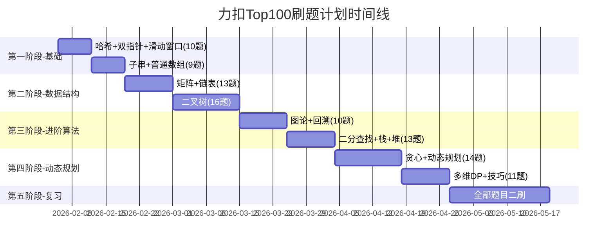
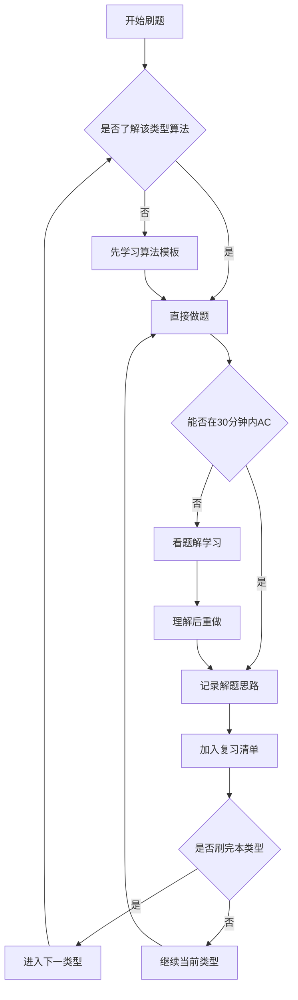

# 力扣Top100刷题计划

## 一、背景信息

- **身份**：Java程序员
- **目标**：跳槽面试准备
- **时间节点**：2026年5月后开始投简历
- **刷题来源**：[LeetCode热题100](https://leetcode.cn/studyplan/top-100-liked/)

## 二、刷题整体规划

## 三、题目分类详情

### 3.1 哈希（3题）

| 序号 | 题号 | 题目名称       | 难度 | 核心思路              |
| ---- | ---- | -------------- | ---- | --------------------- |
| 1    | 1    | 两数之和       | 简单 | HashMap存储值和下标   |
| 2    | 49   | 字母异位词分组 | 中等 | 排序后的字符串作为key |
| 3    | 128  | 最长连续序列   | 中等 | HashSet判断连续性     |

### 3.2 双指针（4题）

| 序号 | 题号 | 题目名称       | 难度 | 核心思路          |
| ---- | ---- | -------------- | ---- | ----------------- |
| 4    | 283  | 移动零         | 简单 | 快慢指针交换      |
| 5    | 11   | 盛最多水的容器 | 中等 | 双端指针+木桶原理 |
| 6    | 15   | 三数之和       | 中等 | 排序+双指针       |
| 7    | 42   | 接雨水         | 困难 | 双指针/单调栈     |

### 3.3 滑动窗口（3题）

| 序号 | 题号 | 题目名称                   | 难度 | 核心思路         |
| ---- | ---- | -------------------------- | ---- | ---------------- |
| 8    | 3    | 无重复字符的最长子串       | 中等 | 滑动窗口+HashSet |
| 9    | 438  | 找到字符串中所有字母异位词 | 中等 | 定长滑动窗口     |
| 10   | 76   | 最小覆盖子串               | 困难 | 滑动窗口+计数    |

### 3.4 子串（3题）

| 序号 | 题号 | 题目名称       | 难度 | 核心思路       |
| ---- | ---- | -------------- | ---- | -------------- |
| 11   | 560  | 和为K的子数组  | 中等 | 前缀和+HashMap |
| 12   | 239  | 滑动窗口最大值 | 困难 | 单调队列       |
| 13   | 53   | 最大子数组和   | 中等 | 动态规划/分治  |

### 3.5 普通数组（6题）

| 序号 | 题号 | 题目名称             | 难度 | 核心思路         |
| ---- | ---- | -------------------- | ---- | ---------------- |
| 14   | 56   | 合并区间             | 中等 | 排序后合并       |
| 15   | 189  | 轮转数组             | 中等 | 三次翻转         |
| 16   | 238  | 除自身以外数组的乘积 | 中等 | 前缀积+后缀积    |
| 17   | 41   | 缺失的第一个正数     | 困难 | 原地哈希         |
| 18   | 73   | 矩阵置零             | 中等 | 使用首行首列标记 |
| 19   | 54   | 螺旋矩阵             | 中等 | 模拟边界收缩     |

### 3.6 矩阵（4题）

| 序号 | 题号 | 题目名称       | 难度 | 核心思路         |
| ---- | ---- | -------------- | ---- | ---------------- |
| 20   | 48   | 旋转图像       | 中等 | 先转置再水平翻转 |
| 21   | 240  | 搜索二维矩阵II | 中等 | 从右上角开始搜索 |
| 22   | 74   | 搜索二维矩阵   | 中等 | 二分查找         |
| 23   | 79   | 单词搜索       | 中等 | DFS回溯          |

### 3.7 链表（9题）

| 序号 | 题号 | 题目名称                | 难度 | 核心思路              |
| ---- | ---- | ----------------------- | ---- | --------------------- |
| 24   | 160  | 相交链表                | 简单 | 双指针走完互换        |
| 25   | 206  | 反转链表                | 简单 | 迭代/递归             |
| 26   | 234  | 回文链表                | 简单 | 快慢指针+反转后半部分 |
| 27   | 141  | 环形链表                | 简单 | 快慢指针              |
| 28   | 142  | 环形链表II              | 中等 | 快慢指针找入口        |
| 29   | 21   | 合并两个有序链表        | 简单 | 迭代/递归             |
| 30   | 2    | 两数相加                | 中等 | 模拟进位              |
| 31   | 19   | 删除链表的倒数第N个结点 | 中等 | 快慢指针间隔N         |
| 32   | 24   | 两两交换链表中的节点    | 中等 | 迭代/递归             |
| 33   | 25   | K个一组翻转链表         | 困难 | 分组反转              |
| 34   | 138  | 复制带随机指针的链表    | 中等 | HashMap/原地复制      |
| 35   | 148  | 排序链表                | 中等 | 归并排序              |
| 36   | 23   | 合并K个升序链表         | 困难 | 优先队列/分治         |
| 37   | 146  | LRU缓存                 | 中等 | HashMap+双向链表      |

### 3.8 二叉树（16题）

| 序号 | 题号 | 题目名称                       | 难度 | 核心思路                |
| ---- | ---- | ------------------------------ | ---- | ----------------------- |
| 38   | 94   | 二叉树的中序遍历               | 简单 | 递归/栈迭代             |
| 39   | 104  | 二叉树的最大深度               | 简单 | DFS/BFS                 |
| 40   | 226  | 翻转二叉树                     | 简单 | 递归交换左右子树        |
| 41   | 101  | 对称二叉树                     | 简单 | 递归比较镜像节点        |
| 42   | 543  | 二叉树的直径                   | 简单 | DFS求每个节点左右深度和 |
| 43   | 102  | 二叉树的层序遍历               | 中等 | BFS队列                 |
| 44   | 108  | 将有序数组转换为二叉搜索树     | 简单 | 递归取中点              |
| 45   | 98   | 验证二叉搜索树                 | 中等 | 中序遍历递增/递归边界   |
| 46   | 230  | 二叉搜索树中第K小的元素        | 中等 | 中序遍历                |
| 47   | 199  | 二叉树的右视图                 | 中等 | BFS每层最后一个         |
| 48   | 114  | 二叉树展开为链表               | 中等 | 前序遍历+原地修改       |
| 49   | 105  | 从前序与中序遍历序列构造二叉树 | 中等 | 递归+HashMap            |
| 50   | 437  | 路径总和III                    | 中等 | 前缀和+DFS              |
| 51   | 236  | 二叉树的最近公共祖先           | 中等 | 递归后序遍历            |
| 52   | 124  | 二叉树中的最大路径和           | 困难 | DFS计算每条路径         |
| 53   | 297  | 二叉树的序列化与反序列化       | 困难 | BFS/DFS                 |

### 3.9 图论（4题）

| 序号 | 题号 | 题目名称         | 难度 | 核心思路       |
| ---- | ---- | ---------------- | ---- | -------------- |
| 54   | 200  | 岛屿数量         | 中等 | DFS/BFS/并查集 |
| 55   | 994  | 腐烂的橘子       | 中等 | 多源BFS        |
| 56   | 207  | 课程表           | 中等 | 拓扑排序       |
| 57   | 208  | 实现Trie(前缀树) | 中等 | 字典树节点设计 |

### 3.10 回溯（6题）

| 序号 | 题号 | 题目名称           | 难度 | 核心思路            |
| ---- | ---- | ------------------ | ---- | ------------------- |
| 58   | 46   | 全排列             | 中等 | 回溯+visited数组    |
| 59   | 78   | 子集               | 中等 | 回溯/位运算         |
| 60   | 17   | 电话号码的字母组合 | 中等 | 回溯                |
| 61   | 39   | 组合总和           | 中等 | 回溯+剪枝           |
| 62   | 22   | 括号生成           | 中等 | 回溯+左右括号计数   |
| 63   | 79   | 单词搜索           | 中等 | DFS回溯             |
| 64   | 131  | 分割回文串         | 中等 | 回溯+动态规划预处理 |
| 65   | 51   | N皇后              | 困难 | 回溯+对角线标记     |

### 3.11 二分查找（4题）

| 序号 | 题号 | 题目名称                                   | 难度 | 核心思路           |
| ---- | ---- | ------------------------------------------ | ---- | ------------------ |
| 66   | 35   | 搜索插入位置                               | 简单 | 二分查找           |
| 67   | 74   | 搜索二维矩阵                               | 中等 | 二维转一维二分     |
| 68   | 34   | 在排序数组中查找元素的第一个和最后一个位置 | 中等 | 两次二分           |
| 69   | 33   | 搜索旋转排序数组                           | 中等 | 二分找有序区间     |
| 70   | 153  | 寻找旋转排序数组中的最小值                 | 中等 | 二分比较mid和right |
| 71   | 4    | 寻找两个正序数组的中位数                   | 困难 | 二分找第k小        |

### 3.12 栈（6题）

| 序号 | 题号 | 题目名称           | 难度 | 核心思路           |
| ---- | ---- | ------------------ | ---- | ------------------ |
| 72   | 20   | 有效的括号         | 简单 | 栈匹配             |
| 73   | 155  | 最小栈             | 中等 | 辅助栈存最小值     |
| 74   | 394  | 字符串解码         | 中等 | 双栈存数字和字符串 |
| 75   | 739  | 每日温度           | 中等 | 单调递减栈         |
| 76   | 84   | 柱状图中最大的矩形 | 困难 | 单调栈             |
| 77   | 85   | 最大矩形           | 困难 | 转化为84题         |

### 3.13 堆（3题）

| 序号 | 题号 | 题目名称              | 难度 | 核心思路      |
| ---- | ---- | --------------------- | ---- | ------------- |
| 78   | 215  | 数组中的第K个最大元素 | 中等 | 快速选择/堆   |
| 79   | 347  | 前K个高频元素         | 中等 | HashMap+堆    |
| 80   | 295  | 数据流的中位数        | 困难 | 大顶堆+小顶堆 |

### 3.14 贪心算法（4题）

| 序号 | 题号 | 题目名称           | 难度 | 核心思路          |
| ---- | ---- | ------------------ | ---- | ----------------- |
| 81   | 121  | 买卖股票的最佳时机 | 简单 | 记录最低价        |
| 82   | 55   | 跳跃游戏           | 中等 | 贪心更新最远距离  |
| 83   | 45   | 跳跃游戏II         | 中等 | 贪心选择最远跳跃  |
| 84   | 763  | 划分字母区间       | 中等 | 贪心+记录最远位置 |

### 3.15 动态规划（10题）

| 序号 | 题号 | 题目名称       | 难度 | 核心思路                           |
| ---- | ---- | -------------- | ---- | ---------------------------------- |
| 85   | 70   | 爬楼梯         | 简单 | dp[i]=dp[i-1]+dp[i-2]              |
| 86   | 118  | 杨辉三角       | 简单 | dp[i][j]=dp[i-1][j-1]+dp[i-1][j]   |
| 87   | 198  | 打家劫舍       | 中等 | dp[i]=max(dp[i-1],dp[i-2]+nums[i]) |
| 88   | 279  | 完全平方数     | 中等 | 完全背包                           |
| 89   | 322  | 零钱兑换       | 中等 | 完全背包                           |
| 90   | 139  | 单词拆分       | 中等 | dp[i]表示前i个字符可拆分           |
| 91   | 300  | 最长递增子序列 | 中等 | dp/二分优化                        |
| 92   | 152  | 乘积最大子数组 | 中等 | 维护最大最小值                     |
| 93   | 416  | 分割等和子集   | 中等 | 0-1背包                            |
| 94   | 32   | 最长有效括号   | 困难 | dp/栈                              |

### 3.16 多维动态规划（7题）

| 序号 | 题号 | 题目名称       | 难度 | 核心思路                       |
| ---- | ---- | -------------- | ---- | ------------------------------ |
| 95   | 62   | 不同路径       | 中等 | dp[i][j]=dp[i-1][j]+dp[i][j-1] |
| 96   | 64   | 最小路径和     | 中等 | 二维dp                         |
| 97   | 5    | 最长回文子串   | 中等 | 中心扩展/dp                    |
| 98   | 1143 | 最长公共子序列 | 中等 | 二维dp                         |
| 99   | 72   | 编辑距离       | 中等 | 二维dp                         |
| 100  | 10   | 正则表达式匹配 | 困难 | 二维dp                         |

### 3.17 技巧（4题）

| 序号 | 题号 | 题目名称         | 难度 | 核心思路      |
| ---- | ---- | ---------------- | ---- | ------------- |
| 101  | 136  | 只出现一次的数字 | 简单 | 异或运算      |
| 102  | 169  | 多数元素         | 简单 | 摩尔投票法    |
| 103  | 75   | 颜色分类         | 中等 | 荷兰国旗问题  |
| 104  | 31   | 下一个排列       | 中等 | 找规律        |
| 105  | 287  | 寻找重复数       | 中等 | 快慢指针/二分 |

## 四、刷题策略

## 五、每日刷题模板

| 时间段   | 任务               | 备注             |
| -------- | ------------------ | ---------------- |
| 早晨     | 复习昨日做过的题目 | 快速回顾思路即可 |
| 工作间隙 | 看1-2道新题的题解  | 理解思路         |
| 晚间     | 独立完成2-3道新题  | 计时练习         |
| 睡前     | 整理当日错题和难点 | 记录到笔记       |

## 5.1 每日刷题打卡表

| 日期 | 今日新题                             | 题号 | 难度 | 用时 | 是否AC | 复习题目  | 备注     |
| ---- | ------------------------------------ | ---- | ---- | ---- | ------ | --------- | -------- |
| 2/5  | 两数之和                             | 1    | 简单 |      | 1      | -         |          |
| 2/5  | 字母异位词分组                       | 49   | 中等 |      | ☐     | -         |          |
| 2/5  | 最长连续序列                         | 128  | 中等 |      | ☐     | -         |          |
| 2/6  | 移动零                               | 283  | 简单 |      | ☐     | 1,49,128  |          |
| 2/6  | 盛最多水的容器                       | 11   | 中等 |      | ☐     | -         |          |
| 2/6  | 三数之和                             | 15   | 中等 |      | ☐     | -         |          |
| 2/7  | 接雨水                               | 42   | 困难 |      | ☐     | 283,11,15 |          |
| 2/7  | 无重复字符的最长子串                 | 3    | 中等 |      | ☐     | -         |          |
| 2/8  | 找到字符串中所有字母异位词           | 438  | 中等 |      | ☐     | 42,3      |          |
| 2/8  | 最小覆盖子串                         | 76   | 困难 |      | ☐     | 1,49,128  | D3复习   |
| 2/9  | 和为K的子数组                        | 560  | 中等 |      | ☐     | 438,76    |          |
| 2/9  | 滑动窗口最大值                       | 239  | 困难 |      | ☐     | -         |          |
| 2/10 | 最大子数组和                         | 53   | 中等 |      | ☐     | 560,239   |          |
| 2/10 | 合并区间                             | 56   | 中等 |      | ☐     | -         |          |
| 2/11 | 轮转数组                             | 189  | 中等 |      | ☐     | 53,56     |          |
| 2/11 | 除自身以外数组的乘积                 | 238  | 中等 |      | ☐     | 283,11,15 | D7复习   |
| 2/12 | 缺失的第一个正数                     | 41   | 困难 |      | ☐     | 189,238   |          |
| 2/12 | 矩阵置零                             | 73   | 中等 |      | ☐     | 42,3      | D7复习   |
| 2/13 | 螺旋矩阵                             | 54   | 中等 |      | ☐     | 41,73     |          |
| 2/13 | 旋转图像                             | 48   | 中等 |      | ☐     | -         |          |
| 2/14 | 搜索二维矩阵II                       | 240  | 中等 |      | ☐     | 54,48     |          |
| 2/14 | 搜索二维矩阵                         | 74   | 中等 |      | ☐     | 1,49,128  | D14复习  |
| 2/15 | 单词搜索                             | 79   | 中等 |      | ☐     | 240,74    |          |
| 2/15 | 相交链表                             | 160  | 简单 |      | ☐     | -         |          |
| 2/16 | 反转链表                             | 206  | 简单 |      | ☐     | 79,160    |          |
| 2/16 | 回文链表                             | 234  | 简单 |      | ☐     | -         |          |
| 2/17 | 环形链表                             | 141  | 简单 |      | ☐     | 206,234   |          |
| 2/17 | 环形链表II                           | 142  | 中等 |      | ☐     | -         |          |
| 2/18 | 合并两个有序链表                     | 21   | 简单 |      | ☐     | 141,142   |          |
| 2/18 | 两数相加                             | 2    | 中等 |      | ☐     | 283,11,15 | D14复习  |
| 2/19 | 删除链表的倒数第N个结点              | 19   | 中等 |      | ☐     | 21,2      |          |
| 2/19 | 两两交换链表中的节点                 | 24   | 中等 |      | ☐     | -         |          |
| 2/20 | K个一组翻转链表                      | 25   | 困难 |      | ☐     | 19,24     |          |
| 2/20 | 复制带随机指针的链表                 | 138  | 中等 |      | ☐     | -         |          |
| 2/21 | 排序链表                             | 148  | 中等 |      | ☐     | 25,138    |          |
| 2/21 | 合并K个升序链表                      | 23   | 困难 |      | ☐     | 42,3      | D14复习  |
| 2/22 | LRU缓存                              | 146  | 中等 |      | ☐     | 148,23    |          |
| 2/22 | 二叉树的中序遍历                     | 94   | 简单 |      | ☐     | -         |          |
| 2/23 | 二叉树的最大深度                     | 104  | 简单 |      | ☐     | 146,94    |          |
| 2/23 | 翻转二叉树                           | 226  | 简单 |      | ☐     | -         |          |
| 2/24 | 对称二叉树                           | 101  | 简单 |      | ☐     | 104,226   |          |
| 2/24 | 二叉树的直径                         | 543  | 简单 |      | ☐     | -         |          |
| 2/25 | 二叉树的层序遍历                     | 102  | 中等 |      | ☐     | 101,543   |          |
| 2/25 | 将有序数组转换为二叉搜索树           | 108  | 简单 |      | ☐     | -         |          |
| 2/26 | 验证二叉搜索树                       | 98   | 中等 |      | ☐     | 102,108   |          |
| 2/26 | 二叉搜索树中第K小的元素              | 230  | 中等 |      | ☐     | -         |          |
| 2/27 | 二叉树的右视图                       | 199  | 中等 |      | ☐     | 98,230    |          |
| 2/27 | 二叉树展开为链表                     | 114  | 中等 |      | ☐     | -         |          |
| 2/28 | 从前序与中序遍历序列构造二叉树       | 105  | 中等 |      | ☐     | 199,114   |          |
| 2/28 | 路径总和III                          | 437  | 中等 |      | ☐     | 1,49,128  | D30复习  |
| 3/1  | 二叉树的最近公共祖先                 | 236  | 中等 |      | ☐     | 105,437   |          |
| 3/1  | 二叉树中的最大路径和                 | 124  | 困难 |      | ☐     | -         |          |
| 3/2  | 二叉树的序列化与反序列化             | 297  | 困难 |      | ☐     | 236,124   |          |
| 3/2  | 岛屿数量                             | 200  | 中等 |      | ☐     | -         |          |
| 3/3  | 腐烂的橘子                           | 994  | 中等 |      | ☐     | 297,200   |          |
| 3/3  | 课程表                               | 207  | 中等 |      | ☐     | -         |          |
| 3/4  | 实现Trie(前缀树)                     | 208  | 中等 |      | ☐     | 994,207   |          |
| 3/4  | 全排列                               | 46   | 中等 |      | ☐     | -         |          |
| 3/5  | 子集                                 | 78   | 中等 |      | ☐     | 208,46    |          |
| 3/5  | 电话号码的字母组合                   | 17   | 中等 |      | ☐     | -         |          |
| 3/6  | 组合总和                             | 39   | 中等 |      | ☐     | 78,17     |          |
| 3/6  | 括号生成                             | 22   | 中等 |      | ☐     | -         |          |
| 3/7  | 分割回文串                           | 131  | 中等 |      | ☐     | 39,22     |          |
| 3/7  | N皇后                                | 51   | 困难 |      | ☐     | -         |          |
| 3/8  | 搜索插入位置                         | 35   | 简单 |      | ☐     | 131,51    |          |
| 3/8  | 在排序数组中查找第一个和最后一个位置 | 34   | 中等 |      | ☐     | -         |          |
| 3/9  | 搜索旋转排序数组                     | 33   | 中等 |      | ☐     | 35,34     |          |
| 3/9  | 寻找旋转排序数组中的最小值           | 153  | 中等 |      | ☐     | -         |          |
| 3/10 | 寻找两个正序数组的中位数             | 4    | 困难 |      | ☐     | 33,153    |          |
| 3/10 | 有效的括号                           | 20   | 简单 |      | ☐     | -         |          |
| 3/11 | 最小栈                               | 155  | 中等 |      | ☐     | 4,20      |          |
| 3/11 | 字符串解码                           | 394  | 中等 |      | ☐     | -         |          |
| 3/12 | 每日温度                             | 739  | 中等 |      | ☐     | 155,394   |          |
| 3/12 | 柱状图中最大的矩形                   | 84   | 困难 |      | ☐     | -         |          |
| 3/13 | 最大矩形                             | 85   | 困难 |      | ☐     | 739,84    |          |
| 3/13 | 数组中的第K个最大元素                | 215  | 中等 |      | ☐     | -         |          |
| 3/14 | 前K个高频元素                        | 347  | 中等 |      | ☐     | 85,215    |          |
| 3/14 | 数据流的中位数                       | 295  | 困难 |      | ☐     | -         |          |
| 3/15 | 买卖股票的最佳时机                   | 121  | 简单 |      | ☐     | 347,295   |          |
| 3/15 | 跳跃游戏                             | 55   | 中等 |      | ☐     | -         |          |
| 3/16 | 跳跃游戏II                           | 45   | 中等 |      | ☐     | 121,55    |          |
| 3/16 | 划分字母区间                         | 763  | 中等 |      | ☐     | -         |          |
| 3/17 | 爬楼梯                               | 70   | 简单 |      | ☐     | 45,763    |          |
| 3/17 | 杨辉三角                             | 118  | 简单 |      | ☐     | -         |          |
| 3/18 | 打家劫舍                             | 198  | 中等 |      | ☐     | 70,118    |          |
| 3/18 | 完全平方数                           | 279  | 中等 |      | ☐     | -         |          |
| 3/19 | 零钱兑换                             | 322  | 中等 |      | ☐     | 198,279   |          |
| 3/19 | 单词拆分                             | 139  | 中等 |      | ☐     | -         |          |
| 3/20 | 最长递增子序列                       | 300  | 中等 |      | ☐     | 322,139   |          |
| 3/20 | 乘积最大子数组                       | 152  | 中等 |      | ☐     | -         |          |
| 3/21 | 分割等和子集                         | 416  | 中等 |      | ☐     | 300,152   |          |
| 3/21 | 最长有效括号                         | 32   | 困难 |      | ☐     | -         |          |
| 3/22 | 不同路径                             | 62   | 中等 |      | ☐     | 416,32    |          |
| 3/22 | 最小路径和                           | 64   | 中等 |      | ☐     | -         |          |
| 3/23 | 最长回文子串                         | 5    | 中等 |      | ☐     | 62,64     |          |
| 3/23 | 最长公共子序列                       | 1143 | 中等 |      | ☐     | -         |          |
| 3/24 | 编辑距离                             | 72   | 中等 |      | ☐     | 5,1143    |          |
| 3/24 | 正则表达式匹配                       | 10   | 困难 |      | ☐     | -         |          |
| 3/25 | 只出现一次的数字                     | 136  | 简单 |      | ☐     | 72,10     |          |
| 3/25 | 多数元素                             | 169  | 简单 |      | ☐     | -         |          |
| 3/26 | 颜色分类                             | 75   | 中等 |      | ☐     | 136,169   |          |
| 3/26 | 下一个排列                           | 31   | 中等 |      | ☐     | -         |          |
| 3/27 | 寻找重复数                           | 287  | 中等 |      | ☐     | 75,31     |          |
| 3/27 | -                                    | -    | -    |      | -      | 全面复习  | 一刷完成 |

## 六、难度分布统计

| 难度 | 题数   | 占比 |
| ---- | ------ | ---- |
| 简单 | 约20题 | 20%  |
| 中等 | 约65题 | 65%  |
| 困难 | 约15题 | 15%  |

## 七、高频面试题标记

以下题目为Java面试高频考点，建议优先掌握：

- **链表**：206反转链表、21合并两个有序链表、141环形链表、146LRU缓存
- **二叉树**：102层序遍历、236最近公共祖先、94中序遍历
- **动态规划**：70爬楼梯、53最大子数组和、322零钱兑换
- **数组**：1两数之和、15三数之和、56合并区间
- **字符串**：3无重复字符的最长子串、5最长回文子串
- **栈**：20有效的括号、155最小栈

## 八、复习周期建议

## 九、注意事项

1. **先理解再刷题**：每种题型先掌握基本模板，再做变形题
2. **限时练习**：简单题15分钟、中等题30分钟、困难题45分钟
3. **记录错题**：建立错题本，定期复习
4. **手写代码**：面试时需要手写，平时也要多练习
5. **总结规律**：同类型题目做完后总结通用解法
6. **Java特性**：熟练使用Java集合框架(HashMap/ArrayList/PriorityQueue等)
