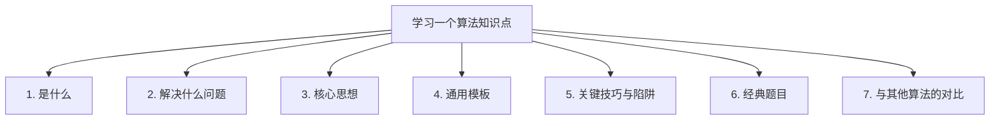
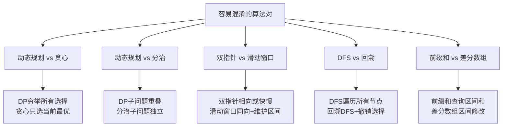
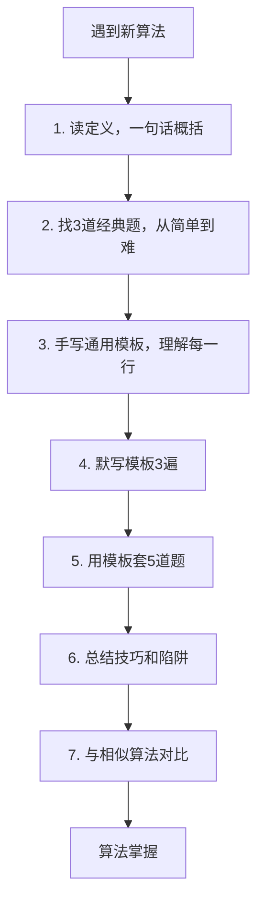

# 算法知识点学习框架
## 一、为什么需要学习框架
每个算法知识点都可以从**相同的维度**去理解和记忆。掌握这个框架后，学任何新算法都能快速建立知识体系，面试时也能系统地回答。
## 二、学习一个算法知识点的7个维度

### 维度总览
| 维度 | 要回答的问题 | 面试价值 |
|------|-------------|----------|
| 1.是什么 | 一句话定义 | 开口第一句 |
| 2.解决什么问题 | 什么时候用它 | 识别题型 |
| 3.核心思想 | 为什么有效 | 展示理解深度 |
| 4.通用模板 | 代码怎么写 | 写代码不卡壳 |
| 5.关键技巧与陷阱 | 哪里容易出错 | 避免bug |
| 6.经典题目 | 代表性题目 | 举一反三 |
| 7.与其他算法的对比 | 和谁容易混淆 | 选对方法 |
## 三、每个维度详解
### 维度1：是什么（一句话定义）
能用一句话向别人解释清楚这个算法是什么。
| 序号 | 算法 | 一句话定义 |
|------|------|-----------|
| 1 | 前缀和 | 预处理数组的累加和，实现O(1)查询任意区间和 |
| 2 | 动态规划 | 将问题拆成重叠子问题，用表格存储子问题的解避免重复计算 |
| 3 | 双指针 | 用两个指针在数组上移动，利用单调性减少搜索空间 |
| 4 | 滑动窗口 | 维护一个满足条件的窗口，通过左右边界的移动遍历所有可能 |
| 5 | 回溯 | 通过递归穷举所有可能，遇到不满足条件的就回头 |
| 6 | 二分查找 | 每次排除一半的搜索空间，O(logn)找到目标 |
| 7 | 并查集 | 维护元素的分组关系，支持近O(1)合并和查询 |
| 8 | 分治法 | 将大问题分解成相同的小问题，递归求解再合并 |
| 9 | 贪心 | 每一步都选当前最优，期望全局最优 |
| 10 | 单调栈 | 维护一个单调递增或递减的栈，O(n)解决下一个更大更小元素问题 |
### 维度2：解决什么问题（识别信号）
题目中出现哪些关键词时，应该联想到这个算法。
| 序号 | 算法 | 题目关键信号 |
|------|------|-------------|
| 1 | 前缀和 | 子数组的和、区间和、连续子数组 |
| 2 | 动态规划 | 最大最小、方案数、是否可行、最优解 |
| 3 | 双指针 | 有序数组、两数之和、原地操作、移除元素 |
| 4 | 滑动窗口 | 最长最短子串、连续、包含所有字符 |
| 5 | 回溯 | 所有组合、所有排列、所有路径、子集 |
| 6 | 二分查找 | 有序、查找、第K个、最小化最大值 |
| 7 | 并查集 | 连通性、分组、是否连通、合并 |
| 8 | 分治法 | 排序、合并、第K大、最近点对 |
| 9 | 贪心 | 最多最少、区间调度、跳跃 |
| 10 | 单调栈 | 下一个更大元素、柱状图、接雨水、温度 |
### 维度3：核心思想（为什么有效）
不只是会写代码，更要理解为什么这么做是对的。
| 序号 | 算法 | 核心思想 |
|------|------|----------|
| 1 | 前缀和 | 用空间换时间，预处理后O(1)查询 |
| 2 | 动态规划 | 最优子结构+重叠子问题，记忆化避免重复计算 |
| 3 | 双指针 | 利用数据的单调性，每次排除不可能的解 |
| 4 | 滑动窗口 | 窗口内的单调性保证了左右指针只向前移动 |
| 5 | 回溯 | 系统地穷举+剪枝减少无效搜索 |
| 6 | 二分查找 | 每次排除一半，利用有序性 |
| 7 | 并查集 | 路径压缩+按秩合并，近O(1)操作 |
| 8 | 分治法 | 子问题独立，分别求解再合并 |
| 9 | 贪心 | 局部最优推导出全局最优，需要证明贪心选择性质 |
| 10 | 单调栈 | 维护单调性，弹出时处理被弹出元素的答案 |
### 维度4：通用模板
每种算法都有固定的代码框架，掌握模板后做题就是填空。
#### 动态规划模板
```java
// 1. 定义dp数组的含义
int[] dp = new int[n];
// 2. 初始化base case
dp[0] = ...;
// 3. 状态转移
for (int i = 1; i < n; i++) {
    dp[i] = 最优选择(dp[i-1] + ..., ...);
}
// 4. 返回结果
return dp[n-1];
```
#### 滑动窗口模板
```java
int left = 0;
for (int right = 0; right < n; right++) {
    // 1. 扩大窗口：加入 nums[right]
    window.add(nums[right]);
    // 2. 收缩窗口：不满足条件时
    while (窗口需要收缩) {
        window.remove(nums[left]);
        left++;
    }
    // 3. 更新答案
    result = Math.max(result, right - left + 1);
}
```
#### 回溯模板
```java
void backtrack(路径, 选择列表) {
    if (满足终止条件) {
        result.add(路径);
        return;
    }
    for (选择 : 选择列表) {
        做选择;               // 路径.add(选择)
        backtrack(路径, 选择列表);
        撤销选择;             // 路径.remove(选择)
    }
}
```
#### 二分查找模板
```java
int left = 0, right = n - 1;
while (left <= right) {
    int mid = left + (right - left) / 2;
    if (nums[mid] == target) return mid;
    else if (nums[mid] < target) left = mid + 1;
    else right = mid - 1;
}
return -1;
```
#### 前缀和+HashMap模板
```java
Map<Integer, Integer> map = new HashMap<>();
map.put(0, 1);  // 哨兵
int prefix = 0, count = 0;
for (int num : nums) {
    prefix += num;
    count += map.getOrDefault(prefix - k, 0);
    map.put(prefix, map.getOrDefault(prefix, 0) + 1);
}
```
#### 并查集模板
```java
int find(int x) {
    if (parent[x] != x) parent[x] = find(parent[x]);  // 路径压缩
    return parent[x];
}
void union(int x, int y) {
    int rx = find(x), ry = find(y);
    if (rx != ry) { parent[rx] = ry; size[ry] += size[rx]; }
}
```
#### 单调栈模板
```java
Deque<Integer> stack = new ArrayDeque<>();
for (int i = 0; i < n; i++) {
    while (!stack.isEmpty() && nums[stack.peek()] < nums[i]) {
        int idx = stack.pop();
        result[idx] = nums[i];  // 弹出时处理答案
    }
    stack.push(i);
}
```
### 维度5：关键技巧与常见陷阱
| 序号 | 算法 | 关键技巧 | 常见陷阱 |
|------|------|----------|----------|
| 1 | 前缀和 | map初始化put(0,1)哨兵 | 忘记哨兵导致漏算从起点开始的子数组 |
| 2 | 动态规划 | 空间优化-滚动数组 | dp含义定义不清或初始化错误 |
| 3 | 双指针 | 相向、同向、快慢三种模式 | 边界条件处理不当导致死循环 |
| 4 | 滑动窗口 | 窗口收缩的判断条件 | 负数场景不适用或更新答案时机不对 |
| 5 | 回溯 | 剪枝优化和排序去重 | 忘记撤销选择或产生重复解 |
| 6 | 二分查找 | left+(right-left)/2防溢出 | 死循环或边界off-by-one |
| 7 | 并查集 | 路径压缩和按秩合并 | 忘记路径压缩导致超时 |
| 8 | 分治法 | 合并步骤是关键 | 递归终止条件漏写 |
| 9 | 贪心 | 证明贪心正确性 | 误用贪心，实际需要DP |
| 10 | 单调栈 | 存下标而不是存值 | 遍历结束后栈中剩余元素未处理 |
### 维度6：经典题目（每类3道）
| 序号 | 算法 | 入门题 | 进阶题 | 困难题 |
|------|------|--------|--------|--------|
| 1 | 前缀和 | LC303 区域和检索 | LC560 和为K的子数组 | LC437 路径总和III |
| 2 | 动态规划 | LC70 爬楼梯 | LC322 零钱兑换 | LC72 编辑距离 |
| 3 | 双指针 | LC283 移动零 | LC15 三数之和 | LC42 接雨水 |
| 4 | 滑动窗口 | LC3 无重复最长子串 | LC438 字母异位词 | LC76 最小覆盖子串 |
| 5 | 回溯 | LC46 全排列 | LC39 组合总和 | LC51 N皇后 |
| 6 | 二分查找 | LC704 二分查找 | LC33 搜索旋转数组 | LC4 两数组中位数 |
| 7 | 并查集 | LC547 省份数量 | LC128 最长连续序列 | LC399 除法求值 |
| 8 | 分治法 | LC53 最大子数组和 | LC148 排序链表 | LC23 合并K个链表 |
| 9 | 贪心 | LC121 买卖股票 | LC55 跳跃游戏 | LC45 跳跃游戏II |
| 10 | 单调栈 | LC739 每日温度 | LC84 柱状图最大矩形 | LC85 最大矩形 |
### 维度7：与其他算法的对比

| 序号 | 对比 | 区别 | 选择依据 |
|------|------|------|----------|
| 1 | DP vs 贪心 | DP穷举所有选择，贪心只选当前最优 | 能证明贪心正确就用贪心，否则用DP |
| 2 | DP vs 分治 | DP子问题重叠，分治子问题独立 | 有重叠子问题就用DP |
| 3 | 双指针 vs 滑动窗口 | 滑动窗口是同向双指针的特例 | 需要维护窗口内状态用滑动窗口 |
| 4 | 前缀和 vs 差分数组 | 前缀和查询区间和，差分数组区间修改 | 多次查询用前缀和，多次修改用差分 |
| 5 | BFS vs DFS | BFS层序按最短路，DFS深入到底 | 最短路用BFS，遍历回溯用DFS |
## 四、学习新算法的行动清单

| 步骤 | 动作 | 预期时间 |
|------|------|----------|
| 1 | 读定义，一句话总结 | 5分钟 |
| 2 | 做3道经典题-简单到困难 | 2-3小时 |
| 3 | 手写通用模板，理解每行含义 | 30分钟 |
| 4 | 默写模板3遍 | 15分钟 |
| 5 | 用模板套5道新题 | 3-5小时 |
| 6 | 总结技巧和易错点 | 30分钟 |
| 7 | 与相似算法对比 | 15分钟 |
## 五、面试中介绍算法知识点的话术模板
某算法是用来解决某类问题的某种方法。核心思想是什么。时间复杂度是多少。经典应用有哪些。
示例1：前缀和是用来解决区间求和问题的预处理技巧。核心思想是预处理出累加和数组，之后用O(1)的减法求任意区间和。经典应用有区间和查询、和为K的子数组、路径总和等。
示例2：动态规划是用来解决最优化问题的方法。核心思想是把问题拆成重叠的子问题，用表格记录每个子问题的解避免重复计算。关键是定义好dp数组的含义和状态转移方程。经典应用有背包问题、最长子序列、编辑距离等。
## 六、记忆口诀
```
学算法，七维度，
定义信号加思想。
模板技巧和题目，
对比混淆不迷茫。
定义一句说得清，
信号识别选对路。
模板默写三五遍，
经典题目套一套。
```
