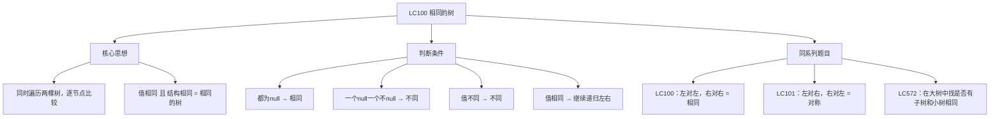

# LC100 相同的树
## 一、题目描述
给你两棵二叉树的根节点 `p` 和 `q`，编写一个函数来检验这两棵树是否**相同**。如果两棵树在结构上相同，并且节点具有相同的值，则认为它们是相同的。
**示例1（相同）：**
```
  p:  1      q:  1
     / \        / \
    2   3      2   3
  → true
```
**示例2（不同）：**
```
  p:  1      q:  1
     /          \
    2            2
  → false（结构不同，一个在左一个在右）
```
**示例3（不同）：**
```
  p:  1      q:  1
     / \        / \
    2   1      1   2
  → false（值不同）
```
**约束：**
- 两棵树的节点数范围 [0, 100]
---
## 二、解法概览
### 解法对比表
| 解法 | 时间复杂度 | 空间复杂度 | 面试推荐 |
|------|-----------|-----------|---------|
| **DFS递归** | O(n) | O(h) | ✅ **首选** |
| BFS迭代 | O(n) | O(w) | ✅ 推荐 |
### 思维导图

---
## 三、记忆口诀
```
相同的树三步判，都空为真一空假
值要相等再递归，左对左来右对右
和对称树一对比，只差配对的方向
```
---
## 四、解法一：DFS递归（首选 ✅）
### 思路
同时递归两棵树，逐节点比较：
1. 两个都是 null → 相同
2. 一个 null 一个不 null → 不同
3. 值不相等 → 不同
4. 值相等 → 递归比较左子树和右子树
### 核心公式
```
isSame(p, q):
  都null → true
  一个null → false
  p.val != q.val → false
  return isSame(p.left, q.left) && isSame(p.right, q.right)
         ↑ 左对左                  ↑ 右对右
```
### 图解过程
```
  p:  1      q:  1
     / \        / \
    2   3      2   3
━━━━━━━━━━━━━━━━━━━━━━━━━━━━━━━━━━
isSame(p=1, q=1)：1==1 ✅
  isSame(p.left=2, q.left=2)：2==2 ✅
    isSame(null, null) → true ✅
    isSame(null, null) → true ✅
    → true
  isSame(p.right=3, q.right=3)：3==3 ✅
    isSame(null, null) → true ✅
    isSame(null, null) → true ✅
    → true
  → true && true = true ✅
```
### 不相同的例子
```
  p:  1      q:  1
     / \        / \
    2   1      1   2
━━━━━━━━━━━━━━━━━━━━━━━━━━━━━━━━━━
isSame(p=1, q=1)：1==1 ✅
  isSame(p.left=2, q.left=1)：2 != 1 ❌
  → 直接返回 false
```
### 代码示例
```java
public boolean isSameTree(TreeNode p, TreeNode q) {
    // 都为空 → 相同
    if (p == null && q == null) return true;
    // 一个空 → 不同
    if (p == null || q == null) return false;
    // 值相同 且 左右子树都相同
    return p.val == q.val
        && isSameTree(p.left, q.left)     // 左对左
        && isSameTree(p.right, q.right);  // 右对右
}
```
### 递归三要素
| 要素 | 本题 |
|------|------|
| **终止条件** | 都 null 返回 true；一个 null 返回 false |
| **判断逻辑** | p.val == q.val |
| **递归调用** | 左对左，右对右 |
### 复杂度分析
- 时间复杂度：**O(min(m,n))**，m、n 是两棵树的节点数，遇到不同就提前返回
- 空间复杂度：**O(min(h1,h2))**，递归栈深度取决于较矮的树
### 优缺点
| 优点 | 缺点 |
|-----|------|
| 代码极简（4行） | 极端情况栈溢出 |
| 面试首选 | 无 |
---
## 五、解法二：BFS迭代
### 思路
和 LC101 类似，用队列成对比较。每次取出两个节点比较，再把它们的孩子成对入队。
### 代码示例
```java
public boolean isSameTree(TreeNode p, TreeNode q) {
    Queue<TreeNode> queue = new LinkedList<>();
    queue.offer(p);
    queue.offer(q);
    while (!queue.isEmpty()) {
        TreeNode n1 = queue.poll();
        TreeNode n2 = queue.poll();
        if (n1 == null && n2 == null) continue;
        if (n1 == null || n2 == null || n1.val != n2.val) return false;
        // 左对左，右对右
        queue.offer(n1.left);
        queue.offer(n2.left);
        queue.offer(n1.right);
        queue.offer(n2.right);
    }
    return true;
}
```
### 复杂度分析
- 时间复杂度：**O(min(m,n))**
- 空间复杂度：**O(w)**，队列最大宽度
### 优缺点
| 优点 | 缺点 |
|-----|------|
| 不会栈溢出 | 代码比递归长 |
---
## 六、LC100 vs LC101 vs LC572 对比
这三道题框架一模一样，只是**配对方式**或**调用方式**不同：
| 题目 | 核心区别 | 递归配对 |
|------|---------|---------|
| LC100 相同的树 | 左对左，右对右 | `(p.left, q.left)` `(p.right, q.right)` |
| LC101 对称二叉树 | 左对右，右对左 | `(p.left, q.right)` `(p.right, q.left)` |
| LC572 另一棵树的子树 | 大树每个节点调用 LC100 | 遍历大树 + isSame 判断 |
```
LC100（相同）：                LC101（对称/镜像）：
    p     q                       left    right
   / \   / \                      / \      / \
  A   B A   B                    A   B    B   A
  ↑   ↑ ↑   ↑                   ↑   ↑    ↑   ↑
  左对左 右对右                   左对右  右对左
```
---
## 七、面试回答模板
### 1. 开场：理解题意
> 两棵树相同 = 结构相同 + 对应位置值相同。
### 2. 思路：同步递归
> 同时递归两棵树，先判断当前节点（都空、一空、值不同），再递归比较左子树和右子树。
### 3. 与 LC101 的区别
> LC100 是"左对左、右对右"判断相同，LC101 是"左对右、右对左"判断镜像对称。框架完全一样，就换了递归参数的配对方式。
### 4. 复杂度
> 时间 O(min(m,n))，空间 O(min(h1,h2))。
---
## 八、相关题目
| 题号 | 题目 | 关系 | 难度 |
|-----|------|------|-----|
| LC101 | 对称二叉树 | 改配对方向：左对右 | 简单 |
| LC572 | 另一棵树的子树 | 遍历+调用isSame | 简单 |
| LC226 | 翻转二叉树 | 翻转后用isSame可判对称 | 简单 |
| LC104 | 二叉树的最大深度 | 同样递归框架 | 简单 |
| LC951 | 翻转等价二叉树 | 相同或翻转后相同 | 中等 |