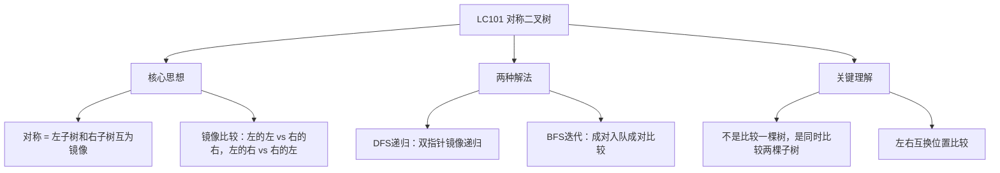

# LC101 对称二叉树
## 一、题目描述
给你一个二叉树的根节点 `root`，检查它是否**轴对称**。
**示例1（对称）：**
```
       1
      / \
     2   2
    / \ / \
   3  4 4  3
  → true（沿中线左右镜像对称）
```
**示例2（不对称）：**
```
     1
    / \
   2   2
    \   \
     3   3
  → false（左子树右孩子=3，右子树也是右孩子=3，不是镜像）
```
**约束：**
- 树的节点数范围 [1, 1000]
---
## 二、解法概览
### 解法对比表
| 解法 | 时间复杂度 | 空间复杂度 | 面试推荐 |
|------|-----------|-----------|---------|
| **DFS递归（镜像比较）** | O(n) | O(h) | ✅ **首选** |
| BFS迭代（队列成对比较） | O(n) | O(w) | ✅ 推荐 |
### 思维导图

---
## 三、记忆口诀
```
对称二叉树看镜像，左子树和右子树比
左的左对右的右，左的右对右的左
值相同且结构同，递归到空都为真
```
---
## 四、解法一：DFS递归 / 镜像比较（首选 ✅）
### 思路
对称 = 左子树和右子树互为**镜像**。
用两个指针 p 和 q 分别指向左子树和右子树，**镜像对称地**递归比较：
- p.val == q.val（当前值相同）
- p.left 和 q.right 对称（**左的左** 对 **右的右**）
- p.right 和 q.left 对称（**左的右** 对 **右的左**）
### 核心公式
```
isMirror(p, q):
  都为null → true（对称的空）
  一个null一个不null → false（结构不同）
  p.val != q.val → false（值不同）
  return isMirror(p.left, q.right) && isMirror(p.right, q.left)
         ↑ 左的左 vs 右的右          ↑ 左的右 vs 右的左
```
### 为什么是 p.left 对 q.right？
```
对称 = 照镜子
你举左手 → 镜子里是右手
你举右手 → 镜子里是左手
       1
      / \
     2   2        ← p=2(左), q=2(右)
    / \ / \
   3  4 4  3
p.left=3 要和 q.right=3 比（左的左 对 右的右）
p.right=4 要和 q.left=4 比（左的右 对 右的左）
不是 p.left 对 q.left！那样是比"相同"不是比"镜像"
```
### 图解过程
```
       1
      / \
     2   2
    / \ / \
   3  4 4  3
━━━━━━━━━━━━━━━━━━━━━━━━━━━━━━━━━━
第1层：isMirror(左2, 右2)
  值：2 == 2 ✅
  继续比较：
    isMirror(左2的左3, 右2的右3)  → 左的左 vs 右的右
    isMirror(左2的右4, 右2的左4)  → 左的右 vs 右的左
━━━━━━━━━━━━━━━━━━━━━━━━━━━━━━━━━━
第2层左：isMirror(3, 3)
  值：3 == 3 ✅
  isMirror(null, null) → true
  isMirror(null, null) → true
  → true ✅
━━━━━━━━━━━━━━━━━━━━━━━━━━━━━━━━━━
第2层右：isMirror(4, 4)
  值：4 == 4 ✅
  isMirror(null, null) → true
  isMirror(null, null) → true
  → true ✅
━━━━━━━━━━━━━━━━━━━━━━━━━━━━━━━━━━
全部为 true → 对称 ✅
```
### 不对称的例子
```
     1
    / \
   2   2
    \   \
     3   3
━━━━━━━━━━━━━━━━━━━━━━━━━━━━━━━━━━
isMirror(左2, 右2)：值 2==2 ✅
  isMirror(左2的left=null, 右2的right=3)
  → 一个null一个不null → false ❌
直接返回 false，不对称
```
### 代码示例
```java
public boolean isSymmetric(TreeNode root) {
    if (root == null) return true;
    return isMirror(root.left, root.right);
}
private boolean isMirror(TreeNode p, TreeNode q) {
    // 都为空，对称
    if (p == null && q == null) return true;
    // 一个空一个不空，不对称
    if (p == null || q == null) return false;
    // 值相同 且 镜像对称地递归
    return p.val == q.val
        && isMirror(p.left, q.right)    // 左的左 vs 右的右
        && isMirror(p.right, q.left);   // 左的右 vs 右的左
}
```
### 与 LC100（相同的树）对比
```
LC100 相同的树：     LC101 对称二叉树：
  isSame(p, q)          isMirror(p, q)
  p.left vs q.left      p.left vs q.right   ← 镜像！
  p.right vs q.right    p.right vs q.left    ← 镜像！
只有递归调用的配对方式不同，框架完全一样
```
### 复杂度分析
- 时间复杂度：**O(n)**，每个节点最多访问一次
- 空间复杂度：**O(h)**，递归栈深度
### 优缺点
| 优点 | 缺点 |
|-----|------|
| 代码简洁 | 链状树可能栈溢出 |
| 面试首选 | 需要理解镜像递归 |
---
## 五、解法二：BFS迭代 / 队列成对比较
### 思路
用队列，每次取出**两个节点**成对比较，再把它们的孩子**镜像对称地**入队。
### 核心公式
```
queue 初始放入 [root.left, root.right]
while queue不为空:
    取出两个节点 p, q
    都为null → 跳过
    一个null → 不对称
    值不同 → 不对称
    镜像入队：(p.left, q.right) 和 (p.right, q.left)
```
### 图解过程
```
       1
      / \
     2   2
    / \ / \
   3  4 4  3
━━━━━━━━━━━━━━━━━━━━━━━━━━━━━━━━━━
初始：queue = [左2, 右2]
━━━━━━━━━━━━━━━━━━━━━━━━━━━━━━━━━━
取出(左2, 右2)：2==2 ✅
  镜像入队：(左2.left=3, 右2.right=3) 和 (左2.right=4, 右2.left=4)
  queue = [3, 3, 4, 4]
━━━━━━━━━━━━━━━━━━━━━━━━━━━━━━━━━━
取出(3, 3)：3==3 ✅ 入队孩子(null,null)(null,null)
取出(4, 4)：4==4 ✅ 入队孩子(null,null)(null,null)
━━━━━━━━━━━━━━━━━━━━━━━━━━━━━━━━━━
后续取出都是(null,null) → 跳过
queue为空 → 对称 ✅
```
### 代码示例
```java
public boolean isSymmetric(TreeNode root) {
    if (root == null) return true;
    Queue<TreeNode> queue = new LinkedList<>();
    queue.offer(root.left);
    queue.offer(root.right);
    while (!queue.isEmpty()) {
        TreeNode p = queue.poll();
        TreeNode q = queue.poll();
        // 都为空，继续
        if (p == null && q == null) continue;
        // 一个空或值不同，不对称
        if (p == null || q == null || p.val != q.val) return false;
        // 镜像入队
        queue.offer(p.left);
        queue.offer(q.right);  // 左的左 对 右的右
        queue.offer(p.right);
        queue.offer(q.left);   // 左的右 对 右的左
    }
    return true;
}
```
### 复杂度分析
- 时间复杂度：**O(n)**
- 空间复杂度：**O(w)**，队列最大宽度
### 优缺点
| 优点 | 缺点 |
|-----|------|
| 不会栈溢出 | 代码比递归长 |
| 迭代好理解 | 需要成对操作 |
---
## 六、面试回答模板
### 1. 开场：理解题意
> 对称 = 左子树和右子树互为镜像。不是左右子树相同，而是镜像对称。
### 2. 思路：镜像递归
> 用两个指针分别从左子树和右子树出发，镜像对称地比较：左的左对右的右，左的右对右的左。
### 3. 终止条件
> 两个都是 null 返回 true，一个 null 返回 false，值不同返回 false。
### 4. 复杂度
> 时间 O(n)，空间 O(h) 递归栈。
---
## 七、相关题目
| 题号 | 题目 | 关系 | 难度 |
|-----|------|------|-----|
| LC100 | 相同的树 | 框架一样，只是左左对左左 | 简单 |
| LC226 | 翻转二叉树 | 翻转后和原树一样就是对称 | 简单 |
| LC104 | 二叉树的最大深度 | 递归框架基础 | 简单 |
| LC572 | 另一棵树的子树 | 递归匹配 | 简单 |
| LC951 | 翻转等价二叉树 | 镜像的进阶版 | 中等 |