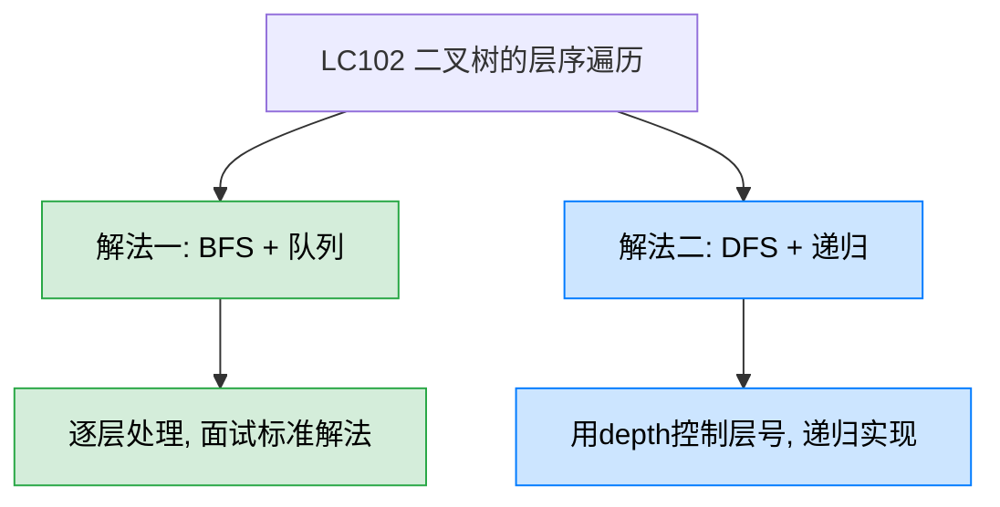
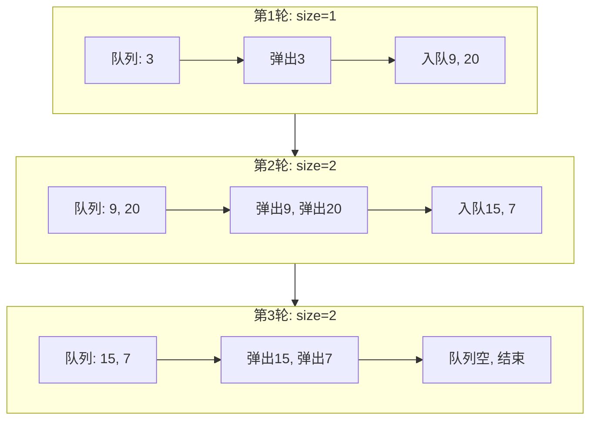
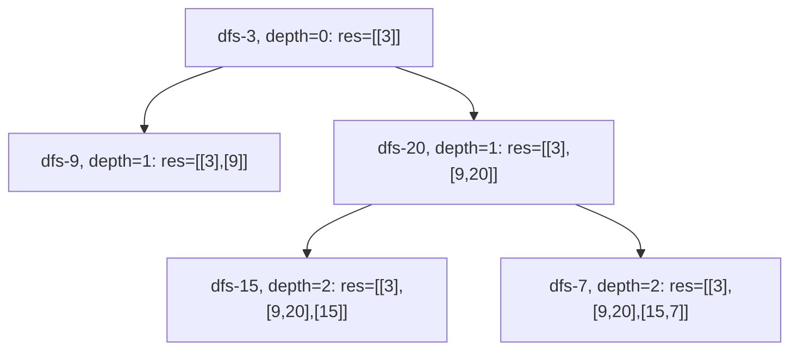

# LC102 二叉树的层序遍历
## 一、题目描述
给你二叉树的根节点 root，返回其节点值的**层序遍历**结果（即逐层地，从左到右访问所有节点）。
**示例：** 输入 `root = [3,9,20,null,null,15,7]`，输出 `[[3],[9,20],[15,7]]`
**约束：** 树中节点数目在范围 [0, 2000] 内，-1000 <= Node.val <= 1000
## 二、解法概览

| 解法 | 时间复杂度 | 空间复杂度 | 难度 | 面试推荐 |
|------|-----------|-----------|------|---------|
| BFS + 队列 | O(n) | O(n) | ⭐⭐ | 面试首选/标准解法 |
| DFS + 递归 | O(n) | O(n) | ⭐⭐ | 备选方案 |
## 三、记忆口诀
> **层序遍历用队列，size锁定当前层，弹一个加俩孩子，一层处理完再下层。**
- BFS：「**入队 → 记size → for循环弹size个 → 孩子入队 → 下一层**」
- DFS：「**带depth递归，depth等于list长度就新建一层**」
## 四、解法一：BFS + 队列（面试首选）
### 4.1 思路
用队列做 BFS。核心技巧：每轮循环开始时，**先用 size 锁定当前层的节点数量**，然后 for 循环恰好处理 size 个节点，保证每轮处理完整的一层。处理过程中把下一层的孩子入队，不会干扰当前层的 size。
### 4.2 核心公式
```
每轮循环:
  size = queue.size()    // 锁定当前层节点数
  for i = 0 to size-1:   // 只处理当前层
    弹出节点 → 加入当前层结果
    左孩子入队、右孩子入队
  当前层结果加入总结果
```
### 4.3 图解过程
以树 `[3, 9, 20, null, null, 15, 7]` 为例：
```
        3
       / \
      9  20
         / \
        15  7
```
| 轮次 | 队列初始状态 | size | 弹出处理 | 入队孩子 | 当前层结果 |
|------|------------|------|---------|---------|----------|
| 1 | [3] | 1 | 弹3 | 入9, 入20 | [3] |
| 2 | [9, 20] | 2 | 弹9, 弹20 | 入15, 入7 | [9, 20] |
| 3 | [15, 7] | 2 | 弹15, 弹7 | 无 | [15, 7] |

### 4.4 代码示例
```java
public List<List<Integer>> levelOrder(TreeNode root) {
    if (root == null) return new ArrayList<>();
    Deque<TreeNode> queue = new ArrayDeque<>();
    queue.offer(root);
    List<List<Integer>> res = new ArrayList<>();
    while (!queue.isEmpty()) {
        List<Integer> level = new ArrayList<>();
        for (int i = queue.size(); i > 0; i--) {
            TreeNode node = queue.poll();
            level.add(node.val);
            if (node.left != null) queue.offer(node.left);
            if (node.right != null) queue.offer(node.right);
        }
        res.add(level);
    }
    return res;
}
```
### 4.5 for 循环的写法技巧
你的代码中 `for (int i = queue.size(); i > 0; i--)` 是一个巧妙的写法：
| 写法 | 效果 | 说明 |
|------|------|------|
| `for (int i = queue.size(); i > 0; i--)` | 正确 | size 只在初始化时取一次，后续 i-- 不受队列变化影响 |
| `int size = queue.size(); for (int i = 0; i < size; i++)` | 正确 | 先存 size，同样不受影响 |
| `for (int i = 0; i < queue.size(); i++)` | **错误** | 每次循环都重新取 size，入队后 size 会变 |
### 4.6 复杂度分析
- **时间复杂度：O(n)**，每个节点入队出队各一次
- **空间复杂度：O(n)**，队列最多存储一层的节点数，最坏为完全二叉树最后一层 n/2 个节点
### 4.7 优缺点
| 优点 | 缺点 |
|------|------|
| 直观：BFS 天然按层遍历 | 需要额外队列空间 |
| 面试标准答案，逻辑清晰 | 无 |
| 容易扩展：改 size 处理逻辑即可变形 | 无 |
## 五、解法二：DFS + 递归
### 5.1 思路
用 DFS 也能实现层序遍历：给递归函数传一个 `depth` 参数表示当前深度。如果 `depth` 等于结果列表的长度，说明这一层还没创建，先新建一个空列表。然后把当前节点的值加入对应层的列表。
### 5.2 核心公式
```
dfs(node, depth):
  if depth == res.size() → res.add(new ArrayList<>())
  res.get(depth).add(node.val)
  dfs(node.left, depth + 1)
  dfs(node.right, depth + 1)
```
### 5.3 图解过程

### 5.4 代码示例
```java
public List<List<Integer>> levelOrder(TreeNode root) {
    List<List<Integer>> res = new ArrayList<>();
    dfs(root, 0, res);
    return res;
}
private void dfs(TreeNode node, int depth, List<List<Integer>> res) {
    if (node == null) return;
    if (depth == res.size()) {
        res.add(new ArrayList<>());
    }
    res.get(depth).add(node.val);
    dfs(node.left, depth + 1, res);
    dfs(node.right, depth + 1, res);
}
```
### 5.5 复杂度分析
- **时间复杂度：O(n)**，每个节点访问一次
- **空间复杂度：O(n)**，递归栈深度最坏 O(n)（链状树），平衡树 O(log n)
### 5.6 优缺点
| 优点 | 缺点 |
|------|------|
| 代码简短 | 不如BFS直观，面试需要解释 |
| 不需要队列 | 递归栈深度可能很大 |
| 展示DFS的灵活性 | 不是层序遍历的"正统"写法 |
## 六、面试回答模板
> **面试官：** 实现二叉树的层序遍历。
**回答要点：**
1. **说思路：** 层序遍历用 BFS + 队列。关键技巧是每轮循环开始时用 `size = queue.size()` 锁定当前层的节点数量，然后 for 循环恰好处理 size 个节点。处理过程中把下一层的孩子入队，不影响当前层的 size。
2. **写代码：** 外层 while 判断队列非空，内层 for 循环处理当前层。弹出节点加入当前层列表，左右孩子入队。
3. **复杂度：** 时间 O(n)，空间 O(n)。
4. **关键细节：** `for (int i = queue.size(); i > 0; i--)` 这种写法可以避免单独声明 size 变量，因为 `queue.size()` 只在 for 初始化时执行一次。
5. **延伸变形：** 锯齿形遍历（LC103）只需偶数层反转；自底向上层序遍历（LC107）只需最后反转结果；右视图（LC199）只需取每层最后一个。
## 七、层序遍历的常见变形
| 变形题 | 改动点 |
|--------|--------|
| LC107 层序遍历II（自底向上） | 最后 `Collections.reverse(res)` |
| LC103 锯齿形层序遍历 | 偶数层反转当前层列表 |
| LC199 二叉树的右视图 | 每层只取最后一个元素 |
| LC116 填充每个节点的下一个右侧指针 | 层内用 prev 连接 next 指针 |
| LC637 二叉树的层平均值 | 每层求和除以 size |
| LC515 在每个树行中找最大值 | 每层取 max |
## 八、相关题目
| 题目 | 关联点 |
|------|--------|
| LC107 二叉树的层序遍历II | 自底向上，结果反转即可 |
| LC103 二叉树的锯齿形层序遍历 | 奇偶层交替方向 |
| LC199 二叉树的右视图 | 层序遍历取每层最后一个 |
| LC429 N叉树的层序遍历 | 从二叉树扩展到多叉树 |
| LC994 腐烂的橘子 | BFS层序扩展的经典应用 |
| LC127 单词接龙 | BFS求最短路径，层序思想 |
