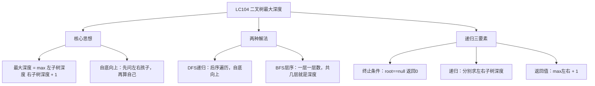

# LC104 二叉树的最大深度
## 一、题目描述
给定一个二叉树 `root`，返回其**最大深度**。最大深度是从根节点到最远叶子节点的最长路径上的**节点数**。
**示例：**
```
    3
   / \
  9  20
    /  \
   15   7
最大深度 = 3（路径：3→20→15 或 3→20→7）
```
**约束：**
- 树的节点数范围 [0, 10^4]
---
## 二、解法概览
### 解法对比表
| 解法 | 时间复杂度 | 空间复杂度 | 面试推荐 |
|------|-----------|-----------|---------|
| **DFS递归（后序遍历）** | O(n) | O(h) | ✅ **首选** |
| BFS层序遍历 | O(n) | O(w) | ✅ 推荐 |
### 思维导图

---
## 三、记忆口诀
```
二叉树深度用递归，空节点返回零
左边问一下右边问一下，取大的加一层
三行代码搞定它，递归就是这么简单
```
---
## 四、解法一：DFS递归 / 后序遍历（首选 ✅）
### 思路
**自底向上**：先递归到最底层，然后从下往上计算深度。
每个节点的深度 = max(左子树深度, 右子树深度) + 1
### 核心公式
```
maxDepth(root):
  if root == null → return 0         // 空节点深度为0
  left = maxDepth(root.left)          // 问左子树：你多深？
  right = maxDepth(root.right)        // 问右子树：你多深？
  return max(left, right) + 1         // 取大的 + 我自己这一层
```
### 怎么理解递归？
```
想象你是节点3，你想知道自己的深度：
  "左孩子9，你那边多深？" → 9说："我是叶子，深度1"
  "右孩子20，你那边多深？" → 20说："等我问问我的孩子..."
    20问15："你多深？" → 15说："我是叶子，深度1"
    20问7："你多深？"  → 7说："我是叶子，深度1"
    20说："max(1,1)+1 = 2，我这边深度2"
  3说："max(1,2)+1 = 3，最大深度是3"
每个节点只需要问自己的两个孩子，不需要关心更深层的细节
```
### 图解过程
```
        3
       / \
      9  20
        /  \
       15   7
━━━━━━━━━━━━━━━━━━━━━━━━━━━━━━━━━━
递归展开（自顶向下）：
  maxDepth(3)
    maxDepth(9)
      maxDepth(null) → 0
      maxDepth(null) → 0
      → max(0,0)+1 = 1
    maxDepth(20)
      maxDepth(15)
        maxDepth(null) → 0
        maxDepth(null) → 0
        → max(0,0)+1 = 1
      maxDepth(7)
        maxDepth(null) → 0
        maxDepth(null) → 0
        → max(0,0)+1 = 1
      → max(1,1)+1 = 2
    → max(1,2)+1 = 3 ✅
━━━━━━━━━━━━━━━━━━━━━━━━━━━━━━━━━━
每个节点的返回值（自底向上）：
        3 → 3
       / \
    1←9  20→2
        /  \
     1←15  7→1
```
### 代码示例
```java
public int maxDepth(TreeNode root) {
    if (root == null) return 0;                     // 终止条件
    int left = maxDepth(root.left);                  // 左子树深度
    int right = maxDepth(root.right);                // 右子树深度
    return Math.max(left, right) + 1;                // 取大的+1
}
```
### 递归三要素
| 要素 | 本题 |
|------|------|
| **终止条件** | `root == null` 返回 0 |
| **递归逻辑** | 分别递归左右子树 |
| **返回值** | `max(左, 右) + 1` |
### 复杂度分析
- 时间复杂度：**O(n)**，每个节点访问一次
- 空间复杂度：**O(h)**，h 是树的高度，递归栈深度。最坏 O(n)（链状树），最好 O(logn)（平衡树）
### 优缺点
| 优点 | 缺点 |
|-----|------|
| 代码极简（3行） | 链状树可能栈溢出 |
| 面试首选 | 需要理解递归 |
---
## 五、解法二：BFS层序遍历
### 思路
**一层一层数**：用队列做 BFS，每遍历完一层深度+1，总共几层就是最大深度。
### 核心公式
```
depth = 0
queue.add(root)
while queue不为空:
    遍历当前层的所有节点（把下一层的节点入队）
    depth++
return depth
```
### 图解过程
```
        3
       / \
      9  20
        /  \
       15   7
━━━━━━━━━━━━━━━━━━━━━━━━━━━━━━━━━━
初始：queue=[3], depth=0
━━━━━━━━━━━━━━━━━━━━━━━━━━━━━━━━━━
第1层：处理queue中的1个节点 [3]
  弹出3 → 左孩子9入队，右孩子20入队
  queue=[9, 20], depth=1
━━━━━━━━━━━━━━━━━━━━━━━━━━━━━━━━━━
第2层：处理queue中的2个节点 [9, 20]
  弹出9 → 无孩子
  弹出20 → 左孩子15入队，右孩子7入队
  queue=[15, 7], depth=2
━━━━━━━━━━━━━━━━━━━━━━━━━━━━━━━━━━
第3层：处理queue中的2个节点 [15, 7]
  弹出15 → 无孩子
  弹出7 → 无孩子
  queue=[], depth=3
━━━━━━━━━━━━━━━━━━━━━━━━━━━━━━━━━━
queue为空，返回 depth=3 ✅
```
### 代码示例
```java
public int maxDepth(TreeNode root) {
    if (root == null) return 0;
    Queue<TreeNode> queue = new LinkedList<>();
    queue.offer(root);
    int depth = 0;
    while (!queue.isEmpty()) {
        int size = queue.size();  // 当前层的节点数
        for (int i = 0; i < size; i++) {
            TreeNode node = queue.poll();
            if (node.left != null) queue.offer(node.left);
            if (node.right != null) queue.offer(node.right);
        }
        depth++;  // 处理完一层，深度+1
    }
    return depth;
}
```
### 复杂度分析
- 时间复杂度：**O(n)**，每个节点入队出队各一次
- 空间复杂度：**O(w)**，w 是树的最大宽度。最坏 O(n/2)（完全二叉树最后一层）
### 优缺点
| 优点 | 缺点 |
|-----|------|
| 不会栈溢出 | 代码比递归长 |
| 直观：数层数 | 需要队列额外空间 |
---
## 六、两种解法对比
| 对比 | DFS递归 | BFS层序 |
|------|---------|---------|
| 方向 | 自底向上（先到底再算） | 自顶向下（一层层扩展） |
| 代码 | 3 行 | 10+ 行 |
| 空间 | O(h) 递归栈 | O(w) 队列 |
| 适合 | 树比较平衡 | 树很深（避免栈溢出） |
| 面试 | **首选** | 层序遍历类题目 |
---
## 七、面试回答模板
### 1. 开场：理解题意
> 求根节点到最远叶子节点的路径长度。
### 2. 思路：DFS递归
> 每个节点的深度等于左右子树深度的较大值加1。递归终止条件是空节点返回0。
### 3. 代码
> 三行代码：判空返回0，递归左右，返回 max+1。
### 4. 复杂度
> 时间 O(n)，每个节点访问一次。空间 O(h)，递归栈深度等于树高。
---
## 八、相关题目
| 题号 | 题目 | 关系 | 难度 |
|-----|------|------|-----|
| LC111 | 二叉树的最小深度 | 改max为min + 注意单边为空 | 简单 |
| LC110 | 平衡二叉树 | 求深度的变体 | 简单 |
| LC543 | 二叉树的直径 | 左深度+右深度的最大值 | 简单 |
| LC226 | 翻转二叉树 | 同样递归框架 | 简单 |
| LC102 | 二叉树的层序遍历 | BFS模板题 | 中等 |
| LC124 | 二叉树中的最大路径和 | 后序遍历+返回值 | 困难 |