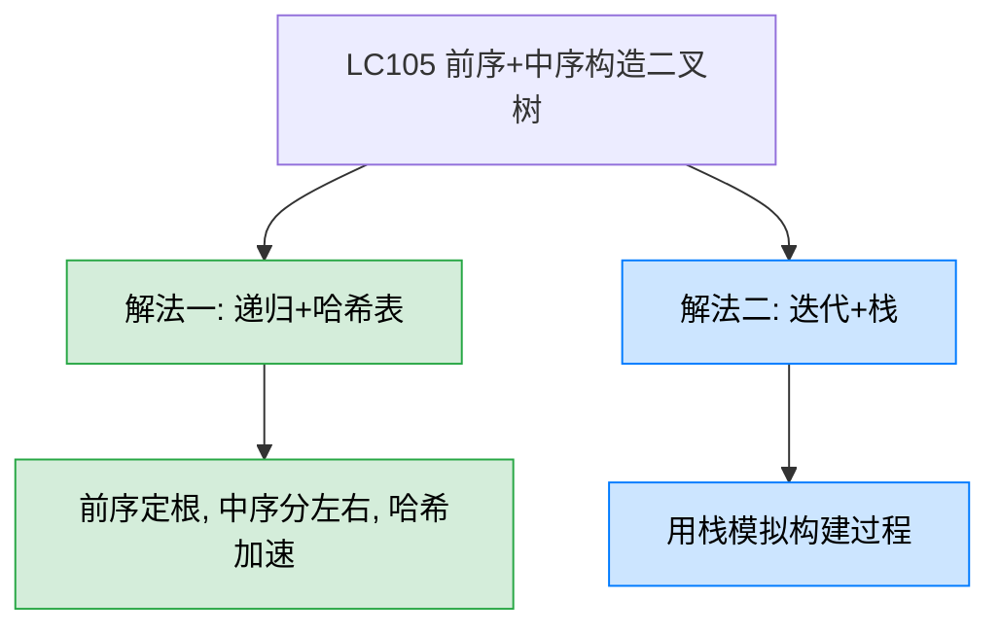
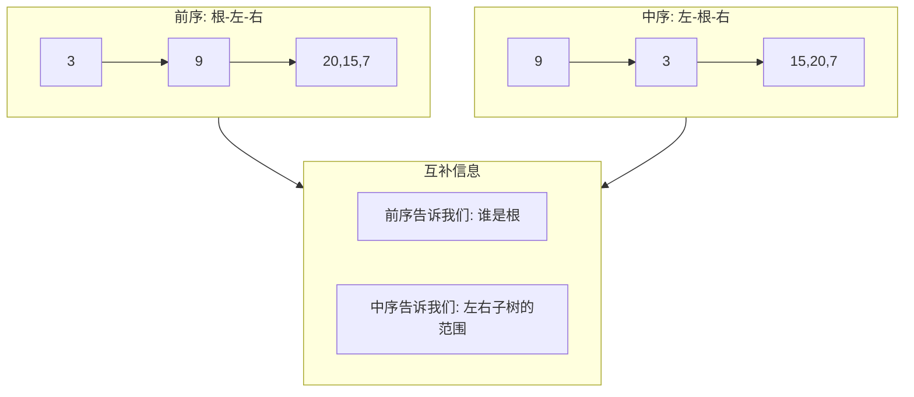
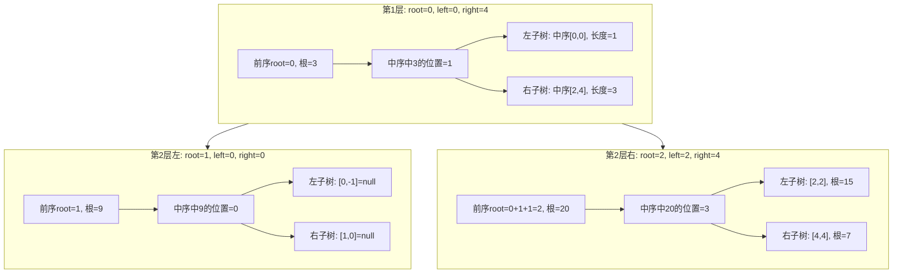

# LC105 从前序与中序遍历序列构造二叉树
## 一、题目描述
给定两个整数数组 preorder 和 inorder，其中 preorder 是二叉树的**前序遍历**，inorder 是同一棵树的**中序遍历**，请构造二叉树并返回其根节点。
**示例：** 输入 `preorder = [3,9,20,15,7], inorder = [9,3,15,20,7]`，输出 `[3,9,20,null,null,15,7]`
**约束：** 1 <= preorder.length <= 3000，inorder.length == preorder.length，值各不相同
## 二、解法概览

| 解法 | 时间复杂度 | 空间复杂度 | 难度 | 面试推荐 |
|------|-----------|-----------|------|---------|
| 递归+哈希表 | O(n) | O(n) | ⭐⭐ | 面试首选/最优解 |
| 迭代+栈 | O(n) | O(n) | ⭐⭐⭐ | 了解即可 |
## 三、记忆口诀
> **前序第一是根，中序根分左右，左子树长度定位右子树根。**
三句话拆解核心逻辑：
1. **前序第一是根** — 前序遍历的第一个元素一定是当前子树的根节点
2. **中序根分左右** — 在中序中找到根的位置，左边是左子树，右边是右子树
3. **左子树长度定位右子树根** — 根据左子树的节点数量，在前序中跳过左子树，定位到右子树的根
## 四、前置知识：两个遍历的信息互补

**前序提供根节点，中序提供左右分割。** 两者结合就能唯一确定一棵二叉树。
## 五、解法一：递归+哈希表（面试首选）
### 5.1 思路
套用**递归建树四问框架**：
1. **函数定义：** 给定前序中根的位置 root，中序的范围 [left, right]，返回子树根节点
2. **什么时候停：** left > right，返回 null
3. **当前做什么：** 前序的 root 位置就是当前根，在中序中找到它的位置 inIndex
4. **怎么拆子问题：** 中序中 inIndex 左边是左子树，右边是右子树。用 `inIndex - left` 算出左子树长度，从而定位右子树在前序中的根位置
### 5.2 核心公式
```
inIndex = map.get(preorder[root])        // 根在中序中的位置
leftSize = inIndex - left                 // 左子树节点数

左子树: recur(root + 1, left, inIndex - 1)
右子树: recur(root + leftSize + 1, inIndex + 1, right)
```
**右子树根在前序中的位置 = root + 左子树长度 + 1**，这是本题最关键的公式。
### 5.3 图解过程
以 `preorder = [3,9,20,15,7], inorder = [9,3,15,20,7]` 为例：

**右子树根的位置计算详解：**
| 参数 | 值 | 说明 |
|------|-----|------|
| root（当前根在前序的位置） | 0 | preorder[0] = 3 |
| inIndex（根在中序的位置） | 1 | inorder[1] = 3 |
| leftSize（左子树长度） | inIndex - left = 1 - 0 = 1 | 中序中根左边有1个节点 |
| 左子树根在前序的位置 | root + 1 = 1 | 紧跟根后面 |
| 右子树根在前序的位置 | root + leftSize + 1 = 0 + 1 + 1 = 2 | 跳过左子树 |
构建结果：
```
        3
       / \
      9  20
         / \
        15  7
```
### 5.4 代码示例
```java
private int[] preorder;
private Map<Integer, Integer> inMap;
public TreeNode buildTree(int[] preorder, int[] inorder) {
    this.preorder = preorder;
    this.inMap = new HashMap<>();
    for (int i = 0; i < inorder.length; i++) {
        inMap.put(inorder[i], i);
    }
    return recur(0, 0, inorder.length - 1);
}
private TreeNode recur(int root, int left, int right) {
    if (left > right) return null;
    TreeNode node = new TreeNode(preorder[root]);
    int inIndex = inMap.get(preorder[root]);
    int leftSize = inIndex - left;
    node.left = recur(root + 1, left, inIndex - 1);
    node.right = recur(root + leftSize + 1, inIndex + 1, right);
    return node;
}
```
### 5.5 为什么用哈希表？
在中序数组中查找根节点的位置，线性查找是 O(n)，n 层递归总共 O(n²)。用哈希表预存 `值→下标` 映射后，查找变为 O(1)，总时间降为 O(n)。
### 5.6 复杂度分析
- **时间复杂度：O(n)**，每个节点创建一次，哈希表查找 O(1)
- **空间复杂度：O(n)**，哈希表 O(n) + 递归栈 O(n)
### 5.7 优缺点
| 优点 | 缺点 |
|------|------|
| 思路清晰，套建树框架 | 需要额外哈希表空间 |
| 面试标准答案 | 右子树根的位置计算容易错 |
| 哈希表加速，整体 O(n) | 用了成员变量 |
## 六、参数传递的另一种写法
你的代码用了成员变量存 preorder 和 inMap。也可以全部用参数传递，更纯粹：
```java
public TreeNode buildTree(int[] preorder, int[] inorder) {
    Map<Integer, Integer> map = new HashMap<>();
    for (int i = 0; i < inorder.length; i++) {
        map.put(inorder[i], i);
    }
    return build(preorder, 0, preorder.length - 1, 0, inorder.length - 1, map);
}
private TreeNode build(int[] preorder, int preL, int preR,
                        int inL, int inR, Map<Integer, Integer> map) {
    if (preL > preR) return null;
    TreeNode root = new TreeNode(preorder[preL]);
    int inIndex = map.get(preorder[preL]);
    int leftSize = inIndex - inL;
    root.left = build(preorder, preL + 1, preL + leftSize, inL, inIndex - 1, map);
    root.right = build(preorder, preL + leftSize + 1, preR, inIndex + 1, inR, map);
    return root;
}
```
这种写法同时传前序范围 `[preL, preR]` 和中序范围 `[inL, inR]`，更容易理解范围的对应关系。
## 七、面试回答模板
> **面试官：** 根据前序和中序遍历结果构造二叉树。
**回答要点：**
1. **说原理：** 前序遍历的第一个元素是根节点，在中序遍历中找到根的位置后，左边就是左子树，右边就是右子树。两者结合可以唯一确定一棵二叉树。
2. **说优化：** 先用哈希表存中序数组的 `值→下标` 映射，查找根的位置从 O(n) 降到 O(1)。
3. **说递归：** 套递归建树框架——终止条件 left > right 返回 null；当前步从前序取根，中序中分割左右；关键公式是右子树根在前序中的位置 = root + 左子树长度 + 1。
4. **复杂度：** 时间 O(n)，空间 O(n)。
5. **易错点：** 右子树根的位置计算，必须加上左子树的长度跳过去。
## 八、相关题目
| 题目 | 关联点 |
|------|--------|
| LC106 从中序与后序遍历序列构造二叉树 | 后序最后一个是根，其余逻辑相同 |
| LC889 根据前序和后序遍历构造二叉树 | 前序+后序不能唯一确定，但可构造一种 |
| LC108 将有序数组转换为BST | 同样的递归建树框架，选根方式不同 |
| LC654 最大二叉树 | 选范围内最大值做根，同样的框架 |
| LC114 二叉树展开为链表 | 前序遍历的应用 |
