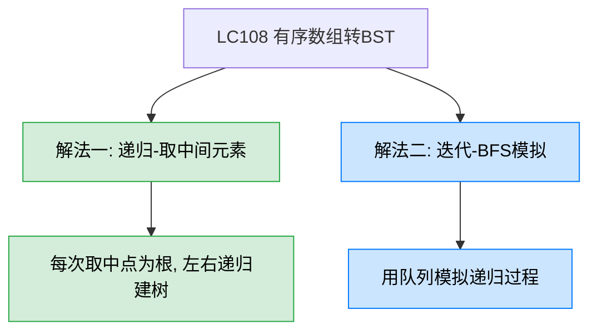
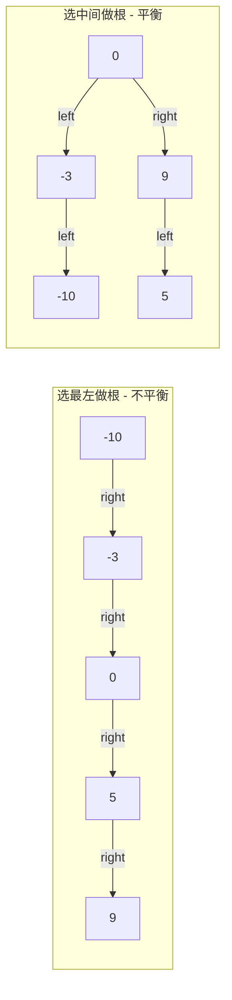
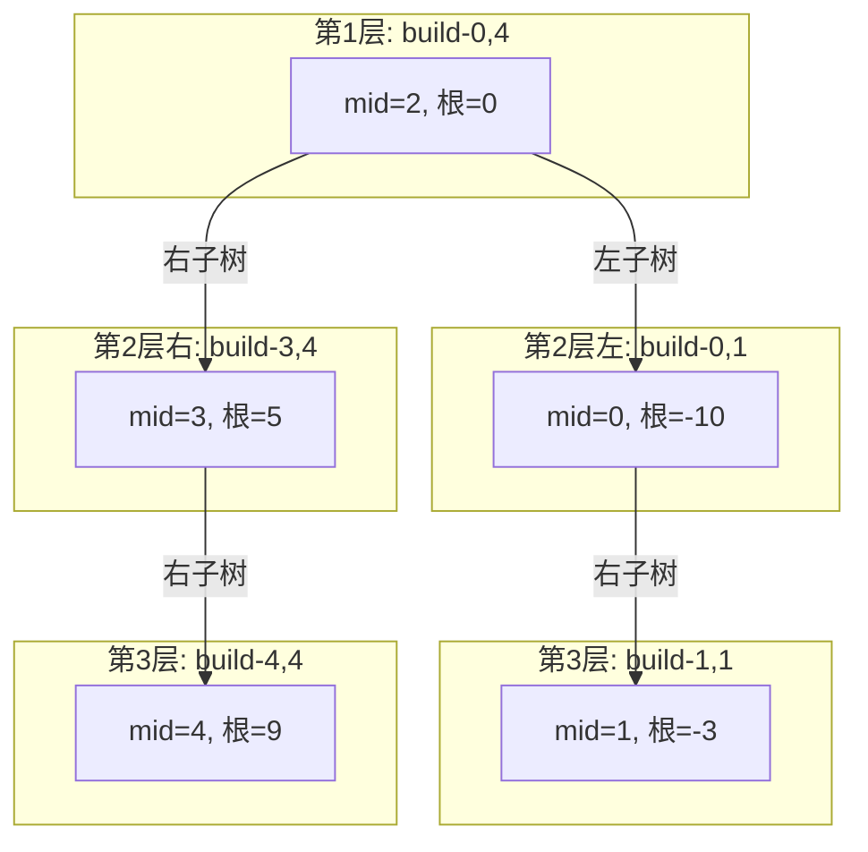

# LC108 将有序数组转换为二叉搜索树
## 一、题目描述
给你一个整数数组 nums，其中元素已经按**升序**排列，请你将其转换为一棵**高度平衡**二叉搜索树。
高度平衡二叉树：每个节点的左右两个子树的高度差不超过 1。
**示例：** 输入 `nums = [-10,-3,0,5,9]`，输出 `[0,-3,9,-10,null,5]`（取中间元素为根）
**约束：** 1 <= nums.length <= 10^4，-10^4 <= nums[i] <= 10^4，nums 按严格递增顺序排列
## 二、解法概览

| 解法 | 时间复杂度 | 空间复杂度 | 难度 | 面试推荐 |
|------|-----------|-----------|------|---------|
| 递归-取中间元素 | O(n) | O(log n) | ⭐⭐ | 面试首选/最优解 |
| 迭代-BFS模拟 | O(n) | O(n) | ⭐⭐⭐ | 备选了解 |
## 三、记忆口诀
> **有序数组找中点，中点做根分两半，左半建左树右半建右树，递归到底自然平衡。**
核心思想：有序数组的**中点**就是当前子树的根，中点左边递归建左子树，中点右边递归建右子树。每次都取中点，天然保证高度平衡。
## 四、前置知识：为什么取中点就能平衡？
BST 的性质：左子树所有值 < 根 < 右子树所有值。
有序数组天然满足这个性质，问题是选谁做根：
- 选最左边 → 退化成右斜链，不平衡
- 选最右边 → 退化成左斜链，不平衡
- **选中间** → 左右节点数量几乎相等，天然平衡

## 五、解法一：递归-取中间元素（面试首选/最优解）
### 5.1 思路
经典的**分治法**：
1. 取数组中间元素作为当前子树的根节点
2. 中间元素左边的子数组递归构建左子树
3. 中间元素右边的子数组递归构建右子树
4. 递归终止条件：`left > right` 时返回 null
### 5.2 核心公式
```
mid = left + (right - left) / 2
node = new TreeNode(nums[mid])
node.left = build(nums, left, mid - 1)
node.right = build(nums, mid + 1, right)
```
### 5.3 图解过程
以 `nums = [-10, -3, 0, 5, 9]` 为例：

构建结果：
```
        0
       / \
     -10   5
       \    \
       -3    9
```
**详细递归过程：**
| 调用 | left | right | mid | 创建节点 | 说明 |
|------|------|-------|-----|---------|------|
| build(0,4) | 0 | 4 | 2 | 0 | 整棵树的根 |
| build(0,1) | 0 | 1 | 0 | -10 | 左子树的根 |
| build(0,-1) | 0 | -1 | - | null | left>right, 返回null |
| build(1,1) | 1 | 1 | 1 | -3 | -10的右孩子 |
| build(3,4) | 3 | 4 | 3 | 5 | 右子树的根 |
| build(4,4) | 4 | 4 | 4 | 9 | 5的右孩子 |
### 5.4 代码示例
```java
public TreeNode sortedArrayToBST(int[] nums) {
    return build(nums, 0, nums.length - 1);
}
private TreeNode build(int[] nums, int left, int right) {
    if (left > right) return null;
    int mid = left + (right - left) / 2;
    TreeNode node = new TreeNode(nums[mid]);
    node.left = build(nums, left, mid - 1);
    node.right = build(nums, mid + 1, right);
    return node;
}
```
### 5.5 关于 mid 的取法
| 写法 | mid值 | 说明 |
|------|------|------|
| `left + (right - left) / 2` | 偏左 | 推荐，防止整数溢出 |
| `left + (right - left + 1) / 2` | 偏右 | 也正确，构建出的树形状略不同 |
| `(left + right) / 2` | 偏左 | 可能溢出（left+right超int范围） |
三种写法都能通过，构建出的 BST 形状可能不同但都是高度平衡的。面试中用第一种最安全。
### 5.6 复杂度分析
- **时间复杂度：O(n)**，每个元素恰好作为一个节点被创建一次
- **空间复杂度：O(log n)**，递归栈深度等于树的高度，平衡树为 log n
### 5.7 优缺点
| 优点 | 缺点 |
|------|------|
| 代码极简，核心只有5行 | 无（这就是最优解） |
| 分治思想清晰，面试标准答案 | - |
| 天然保证平衡 | - |
## 六、解法二：迭代-BFS模拟
### 6.1 思路
用三个队列分别存储：待处理的节点、对应的左边界、对应的右边界，模拟递归过程。
### 6.2 代码示例
```java
public TreeNode sortedArrayToBST(int[] nums) {
    if (nums.length == 0) return null;
    Deque<TreeNode> nodeQueue = new ArrayDeque<>();
    Deque<Integer> leftQueue = new ArrayDeque<>();
    Deque<Integer> rightQueue = new ArrayDeque<>();
    int mid = nums.length / 2;
    TreeNode root = new TreeNode(nums[mid]);
    nodeQueue.offer(root);
    leftQueue.offer(0);
    rightQueue.offer(nums.length - 1);
    while (!nodeQueue.isEmpty()) {
        TreeNode node = nodeQueue.poll();
        int left = leftQueue.poll();
        int right = rightQueue.poll();
        mid = left + (right - left) / 2;
        if (left < mid) {
            int leftMid = left + (mid - 1 - left) / 2;
            node.left = new TreeNode(nums[leftMid]);
            nodeQueue.offer(node.left);
            leftQueue.offer(left);
            rightQueue.offer(mid - 1);
        }
        if (mid < right) {
            int rightMid = mid + 1 + (right - mid - 1) / 2;
            node.right = new TreeNode(nums[rightMid]);
            nodeQueue.offer(node.right);
            leftQueue.offer(mid + 1);
            rightQueue.offer(right);
        }
    }
    return root;
}
```
### 6.3 复杂度分析
- **时间复杂度：O(n)**
- **空间复杂度：O(n)**，三个队列
### 6.4 优缺点
| 优点 | 缺点 |
|------|------|
| 不使用递归，无栈溢出风险 | 代码冗长，需要维护三个队列 |
| 展示 BFS 建树思路 | 远不如递归直观 |
## 七、面试回答模板
> **面试官：** 将有序数组转换为高度平衡的二叉搜索树。
**回答要点：**
1. **说思路：** 有序数组天然满足 BST 的性质。要保证高度平衡，关键是每次选中间元素做根，这样左右子树的节点数量几乎相等。用分治法递归：取中点建根，左半部分递归建左子树，右半部分递归建右子树。
2. **写代码：** 核心函数 `build(nums, left, right)`，递归终止条件 `left > right` 返回 null。mid 用 `left + (right - left) / 2` 防止溢出。
3. **复杂度：** 时间 O(n)，空间 O(log n)（递归栈深度）。
4. **关键细节：** mid 取偏左或偏右都行，构建出的树形状不同但都是合法答案。
5. **延伸：** 如果输入是有序链表（LC109），由于链表不能随机访问，需要用快慢指针找中点，或者用中序遍历模拟的方式建树。
## 八、相关题目
| 题目 | 关联点 |
|------|--------|
| LC109 有序链表转换二叉搜索树 | 同样思路，但链表需用快慢指针找中点 |
| LC98 验证二叉搜索树 | 验证构建出的树是否合法 |
| LC110 平衡二叉树 | 判断一棵树是否高度平衡 |
| LC1382 将二叉搜索树变平衡 | 先中序遍历得有序数组，再用本题方法重建 |
| LC105 从前序与中序遍历序列构造二叉树 | 同样是分治法递归建树 |
