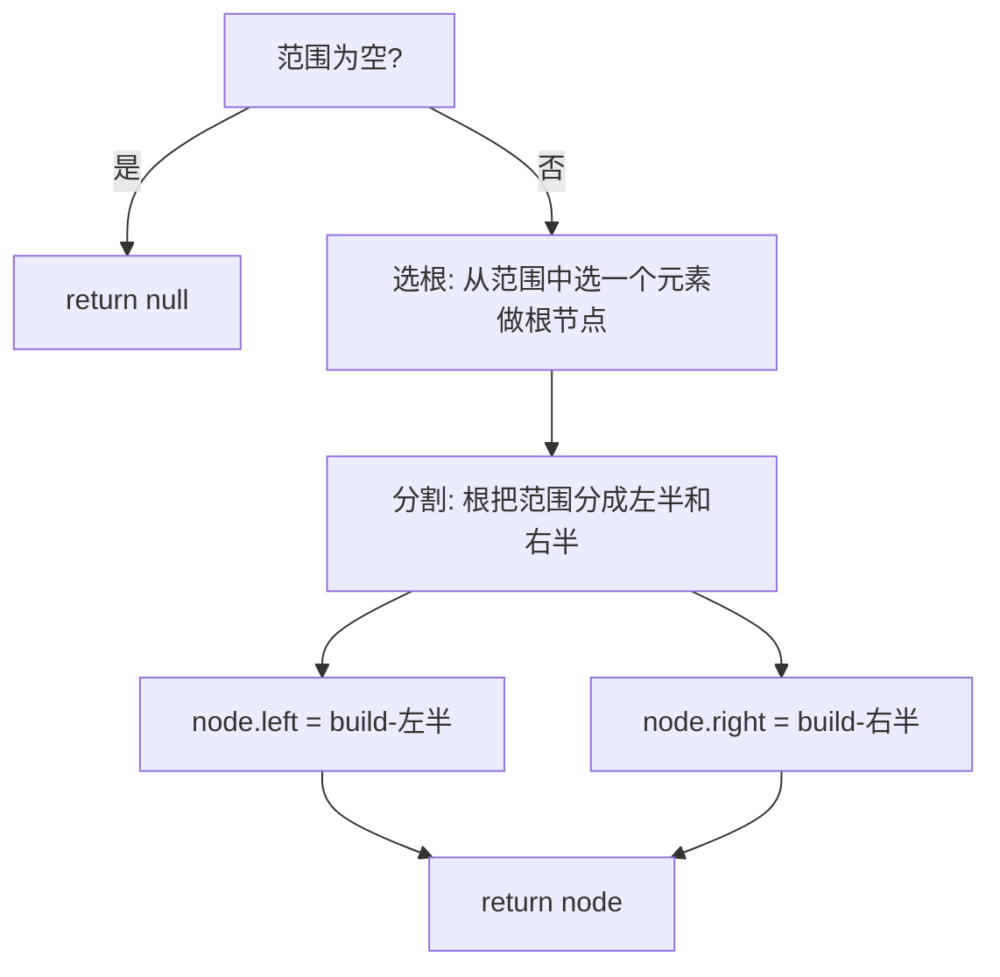

# 递归建树思维推导指南
## 一、核心思想
递归建树的代码不是靠背的，是从问题本身**一步步推导出来的**。只要回答四个问题，代码就自然写出来了。
## 二、推导四问
| 问题 | 含义 | 对应代码 |
|------|------|---------|
| 函数定义是什么？ | 给定范围，返回子树的根 | 函数签名 |
| 什么时候停？ | 范围为空时返回null | 终止条件 |
| 当前步做什么？ | 选根、建节点 | 选根逻辑 |
| 怎么拆成子问题？ | 根把范围分两半，递归 | 左右递归 |
## 三、以LC108为例逐步推导
### 第一步：明确目标 → 确定函数签名
> 把有序数组的 [left, right] 范围内的元素，构建成一棵平衡BST，返回根节点。
```java
TreeNode build(int[] nums, int left, int right)
//     返回根节点              输入范围
```
### 第二步：想最简单的情况 → 递归终止
什么时候无法构建？范围为空，即 left > right，返回null。
```java
if (left > right) return null;
```
### 第三步：当前这一步该做什么 → 选根
要构建BST，必须选一个元素做根。选谁？
- 要满足BST性质 → 左边的值 < 根 < 右边的值 → 有序数组天然满足
- 要满足平衡 → 左右子树节点数量尽量相等 → 选中间的
```java
int mid = left + (right - left) / 2;
TreeNode node = new TreeNode(nums[mid]);
```
### 第四步：剩下的交给递归 → 信任递归
根选好了，剩下的元素分成两半：
- [left, mid-1] → 都比根小 → 构建左子树
- [mid+1, right] → 都比根大 → 构建右子树
不用想递归怎么展开，只要相信它能把子问题解决就行：
```java
node.left = build(nums, left, mid - 1);
node.right = build(nums, mid + 1, right);
return node;
```
### 完整代码（每行都有来由）
```java
TreeNode build(int[] nums, int left, int right) {
    if (left > right) return null;              // ① 范围为空，无法建树
    int mid = left + (right - left) / 2;        // ② 选中间元素保证平衡
    TreeNode node = new TreeNode(nums[mid]);     // ③ 中间元素做根
    node.left = build(nums, left, mid - 1);     // ④ 左半建左子树
    node.right = build(nums, mid + 1, right);   // ⑤ 右半建右子树
    return node;                                 // ⑥ 返回当前子树的根
}
```
## 四、通用框架：所有分治建树的固定套路
```java
TreeNode build(范围参数) {
    // 1. 终止条件：范围为空 → return null
    // 2. 选根：从范围中确定当前根节点
    // 3. 分割：根把范围分成左右两部分
    // 4. 递归：左部分建左子树，右部分建右子树
    // 5. 返回：return 根节点
}
```

## 五、框架套用：同类题目对比
| 题目 | 选根的方式 | 分割方式 | 终止条件 |
|------|-----------|---------|---------|
| LC108 有序数组转BST | 取中点 | 中点左边/中点右边 | left > right |
| LC105 前序+中序建树 | 前序第一个 | 中序中根的左边/右边 | left > right |
| LC106 中序+后序建树 | 后序最后一个 | 中序中根的左边/右边 | left > right |
| LC654 最大二叉树 | 范围内最大值 | 最大值左边/右边 | left > right |
| LC109 有序链表转BST | 快慢指针找中点 | 中点左边/中点右边 | head == null |
框架完全一样，只有"选根"和"分割"的逻辑不同。
## 六、LC105 套用示例
**题目：** 从前序和中序遍历序列构造二叉树。
**套四问：**
1. 函数定义：给定前序范围和中序范围，返回子树的根
2. 什么时候停：范围为空返回null
3. 当前步做什么：前序的第一个元素就是根
4. 怎么拆子问题：在中序中找到根的位置，左边是左子树，右边是右子树
```java
TreeNode build(int[] preorder, int preL, int preR,
               int[] inorder, int inL, int inR, Map<Integer,Integer> map) {
    if (preL > preR) return null;                            // ① 终止
    TreeNode root = new TreeNode(preorder[preL]);             // ② 前序第一个是根
    int mid = map.get(preorder[preL]);                        // ③ 根在中序中的位置
    int leftSize = mid - inL;                                 // ④ 左子树的大小
    root.left = build(preorder, preL+1, preL+leftSize,
                      inorder, inL, mid-1, map);              // ⑤ 左半建左子树
    root.right = build(preorder, preL+leftSize+1, preR,
                       inorder, mid+1, inR, map);             // ⑥ 右半建右子树
    return root;
}
```
和LC108的结构一模一样：终止→选根→分割→递归→返回。
## 七、总结速记卡
```
递归建树四问：
  1. 函数干什么？ → 给定范围，返回子树根节点
  2. 什么时候停？ → 范围为空，return null
  3. 当前做什么？ → 选根，建节点
  4. 怎么拆？    → 根分两半，左右递归

代码模板：
  终止 → 选根 → 分割 → 递归左 → 递归右 → return根

信任递归：不要展开想，相信子问题能被正确解决
```
