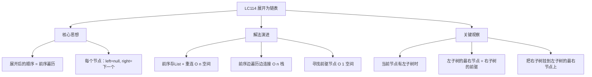
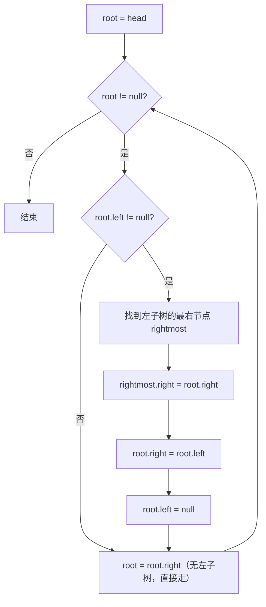

# LC114 二叉树展开为链表
## 一、题目描述
给你二叉树的根节点 `root`，请你将它展开为一个单链表：
- 展开后的单链表应该与前序遍历顺序相同
- 所有节点的 `left` 为 null，`right` 指向下一个节点
- **原地**修改，不能新建节点
**示例：**
```
输入：          输出（链表形式）：
     1               1
    / \                \
   2   5                2
  / \   \                \
 3   4   6                3
                           \
                            4
                             \
                              5
                               \
                                6
前序遍历：1→2→3→4→5→6
```
**约束：**
- 节点数范围 [0, 2000]
---
## 二、解法概览
### 解法对比表
| 解法 | 时间复杂度 | 空间复杂度 | 面试推荐 |
|------|-----------|-----------|---------|
| 前序遍历 + List | O(n) | O(n) | ✅ 普通解法 |
| 前序遍历 + 边遍历边连接 | O(n) | O(n) | ✅ 推荐 |
| **寻找前驱节点（原地）** | O(n) | O(1) | ✅ **最优解** |
### 思维导图

---
## 三、记忆口诀
```
展开链表前序走，三种解法任你选
最优解法找前驱，左子树的最右节点
右子树挂到那里去，左变右来左置空
一路往右走到底，链表就出来了
```
---
## 四、解法一：前序遍历 + List 存储
### 思路
先前序遍历把所有节点存入 List，再遍历 List 重新连接：每个节点 left=null, right=下一个。
### 图解过程
```
     1
    / \
   2   5
  / \   \
 3   4   6
━━━━━━━━━━━━━━━━━━━━━━━━━━━━━━━━━━
第1步：前序遍历 → list = [1, 2, 3, 4, 5, 6]
第2步：重新连接
  1.left=null, 1.right=2
  2.left=null, 2.right=3
  3.left=null, 3.right=4
  4.left=null, 4.right=5
  5.left=null, 5.right=6
```
### 代码示例
```java
public void flatten(TreeNode root) {
    if (root == null) return;
    List<TreeNode> list = new ArrayList<>();
    // 前序遍历（迭代）
    Deque<TreeNode> stack = new ArrayDeque<>();
    stack.push(root);
    while (!stack.isEmpty()) {
        TreeNode node = stack.pop();
        list.add(node);
        if (node.right != null) stack.push(node.right);
        if (node.left != null) stack.push(node.left);
    }
    // 重新连接
    for (int i = 0; i < list.size() - 1; i++) {
        list.get(i).left = null;
        list.get(i).right = list.get(i + 1);
    }
}
```
### 复杂度分析
- 时间复杂度：**O(n)**
- 空间复杂度：**O(n)**，List + 栈
### 优缺点
| 优点 | 缺点 |
|-----|------|
| 思路简单直接 | O(n) 额外空间 |
| 不容易出错 | 不够优雅 |
---
## 五、解法二：前序遍历 + 边遍历边连接
### 思路
在前序遍历的过程中，直接把上一个节点的 right 指向当前节点。不需要存 List。
### 代码示例
```java
public void flatten(TreeNode root) {
    if (root == null) return;
    Deque<TreeNode> stack = new ArrayDeque<>();
    stack.push(root);
    TreeNode prev = null;
    while (!stack.isEmpty()) {
        TreeNode cur = stack.pop();
        // 上一个节点的right指向当前节点
        if (prev != null) {
            prev.left = null;
            prev.right = cur;
        }
        // 先右后左入栈（前序：根→左→右）
        if (cur.right != null) stack.push(cur.right);
        if (cur.left != null) stack.push(cur.left);
        prev = cur;
    }
}
```
### 复杂度分析
- 时间复杂度：**O(n)**
- 空间复杂度：**O(n)**，栈空间（省掉了 List）
### 优缺点
| 优点 | 缺点 |
|-----|------|
| 省掉了 List | 仍需要 O(n) 栈 |
| 代码简洁 | 不是 O(1) 空间 |
---
## 六、解法三：寻找前驱节点（最优解 ✅）
### 思路
**核心观察**：对于每个节点，如果它有左子树，那么前序遍历中**左子树的最右节点**就是**右子树的前驱**。
操作步骤：
1. 找到左子树的最右节点
2. 把当前节点的右子树**挂到**左子树的最右节点的 right 上
3. 把左子树**移到**右边，左子树置空
4. 移动到右孩子，重复以上步骤
### 核心公式
```
while root != null:
    if root.left != null:
        找到 root.left 的最右节点 rightmost
        rightmost.right = root.right   // 右子树挂到左子树最右边
        root.right = root.left          // 左子树移到右边
        root.left = null                // 左子树置空
    root = root.right                   // 移动到下一个
```
### 为什么左子树的最右节点是右子树的前驱？
```
前序遍历：根 → 左子树(全部) → 右子树(全部)
左子树遍历到最后一个 = 左子树的最右节点
它的下一个 = 右子树的第一个
所以：左子树最右节点.right = 右子树根节点
     1
    / \
   2   5
  / \   \
 3   4   6
前序：1 → [2→3→4] → [5→6]
         左子树      右子树
左子树的最右节点 = 4
4 的下一个 = 5（右子树的根）
所以：4.right = 5
```
### 图解过程
```
     1
    / \
   2   5
  / \   \
 3   4   6
━━━━━━━━━━━━━━━━━━━━━━━━━━━━━━━━━━
处理节点1：有左子树
  找到左子树(2)的最右节点 = 4
  4.right = 1.right(5)     → 把5挂到4后面
  1.right = 1.left(2)      → 把左子树移到右边
  1.left = null             → 左子树置空
  变成：
     1
      \
       2
      / \
     3   4
          \
           5
            \
             6
━━━━━━━━━━━━━━━━━━━━━━━━━━━━━━━━━━
移动到 root=2：有左子树
  找到左子树(3)的最右节点 = 3
  3.right = 2.right(4)     → 把4挂到3后面
  2.right = 2.left(3)      → 把左子树移到右边
  2.left = null
  变成：
     1
      \
       2
        \
         3
          \
           4
            \
             5
              \
               6
━━━━━━━━━━━━━━━━━━━━━━━━━━━━━━━━━━
移动到 root=3：无左子树 → 跳过
移动到 root=4：无左子树 → 跳过
移动到 root=5：无左子树 → 跳过
移动到 root=6：无左子树 → 跳过
root=null → 结束 ✅
```
### 单步操作图解
```
处理前：                 处理后：
    cur                     cur
   /   \                      \
  L     R          →           L
 / \                          / \
... LR                       ... LR
                                   \
                                    R
操作：
  LR.right = R    （右子树挂到左子树最右边）
  cur.right = L   （左子树移到右边）
  cur.left = null （清空左子树）
```
### 算法流程图

### 代码示例
```java
public void flatten(TreeNode root) {
    while (root != null) {
        if (root.left != null) {
            // 找到左子树的最右节点
            TreeNode rightmost = root.left;
            while (rightmost.right != null) {
                rightmost = rightmost.right;
            }
            // 右子树挂到左子树最右边
            rightmost.right = root.right;
            // 左子树移到右边
            root.right = root.left;
            root.left = null;
        }
        // 移动到下一个（沿right走）
        root = root.right;
    }
}
```
### 复杂度分析
- 时间复杂度：**O(n)**，每个节点最多被"找最右"访问一次，总共 O(n)
- 空间复杂度：**O(1)**，没有栈/递归/List，纯指针操作
### 优缺点
| 优点 | 缺点 |
|-----|------|
| 空间 O(1) 最优 | 需要理解"前驱节点"的概念 |
| 不需要栈/递归 | 思路不直观 |
| 面试首选 | 无 |
### 关键点总结
| 关键点 | 说明 |
|-------|------|
| 为什么找左子树最右？ | 前序中左子树的最后一个 = 右子树的前驱 |
| 三步操作 | ①右子树挂到最右 ②左移到右 ③左置空 |
| 时间真的是 O(n)？ | 是的，每条边最多被"找最右"走一次，总共 n-1 条边 |
| 和 Morris 遍历的关系 | 本题的思路就是 Morris 前序遍历的思想 |
---
## 七、面试回答模板
### 1. 开场：理解题意
> 把二叉树按前序遍历的顺序展开为只有 right 指针的单链表，left 全部置空。
### 2. 思路：寻找前驱节点
> 对于每个有左子树的节点，找到左子树的最右节点（它是前序中右子树的前驱），把右子树挂到那里，再把左子树移到右边，左置空。然后沿 right 继续处理下一个。
### 3. 为什么这样做是对的
> 前序遍历是"根→左子树全部→右子树全部"，左子树遍历的最后一个节点就是"最右节点"，它的下一个就是右子树。所以把右子树挂到它后面，顺序就对了。
### 4. 复杂度
> 时间 O(n)，空间 O(1)。
---
## 八、相关题目
| 题号 | 题目 | 关系 | 难度 |
|-----|------|------|-----|
| LC144 | 二叉树的前序遍历 | 基础：前序遍历 | 简单 |
| LC206 | 反转链表 | 链表指针操作 | 简单 |
| LC897 | 递增顺序搜索树 | BST展开为链表（中序） | 简单 |
| LC430 | 扁平化多级双向链表 | 展开变体 | 中等 |
| LC226 | 翻转二叉树 | 树的结构变换 | 简单 |
| LC Morris | Morris遍历 | 同样的前驱节点思想 | 进阶 |