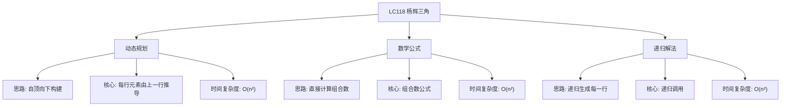

# 03-19-00-00 LC118_杨辉三角解法分析
## 题目描述
给定一个非负整数 numRows，生成「杨辉三角」的前 numRows 行。在「杨辉三角」中，每个数是它左上方和右上方的数的和。
**示例：**
输入：numRows = 5
输出：[[1],[1,1],[1,2,1],[1,3,3,1],[1,4,6,4,1]]
输入：numRows = 1
输出：[[1]]
## 解法概览
### 思维导图

## 记忆口诀
**动态规划：** 自顶向下构建，每行元素由上一行推导。
**数学公式：** 直接计算组合数，每行元素为组合数序列。
**递归解法：** 递归生成每一行，基于上一行计算当前行。
## 不同解法
### 解法一：动态规划（最优解）
#### 思路
使用动态规划的方法，自顶向下构建杨辉三角。每一行的元素由上一行的元素推导而来，每行的第一个和最后一个元素都是1，中间的元素是上一行对应位置和前一位置元素的和。
#### 核心公式
- 状态定义：result[i][j] 表示第i行第j列的元素
- 状态转移方程：result[i][j] = result[i-1][j-1] + result[i-1][j]（当0 < j < i时）
- 边界条件：result[i][0] = 1，result[i][i] = 1
#### 图解过程
以numRows=5为例：
- 第0行：[1]
- 第1行：[1,1]（首尾为1）
- 第2行：[1, 1+1=2, 1]（中间元素为上一行对应位置和前一位置元素的和）
- 第3行：[1, 1+2=3, 2+1=3, 1]
- 第4行：[1, 1+3=4, 3+3=6, 3+1=4, 1]
#### 代码示例（带详细注释）
```java
public List<List<Integer>> generate(int numRows) {
    List<List<Integer>> result = new ArrayList<>();
    if (numRows == 0) {
        return result;
    }
    
    // 初始化第一行
    List<Integer> firstRow = new ArrayList<>();
    firstRow.add(1);
    result.add(firstRow);
    
    // 从第二行开始构建
    for (int i = 1; i < numRows; i++) {
        List<Integer> currentRow = new ArrayList<>();
        List<Integer> previousRow = result.get(i - 1);
        
        // 每行的第一个元素是1
        currentRow.add(1);
        
        // 中间元素是上一行对应位置和前一位置元素的和
        for (int j = 1; j < i; j++) {
            currentRow.add(previousRow.get(j - 1) + previousRow.get(j));
        }
        
        // 每行的最后一个元素是1
        currentRow.add(1);
        
        result.add(currentRow);
    }
    
    return result;
}
```
#### 复杂度分析
- 时间复杂度：O(n²)，其中n是numRows，需要计算每个元素
- 空间复杂度：O(n²)，需要存储整个杨辉三角
#### 优缺点
- **优点：**
  - 逻辑清晰，易于理解
  - 实现简单，代码可读性高
  - 时间复杂度最优
- **缺点：** 空间复杂度为O(n²)，但这是存储结果所必需的
### 解法二：数学公式
#### 思路
杨辉三角的每个元素实际上是组合数C(n, k)，其中n是行号（从0开始），k是列号（从0开始）。可以使用组合数公式直接计算每个元素的值。
#### 核心公式
- 组合数公式：C(n, k) = n! / (k! * (n-k)!)
- 递推公式：C(n, k) = C(n, k-1) * (n - k + 1) / k
#### 图解过程
以numRows=5为例：
- 第0行：C(0,0)=1
- 第1行：C(1,0)=1, C(1,1)=1
- 第2行：C(2,0)=1, C(2,1)=2, C(2,2)=1
- 第3行：C(3,0)=1, C(3,1)=3, C(3,2)=3, C(3,3)=1
- 第4行：C(4,0)=1, C(4,1)=4, C(4,2)=6, C(4,3)=4, C(4,4)=1
#### 代码示例
```java
public List<List<Integer>> generate(int numRows) {
    List<List<Integer>> result = new ArrayList<>();
    if (numRows == 0) {
        return result;
    }
    
    for (int i = 0; i < numRows; i++) {
        List<Integer> row = new ArrayList<>();
        long current = 1;
        row.add((int) current);
        
        // 使用递推公式计算组合数
        for (int j = 1; j <= i; j++) {
            current = current * (i - j + 1) / j;
            row.add((int) current);
        }
        
        result.add(row);
    }
    
    return result;
}
```
#### 复杂度分析
- 时间复杂度：O(n²)，其中n是numRows，需要计算每个元素
- 空间复杂度：O(n²)，需要存储整个杨辉三角
#### 优缺点
- 优点：直接使用数学公式，代码简洁
- 缺点：涉及乘法和除法，可能存在整数溢出的风险
### 解法三：递归解法
#### 思路
使用递归的方法，通过递归生成上一行，然后基于上一行生成当前行。
#### 核心公式
- 递归基：当numRows=1时，返回[[1]]
- 递归公式：先递归生成前numRows-1行，然后基于最后一行生成第numRows行
#### 图解过程
以numRows=5为例：
- 递归调用generate(4)得到前4行
- 基于第4行生成第5行
- 返回包含5行的结果
#### 代码示例
```java
public List<List<Integer>> generate(int numRows) {
    List<List<Integer>> result = new ArrayList<>();
    if (numRows == 0) {
        return result;
    }
    if (numRows == 1) {
        List<Integer> row = new ArrayList<>();
        row.add(1);
        result.add(row);
        return result;
    }
    
    // 递归生成前numRows-1行
    List<List<Integer>> previous = generate(numRows - 1);
    result.addAll(previous);
    
    // 基于最后一行生成第numRows行
    List<Integer> lastRow = previous.get(previous.size() - 1);
    List<Integer> currentRow = new ArrayList<>();
    currentRow.add(1);
    for (int i = 1; i < lastRow.size(); i++) {
        currentRow.add(lastRow.get(i - 1) + lastRow.get(i));
    }
    currentRow.add(1);
    result.add(currentRow);
    
    return result;
}
```
#### 复杂度分析
- 时间复杂度：O(n²)，其中n是numRows，需要计算每个元素
- 空间复杂度：O(n²)，需要存储整个杨辉三角，加上递归栈的空间
#### 优缺点
- 优点：逻辑直观，易于理解
- 缺点：递归调用会增加栈空间的使用，效率略低于动态规划解法
## 面试回答模板
**问题：** 请生成杨辉三角的前numRows行。
**回答：**
这是一道经典的动态规划问题，主要有三种解法：
1. **动态规划**：自顶向下构建杨辉三角，每一行的元素由上一行的元素推导而来。时间复杂度O(n²)，是本题的最优解。
2. **数学公式**：使用组合数公式直接计算每个元素的值。时间复杂度O(n²)，代码简洁但可能存在整数溢出的风险。
3. **递归解法**：通过递归生成上一行，然后基于上一行生成当前行。时间复杂度O(n²)，逻辑直观但效率略低。
**最优选择：** 动态规划解法是本题的最优解，因为它逻辑清晰，实现简单，代码可读性高，且时间复杂度最优。面试中推荐使用动态规划解法，既展示了对问题的深入理解，又能高效解决问题。
## 相关题目
1. **LC119：杨辉三角 II** - 返回杨辉三角的第n行
2. **LC77：组合** - 组合数计算
3. **LC39：组合总和** - 组合数的应用
4. **LC40：组合总和 II** - 组合数的变体
这些题目都涉及到组合数的计算或杨辉三角的应用，与LC118_杨辉三角有一定的关联性。