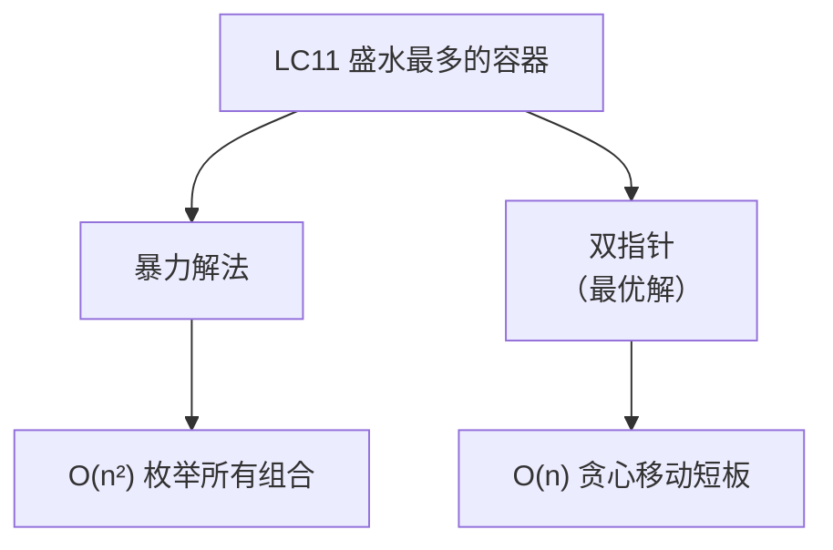
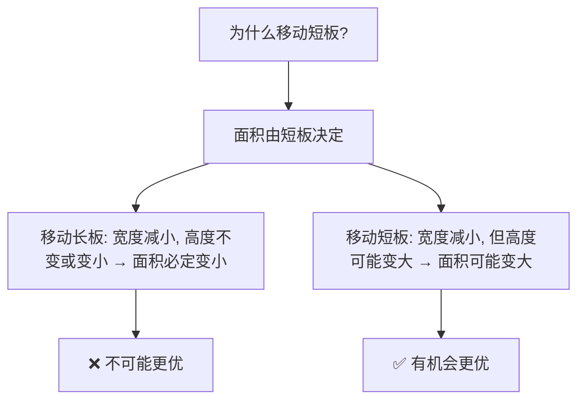
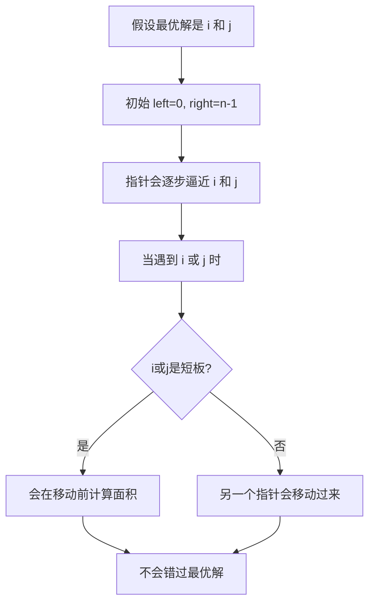
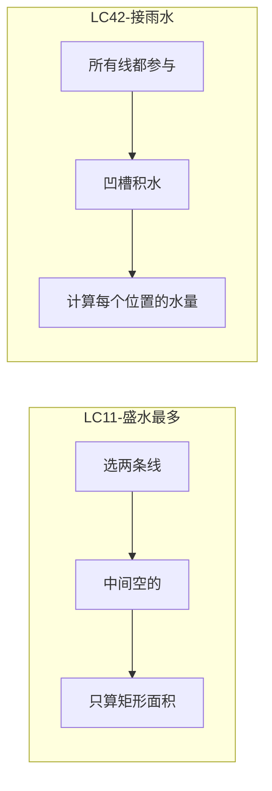

# LC11 盛水最多的容器 - 面试题解
## 一、题目描述
给定一个长度为 `n` 的整数数组 `height`。有 `n` 条垂线，第 `i` 条线的两个端点是 `(i, 0)` 和 `(i, height[i])`。
找出其中的两条线，使得它们与 `x` 轴共同构成的容器可以容纳最多的水。
**示例**：
```
输入：height = [1,8,6,2,5,4,8,3,7]
输出：49
解释：选择第2条线(高度8)和第9条线(高度7)，容器面积 = min(8,7) × (9-2) = 7 × 7 = 49
```
```
     8   |           |
     7   |           |       |
     6   |   |       |       |
     5   |   |   |   |       |
     4   |   |   |   |   |   |
     3   |   |   |   |   |   |   |
     2   |   |   |   |   |   |   |
     1|  |   |   |   |   |   |   |
     0 1 2 3 4 5 6 7 8 9 (索引)
       ↑               ↑
      left           right
      面积 = min(8,7) × 7 = 49
```
## 二、解法概览

| 解法 | 时间复杂度 | 空间复杂度 | 面试推荐 |
|------|------------|------------|----------|
| 暴力枚举 | O(n²) | O(1) | ❌ 超时 |
| **双指针** | **O(n)** | O(1) | ✅ **最优解** |
## 三、解法一：暴力枚举（了解即可）
### 3.1 思路
枚举所有可能的两条线组合，计算每种组合的面积，取最大值。
### 3.2 代码
```java
public int maxArea_Brute(int[] height) {
    int maxArea = 0;
    for (int i = 0; i < height.length; i++) {
        for (int j = i + 1; j < height.length; j++) {
            int area = (j - i) * Math.min(height[i], height[j]);
            maxArea = Math.max(maxArea, area);
        }
    }
    return maxArea;
}
```
### 3.3 复杂度
| 复杂度 | 分析 |
|--------|------|
| 时间 | O(n²)，双重循环 |
| 空间 | O(1) |
**问题**：数据量大时会超时！
## 四、解法二：双指针（最优解）
### 4.1 核心思想
**面积公式**：`面积 = 宽度 × 高度 = (right - left) × min(height[left], height[right])`
**贪心策略**：每次移动**较短**的那根线！

### 4.2 图解过程
```
初始：height = [1,8,6,2,5,4,8,3,7]
               ↑               ↑
              left            right
              h=1             h=7
Step 1: 面积 = min(1,7) × 8 = 8
        left更短，移动left
Step 2: left=1, right=8
        height[1]=8, height[8]=7
        面积 = min(8,7) × 7 = 49
        right更短，移动right
Step 3: left=1, right=7
        height[1]=8, height[7]=3
        面积 = min(8,3) × 6 = 18
        right更短，移动right
...继续直到left >= right
最大面积 = 49
```
### 4.3 执行过程表格
| 步骤 | left | right | height[left] | height[right] | 宽度 | 面积 | 移动 |
|------|------|-------|--------------|---------------|------|------|------|
| 1 | 0 | 8 | 1 | 7 | 8 | 8 | left++ |
| 2 | 1 | 8 | 8 | 7 | 7 | **49** | right-- |
| 3 | 1 | 7 | 8 | 3 | 6 | 18 | right-- |
| 4 | 1 | 6 | 8 | 8 | 5 | 40 | left++/right-- |
| 5 | 2 | 6 | 6 | 8 | 4 | 24 | left++ |
| 6 | 3 | 6 | 2 | 8 | 3 | 6 | left++ |
| 7 | 4 | 6 | 5 | 8 | 2 | 10 | left++ |
| 8 | 5 | 6 | 4 | 8 | 1 | 4 | left++ |
| 结束 | 6 | 6 | - | - | - | - | left>=right |
### 4.4 代码实现
```java
public int maxArea(int[] height) {
    int left = 0;
    int right = height.length - 1;
    int maxArea = 0;
    while (left < right) {
        // 计算当前面积
        int width = right - left;
        int h = Math.min(height[left], height[right]);
        int area = width * h;
        maxArea = Math.max(maxArea, area);
        // 移动短板
        if (height[left] < height[right]) {
            left++;
        } else {
            right--;
        }
    }
    return maxArea;
}
```
### 4.5 更简洁写法
```java
public int maxArea(int[] height) {
    int left = 0, right = height.length - 1;
    int maxArea = 0;
    while (left < right) {
        // 三元运算符：计算面积的同时移动指针
        maxArea = Math.max(maxArea, 
            (right - left) * (height[left] < height[right] ? height[left++] : height[right--]));
    }
    return maxArea;
}
```
### 4.6 复杂度分析
| 复杂度 | 分析 |
|--------|------|
| 时间 | O(n)，每个元素最多被访问一次 |
| 空间 | O(1)，只用常数变量 |
## 五、为什么双指针是正确的？
### 5.1 证明：移动短板不会错过最优解

### 5.2 直观理解
假设当前 `left` 指向的是短板：
- 如果移动 `right`（长板）：宽度-1，高度最多不变（还是被短板限制），面积必定变小
- 如果移动 `left`（短板）：宽度-1，高度可能变大，面积**有可能**变大
**结论**：移动短板是唯一可能让面积变大的选择！
## 六、与LC42接雨水的区别
| 题目 | LC11 盛水最多的容器 | LC42 接雨水 |
|------|---------------------|-------------|
| 问题 | 两条线围成的**最大**面积 | 所有凹槽能接的**总**雨水量 |
| 线条作用 | 容器的**边界** | 雨水的**隔板** |
| 中间线条 | 不影响计算 | 影响雨水量 |
| 解法 | 双指针贪心 | 双指针/单调栈/动态规划 |

## 七、面试回答模板
### 7.1 描述思路
> "这道题用双指针。左右指针从两端开始，每次计算当前面积，然后移动**较短**的那根线。因为面积由短板决定，移动长板只会让面积变小或不变，而移动短板有可能让面积变大。"
### 7.2 解释为什么正确
> "移动短板不会错过最优解。假设最优解是i和j，当指针遇到它们时，必定会计算这个面积。而在遇到之前，我们只是排除了那些不可能是最优解的组合。"
### 7.3 复杂度
> "时间复杂度O(n)，一次遍历；空间复杂度O(1)，只用了常数变量。"
## 八、相关题目
| 题号 | 题目 | 关联 |
|------|------|------|
| LC42 | 接雨水 | 双指针/单调栈 |
| LC84 | 柱状图中最大的矩形 | 单调栈 |
| LC407 | 接雨水II | 3D版本，优先队列 |
| LC15 | 三数之和 | 双指针 |
## 九、完整代码
```java
package com.ssl.note.leetcode.编号刷题.LC11_盛水最多的容器;
public class Solution {
    /**
     * 盛水最多的容器 - 双指针解法
     * 核心：每次移动短板，因为移动长板面积必定变小
     * 时间O(n)，空间O(1)
     */
    public int maxArea(int[] height) {
        int left = 0;
        int right = height.length - 1;
        int maxArea = 0;
        while (left < right) {
            // 计算当前面积
            int width = right - left;
            int h = Math.min(height[left], height[right]);
            maxArea = Math.max(maxArea, width * h);
            // 移动短板
            if (height[left] < height[right]) {
                left++;
            } else {
                right--;
            }
        }
        return maxArea;
    }
    /**
     * 暴力解法 - O(n²) 会超时
     */
    public int maxArea_Brute(int[] height) {
        int maxArea = 0;
        for (int i = 0; i < height.length; i++) {
            for (int j = i + 1; j < height.length; j++) {
                int area = (j - i) * Math.min(height[i], height[j]);
                maxArea = Math.max(maxArea, area);
            }
        }
        return maxArea;
    }
    public static void main(String[] args) {
        Solution solution = new Solution();
        int[] height = {1, 8, 6, 2, 5, 4, 8, 3, 7};
        System.out.println(solution.maxArea(height));  // 49
    }
}
```
## 十、记忆口诀
```
盛水容器双指针，
左右两端往中走。
面积取决于短板，
所以每次移短的。
移动长板必变小，
移动短板有希望。
一遍遍历O(n)解，
贪心思想要记牢。
```
