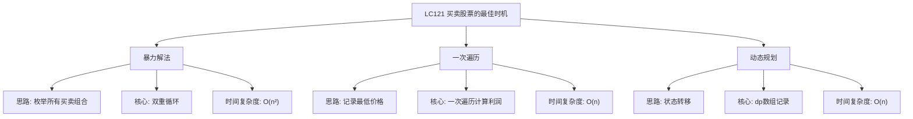

# 03-18-00-00 LC121_买卖股票的最佳时机解法分析
## 题目描述
给定一个数组 prices ，它的第 i 个元素 prices[i] 表示一支给定股票第 i 天的价格。你只能选择 某一天 买入这只股票，并选择在 未来的某一个不同的日子 卖出该股票。设计一个算法来计算你所能获取的最大利润。返回你可以从这笔交易中获取的最大利润。如果你不能获取任何利润，返回 0 。
**示例：**
输入：[7,1,5,3,6,4]
输出：5
解释：在第 2 天（价格 = 1）的时候买入，在第 5 天（价格 = 6）的时候卖出，最大利润 = 6-1 = 5 。
注意利润不能是 7-1 = 6, 因为卖出价格需要大于买入价格；同时，你不能在买入前卖出股票。
## 解法概览
### 思维导图

## 记忆口诀
**暴力解法：** 双重循环枚举，计算所有可能利润。
**一次遍历：** 记录最低价格，计算最大利润。
**动态规划：** 状态转移方程，记录最大利润。
## 不同解法
### 解法一：暴力解法（普通解法）
#### 思路
枚举所有可能的买卖组合，计算每对买卖的利润，取最大值。
#### 核心公式
- 遍历所有可能的买入日期 i
- 对于每个 i，遍历所有可能的卖出日期 j（j > i）
- 计算利润 prices[j] - prices[i]
- 取所有利润中的最大值
#### 图解过程
以输入 [7,1,5,3,6,4] 为例：
- i=0（价格7）：j=1→-6, j=2→-2, j=3→-4, j=4→-1, j=5→-3 → 最大-1
- i=1（价格1）：j=2→4, j=3→2, j=4→5, j=5→3 → 最大5
- i=2（价格5）：j=3→-2, j=4→1, j=5→-1 → 最大1
- i=3（价格3）：j=4→3, j=5→1 → 最大3
- i=4（价格6）：j=5→-2 → 最大-2
- 最终最大利润：5
#### 代码示例
```java
public int maxProfit(int[] prices) {
    int maxProfit = 0;
    for (int i = 0; i < prices.length - 1; i++) {
        for (int j = i + 1; j < prices.length; j++) {
            int profit = prices[j] - prices[i];
            if (profit > maxProfit) {
                maxProfit = profit;
            }
        }
    }
    return maxProfit;
}
```
#### 复杂度分析
- 时间复杂度：O(n²)，双重循环遍历所有可能的买卖组合
- 空间复杂度：O(1)，只需要常数级别的额外空间
#### 优缺点
- 优点：代码简单，容易理解
- 缺点：时间复杂度较高，不适合处理大规模数据
### 解法二：一次遍历（最优解）
#### 思路
在一次遍历中，记录当前遇到的最低价格，并计算以当前价格卖出时的利润，更新最大利润。
#### 核心公式
- minPrice：记录遍历过程中的最低价格
- maxProfit：记录当前最大利润
- 对于每个价格：
  1. 如果当前价格 < minPrice，更新 minPrice
  2. 否则，计算当前利润 = 当前价格 - minPrice
  3. 如果当前利润 > maxProfit，更新 maxProfit
#### 图解过程
以输入 [7,1,5,3,6,4] 为例：
- 初始：minPrice=7, maxProfit=0
- 价格1：1 < 7 → minPrice=1
- 价格5：5 > 1 → 利润4 > 0 → maxProfit=4
- 价格3：3 > 1 → 利润2 < 4 → 无变化
- 价格6：6 > 1 → 利润5 > 4 → maxProfit=5
- 价格4：4 > 1 → 利润3 < 5 → 无变化
- 最终最大利润：5
#### 代码示例（带详细注释）
```java
public int maxProfit(int[] prices) {
    if (prices == null || prices.length == 0) {
        return 0;
    }
    
    int minPrice = prices[0]; // 记录最低价格
    int maxProfit = 0; // 记录最大利润
    
    for (int i = 1; i < prices.length; i++) {
        // 如果当前价格低于最低价格，更新最低价格
        if (prices[i] < minPrice) {
            minPrice = prices[i];
        }
        // 否则，计算当前利润并更新最大利润
        else {
            int currentProfit = prices[i] - minPrice;
            if (currentProfit > maxProfit) {
                maxProfit = currentProfit;
            }
        }
    }
    
    return maxProfit;
}
```
#### 复杂度分析
- 时间复杂度：O(n)，只需一次遍历数组
- 空间复杂度：O(1)，只需要常数级别的额外空间
#### 优缺点
- **优点：**
  - 时间复杂度最优，只需一次遍历
  - 空间复杂度低，适合处理大规模数据
  - 代码简洁，逻辑清晰
- **缺点：** 无明显缺点，是本题的最优解法
### 解法三：动态规划
#### 思路
使用动态规划来记录每天的状态，包括持有股票和不持有股票的最大利润。
#### 核心公式
- dp[i][0]：第i天不持有股票的最大利润
- dp[i][1]：第i天持有股票的最大利润
- 状态转移方程：
  - dp[i][0] = max(dp[i-1][0], dp[i-1][1] + prices[i])
  - dp[i][1] = max(dp[i-1][1], -prices[i])
- 最终结果：dp[n-1][0]
#### 图解过程
以输入 [7,1,5,3,6,4] 为例：
- 初始化：dp[0][0] = 0, dp[0][1] = -7
- 第1天：dp[1][0] = max(0, -7+1=-6) → 0；dp[1][1] = max(-7, -1) → -1
- 第2天：dp[2][0] = max(0, -1+5=4) → 4；dp[2][1] = max(-1, -5) → -1
- 第3天：dp[3][0] = max(4, -1+3=2) → 4；dp[3][1] = max(-1, -3) → -1
- 第4天：dp[4][0] = max(4, -1+6=5) → 5；dp[4][1] = max(-1, -6) → -1
- 第5天：dp[5][0] = max(5, -1+4=3) → 5；dp[5][1] = max(-1, -4) → -1
- 最终结果：5
#### 代码示例
```java
public int maxProfit(int[] prices) {
    if (prices == null || prices.length == 0) {
        return 0;
    }
    
    int n = prices.length;
    int[][] dp = new int[n][2];
    
    // 初始化：第0天不持有股票利润为0，持有股票利润为-prices[0]
    dp[0][0] = 0;
    dp[0][1] = -prices[0];
    
    for (int i = 1; i < n; i++) {
        // 第i天不持有股票：要么前一天就不持有，要么前一天持有今天卖出
        dp[i][0] = Math.max(dp[i-1][0], dp[i-1][1] + prices[i]);
        // 第i天持有股票：要么前一天就持有，要么今天买入（只能买一次）
        dp[i][1] = Math.max(dp[i-1][1], -prices[i]);
    }
    
    return dp[n-1][0];
}
```
#### 复杂度分析
- 时间复杂度：O(n)，只需一次遍历数组
- 空间复杂度：O(n)，需要二维数组存储状态
#### 优缺点
- 优点：可以扩展到多次交易的情况，通用性强
- 缺点：空间复杂度较高，对于本题来说不是最优
## 面试回答模板
**问题：** 请设计一个算法来计算买卖股票的最佳时机，只能进行一次交易。
**回答：**
这是一道经典的股票交易问题，主要有三种解法：
1. **暴力解法**：枚举所有可能的买卖组合，计算每对买卖的利润，取最大值。时间复杂度O(n²)，代码简单但效率较低。
2. **一次遍历**：在一次遍历中记录最低价格，计算以当前价格卖出时的利润，更新最大利润。时间复杂度O(n)，是本题的最优解。
3. **动态规划**：使用二维数组记录每天持有和不持有股票的最大利润，通过状态转移方程求解。时间复杂度O(n)，空间复杂度O(n)，可以扩展到多次交易的情况。
**最优选择：** 一次遍历方法是本题的最优解，因为它在保证时间复杂度O(n)的同时，空间复杂度为O(1)，代码简洁且易于理解。面试中推荐使用一次遍历方法，既展示了对问题的深入理解，又能高效解决问题。
## 相关题目
1. **LC122：买卖股票的最佳时机 II** - 多次交易
2. **LC123：买卖股票的最佳时机 III** - 最多两次交易
3. **LC188：买卖股票的最佳时机 IV** - 最多k次交易
4. **LC309：最佳买卖股票时机含冷冻期** - 含冷冻期的交易
这些题目都涉及到股票交易的不同场景，与LC121_买卖股票的最佳时机有一定的关联性。