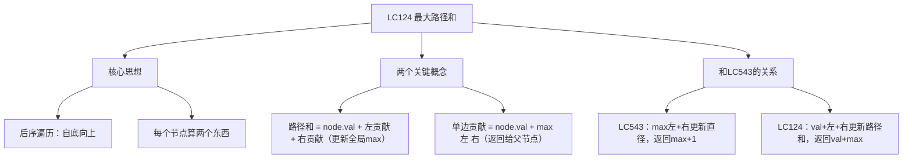
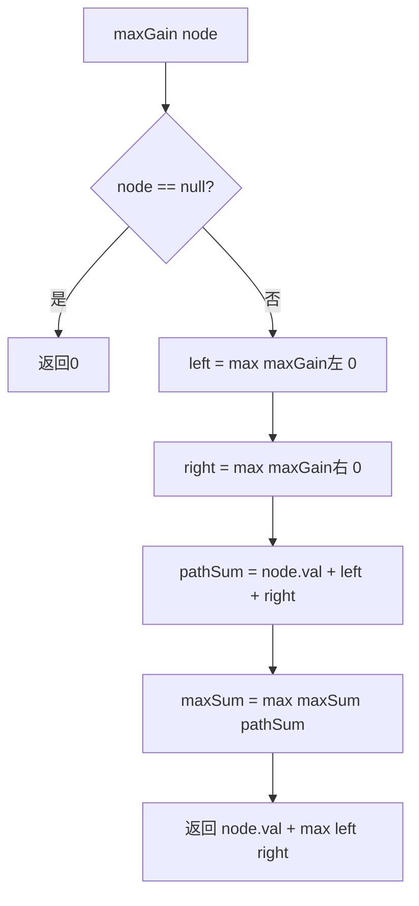

# LC124 二叉树中的最大路径和
## 一、题目描述
二叉树中的**路径**被定义为一条节点序列，路径中相邻的两个节点之间存在一条边。路径上至少包含一个节点，且**不一定经过根节点**。**路径和**是路径中各节点值的总和。给你一个二叉树的根节点 `root`，返回其**最大路径和**。
**示例1：**
```
     -10
     /  \
    9   20
       /  \
      15   7
  最大路径：15 → 20 → 7，路径和 = 42
```
**示例2：**
```
    1
   / \
  2   3
  最大路径：2 → 1 → 3，路径和 = 6
```
**示例3：**
```
    -3
  最大路径：-3，路径和 = -3（至少要包含一个节点）
```
**约束：**
- 节点数范围 [1, 3×10^4]
- -1000 <= Node.val <= 1000
---
## 二、解法概览
### 解法对比表
| 解法 | 时间复杂度 | 空间复杂度 | 面试推荐 |
|------|-----------|-----------|---------|
| **DFS后序遍历 + 全局变量** | O(n) | O(h) | ✅ **标准解法** |
### 与 LC543（直径）的关系
```
LC543 直径：max = max(max, 左深度 + 右深度)        边数
LC124 最大路径和：max = max(max, 左贡献 + 右贡献 + 自身)  值之和
框架完全一样！只是一个算边数，一个算值之和
而且 LC124 多了一个细节：贡献可能是负数，要和0取max
```
### 思维导图

---
## 三、记忆口诀
```
最大路径和后序找，每个节点算两值
路径和等于左加右加自己，更新全局最大值
单边贡献返给父，取左右大的加自己
负数贡献不要了，和零取大是关键
```
---
## 四、解法：DFS后序遍历 + 全局变量
### 思路
每个节点要算两个东西：
1. **经过自己的路径和** = 左贡献 + 自身值 + 右贡献 → 更新全局 max（答案）
2. **向上的单边贡献** = 自身值 + max(左贡献, 右贡献) → 返回给父节点
### 两个概念的区别
```
"经过自己的路径和"（两条边都可以用）：
    左
     \
      自己    → left + node.val + right = 可以"拐弯"
     /
    右
"向上的单边贡献"（只能选一条边）：
      父节点
       |
      自己    → node.val + max(left, right) = 只能走一边
      / \
    左   右    ← 选一条贡献给父节点，不能两边都走
```
```
为什么返回给父节点时只能选一边？
  路径是一条线，不能分叉！
  如果左右都选了，经过自己就变成了"Y形"，不是一条路径
  只有在"以自己为拐点"的时候才能左右都用，这时候更新max
  给父节点只能贡献一边，保持路径是一条线
```
### 核心公式
```
maxGain(node):
  if node == null → return 0
  left = max(maxGain(node.left), 0)     // 左贡献（负数当0，不要）
  right = max(maxGain(node.right), 0)   // 右贡献（负数当0，不要）
  pathSum = node.val + left + right      // 经过自己的路径和
  maxSum = max(maxSum, pathSum)          // 更新全局最大
  return node.val + max(left, right)     // 返回单边贡献
```
### 为什么负贡献要当0？
```
    5
   / \
  -3   2
如果左孩子贡献-3，我还不如不走左边（贡献0）
max(-3, 0) = 0 → 不走左边
路径：5→2 = 7（不经过-3）
如果不和0取max，路径和 = -3+5+2 = 4，不如不走-3
```
### 图解过程
```
     -10
     /  \
    9   20
       /  \
      15   7
━━━━━━━━━━━━━━━━━━━━━━━━━━━━━━━━━━
maxGain(9)：叶子
  left=max(0,0)=0, right=max(0,0)=0
  路径和=9+0+0=9 → maxSum=9
  返回贡献=9+max(0,0)=9
━━━━━━━━━━━━━━━━━━━━━━━━━━━━━━━━━━
maxGain(15)：叶子
  left=0, right=0
  路径和=15 → maxSum=15
  返回贡献=15
━━━━━━━━━━━━━━━━━━━━━━━━━━━━━━━━━━
maxGain(7)：叶子
  left=0, right=0
  路径和=7 → maxSum=15（不更新）
  返回贡献=7
━━━━━━━━━━━━━━━━━━━━━━━━━━━━━━━━━━
maxGain(20)：
  left=max(15,0)=15, right=max(7,0)=7
  路径和=20+15+7=42 → maxSum=42 ← 更新！
  返回贡献=20+max(15,7)=20+15=35
  （只能选一边给父节点，选15更大的那边）
━━━━━━━━━━━━━━━━━━━━━━━━━━━━━━━━━━
maxGain(-10)：
  left=max(9,0)=9, right=max(35,0)=35
  路径和=-10+9+35=34 → maxSum=42（不更新，42更大）
  返回贡献=-10+max(9,35)=-10+35=25
━━━━━━━━━━━━━━━━━━━━━━━━━━━━━━━━━━
每个节点的贡献和路径和：
     -10  贡献25  路径和34
     /  \
    9   20  贡献9/35  路径和9/42 ← 最大路径和在这！
       /  \
      15   7  贡献15/7  路径和15/7
最终 maxSum = 42 ✅（路径 15→20→7）
```
### 算法流程图

### 代码示例
```java
private int maxSum = Integer.MIN_VALUE;
public int maxPathSum(TreeNode root) {
    maxGain(root);
    return maxSum;
}
private int maxGain(TreeNode node) {
    if (node == null) return 0;
    // 左右贡献（负数当0，不如不走）
    int left = Math.max(maxGain(node.left), 0);
    int right = Math.max(maxGain(node.right), 0);
    // 经过自己的路径和（左+自己+右，可以拐弯）→ 更新全局max
    maxSum = Math.max(maxSum, node.val + left + right);
    // 返回单边贡献（只能选一边给父节点）
    return node.val + Math.max(left, right);
}
```
### 和 LC543（直径）的代码对比
```java
// LC543 直径
int dfs(TreeNode node) {
    if (node == null) return 0;
    int left = dfs(node.left);
    int right = dfs(node.right);
    max = Math.max(max, left + right);            // 直径 = 左深度+右深度
    return Math.max(left, right) + 1;              // 返回深度
}
// LC124 最大路径和
int maxGain(TreeNode node) {
    if (node == null) return 0;
    int left = Math.max(maxGain(node.left), 0);    // ← 多了和0取max
    int right = Math.max(maxGain(node.right), 0);  // ← 多了和0取max
    maxSum = Math.max(maxSum, node.val+left+right); // 路径和=左+右+自己
    return node.val + Math.max(left, right);        // 返回贡献值
}
```
```
区别：
  LC543：深度，没有负数问题，不需要和0取max
  LC124：值的和，可能有负数，负贡献不如不走→和0取max
  框架完全一样：全局变量记录"拐弯"的最大值，返回值是"单边"给父节点用
```
### 复杂度分析
- 时间复杂度：**O(n)**，每个节点访问一次
- 空间复杂度：**O(h)**，递归栈深度
### 优缺点
| 优点 | 缺点 |
|-----|------|
| 一次遍历搞定 | 需要区分"路径和"和"单边贡献" |
| 和LC543框架一样 | 负数处理容易忘 |
### 关键点总结
| 关键点 | 说明 |
|-------|------|
| 路径和 vs 单边贡献 | 路径和可以拐弯（左+右+自己），贡献只能选一边 |
| 为什么负贡献当0？ | 走这边还不如不走，不走贡献=0 |
| maxSum 初始值 | `Integer.MIN_VALUE`，因为节点值可能全是负数 |
| 为什么不能初始为0？ | 如果所有节点都是负数，答案是最大的负数，不是0 |
| 和 LC543 的关系 | 框架一样，多了"和0取max"和"加上node.val" |
---
## 五、面试回答模板
### 1. 开场：理解题意
> 找二叉树中路径和最大的路径，路径不一定经过根，但路径是一条线不能分叉。
### 2. 思路：后序遍历 + 全局变量
> 每个节点算两个值：一是经过自己的路径和（左+右+自己），更新全局最大值；二是向上的单边贡献（自己+max(左,右)），返回给父节点。
### 3. 关键细节
> 负贡献要和0取max，因为走这边不如不走。全局变量初始为 Integer.MIN_VALUE，因为所有节点可能都是负数。
### 4. 和 LC543 的关系
> 框架和求直径一模一样。直径是 max(左深度+右深度)，路径和是 max(左贡献+右贡献+自身值)，多了负数处理。
### 5. 复杂度
> 时间 O(n)，空间 O(h)。
---
## 六、相关题目
| 题号 | 题目 | 关系 | 难度 |
|-----|------|------|-----|
| LC543 | 二叉树的直径 | 同框架：返回值+全局变量 | 简单 |
| LC687 | 最长同值路径 | 路径和变体 | 中等 |
| LC112 | 路径总和 | 根到叶的路径判断 | 简单 |
| LC113 | 路径总和II | 根到叶收集路径 | 中等 |
| LC437 | 路径总和III | 任意路径+前缀和 | 中等 |
| LC104 | 二叉树的最大深度 | 基础后序遍历 | 简单 |