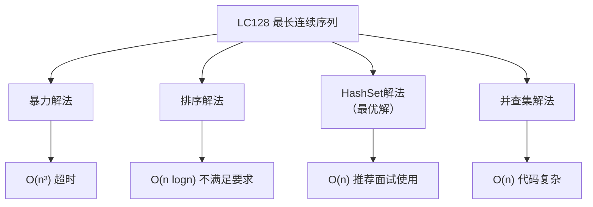
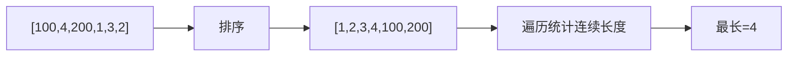
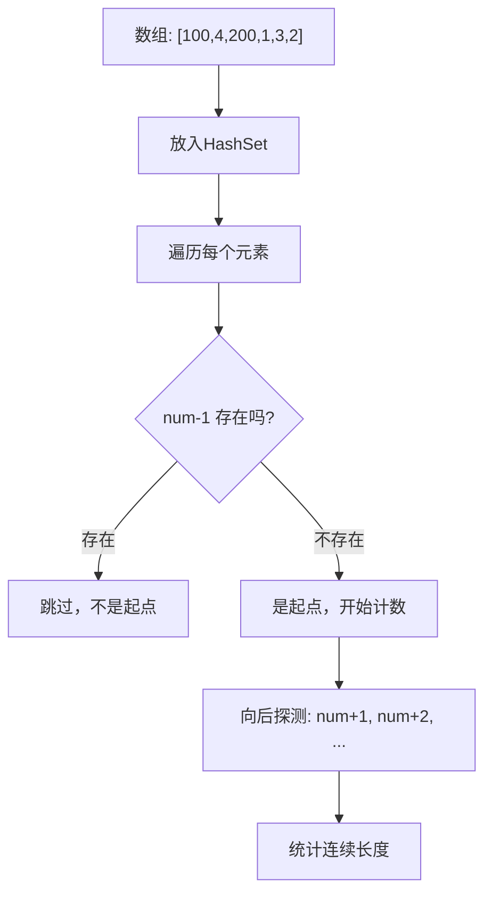
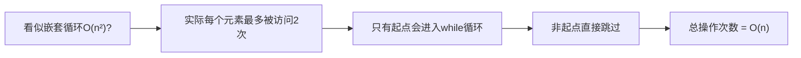
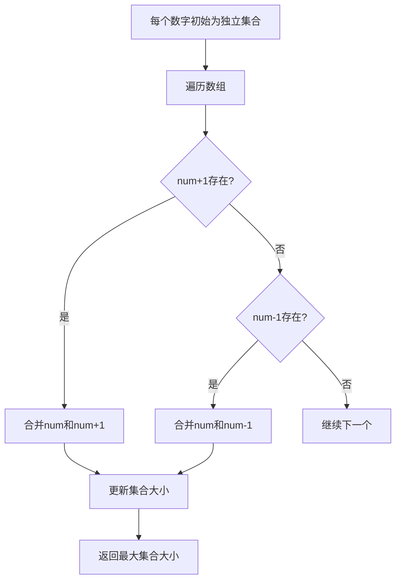

# LC128 最长连续序列 - 面试题解
## 一、题目描述
给定一个**未排序**的整数数组 `nums`，找出数字连续的最长序列（不要求序列元素在原数组中连续）的长度。
**要求**：时间复杂度为 O(n)
**示例**：
```
输入：nums = [100, 4, 200, 1, 3, 2]
输出：4
解释：最长数字连续序列是 [1, 2, 3, 4]，长度为 4
```
## 二、解法概览

| 解法 | 时间复杂度 | 空间复杂度 | 面试推荐度 |
|------|------------|------------|------------|
| 暴力解法 | O(n³) | O(1) | ❌ 超时 |
| 排序解法 | O(n logn) | O(1) | ⚠️ 不满足O(n)要求 |
| **HashSet解法** | **O(n)** | O(n) | ✅ **最优解，强烈推荐** |
| 并查集解法 | O(n) | O(n) | ⚠️ 代码复杂，进阶展示 |
## 三、解法一：排序法（不满足题目要求，但面试可作为第一反应）
### 3.1 思路

### 3.2 代码实现
```java
public int longestConsecutive(int[] nums) {
    if (nums.length == 0) return 0;
    Arrays.sort(nums);
    int maxLen = 1, curLen = 1;
    for (int i = 1; i < nums.length; i++) {
        if (nums[i] == nums[i-1]) {
            continue;  // 跳过重复元素
        } else if (nums[i] == nums[i-1] + 1) {
            curLen++;
        } else {
            maxLen = Math.max(maxLen, curLen);
            curLen = 1;
        }
    }
    return Math.max(maxLen, curLen);
}
```
### 3.3 复杂度
| 复杂度 | 分析 |
|--------|------|
| 时间 | O(n logn)，排序占主导 |
| 空间 | O(1)，原地排序 |
**缺点**：不满足题目O(n)时间复杂度要求！
## 四、解法二：HashSet解法（最优解，面试必会）
### 4.1 核心思想
**关键洞察**：只从序列的**起点**开始计数，避免重复计算！

**为什么只处理起点？**
| 数字 | num-1存在？ | 是否起点 | 处理方式 |
|------|-------------|----------|----------|
| 1 | 0不存在 | ✅是起点 | 向后计数1→2→3→4，长度=4 |
| 2 | 1存在 | ❌不是 | 跳过 |
| 3 | 2存在 | ❌不是 | 跳过 |
| 4 | 3存在 | ❌不是 | 跳过 |
| 100 | 99不存在 | ✅是起点 | 向后计数100，长度=1 |
| 200 | 199不存在 | ✅是起点 | 向后计数200，长度=1 |
### 4.2 代码实现
```java
public int longestConsecutive(int[] nums) {
    // 1. 将所有数字放入HashSet
    Set<Integer> set = new HashSet<>();
    for (int num : nums) {
        set.add(num);
    }
    int maxLen = 0;
    // 2. 遍历每个数字
    for (int num : set) {
        // 3. 只处理起点（num-1不存在）
        if (!set.contains(num - 1)) {
            int curNum = num;
            int curLen = 1;
            // 4. 向后探测连续数字
            while (set.contains(curNum + 1)) {
                curNum++;
                curLen++;
            }
            maxLen = Math.max(maxLen, curLen);
        }
    }
    return maxLen;
}
```
### 4.3 执行过程演示
```
输入：nums = [100, 4, 200, 1, 3, 2]
Step 1: 构建HashSet = {100, 4, 200, 1, 3, 2}
Step 2: 遍历set中的元素
  - 100: 99不在set中 → 是起点 → 探测101不在 → 长度=1
  - 4:   3在set中 → 不是起点 → 跳过
  - 200: 199不在set中 → 是起点 → 探测201不在 → 长度=1
  - 1:   0不在set中 → 是起点 → 探测2,3,4都在 → 长度=4
  - 3:   2在set中 → 不是起点 → 跳过
  - 2:   1在set中 → 不是起点 → 跳过
Step 3: 返回 maxLen = 4
```
### 4.4 复杂度分析
| 复杂度 | 分析 |
|--------|------|
| 时间 | O(n)，每个元素最多被访问2次（一次判断起点，一次被探测） |
| 空间 | O(n)，HashSet存储所有元素 |
### 4.5 为什么是O(n)而不是O(n²)？

**关键**：`while`循环虽然嵌套在`for`循环里，但**只有起点才会进入while**，每个元素在while中最多被访问一次，所以总时间是O(n)。
## 五、解法三：并查集解法（你现有代码）
### 5.1 思路

### 5.2 代码实现（你现有代码优化版）
```java
public int longestConsecutive(int[] nums) {
    Map<Integer, Integer> fathers = new HashMap<>();  // 父节点
    Map<Integer, Integer> counts = new HashMap<>();   // 集合大小
    Set<Integer> set = new HashSet<>();
    // 初始化：每个数字是自己的父节点，集合大小为1
    for (int num : nums) {
        fathers.put(num, num);
        counts.put(num, 1);
        set.add(num);
    }
    // 合并相邻元素
    for (int num : nums) {
        if (set.contains(num + 1)) {
            union(fathers, counts, num, num + 1);
        }
        if (set.contains(num - 1)) {
            union(fathers, counts, num, num - 1);
        }
    }
    // 找最大集合
    int res = 0;
    for (int length : counts.values()) {
        res = Math.max(res, length);
    }
    return res;
}
private void union(Map<Integer, Integer> fathers, Map<Integer, Integer> counts, int a, int b) {
    int fa = findFather(fathers, a);
    int fb = findFather(fathers, b);
    if (fa != fb) {
        fathers.put(fa, fb);  // fa挂到fb下
        counts.put(fb, counts.get(fa) + counts.get(fb));  // 更新fb的集合大小
    }
}
private int findFather(Map<Integer, Integer> fathers, int num) {
    if (fathers.get(num) != num) {
        fathers.put(num, findFather(fathers, fathers.get(num)));  // 路径压缩
    }
    return fathers.get(num);
}
```
### 5.3 复杂度
| 复杂度 | 分析 |
|--------|------|
| 时间 | O(n × α(n)) ≈ O(n)，α是阿克曼函数的反函数，近似常数 |
| 空间 | O(n) |
### 5.4 并查集 vs HashSet
| 维度 | HashSet解法 | 并查集解法 |
|------|-------------|------------|
| 时间复杂度 | O(n) | O(n × α(n)) ≈ O(n) |
| 代码复杂度 | 简单 | 复杂 |
| 面试推荐 | ✅ 首选 | 进阶展示 |
| 适用场景 | 本题最优 | 动态合并场景更优 |
## 六、面试回答模板
### 6.1 第一反应
> "我的第一反应是排序，排序后遍历统计连续长度。但这样时间复杂度是O(n logn)，不满足题目O(n)的要求。"
### 6.2 最优解
> "要达到O(n)，我用HashSet。关键思路是：**只从序列的起点开始计数**。判断起点的方法是：如果num-1不在集合中，那num就是某个连续序列的起点。从起点开始向后探测num+1、num+2...直到不连续为止，记录长度。虽然有嵌套循环，但每个元素最多被访问两次，所以总时间是O(n)。"
### 6.3 进阶展示
> "这道题还可以用并查集做。把相邻的数字合并到同一个集合，最后找最大集合的大小。不过并查集代码更复杂，对于这道题HashSet解法更简洁高效。"
## 七、完整代码（推荐版本）
```java
package com.ssl.note.leetcode.编号刷题.LC128_最长连续序列;
import java.util.*;
public class Solution {
    // 解法一：HashSet（最优解，推荐）
    public int longestConsecutive_HashSet(int[] nums) {
        Set<Integer> set = new HashSet<>();
        for (int num : nums) {
            set.add(num);
        }
        int maxLen = 0;
        for (int num : set) {
            // 只处理起点
            if (!set.contains(num - 1)) {
                int curNum = num;
                int curLen = 1;
                while (set.contains(curNum + 1)) {
                    curNum++;
                    curLen++;
                }
                maxLen = Math.max(maxLen, curLen);
            }
        }
        return maxLen;
    }
    // 解法二：排序（不满足O(n)要求）
    public int longestConsecutive_Sort(int[] nums) {
        if (nums.length == 0) return 0;
        Arrays.sort(nums);
        int maxLen = 1, curLen = 1;
        for (int i = 1; i < nums.length; i++) {
            if (nums[i] == nums[i-1]) continue;
            if (nums[i] == nums[i-1] + 1) {
                curLen++;
            } else {
                maxLen = Math.max(maxLen, curLen);
                curLen = 1;
            }
        }
        return Math.max(maxLen, curLen);
    }
}
```
## 八、记忆口诀
```
最长连续序列题，
HashSet是最优解。
只从起点开始数，
num减一不存在。
向后探测加加加，
统计长度取最大。
看似嵌套实O(n)，
每个元素访两次。
```
## 九、相关题目
| 题号 | 题目 | 关联 |
|------|------|------|
| LC1 | 两数之和 | HashSet/HashMap应用 |
| LC49 | 字母异位词分组 | HashMap分组 |
| LC287 | 寻找重复数 | 快慢指针/HashSet |
