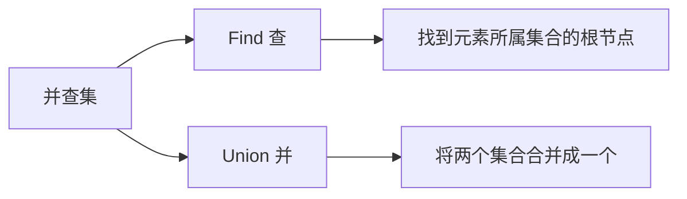
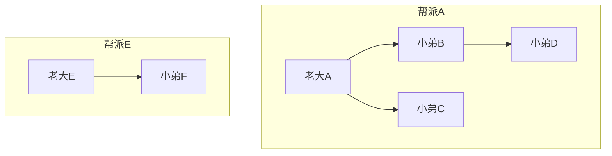
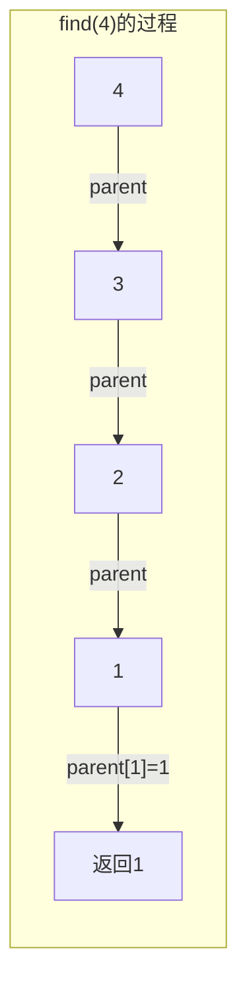
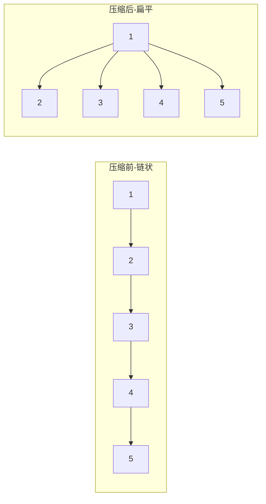
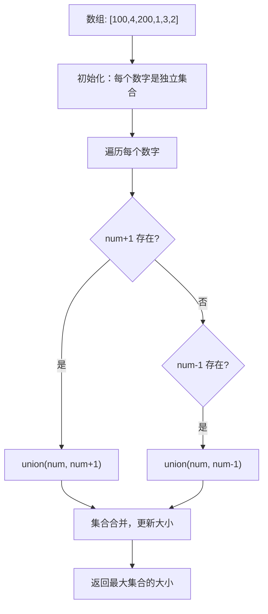
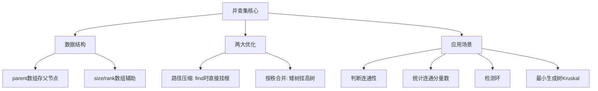

# 并查集知识点与LC128实战
## 一、并查集概述
### 1.1 什么是并查集
**并查集（Union-Find）**：用于处理**不相交集合**的合并与查询问题的数据结构。

### 1.2 核心操作
| 操作 | 功能 | 优化后时间复杂度 |
|------|------|------------------|
| **Find（查）** | 找到元素所属集合的**根节点** | O(α(n)) ≈ O(1) |
| **Union（并）** | 将两个集合**合并**成一个 | O(α(n)) ≈ O(1) |
| **isConnected** | 判断两个元素是否在同一集合 | O(α(n)) ≈ O(1) |
> α(n) 是阿克曼函数的反函数，增长极慢，对于实际问题可视为常数。
## 二、形象理解：帮派系统

| 概念 | 帮派比喻 | 并查集术语 |
|------|----------|------------|
| 帮派 | 一群人组成的团体 | 集合 |
| 老大 | 帮派的最高领导 | 根节点（代表元） |
| 找老大 | 顺着上级一直找到最高领导 | Find操作 |
| 帮派合并 | 一个老大认另一个老大当大哥 | Union操作 |
| 同一帮派 | 两人的老大是同一个人 | isConnected |
## 三、代码实现演进
### 3.1 基础版本
```java
public class UnionFind {
    private int[] parent;  // parent[i] = i的父节点
    // 初始化：每个人都是自己的老大
    public UnionFind(int n) {
        parent = new int[n];
        for (int i = 0; i < n; i++) {
            parent[i] = i;  // 自己是自己的父节点
        }
    }
    // 查：找到x的老大（根节点）
    public int find(int x) {
        while (parent[x] != x) {
            x = parent[x];  // 不断向上找
        }
        return x;
    }
    // 并：合并x和y所在的帮派
    public void union(int x, int y) {
        int rootX = find(x);
        int rootY = find(y);
        if (rootX != rootY) {
            parent[rootX] = rootY;  // x的老大认y的老大当大哥
        }
    }
    // 判断x和y是否在同一个帮派
    public boolean isConnected(int x, int y) {
        return find(x) == find(y);
    }
}
```
### 3.2 Find过程图解

```
parent数组: [_, 1, 1, 2, 3]  (索引从1开始)
             i=1 i=2 i=3 i=4
find(4): 4 → 3 → 2 → 1 → 返回1
```
## 四、两大优化技术
### 4.1 路径压缩（Path Compression）
**问题**：树可能退化成链表，find变成O(n)

**解决**：查找时顺便把路径上的节点直接挂到根节点下
```java
// 路径压缩版find（递归实现）
public int find(int x) {
    if (parent[x] != x) {
        parent[x] = find(parent[x]);  // 递归查找 + 直接挂到根节点
    }
    return parent[x];
}
// 路径压缩版find（迭代实现，避免栈溢出）
public int find(int x) {
    int root = x;
    // 第一遍：找到根节点
    while (parent[root] != root) {
        root = parent[root];
    }
    // 第二遍：压缩路径
    while (parent[x] != root) {
        int next = parent[x];
        parent[x] = root;  // 直接挂到根
        x = next;
    }
    return root;
}
```
### 4.2 按秩合并（Union by Rank/Size）
**问题**：合并时总把大树挂到小树下，树会变高
**解决**：总是把**矮的树/小的树**挂到**高的树/大的树**下
```java
public class UnionFind {
    private int[] parent;
    private int[] rank;  // rank[i] = 以i为根的树的高度
    public UnionFind(int n) {
        parent = new int[n];
        rank = new int[n];
        for (int i = 0; i < n; i++) {
            parent[i] = i;
            rank[i] = 1;
        }
    }
    public void union(int x, int y) {
        int rootX = find(x);
        int rootY = find(y);
        if (rootX == rootY) return;
        // 矮树挂到高树下
        if (rank[rootX] < rank[rootY]) {
            parent[rootX] = rootY;
        } else if (rank[rootX] > rank[rootY]) {
            parent[rootY] = rootX;
        } else {
            parent[rootY] = rootX;
            rank[rootX]++;  // 高度相同，合并后高度+1
        }
    }
}
```
### 4.3 优化效果对比
| 版本 | Find时间复杂度 | Union时间复杂度 |
|------|----------------|-----------------|
| 基础版 | O(n) 最坏 | O(n) |
| 路径压缩 | O(log n) 均摊 | O(log n) |
| 路径压缩 + 按秩合并 | O(α(n)) ≈ O(1) | O(α(n)) ≈ O(1) |
## 五、并查集通用模板（面试必备）
```java
class UnionFind {
    private int[] parent;  // 父节点
    private int[] size;    // 集合大小
    private int count;     // 集合数量
    public UnionFind(int n) {
        parent = new int[n];
        size = new int[n];
        count = n;
        for (int i = 0; i < n; i++) {
            parent[i] = i;
            size[i] = 1;
        }
    }
    // 查：路径压缩
    public int find(int x) {
        if (parent[x] != x) {
            parent[x] = find(parent[x]);
        }
        return parent[x];
    }
    // 并：按大小合并
    public void union(int x, int y) {
        int rootX = find(x);
        int rootY = find(y);
        if (rootX == rootY) return;
        // 小集合挂到大集合下
        if (size[rootX] < size[rootY]) {
            parent[rootX] = rootY;
            size[rootY] += size[rootX];
        } else {
            parent[rootY] = rootX;
            size[rootX] += size[rootY];
        }
        count--;  // 集合数量减1
    }
    // 判断是否连通
    public boolean isConnected(int x, int y) {
        return find(x) == find(y);
    }
    // 获取集合数量
    public int getCount() {
        return count;
    }
    // 获取x所在集合的大小
    public int getSize(int x) {
        return size[find(x)];
    }
}
```
## 六、LC128 最长连续序列 - 并查集实战
### 6.1 题目描述
给定一个**未排序**的整数数组 `nums`，找出数字连续的最长序列的长度。
**要求**：时间复杂度 O(n)
```
输入：nums = [100, 4, 200, 1, 3, 2]
输出：4
解释：最长连续序列是 [1, 2, 3, 4]，长度为 4
```
### 6.2 并查集思路

### 6.3 执行过程演示
```
初始状态：
  集合: {100}, {4}, {200}, {1}, {3}, {2}
  大小:   1     1     1      1    1    1
遍历处理：
  处理100: 99不存在, 101不存在 → 不合并
  处理4:   3存在 → union(4,3) → {3,4} 大小=2
  处理200: 199不存在, 201不存在 → 不合并
  处理1:   2存在 → union(1,2) → {1,2} 大小=2
  处理3:   2存在 → union(3,2) → {1,2,3,4} 大小=4
  处理2:   已在同一集合，跳过
最终结果：
  集合: {100}, {1,2,3,4}, {200}
  大小:   1        4         1
  返回最大值 = 4
```
### 6.4 代码实现
```java
public class Solution {
    public int longestConsecutive(int[] nums) {
        // 使用HashMap实现并查集（因为数字可能很大或为负）
        Map<Integer, Integer> fathers = new HashMap<>();  // 父节点
        Map<Integer, Integer> counts = new HashMap<>();   // 集合大小
        Set<Integer> set = new HashSet<>();
        // 初始化
        for (int num : nums) {
            fathers.put(num, num);
            counts.put(num, 1);
            set.add(num);
        }
        // 合并相邻元素
        for (int num : nums) {
            if (set.contains(num + 1)) {
                union(fathers, counts, num, num + 1);
            }
            if (set.contains(num - 1)) {
                union(fathers, counts, num, num - 1);
            }
        }
        // 找最大集合
        int res = 0;
        for (int length : counts.values()) {
            res = Math.max(res, length);
        }
        return res;
    }
    private void union(Map<Integer, Integer> fathers, 
                       Map<Integer, Integer> counts, int a, int b) {
        int fa = findFather(fathers, a);
        int fb = findFather(fathers, b);
        if (fa != fb) {
            fathers.put(fa, fb);  // fa挂到fb下
            counts.put(fb, counts.get(fa) + counts.get(fb));  // 更新大小
        }
    }
    private int findFather(Map<Integer, Integer> fathers, int num) {
        if (fathers.get(num) != num) {
            fathers.put(num, findFather(fathers, fathers.get(num)));  // 路径压缩
        }
        return fathers.get(num);
    }
}
```
### 6.5 复杂度分析
| 复杂度 | 分析 |
|--------|------|
| 时间 | O(n × α(n)) ≈ O(n) |
| 空间 | O(n)，HashMap存储 |
### 6.6 与HashSet解法对比
| 维度 | HashSet解法 | 并查集解法 |
|------|-------------|------------|
| 时间复杂度 | O(n) | O(n × α(n)) ≈ O(n) |
| 代码复杂度 | 简单 | 复杂 |
| 思维方式 | 只从起点计数 | 动态合并集合 |
| 面试推荐 | ✅ 首选 | 进阶展示 |
| 适用场景 | 本题最优 | 需要动态维护连通性时更优 |
## 七、并查集经典应用题目
| 题号 | 题目 | 应用场景 | 难度 |
|------|------|----------|------|
| LC128 | 最长连续序列 | 合并相邻数字，找最大集合 | 中等 |
| LC200 | 岛屿数量 | 合并相邻陆地，统计集合数 | 中等 |
| LC547 | 省份数量 | 合并相连城市，统计集合数 | 中等 |
| LC684 | 冗余连接 | 检测环（union时已连通） | 中等 |
| LC685 | 冗余连接II | 有向图找冗余边 | 困难 |
| LC399 | 除法求值 | 带权并查集 | 中等 |
| LC765 | 情侣牵手 | 计算交换次数 | 困难 |
| LC839 | 相似字符串组 | 字符串分组 | 困难 |
## 八、面试话术
### 8.1 介绍并查集
> "并查集是处理动态连通性问题的数据结构，核心是两个操作：Find查询根节点，Union合并集合。通过**路径压缩**和**按秩合并**优化后，每次操作的时间复杂度接近O(1)。"
### 8.2 解释LC128的并查集解法
> "这道题可以用并查集做。把每个数字看作一个节点，如果两个数字相邻（差1），就把它们合并到同一个集合。最后找出最大集合的大小就是答案。不过这道题用HashSet更简洁，只从起点向后计数就行。"
## 九、记忆口诀
```
并查集，两操作，
Find找根Union合。
路径压缩是关键，
直接挂到根下面。
按秩合并防链化，
矮树挂到高树下。
复杂度近乎O(1)，
动态连通它最强。
```
## 十、总结

