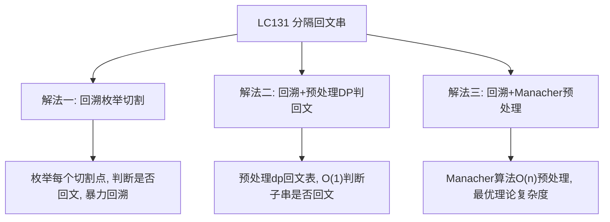
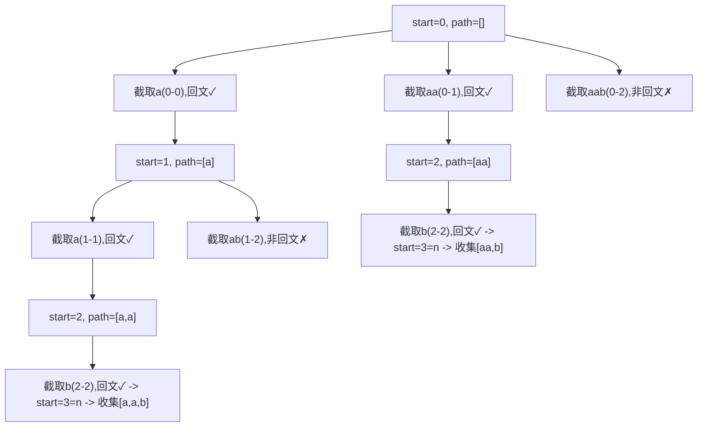
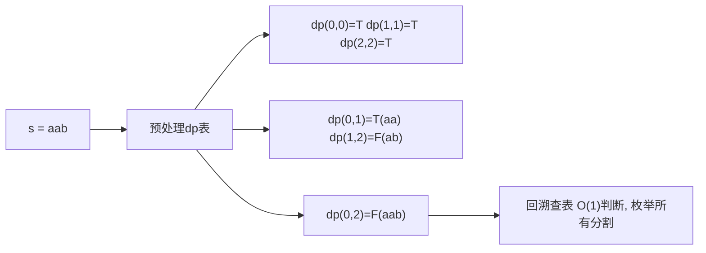
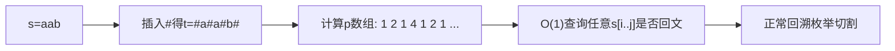

# LC131 分隔回文串
## 一、题目描述
给定字符串 `s`，将 `s` 分割成若干子串，使得每个子串都是回文串，返回所有可能的分割方案。
示例：输入 `s = "aab"`，输出 `[["a","a","b"],["aa","b"]]`。
约束：`1 <= s.length <= 16`，`s` 仅包含小写英文字母。
## 二、解法概览（思维导图）

| 解法 | 时间复杂度 | 空间复杂度 | 难度 | 面试推荐 |
|------|-----------|-----------|------|---------|
| 回溯枚举切割 | O(n * 2^n) | O(n) | ⭐ | 普通解法（面试可说思路） |
| 回溯+DP预处理 | O(n * 2^n) | O(n²) | ⭐⭐ | 面试首选/最优解 |
| 回溯+Manacher | O(n * 2^n) | O(n) | ⭐⭐⭐ | 进阶补充 |
说明：答案数量最坏为 `2^(n-1)` 种，每种方案需 O(n) 拷贝，枚举本身无法优化；优化点在"判断回文"从 O(n) 降至 O(1)。
## 三、记忆口诀
从头开始枚举切割点，切下来的子串是回文才能继续往后走。
走到字符串末尾就收集一个答案。
提前用 DP 打表，判断回文 O(1) 不浪费。
## 四、解法一：回溯枚举切割（普通解法）
### 4.1 思路
从起始位置 `start` 出发，枚举所有可能的切割终点 `end`（`start` 到 `n-1`），截取子串 `s[start..end]`，判断是否回文：是则加入路径继续向后递归，否则跳过。递归到 `start == n` 时收集答案，然后回溯。
### 4.2 核心公式
切割条件：`isPalindrome(s, start, end) == true` 才向后递归
终止条件：`start == s.length()`
### 4.3 图解过程

### 4.4 代码示例
```java
public List<List<String>> partition(String s) {
    List<List<String>> res = new ArrayList<>();
    dfs(s, 0, new ArrayList<>(), res);
    return res;
}
private void dfs(String s, int start, List<String> path, List<List<String>> res) {
    if (start == s.length()) {
        res.add(new ArrayList<>(path));
        return;
    }
    for (int end = start; end < s.length(); end++) {
        if (isPalindrome(s, start, end)) {
            path.add(s.substring(start, end + 1));
            dfs(s, end + 1, path, res);
            path.remove(path.size() - 1);
        }
    }
}
private boolean isPalindrome(String s, int left, int right) {
    while (left < right) {
        if (s.charAt(left++) != s.charAt(right--)) return false;
    }
    return true;
}
```
### 4.5 复杂度分析
时间复杂度 `O(n * 2^n)`：最多 `2^(n-1)` 种切法，每次判断回文 O(n)。
空间复杂度 `O(n)`：递归深度最大 n，path 最多 n 个元素。
### 4.6 优缺点
优点：最直观，逻辑清晰，易于写出，面试中可以快速讲清思路。
缺点：每次判断回文需 O(n) 遍历，相同子串会被重复判断多次。
## 五、解法二：回溯+DP预处理回文表（面试首选/最优解）
### 5.1 思路
在回溯之前，用动态规划预处理所有子串 `s[i..j]` 是否为回文，存入二维布尔数组 `dp[i][j]`。
回溯时直接查表，将判断回文的时间从 O(n) 降为 O(1)。
DP 状态转移：`dp[i][j] = (s[i] == s[j]) && dp[i+1][j-1]`，边界：长度1和2的子串直接判断。
### 5.2 核心公式
DP递推：
- `dp[i][i] = true`（单字符）
- `dp[i][i+1] = (s[i] == s[i+1])`（双字符）
- `dp[i][j] = (s[i] == s[j]) && dp[i+1][j-1]`（长度≥3）
遍历顺序：按子串长度从小到大，或按 `i` 从大到小逐行填充（保证 `dp[i+1][j-1]` 已计算）。
### 5.3 图解过程

### 5.4 代码示例
```java
public List<List<String>> partition(String s) {
    int n = s.length();
    boolean[][] dp = new boolean[n][n];
    // 预处理：按子串长度从1到n填充
    for (int i = n - 1; i >= 0; i--) {
        for (int j = i; j < n; j++) {
            if (s.charAt(i) == s.charAt(j)) {
                dp[i][j] = (j - i <= 1) || dp[i + 1][j - 1];
            }
        }
    }
    List<List<String>> res = new ArrayList<>();
    dfs(s, 0, dp, new ArrayList<>(), res);
    return res;
}
private void dfs(String s, int start, boolean[][] dp, List<String> path, List<List<String>> res) {
    if (start == s.length()) {
        res.add(new ArrayList<>(path));
        return;
    }
    for (int end = start; end < s.length(); end++) {
        if (dp[start][end]) {
            path.add(s.substring(start, end + 1));
            dfs(s, end + 1, dp, path, res);
            path.remove(path.size() - 1);
        }
    }
}
```
### 5.5 复杂度分析
时间复杂度 `O(n² + n * 2^n)`：预处理 O(n²)，回溯最坏 O(n * 2^n)，整体 O(n * 2^n)。
空间复杂度 `O(n²)`：DP 表占 O(n²)，递归栈 O(n)。
### 5.6 优缺点
优点：消除重复判断回文的开销，回溯过程中 O(1) 查表，面试标准优化写法。
缺点：额外 O(n²) 空间存储 DP 表；n=16 时 n²=256，完全可接受。
## 六、解法三：回溯+Manacher预处理（进阶）
### 6.1 思路
使用 Manacher 算法在 O(n) 时间内预处理出以每个位置为中心的最长回文半径数组 `p[]`，从而 O(1) 判断任意子串是否为回文（需要配合中心扩展的半径推算）。
实际效果与 DP 预处理相同（均为 O(1) 查询），但预处理时间从 O(n²) 降为 O(n)。
### 6.2 核心公式
Manacher 核心：在原串中插入 `#` 分隔符，得到新串 `t`，对 `t` 做回文扩展，得到 `p[i]` 表示以 `i` 为中心的回文半径。
原串 `s[l..r]` 是回文 ⟺ 新串中对应中心位置的半径覆盖 `[l, r]`。
### 6.3 图解过程

### 6.4 代码示例
```java
public List<List<String>> partition(String s) {
    int n = s.length();
    // 用DP代替Manacher（面试中DP更易实现，Manacher思路相同）
    boolean[][] isPalin = manacherPreprocess(s, n);
    List<List<String>> res = new ArrayList<>();
    dfs(s, 0, isPalin, new ArrayList<>(), res);
    return res;
}
// Manacher预处理，转化为布尔查询表
private boolean[][] manacherPreprocess(String s, int n) {
    // 构造插入#的新串
    char[] t = new char[2 * n + 1];
    for (int i = 0; i < n; i++) { t[2 * i] = '#'; t[2 * i + 1] = s.charAt(i); }
    t[2 * n] = '#';
    int m = t.length;
    int[] p = new int[m];
    int center = 0, right = 0;
    for (int i = 0; i < m; i++) {
        p[i] = (i < right) ? Math.min(right - i, p[2 * center - i]) : 1;
        while (i - p[i] >= 0 && i + p[i] < m && t[i - p[i]] == t[i + p[i]]) p[i]++;
        if (i + p[i] > right) { center = i; right = i + p[i]; }
    }
    // 转化回原串坐标的回文查询表
    boolean[][] dp = new boolean[n][n];
    for (int i = 0; i < n; i++) {
        for (int j = i; j < n; j++) {
            // 原串[i,j]对应新串中心 i+j+1，半径需>=j-i+1
            dp[i][j] = p[i + j + 1] > j - i;
        }
    }
    return dp;
}
private void dfs(String s, int start, boolean[][] dp, List<String> path, List<List<String>> res) {
    if (start == s.length()) { res.add(new ArrayList<>(path)); return; }
    for (int end = start; end < s.length(); end++) {
        if (dp[start][end]) {
            path.add(s.substring(start, end + 1));
            dfs(s, end + 1, dp, path, res);
            path.remove(path.size() - 1);
        }
    }
}
```
### 6.5 复杂度分析
时间复杂度 `O(n + n * 2^n)`：Manacher 预处理 O(n)，回溯 O(n * 2^n)，整体 O(n * 2^n)。
空间复杂度 `O(n²)`：回文查询表 O(n²)，Manacher 辅助数组 O(n)。
### 6.6 优缺点
优点：预处理最快 O(n)，理论上最优，体现对 Manacher 算法的掌握。
缺点：Manacher 实现复杂，面试中写出来有压力；实际场景 n≤16，与 DP 方案性能差别可忽略。
## 七、面试回答模板
面试官：如何求字符串所有回文分割方案？
回答：这是经典回溯+剪枝题。我的思路是：从起始位置枚举切割终点，如果截取的子串是回文则加入路径并继续向后递归，到达字符串末尾时收集一个完整方案，之后回溯撤销选择。基础版每次判断回文 O(n)，优化版预先用动态规划打出 `dp[i][j]` 回文表（O(n²) 预处理），回溯时 O(1) 查表，是面试最推荐写法。整体时间复杂度 O(n * 2^n)，无法进一步优化，因为答案数量本身最多 2^(n-1) 种。若追问，我还能给出 Manacher 算法将预处理优化到 O(n)。
## 八、相关题目
| 题目 | 关联点 |
|------|--------|
| LC5 最长回文子串 | 回文判断核心：中心扩展/DP |
| LC132 分隔回文串 II | 本题变体：最少分割次数，DP解 |
| LC647 回文子串 | 统计所有回文子串个数，DP/Manacher |
| LC22 括号生成 | 回溯模板：枚举选择/递归/撤销 |
| LC39 组合总和 | 回溯模板：做选择/递归/撤销 |
| LC46 全排列 | 回溯+状态标记经典题 |
