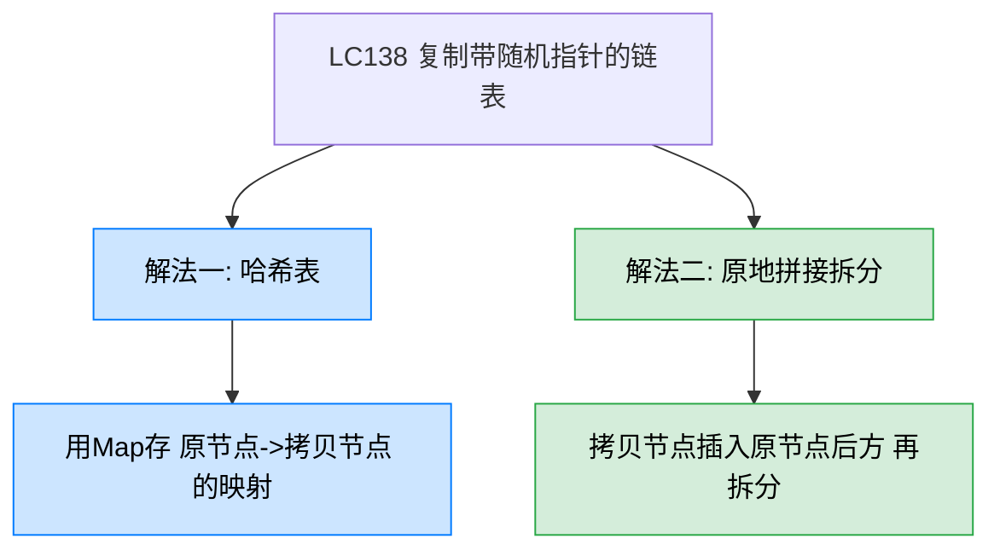
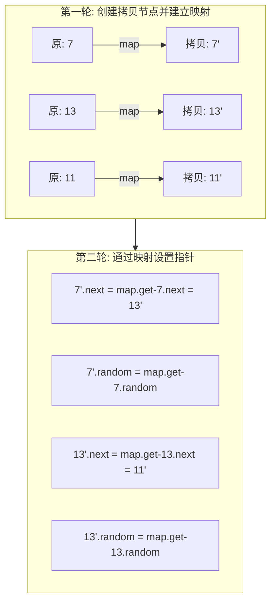
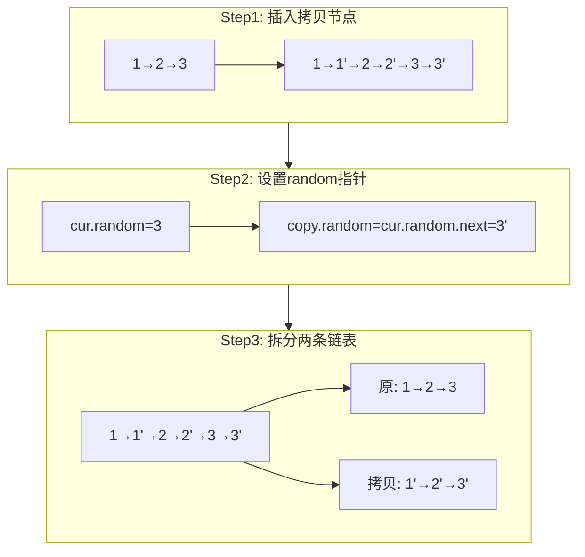
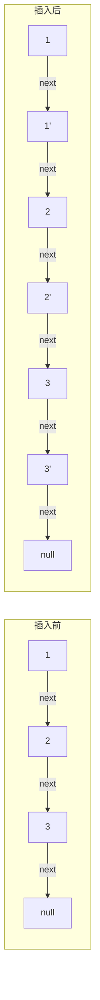

# LC138 复制带随机指针的链表
## 一、题目描述
给你一个长度为 n 的链表，每个节点包含一个额外的随机指针 random，该指针可以指向链表中的任何节点或空节点。构造这个链表的**深拷贝**。
每个节点包含：`val`（整数值）、`next`（下一个节点指针）、`random`（随机指针，可指向任意节点或 null）。
**示例：** 输入 `head = [[7,null],[13,0],[11,4],[10,2],[1,0]]`，输出相同结构的深拷贝链表。
**约束：** 0 <= n <= 1000，-10^4 <= Node.val <= 10^4，random 指向链表中的节点或 null。
**难点：** random 指针指向的目标节点在复制时可能还未创建，如何正确建立新链表的 random 映射关系？
## 二、解法概览

| 解法 | 时间复杂度 | 空间复杂度 | 难度 | 面试推荐 |
|------|-----------|-----------|------|---------|
| 哈希表 | O(n) | O(n) | ⭐⭐ | 普通解法，思路清晰 |
| 原地拼接拆分 | O(n) | O(1) | ⭐⭐⭐ | 最优解，面试加分 |
## 三、记忆口诀
> **哈希映射最直白，拼接拆分省空间。**
> **三步走：插拷贝、连random、拆链表。**
- 哈希表法：「**建映射、连next、连random**」，三轮遍历
- 原地拼接法：「**插后面、借邻居、拆两半**」，三步搞定
## 四、解法一：哈希表（面试普通解法）
### 4.1 思路
用 HashMap 存储「原节点 → 拷贝节点」的映射关系。第一轮遍历创建所有拷贝节点并建立映射；第二轮遍历通过映射表设置拷贝节点的 next 和 random 指针。
### 4.2 核心公式
`map.put(原节点, 新节点)`，查找时 `map.get(原节点.next)` 得到拷贝的 next，`map.get(原节点.random)` 得到拷贝的 random。
### 4.3 图解过程

### 4.4 代码示例
```java
public Node copyRandomList(Node head) {
    if (head == null) return null;
    Map<Node, Node> map = new HashMap<>();
    // 第一轮：创建所有拷贝节点
    Node cur = head;
    while (cur != null) {
        map.put(cur, new Node(cur.val));
        cur = cur.next;
    }
    // 第二轮：设置 next 和 random
    cur = head;
    while (cur != null) {
        map.get(cur).next = map.get(cur.next);
        map.get(cur).random = map.get(cur.random);
        cur = cur.next;
    }
    return map.get(head);
}
```
### 4.5 复杂度分析
- **时间复杂度：O(n)**，两轮遍历链表
- **空间复杂度：O(n)**，哈希表存储 n 个映射关系
### 4.6 优缺点
| 优点 | 缺点 |
|------|------|
| 思路直观，容易理解和编码 | 需要 O(n) 额外空间 |
| 不修改原链表结构 | 哈希表有常数因子开销 |
| 面试中可快速写出 | 空间上不是最优 |
## 五、解法二：原地拼接拆分（最优解）
### 5.1 思路
不使用哈希表，利用原链表的结构来建立映射关系。分三步：
1. **插拷贝：** 在每个原节点后面插入它的拷贝节点，形成 `1→1'→2→2'→3→3'` 的交替链表
2. **连random：** 拷贝节点的 random = 原节点的 random 的下一个（即 `copy.random = cur.random.next`）
3. **拆链表：** 把交替链表拆分成原链表和拷贝链表两条独立的链表
### 5.2 核心公式
- 插入拷贝：`copy = new Node(cur.val); copy.next = cur.next; cur.next = copy`
- 连接random：`copy.random = cur.random != null ? cur.random.next : null`
- 拆分：`cur.next = next; copy.next = next != null ? next.next : null`
### 5.3 图解过程

**Step1 插入拷贝节点详细过程：**

**Step2 设置random的关键：** 因为拷贝节点紧跟在原节点后面，所以 `cur.random` 的拷贝节点就是 `cur.random.next`，利用这个位置关系替代了哈希表的映射功能。
### 5.4 代码示例
```java
public Node copyRandomList(Node head) {
    if (head == null) return null;
    Node cur = head;
    Node next;
    // Step1: 在每个原节点后插入拷贝节点
    while (cur != null) {
        next = cur.next;
        cur.next = new Node(cur.val);
        cur.next.next = next;
        cur = next;
    }
    // Step2: 设置拷贝节点的random指针
    cur = head;
    Node copy;
    while (cur != null) {
        next = cur.next.next;
        copy = cur.next;
        copy.random = cur.random != null ? cur.random.next : null;
        cur = next;
    }
    // Step3: 拆分成两条链表
    cur = head;
    Node copyHead = cur.next;
    while (cur != null) {
        next = cur.next.next;
        copy = cur.next;
        cur.next = next;
        copy.next = next != null ? next.next : null;
        cur = next;
    }
    return copyHead;
}
```
### 5.5 复杂度分析
- **时间复杂度：O(n)**，三轮遍历链表，每轮 O(n)
- **空间复杂度：O(1)**，不使用哈希表，只用了几个指针变量（新链表本身不算额外空间）
### 5.6 优缺点
| 优点 | 缺点 |
|------|------|
| 空间最优 O(1)，不需要哈希表 | 代码较长，逻辑分三步 |
| 巧妙利用位置关系替代映射 | 临时修改了原链表结构 |
| 面试中展示链表操作功底 | 指针操作多，容易出错 |
## 六、面试回答模板
> **面试官：** 如何深拷贝一个带随机指针的链表？
**回答要点：**
1. **说明难点：** 这题的难点在于 random 指针可以指向任意节点，在复制时目标节点可能还未创建，需要建立「原节点→拷贝节点」的映射关系。
2. **先说哈希表解法：** 最直观的方法是用 HashMap 存储映射。第一遍遍历创建所有拷贝节点，第二遍遍历通过 map 设置 next 和 random。时间 O(n)、空间 O(n)。
3. **引出最优解：** 可以用原地拼接法省掉哈希表。把拷贝节点插入原节点后面，利用「cur.random.next 就是拷贝节点」这个位置关系来设置 random，最后再拆分。时间 O(n)、空间 O(1)。
4. **核心技巧：** 原地拼接法的精髓是**用物理位置（紧邻关系）替代了哈希表的映射关系**。
## 七、相关题目
| 题目 | 关联点 |
|------|--------|
| LC133 克隆图 | 同样是深拷贝带额外指针的数据结构，用哈希表映射 |
| LC206 反转链表 | 链表指针操作的基础功，拆分链表时会用到 |
| LC141/142 环形链表 | 链表快慢指针技巧，同属链表高频题 |
| LC234 回文链表 | 同样涉及链表的拆分和重组操作 |
| 剑指Offer 35 复杂链表的复制 | 同一道题，剑指Offer版本 |
