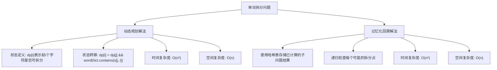

# LC139_单词拆分解法分析
## 题目描述
给定一个非空字符串 `s` 和一个包含非空单词的列表 `wordDict`，判定 `s` 是否可以被空格拆分为一个或多个在字典中出现的单词。
**说明：**
- 拆分时可以重复使用字典中的单词。
- 你可以假设字典中没有重复的单词。
**示例：**
- 输入: `s = "applepenapple", wordDict = ["apple", "pen"]`
- 输出: `true`
- 解释: 返回 true 因为 "applepenapple" 可以由 "apple" "pen" "apple" 拼接成。
## 解法概览

## 记忆口诀
**动态规划解法**：前i可拆看前j，j到i在字典里。
**回溯解法**：递归拆分加记忆，避免重复计算去。
## 解法一：动态规划
### 思路
1. **状态定义**：`dp[i]` 表示字符串 `s` 的前 `i` 个字符是否可以被拆分为字典中的单词。
2. **初始状态**：`dp[0] = true`，表示空字符串可以被拆分。
3. **状态转移**：对于每个位置 `i`，检查所有可能的 `j`（从 0 到 `i-1`），如果 `dp[j]` 为 `true` 且子字符串 `s[j..i-1]` 在字典中，则 `dp[i]` 为 `true`。
4. **最终结果**：`dp[s.length()]` 即为所求。
### 核心公式
`dp[i] = dp[j] && wordDict.contains(s.substring(j, i))`，其中 `0 ≤ j < i`
### 图解过程
以 `s = "applepenapple", wordDict = ["apple", "pen"]` 为例：
1. 初始化 `dp[0] = true`
2. 计算 `dp[1]` 到 `dp[13]`（字符串长度为13）
3. 当 `i=5` 时，`j=0`，`s.substring(0,5)="apple"` 在字典中，所以 `dp[5] = true`
4. 当 `i=8` 时，`j=5`，`s.substring(5,8)="pen"` 在字典中，所以 `dp[8] = true`
5. 当 `i=13` 时，`j=8`，`s.substring(8,13)="apple"` 在字典中，所以 `dp[13] = true`
### 代码示例
```java
public boolean wordBreak(String s, List<String> wordDict) {
    int n = s.length();
    // dp[i]:s的前i个字符能否被匹配
    boolean[] dp = new boolean[n + 1];
    // 空串表示可以被任意单词匹配
    dp[0] = true;
    
    // set:[[apple],[pen]]
    Set<String> set = new HashSet<>(wordDict);
    
    for (int i = 1; i <= n; i++) {
        for (int j = 0; j < i; j++) {
            // dp[j]与子字符串来判断dp[i]状态
            if (dp[j] && set.contains(s.substring(j, i))) {
                dp[i] = true;
                // 内存循环只有匹配成功一次，就跳出到外层；开启下一个外层循环
                break;
            }
        }
    }
    
    return dp[n];
}
```
### 复杂度分析
- **时间复杂度**：O(n²)，其中 n 是字符串的长度。对于每个位置 i，我们需要检查所有可能的 j（从 0 到 i-1）。
- **空间复杂度**：O(n)，用于存储 dp 数组。
### 优缺点
- **优点**：实现简单，时间复杂度较低，适合处理较长的字符串。
- **缺点**：需要遍历所有可能的拆分点，对于某些极端情况可能效率不高。
## 解法二：记忆化回溯
### 思路
1. **递归拆分**：从字符串的起始位置开始，尝试所有可能的拆分点。
2. **记忆化**：使用哈希表存储已经计算过的子问题结果，避免重复计算。
3. **终止条件**：当拆分到字符串末尾时，返回 true；当遇到已经计算过的子问题时，直接返回存储的结果。
### 核心公式
无明确公式，核心是递归尝试所有可能的拆分点，并使用记忆化优化。
### 图解过程
以 `s = "applepenapple", wordDict = ["apple", "pen"]` 为例：
1. 从位置 0 开始，尝试拆分 "a"、"ap"、...、"apple"，发现 "apple" 在字典中。
2. 接着从位置 5 开始，尝试拆分 "p"、"pe"、"pen"，发现 "pen" 在字典中。
3. 接着从位置 8 开始，尝试拆分 "a"、"ap"、...、"apple"，发现 "apple" 在字典中。
4. 到达字符串末尾，返回 true。
### 代码示例
```java
public boolean wordBreak(String s, List<String> wordDict) {
    Set<String> wordSet = new HashSet<>(wordDict);
    return backtrack(s, wordSet, 0, new Boolean[s.length()]);
}

private boolean backtrack(String s, Set<String> wordSet, int start, Boolean[] memo) {
    if (start == s.length()) {
        return true;
    }
    if (memo[start] != null) {
        return memo[start];
    }
    for (int end = start + 1; end <= s.length(); end++) {
        if (wordSet.contains(s.substring(start, end)) && backtrack(s, wordSet, end, memo)) {
            return memo[start] = true;
        }
    }
    return memo[start] = false;
}
```
### 复杂度分析
- **时间复杂度**：O(n²)，其中 n 是字符串的长度。每个子问题最多被计算一次。
- **空间复杂度**：O(n)，用于存储记忆化数组。
### 优缺点
- **优点**：思路直观，代码结构清晰。
- **缺点**：对于某些极端情况（如长字符串且字典中包含很多短单词），可能会导致栈溢出。
## 面试回答模板
**问题**：如何解决单词拆分问题？
**回答**：
我会考虑两种解法：动态规划和记忆化回溯。
首先，动态规划解法。定义 `dp[i]` 表示字符串的前 `i` 个字符是否可以被拆分为字典中的单词。初始状态 `dp[0] = true`，表示空字符串可以被拆分。然后对于每个位置 `i`，检查所有可能的 `j`（从 0 到 `i-1`），如果 `dp[j]` 为 `true` 且子字符串 `s[j..i-1]` 在字典中，则 `dp[i]` 为 `true`。最终返回 `dp[s.length()]`。这种方法的时间复杂度是 O(n²)，空间复杂度是 O(n)。
其次，记忆化回溯解法。从字符串的起始位置开始，尝试所有可能的拆分点。使用哈希表存储已经计算过的子问题结果，避免重复计算。当拆分到字符串末尾时返回 true，当遇到已经计算过的子问题时直接返回存储的结果。这种方法的时间复杂度也是 O(n²)，空间复杂度是 O(n)。
在面试中，我会优先选择动态规划解法，因为它更直观且不容易出现栈溢出的问题。
## 相关题目
1. **LC140_单词拆分 II**：不仅要判断是否可以拆分，还要返回所有可能的拆分方式。
2. **LC472_连接词**：判断一个单词是否可以由其他单词连接而成。
3. **LC588_设计内存文件系统**：涉及路径的拆分和处理。
4. **LC648_单词替换**：将句子中的单词替换为字典中的前缀。
5. **LC720_词典中最长的单词**：寻找可以通过逐个添加字符形成的最长单词。
## 总结
单词拆分问题是一个经典的动态规划问题，主要有两种解法：动态规划和记忆化回溯。动态规划解法通过状态转移方程高效地判断字符串是否可以被拆分，而记忆化回溯则通过递归和记忆化优化来解决问题。在面试中，动态规划解法更为常用，因为它实现简单且效率较高。
通过掌握这两种解法，我们可以更好地理解动态规划和回溯算法的应用场景，为解决类似的字符串处理问题打下基础。