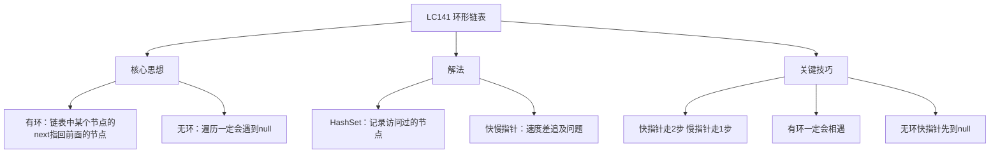
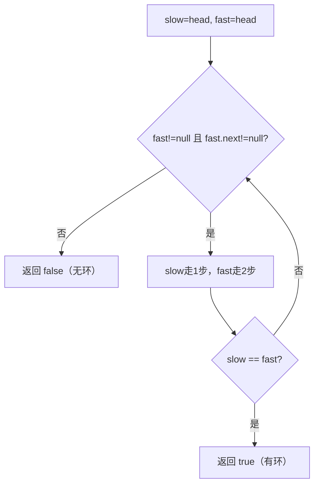

# LC141 环形链表
## 一、题目描述
给你一个链表的头节点 `head`，判断链表中是否有环。如果存在环，返回 `true`；否则返回 `false`。
**示例1（有环）：**
```
  3 → 2 → 0 → -4
      ↑           |
      └───────────┘
  pos = 1（尾节点连接到下标1的节点）
  输出：true
```
**示例2（无环）：**
```
  1 → 2 → null
  输出：false
```
**约束：**
- 链表节点数范围 [0, 10^4]
- 不能修改链表
---
## 二、解法概览
### 解法对比表
| 解法 | 时间复杂度 | 空间复杂度 | 面试推荐 |
|------|-----------|-----------|---------|
| HashSet | O(n) | O(n) | ✅ 普通解法 |
| **快慢指针（龟兔赛跑）** | O(n) | O(1) | ✅ **最优解** |
### 思维导图

---
## 三、记忆口诀
```
环形链表龟兔跑，快走两步慢走一
有环必定会相遇，无环快指针先到头
就像操场跑圈圈，跑得快的追上慢的
```
---
## 四、解法一：HashSet
### 思路
遍历链表，用 HashSet 记录每个访问过的节点。如果遇到已存在的节点，说明有环；如果遇到 null，说明无环。
### 核心公式
```
遍历每个节点：
  如果 set 中已存在 → 有环
  如果 cur == null  → 无环
  否则加入 set，继续
```
### 图解过程
```
链表：3 → 2 → 0 → -4 → 回到2
遍历过程：
  节点3：set={3}，继续
  节点2：set={3,2}，继续
  节点0：set={3,2,0}，继续
  节点-4：set={3,2,0,-4}，继续
  节点2：已在set中 → 有环！✅
```
### 代码示例
```java
public boolean hasCycle(ListNode head) {
    Set<ListNode> set = new HashSet<>();
    ListNode cur = head;
    while (cur != null) {
        if (set.contains(cur)) {
            return true;  // 重复出现，有环
        }
        set.add(cur);
        cur = cur.next;
    }
    return false;  // 遇到null，无环
}
```
### 复杂度分析
- 时间复杂度：**O(n)**，遍历一次
- 空间复杂度：**O(n)**，HashSet 存所有节点
### 优缺点
| 优点 | 缺点 |
|-----|------|
| 思路直观 | O(n) 额外空间 |
| 代码简单 | 面试通常要求 O(1) 空间 |
---
## 五、解法二：快慢指针 / 龟兔赛跑（最优解 ✅）
### 思路
两个指针从头出发，**慢指针走1步，快指针走2步**：
- **有环**：快指针一定会追上慢指针（在环内相遇）
- **无环**：快指针先到 null
### 为什么有环一定会相遇？
```
想象操场跑圈：
  小明每秒跑1米，小红每秒跑2米
  两人同时出发，小红跑得快先进入环
  小红在环里不断追小明，每秒追近1米
  距离从 n 缩小到 n-1, n-2, ..., 1, 0 → 追上了！
数学证明：
  进入环后，设两人距离为 d（环内距离）
  每走一步，距离缩小 1（fast走2步-slow走1步=追近1步）
  d, d-1, d-2, ..., 1, 0
  最多 d 步一定追上，d < 环长度 ≤ n
  所以一定会相遇，不会跳过
```
### 为什么不会跳过？（快指针会不会跨过慢指针？）
```
每一步距离变化 = fast走2步 - slow走1步 = 缩小1
距离变化序列：..., 3, 2, 1, 0
距离是逐个减少的，一定经过0，不可能从1直接跳到-1
所以快指针不会跳过慢指针，一定会刚好追上
```
### 图解过程
```
链表：1 → 2 → 3 → 4 → 5 → 回到3
                ↑           |
                └───────────┘
环入口=3，环长度=3（3→4→5→3）
━━━━━━━━━━━━━━━━━━━━━━━━━━━━
初始：slow=1, fast=1
━━━━━━━━━━━━━━━━━━━━━━━━━━━━
第1步：slow=2, fast=3
  1 → [2] → 3 → 4 → 5
              ↑   [fast]  |
        slow  └───────────┘
━━━━━━━━━━━━━━━━━━━━━━━━━━━━
第2步：slow=3, fast=5
  1 → 2 → [3] → 4 → [5]
            ↑    slow  fast|
            └──────────────┘
━━━━━━━━━━━━━━━━━━━━━━━━━━━━
第3步：slow=4, fast=4
  1 → 2 → 3 → [4] → 5
               ↑ slow&fast|
               └──────────┘
  slow == fast → 有环！✅
━━━━━━━━━━━━━━━━━━━━━━━━━━━━
追击过程（进入环后）：
  第2步时：slow在3，fast在5，环内距离=1
  第3步时：距离 1-1=0 → 相遇！
```
### 无环的情况
```
链表：1 → 2 → 3 → null
初始：slow=1, fast=1
第1步：slow=2, fast=3
第2步：slow=3, fast=null → fast到头了，无环 ✅
```
### 算法流程图

### 代码示例（推荐写法）
```java
public boolean hasCycle(ListNode head) {
    ListNode slow = head, fast = head;
    while (fast != null && fast.next != null) {
        slow = slow.next;        // 慢指针走1步
        fast = fast.next.next;   // 快指针走2步
        if (slow == fast) {
            return true;         // 相遇，有环
        }
    }
    return false;  // fast到null，无环
}
```
### 你的写法 vs 推荐写法
```
你的写法：
  slow 初始在 head.next，fast 初始在 head.next.next
  循环条件是 fast != slow
  需要额外判断 head/head.next/head.next.next 为null
推荐写法：
  slow 和 fast 都初始在 head
  先走再判断是否相遇
  代码更简洁，不需要额外的null判断
两种都正确，推荐写法更简洁不容易出错
```
### 复杂度分析
- 时间复杂度：**O(n)**
  - 无环：fast 走到末尾，O(n)
  - 有环：slow 进入环后，最多走一圈就被追上，O(n)
- 空间复杂度：**O(1)**，只用两个指针
### 优缺点
| 优点 | 缺点 |
|-----|------|
| 空间 O(1) | 需要理解追及问题 |
| 代码极简 | 不知道环的入口（LC142解决） |
| 面试首选 | 无 |
### 关键点总结
| 关键点 | 说明 |
|-------|------|
| 为什么一定会相遇？ | 每步距离缩小1，一定从1到0 |
| 会不会跳过？ | 不会，距离逐个减少 |
| 为什么fast走2步？ | 速度差=1，保证逐步追近 |
| 能不能fast走3步？ | 可以，但可能跳过（距离差=2，从奇数可能跳过0） |
---
## 六、面试回答模板
### 1. 开场：理解题意
> 这道题判断链表是否有环，即链表中某个节点的 next 是否指回前面的节点。
### 2. 思路：快慢指针
> 快慢两个指针从头出发，慢指针每次走1步，快指针每次走2步。如果有环，快指针一定会在环内追上慢指针；如果无环，快指针先到 null。
### 3. 为什么一定会相遇（如果面试官问）
> 进入环后，每走一步两人距离缩小1，距离从 d 逐步减到0，一定相遇不会跳过。就像操场跑步，跑得快的一定会追上慢的。
### 4. 复杂度
> 时间 O(n)，空间 O(1)。
---
## 七、相关题目
| 题号 | 题目 | 关系 | 难度 |
|-----|------|------|-----|
| LC142 | 环形链表II | 找环的入口节点 | 中等 |
| LC202 | 快乐数 | 快慢指针判环（数字链） | 简单 |
| LC287 | 寻找重复数字 | 快慢指针找环 | 中等 |
| LC876 | 链表的中间结点 | 快慢指针找中点 | 简单 |
| LC160 | 相交链表 | 链表双指针 | 简单 |
| LC234 | 回文链表 | 快慢指针找中点 | 简单 |