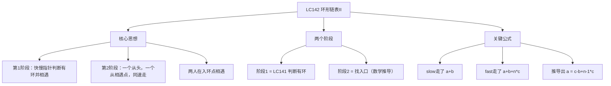
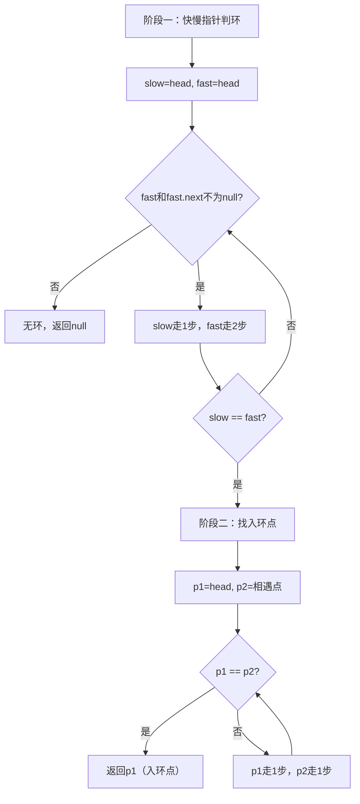

# LC142 环形链表II
## 一、题目描述
给定一个链表的头节点 `head`，返回链表**开始入环的第一个节点**。如果链表无环，则返回 `null`。
**示例：**
```
  3 → 2 → 0 → -4
      ↑           |
      └───────────┘
  入环节点 = 2
```
**与 LC141 的区别：**
```
LC141：判断有没有环 → 返回 true/false
LC142：找环的入口   → 返回入口节点
```
**约束：**
- 链表节点数范围 [0, 10^4]
- 不能修改链表
---
## 二、解法概览
### 解法对比表
| 解法 | 时间复杂度 | 空间复杂度 | 面试推荐 |
|------|-----------|-----------|---------|
| HashSet | O(n) | O(n) | ✅ 普通解法 |
| **快慢指针+数学推导** | O(n) | O(1) | ✅ **最优解** |
### 思维导图

---
## 三、记忆口诀
```
环形链表找入口，两个阶段来搞定
第一阶段龟兔跑，快慢相遇证有环
第二阶段同速走，一个从头一个从相遇点
再次相遇就是入口，数学证明保证对
```
---
## 四、解法一：HashSet
### 思路
遍历链表，第一个重复出现的节点就是入环点。
### 核心公式
```
遍历每个节点：
  如果 set 中已存在 → 这就是入环点
  如果 cur == null  → 无环
  否则加入 set，继续
```
### 图解过程
```
链表：3 → 2 → 0 → -4 → 回到2
遍历：
  节点3：set={3}
  节点2：set={3,2}
  节点0：set={3,2,0}
  节点-4：set={3,2,0,-4}
  节点2：已在set中 → 入环点就是2 ✅
```
### 代码示例
```java
public ListNode detectCycle(ListNode head) {
    Set<ListNode> set = new HashSet<>();
    ListNode cur = head;
    while (cur != null) {
        if (set.contains(cur)) {
            return cur;  // 第一个重复的就是入环点
        }
        set.add(cur);
        cur = cur.next;
    }
    return null;
}
```
### 复杂度分析
- 时间复杂度：**O(n)**
- 空间复杂度：**O(n)**
### 优缺点
| 优点 | 缺点 |
|-----|------|
| 思路直观 | O(n) 额外空间 |
| 代码简单 | 面试通常要求 O(1) |
---
## 五、解法二：快慢指针+数学推导（最优解 ✅）
### 思路
**两个阶段：**
1. **阶段一（判环+相遇）**：快慢指针，快走2步慢走1步，在环内相遇
2. **阶段二（找入口）**：一个指针从头出发，一个从相遇点出发，都走1步，**再次相遇的地方就是入环点**
### 为什么阶段二一定在入环点相遇？（数学证明）
```
设链表结构如下：
  头 ──a──→ 入环点 ──b──→ 相遇点 ──c──→ 入环点
  a = 头到入环点的距离
  b = 入环点到相遇点的距离
  c = 相遇点到入环点的距离（继续走回入环点）
  环长 = b + c
```
```
阶段一结束时：
  slow 走了：a + b
  fast 走了：a + b + n×(b+c)   （fast在环里多转了n圈）
  fast速度是slow的2倍：
    2 × (a + b) = a + b + n × (b + c)
    a + b = n × (b + c)
    a = n × (b + c) - b
    a = (n-1) × (b + c) + c
简化（取n=1，fast只多走了1圈）：
    a = c
```
```
结论：a = c（头到入环点的距离 = 相遇点到入环点的距离）
所以：一个从头走a步，一个从相遇点走c步，刚好在入环点碰面！
即使 n > 1（fast多走了好几圈），也成立：
    a = (n-1)圈 + c
    相遇点的指针多绕几圈再走c步，还是到入环点
```
### 图解过程
```
链表：1 → 2 → 3 → 4 → 5 → 回到3
                ↑           |
                └───────────┘
  a = 2（1→2→3，头到入环点距离）
  b = 2（3→4→5，入环点到相遇点距离）
  c = 1（5→3，相遇点到入环点距离）
  环长 = b + c = 3
━━━━━━━━━━━━━━━━━━━━━━━━━━━━━━━━━━
阶段一：快慢指针相遇
  初始：slow=1, fast=1
  第1步：slow=2, fast=3
  第2步：slow=3, fast=5
  第3步：slow=4, fast=4  ← 相遇！
  （fast: 1→3→5→4, slow: 1→2→3→4）
━━━━━━━━━━━━━━━━━━━━━━━━━━━━━━━━━━
阶段二：找入环点
  p1 从头(1)出发，p2 从相遇点(4)出发，都走1步
  第1步：p1=2, p2=5
  第2步：p1=3, p2=3  ← 相遇！入环点=3 ✅
验证：a=2, c=1？
  a=2（1→2→3）✅
  但实际 c=1（相遇点5到入环点3只要1步:5→3）
  而 p2 走了2步（4→5→3）
  因为 n=1 时 a = (n-1)×(b+c) + c = 0 + c... 不对
让我重新算：a=2, b=2, c=1, n=1:
  a = n(b+c) - b = 1×3 - 2 = 1 ≠ 2？
实际看看：slow走了 a+b=4步，fast走了8步？不对。
让我重新trace:
  fast走的：1→3(第1步) →5(第2步) →4(第3步)=走了3步×2=6步？
  不对，fast每步走2格：
    第1步：1→2→3, fast=3
    第2步：3→4→5, fast=5
    第3步：5→3→4, fast=4
  fast走了6格，slow走了3格
  slow: a+b=3, fast: a+b+环长=3+3=6 ✅
  2×slow=2×3=6=fast ✅
  a=2, b=1（入环点3到相遇点4只有1步），c=2（4→5→3要2步）
  a = c = 2 ✅
阶段二：p1从头(1)走2步=3, p2从相遇点(4)走2步=4→5→3
  第1步：p1=2, p2=5
  第2步：p1=3, p2=3 → 相遇在3=入环点 ✅
```
### 更清晰的图解
```
链表结构：
  1 → 2 → 3 → 4 → 5
            ↑         |
            └─────────┘
  a=2（头→入环点：1→2→3）
  b=1（入环点→相遇点：3→4）
  c=2（相遇点→入环点：4→5→3）
  环长=b+c=3
━━━━━━━━━━━━━━━━━━━━━━━━━━━━
阶段一结果：相遇在节点4
━━━━━━━━━━━━━━━━━━━━━━━━━━━━
阶段二：a=2=c=2，两人同时走2步相遇
  p1(从头): 1 → 2 → [3]
  p2(从4):  4 → 5 → [3]
  在节点3相遇 = 入环点 ✅
```
### 算法流程图

### 代码示例（推荐写法）
```java
public ListNode detectCycle(ListNode head) {
    // 阶段一：快慢指针判环
    ListNode slow = head, fast = head;
    boolean hasCycle = false;
    while (fast != null && fast.next != null) {
        slow = slow.next;
        fast = fast.next.next;
        if (slow == fast) {
            hasCycle = true;
            break;
        }
    }
    if (!hasCycle) return null;
    // 阶段二：找入环点
    // 一个从头走，一个从相遇点走，都走1步
    ListNode p = head;
    while (p != slow) {
        p = p.next;
        slow = slow.next;
    }
    return p;  // 相遇点就是入环点
}
```
### 代码精简版
```java
public ListNode detectCycle(ListNode head) {
    ListNode slow = head, fast = head;
    while (fast != null && fast.next != null) {
        slow = slow.next;
        fast = fast.next.next;
        if (slow == fast) {
            // 阶段二：找入环点
            ListNode p = head;
            while (p != slow) {
                p = p.next;
                slow = slow.next;
            }
            return p;
        }
    }
    return null;
}
```
### 复杂度分析
- 时间复杂度：**O(n)**，两个阶段各最多走 n 步
- 空间复杂度：**O(1)**，只用了几个指针
### 优缺点
| 优点 | 缺点 |
|-----|------|
| 空间 O(1) | 需要理解数学推导 |
| 面试首选 | a=c 的证明不直观 |
| 代码简洁 | 无 |
### 关键点总结
| 关键点 | 说明 |
|-------|------|
| 阶段一做什么？ | 快慢指针判环，找到相遇点 |
| 阶段二做什么？ | 一个从头，一个从相遇点，同速走 |
| 为什么阶段二能找到入环点？ | 数学推导 a = c，两人走相同步数在入环点相遇 |
| a = c 怎么记？ | 头到入环点的距离 = 相遇点到入环点的距离 |
---
## 六、面试回答模板
### 1. 开场：理解题意
> 这道题要找链表环的入口节点，是 LC141 判断有环的进阶版。
### 2. 思路：两个阶段
> 第一阶段用快慢指针找到环内的相遇点。第二阶段让一个指针从头出发，另一个从相遇点出发，都每次走一步，再次相遇的地方就是入环点。
### 3. 为什么第二阶段成立（如果面试官问）
> 设头到入环点距离为 a，入环点到相遇点距离为 b，相遇点继续走回入环点距离为 c。由 fast 走的是 slow 的两倍可推出 a = c（加上若干整圈）。所以从头走 a 步和从相遇点走 c 步，刚好在入环点碰面。
### 4. 复杂度
> 时间 O(n)，空间 O(1)。
---
## 七、相关题目
| 题号 | 题目 | 关系 | 难度 |
|-----|------|------|-----|
| LC141 | 环形链表 | 前置：判断有没有环 | 简单 |
| LC160 | 相交链表 | 同样双指针+数学思想 | 简单 |
| LC287 | 寻找重复数字 | 把数组转化为环形链表 | 中等 |
| LC202 | 快乐数 | 快慢指针判环 | 简单 |
| LC876 | 链表的中间结点 | 快慢指针 | 简单 |