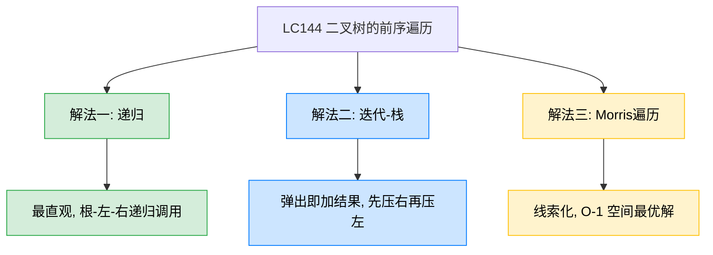
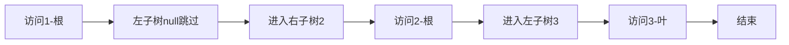
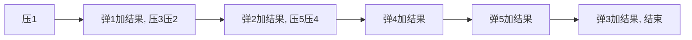
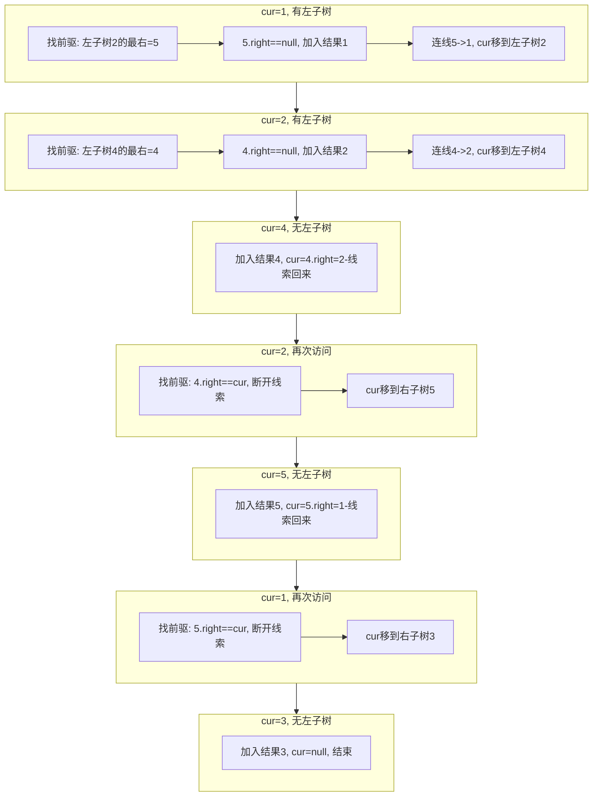

# LC144 二叉树的前序遍历
## 一、题目描述
给你二叉树的根节点 root，返回它节点值的**前序遍历**结果。
前序遍历顺序：**根节点 → 左子树 → 右子树**。
**示例：** 输入 `root = [1,null,2,3]`，输出 `[1,2,3]`
**约束：** 树中节点数目在范围 [0, 100] 内，-100 <= Node.val <= 100
## 二、解法概览

| 解法 | 时间复杂度 | 空间复杂度 | 难度 | 面试推荐 |
|------|-----------|-----------|------|---------|
| 递归 | O(n) | O(n) | ⭐ | 入门必会 |
| 迭代-栈 | O(n) | O(n) | ⭐⭐ | 面试首选 |
| Morris遍历 | O(n) | O(1) | ⭐⭐⭐ | 最优解/进阶加分 |
## 三、记忆口诀
> **递归三行最简单，迭代弹出先加根，先压右来再压左，Morris有左找前驱。**
- 递归：「**加自己、左递归、右递归**」
- 迭代：「**弹出就加结果，先压右再压左**」（栈后进先出，所以先压右保证左先弹出）
- Morris：「**无左直走、有左找前驱、右空连回来加结果、右有断回去**」
## 四、解法一：递归
### 4.1 思路
前序遍历的定义就是递归的：先访问根节点，再递归遍历左子树，最后递归遍历右子树。
### 4.2 核心公式
`preorder(node) = node.val + preorder(node.left) + preorder(node.right)`
### 4.3 图解过程
以 `[1, null, 2, 3]` 为例：

结果：`[1, 2, 3]`
### 4.4 代码示例
```java
public List<Integer> preorderTraversal(TreeNode root) {
    List<Integer> res = new ArrayList<>();
    preorder(root, res);
    return res;
}
private void preorder(TreeNode node, List<Integer> res) {
    if (node == null) return;
    res.add(node.val);
    preorder(node.left, res);
    preorder(node.right, res);
}
```
### 4.5 复杂度分析
- **时间复杂度：O(n)**，每个节点访问一次
- **空间复杂度：O(n)**，递归栈深度，最坏链状树 O(n)，平衡树 O(log n)
### 4.6 优缺点
| 优点 | 缺点 |
|------|------|
| 代码最短，和定义完全一致 | 递归深度大时可能栈溢出 |
| 最容易理解和记忆 | 面试官通常会追问非递归写法 |
## 五、解法二：迭代-栈（面试首选）
### 5.1 思路
用栈模拟前序遍历。核心技巧：**弹出节点时立即加入结果，然后先压右孩子再压左孩子**。因为栈是后进先出，先压右保证左孩子先被弹出处理，符合"根-左-右"的顺序。
### 5.2 核心公式
循环体：`弹出 → 加结果 → 压右孩子 → 压左孩子`
### 5.3 图解过程
以树 `[1, 2, 3, 4, 5]` 为例：
```
        1
       / \
      2   3
     / \
    4   5
```
| 步骤 | 操作 | 栈状态 | 结果 |
|------|------|--------|------|
| 初始 | 压入根节点1 | [1] | [] |
| 1 | 弹出1，加结果，压右3，压左2 | [3, 2] | [1] |
| 2 | 弹出2，加结果，压右5，压左4 | [3, 5, 4] | [1, 2] |
| 3 | 弹出4，加结果，无子节点 | [3, 5] | [1, 2, 4] |
| 4 | 弹出5，加结果，无子节点 | [3] | [1, 2, 4, 5] |
| 5 | 弹出3，加结果，无子节点 | [] | [1, 2, 4, 5, 3] |

### 5.4 代码示例
```java
public List<Integer> preorderTraversal(TreeNode root) {
    if (root == null) return new LinkedList<>();
    LinkedList<TreeNode> stack = new LinkedList<>();
    List<Integer> res = new LinkedList<>();
    stack.push(root);
    while (!stack.isEmpty()) {
        root = stack.pop();
        res.add(root.val);
        if (root.right != null) stack.push(root.right);
        if (root.left != null) stack.push(root.left);
    }
    return res;
}
```
### 5.5 复杂度分析
- **时间复杂度：O(n)**，每个节点入栈出栈各一次
- **空间复杂度：O(n)**，栈最多存储 O(n) 个节点
### 5.6 优缺点
| 优点 | 缺点 |
|------|------|
| 逻辑简洁：弹出加结果，先右后左 | 空间仍是 O(n) |
| 三种遍历中前序的迭代写法最简单 | 比递归代码稍长 |
| 面试高频，展示栈的理解 | 需理解"先压右再压左"的原因 |
### 5.7 与中序迭代的对比
| 对比项 | 前序迭代 | 中序迭代 |
|--------|---------|---------|
| 加结果时机 | **弹出时立即加** | **弹出时加** |
| 压栈策略 | 弹出后压右压左 | 一路压左到底，弹出后转右 |
| 代码结构 | 只需一个 while | while 里套 if-else |
| 记忆难度 | 更简单 | 稍复杂 |
## 六、解法三：Morris遍历（最优解）
### 6.1 思路
利用线索二叉树思想，不需要栈。与中序 Morris 的区别在于：**前序在第一次到达节点时就加入结果**（中序是第二次到达时加入）。
### 6.2 核心公式
对于当前节点 cur：
- **无左子树：** 加入结果，cur = cur.right
- **有左子树：** 找到左子树的最右节点 mostRight
  - mostRight.right == null → **加入结果**，连线回 cur，cur = cur.left
  - mostRight.right == cur → 断开连线，cur = cur.right（不加结果）
### 6.3 图解过程

结果：`[1, 2, 4, 5, 3]`
### 6.4 代码示例
```java
public List<Integer> preorderTraversal(TreeNode root) {
    List<Integer> res = new ArrayList<>();
    TreeNode cur = root;
    TreeNode mostRight;
    while (cur != null) {
        if (cur.left == null) {
            res.add(cur.val);
            cur = cur.right;
        } else {
            mostRight = cur.left;
            while (mostRight.right != null && mostRight.right != cur) {
                mostRight = mostRight.right;
            }
            if (mostRight.right == null) {
                res.add(cur.val);
                mostRight.right = cur;
                cur = cur.left;
            } else {
                mostRight.right = null;
                cur = cur.right;
            }
        }
    }
    return res;
}
```
### 6.5 复杂度分析
- **时间复杂度：O(n)**，每个节点最多访问两次
- **空间复杂度：O(1)**，不使用栈和递归
### 6.6 优缺点
| 优点 | 缺点 |
|------|------|
| 空间最优 O(1) | 代码较复杂 |
| 遍历后恢复树结构 | 临时修改了树的指针 |
| 面试进阶加分项 | 一般不强制要求 |
### 6.7 前序 Morris 与中序 Morris 对比
| 对比项 | 前序 Morris | 中序 Morris |
|--------|-----------|-----------|
| 加入结果时机 | **第一次**到达时（mostRight.right==null） | **第二次**到达时（mostRight.right==cur） |
| 无左子树时 | 加入结果 | 加入结果 |
| 代码差异 | `res.add` 在 `if (mostRight.right == null)` 分支 | `res.add` 在 `else` 分支 |
## 七、面试回答模板
> **面试官：** 实现二叉树的前序遍历。
**回答要点：**
1. **先说定义：** 前序遍历的顺序是根-左-右。递归写法三行搞定，但面试一般要求非递归。
2. **给出迭代解法：** 用栈实现。把根节点压栈，然后循环弹出栈顶加入结果，再先压右孩子后压左孩子。因为栈后进先出，先压右保证左先弹出，符合根-左-右的顺序。
3. **分析复杂度：** 时间 O(n)，空间 O(n)。
4. **与中序对比：** 前序的迭代写法比中序更简单——弹出就加结果，不需要"一路压左到底"的逻辑。
5. **延伸：** 如果追问 O(1) 空间，可以介绍 Morris 遍历，和中序 Morris 的区别是"第一次到达就加结果"。
## 八、相关题目
| 题目 | 关联点 |
|------|--------|
| LC94 二叉树的中序遍历 | 迭代写法对比，加结果时机不同 |
| LC145 二叉树的后序遍历 | 三种遍历中迭代最复杂的一种 |
| LC102 二叉树的层序遍历 | BFS遍历，用队列代替栈 |
| LC114 二叉树展开为链表 | 前序遍历顺序展开，可用Morris思想 |
| LC589 N叉树的前序遍历 | 从二叉树扩展到多叉树 |
| LC105 从前序与中序遍历序列构造二叉树 | 前序+中序可唯一确定一棵树 |
