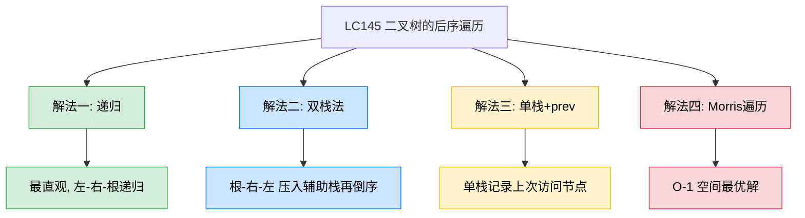
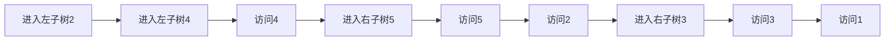
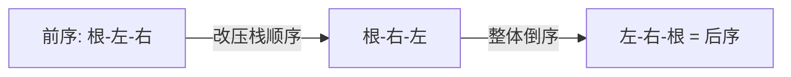

# LC145 二叉树的后序遍历
## 一、题目描述
给你一棵二叉树的根节点 root，返回其节点值的**后序遍历**结果。
后序遍历顺序：**左子树 → 右子树 → 根节点**。
**示例：** 输入 `root = [1,null,2,3]`，输出 `[3,2,1]`
**约束：** 树中节点数目在范围 [0, 100] 内，-100 <= Node.val <= 100
## 二、解法概览

| 解法 | 时间复杂度 | 空间复杂度 | 难度 | 面试推荐 |
|------|-----------|-----------|------|---------|
| 递归 | O(n) | O(n) | ⭐ | 入门必会 |
| 双栈法 | O(n) | O(n) | ⭐⭐ | 最易理解的迭代写法 |
| 单栈+prev | O(n) | O(n) | ⭐⭐⭐ | 面试首选 |
| Morris遍历 | O(n) | O(1) | ⭐⭐⭐⭐ | 最优解/进阶加分 |
## 三、记忆口诀
> **后序最难迭代写，双栈倒序最好记，单栈prev是正解，Morris逆序加分题。**
- 递归：「**左递归、右递归、加自己**」
- 双栈法：「**前序改成根-右-左，再整体倒过来就是左-右-根**」
- 单栈+prev：「**左压到底、看右子树、右空或右已访问才弹出加结果**」
## 四、解法一：递归
### 4.1 思路
后序遍历的定义：先递归遍历左子树，再递归遍历右子树，最后访问根节点。
### 4.2 核心公式
`postorder(node) = postorder(node.left) + postorder(node.right) + node.val`
### 4.3 图解过程
以树 `[1, 2, 3, 4, 5]` 为例：
```
        1
       / \
      2   3
     / \
    4   5
```

结果：`[4, 5, 2, 3, 1]`
### 4.4 代码示例
```java
public List<Integer> postorderTraversal(TreeNode root) {
    List<Integer> res = new ArrayList<>();
    postorder(root, res);
    return res;
}
private void postorder(TreeNode node, List<Integer> res) {
    if (node == null) return;
    postorder(node.left, res);
    postorder(node.right, res);
    res.add(node.val);
}
```
### 4.5 复杂度分析
- **时间复杂度：O(n)**，每个节点访问一次
- **空间复杂度：O(n)**，递归栈深度，最坏链状树 O(n)
### 4.6 优缺点
| 优点 | 缺点 |
|------|------|
| 代码最短，和定义完全一致 | 递归栈深度大时可能溢出 |
| 最容易理解和记忆 | 面试官通常追问非递归写法 |
## 五、解法二：双栈法（你的当前实现）
### 5.1 思路
巧妙利用前序遍历的思路：前序是**根-左-右**，把压栈顺序改为**先左后右**就变成**根-右-左**，再把结果整体倒过来就是**左-右-根**（后序）。

倒序的实现：用一个辅助栈收集结果，最后从辅助栈弹出就是倒序。
### 5.2 核心公式
- 主栈：弹出 → 压入辅助栈 → 先压左再压右（保证弹出顺序是根-右-左）
- 辅助栈：最后依次弹出，根-右-左倒过来就是左-右-根
### 5.3 图解过程
以树 `[1, 2, 3, 4, 5]` 为例：
| 步骤 | 主栈弹出 | 辅助栈压入 | 主栈压入 | 主栈状态 | 辅助栈状态 |
|------|---------|----------|---------|---------|-----------|
| 初始 | - | - | 压1 | [1] | [] |
| 1 | 弹1 | 压1 | 压左2,压右3 | [2,3] | [1] |
| 2 | 弹3 | 压3 | 无子节点 | [2] | [1,3] |
| 3 | 弹2 | 压2 | 压左4,压右5 | [4,5] | [1,3,2] |
| 4 | 弹5 | 压5 | 无子节点 | [4] | [1,3,2,5] |
| 5 | 弹4 | 压4 | 无子节点 | [] | [1,3,2,5,4] |
辅助栈弹出顺序：`4, 5, 2, 3, 1` = 后序遍历
### 5.4 代码示例
```java
public List<Integer> postorderTraversal(TreeNode root) {
    if (root == null) return new LinkedList<>();
    LinkedList<TreeNode> stack = new LinkedList<>();
    LinkedList<TreeNode> temp = new LinkedList<>();
    List<Integer> res = new LinkedList<>();
    stack.push(root);
    while (!stack.isEmpty()) {
        TreeNode node = stack.pop();
        temp.push(node);
        if (node.left != null) stack.push(node.left);
        if (node.right != null) stack.push(node.right);
    }
    while (!temp.isEmpty()) {
        res.add(temp.pop().val);
    }
    return res;
}
```
### 5.5 复杂度分析
- **时间复杂度：O(n)**，每个节点入栈出栈各两次（主栈+辅助栈）
- **空间复杂度：O(n)**，两个栈各存 n 个节点
### 5.6 优缺点
| 优点 | 缺点 |
|------|------|
| 思路最巧妙：前序变体+倒序 | 需要两个栈，空间占用翻倍 |
| 代码和前序迭代高度相似，容易记 | 不是"真正"的后序遍历过程 |
| 不需要判断右子树是否已访问 | 面试官可能追问单栈写法 |
## 六、解法三：单栈+prev（面试首选）
### 6.1 思路
用单栈模拟后序遍历的真实过程。关键问题：弹出节点时需要判断右子树是否已经处理完。引入 `prev` 指针记录上一次加入结果的节点：
- 如果右子树为空，或右子树已经访问过（`root.right == prev`），说明可以访问当前节点
- 否则先去处理右子树
### 6.2 核心公式
```
while (栈不空 || 当前不空):
  当前不空 → 压栈，走左子树
  当前为空 → 看栈顶:
    栈顶右子树不空 且 右子树 != prev → 转向右子树
    否则 → 弹出加结果，prev = 弹出节点
```
### 6.3 图解过程
以树 `[1, 2, 3, 4, 5]` 为例：
| 步骤 | cur | 操作 | 栈 | prev | 结果 |
|------|-----|------|-----|------|------|
| 1 | 1 | 压栈,左移 | [1] | null | [] |
| 2 | 2 | 压栈,左移 | [1,2] | null | [] |
| 3 | 4 | 压栈,左移 | [1,2,4] | null | [] |
| 4 | null | 栈顶4,右空 → 弹出4加结果 | [1,2] | 4 | [4] |
| 5 | null | 栈顶2,右=5,不等于prev → cur=5 | [1,2] | 4 | [4] |
| 6 | 5 | 压栈,左移 | [1,2,5] | 4 | [4] |
| 7 | null | 栈顶5,右空 → 弹出5加结果 | [1,2] | 5 | [4,5] |
| 8 | null | 栈顶2,右=5=prev → 弹出2加结果 | [1] | 2 | [4,5,2] |
| 9 | null | 栈顶1,右=3,不等于prev → cur=3 | [1] | 2 | [4,5,2] |
| 10 | 3 | 压栈,左移 | [1,3] | 2 | [4,5,2] |
| 11 | null | 栈顶3,右空 → 弹出3加结果 | [1] | 3 | [4,5,2,3] |
| 12 | null | 栈顶1,右=3=prev → 弹出1加结果 | [] | 1 | [4,5,2,3,1] |
### 6.4 代码示例
```java
public List<Integer> postorderTraversal(TreeNode root) {
    List<Integer> res = new ArrayList<>();
    LinkedList<TreeNode> stack = new LinkedList<>();
    TreeNode prev = null;
    while (!stack.isEmpty() || root != null) {
        if (root != null) {
            stack.push(root);
            root = root.left;
        } else {
            TreeNode peek = stack.peek();
            if (peek.right != null && peek.right != prev) {
                root = peek.right;
            } else {
                prev = stack.pop();
                res.add(prev.val);
            }
        }
    }
    return res;
}
```
### 6.5 复杂度分析
- **时间复杂度：O(n)**，每个节点入栈出栈各一次
- **空间复杂度：O(n)**，单栈
### 6.6 优缺点
| 优点 | 缺点 |
|------|------|
| 单栈，空间比双栈少 | 需要 prev 指针，逻辑较复杂 |
| 真正模拟了后序遍历过程 | 面试中需要解释清楚判断条件 |
| 面试标准答案 | 三种遍历中后序迭代最难写 |
## 七、解法四：Morris遍历（最优解）
### 7.1 思路
后序 Morris 是三种遍历中最复杂的。核心：在第二次到达一个节点时（断开线索时），**逆序打印该节点左子树的右边界**。最后再逆序打印整棵树的右边界。
### 7.2 核心公式
- 第一次到达（mostRight.right==null）：建线索，cur = cur.left
- 第二次到达（mostRight.right==cur）：断线索，**逆序收集 cur.left 到 mostRight 的路径**
- 遍历结束后：**逆序收集整棵树的右边界**
### 7.3 代码示例
```java
public List<Integer> postorderTraversal(TreeNode root) {
    List<Integer> res = new ArrayList<>();
    TreeNode cur = root;
    TreeNode mostRight;
    while (cur != null) {
        if (cur.left == null) {
            cur = cur.right;
        } else {
            mostRight = cur.left;
            while (mostRight.right != null && mostRight.right != cur) {
                mostRight = mostRight.right;
            }
            if (mostRight.right == null) {
                mostRight.right = cur;
                cur = cur.left;
            } else {
                mostRight.right = null;
                collectReverse(cur.left, mostRight, res);
                cur = cur.right;
            }
        }
    }
    collectReverse(root, mostRight(root), res);
    return res;
}
private TreeNode mostRight(TreeNode node) {
    while (node != null && node.right != null) node = node.right;
    return node;
}
private void collectReverse(TreeNode from, TreeNode to, List<Integer> res) {
    reverse(from, to);
    TreeNode node = to;
    while (node != from) {
        res.add(node.val);
        node = node.right;
    }
    res.add(from.val);
    reverse(to, from);
}
private void reverse(TreeNode from, TreeNode to) {
    if (from == to) return;
    TreeNode prev = from, cur = from.right, next;
    while (prev != to) {
        next = cur.right;
        cur.right = prev;
        prev = cur;
        cur = next;
    }
}
```
### 7.4 复杂度分析
- **时间复杂度：O(n)**
- **空间复杂度：O(1)**，不使用栈和递归
### 7.5 优缺点
| 优点 | 缺点 |
|------|------|
| 空间最优 O(1) | 代码非常复杂，需要逆序打印右边界 |
| 理论最优解 | 面试中极少要求，了解即可 |
## 八、三种遍历迭代写法横向对比
| 对比项 | 前序 | 中序 | 后序 |
|--------|------|------|------|
| 核心思路 | 弹出即加结果，先压右再压左 | 左压到底，弹出加结果，转右 | 左压到底，右空或右已访问才弹出 |
| 代码难度 | 最简单 | 中等 | 最复杂 |
| 关键区别 | 弹出时加 | 弹出时加 | 需要prev判断右子树 |
| 记忆口诀 | 弹出加，先右后左 | 左到底，弹出加，转右 | 左到底，看右，右完才弹 |
## 九、面试回答模板
> **面试官：** 实现二叉树的后序遍历。
**回答要点：**
1. **先说定义：** 后序遍历是左-右-根，递归写法三行代码。后序的迭代写法是三种遍历中最复杂的。
2. **方法一（双栈法）：** 前序遍历是根-左-右，把压栈顺序改成先左后右就变成根-右-左，再用辅助栈倒序就得到左-右-根。思路巧妙但需要两个栈。
3. **方法二（单栈+prev）：** 用一个 prev 指针记录上次访问的节点。弹出栈顶前先检查：如果右子树为空或右子树已经访问过（right==prev），才弹出加结果；否则先转向右子树。
4. **复杂度：** 时间 O(n)，空间 O(n)。
5. **技巧总结：** 后序遍历的难点在于"根节点要等左右子树都处理完才能访问"，需要一种机制判断右子树是否已处理，prev 指针就是这个机制。
## 十、相关题目
| 题目 | 关联点 |
|------|--------|
| LC144 二叉树的前序遍历 | 双栈法的基础：前序改压栈顺序+倒序=后序 |
| LC94 二叉树的中序遍历 | 三种遍历迭代写法的横向对比 |
| LC590 N叉树的后序遍历 | 从二叉树扩展到多叉树 |
| LC106 从中序与后序遍历序列构造二叉树 | 后序最后一个是根，可用于构造树 |
| LC889 根据前序和后序遍历构造二叉树 | 前序+后序不能唯一确定，但可构造一种 |
