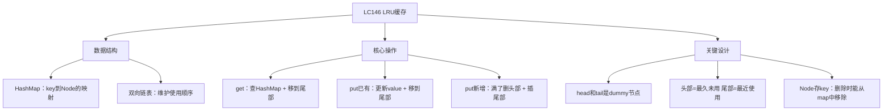
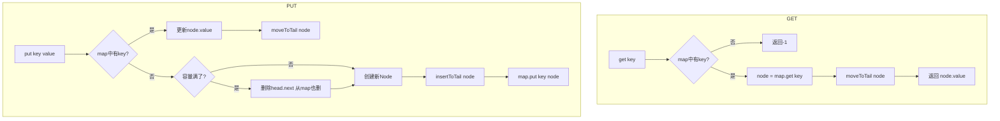

# LC146 LRU 缓存
## 一、题目描述
请你设计并实现一个满足 **LRU（最近最少使用）缓存** 约束的数据结构。
实现 `LRUCache` 类：
- `LRUCache(int capacity)` 以正整数作为容量初始化 LRU 缓存
- `int get(int key)` 如果 key 存在，返回 value 并标记为"最近使用"；不存在返回 -1
- `void put(int key, int value)` 如果 key 存在，更新 value；不存在则插入。如果容量满了，**删除最久未使用的**
**要求**：`get` 和 `put` 都必须是 **O(1)** 时间复杂度。
**示例：**
```
LRUCache cache = new LRUCache(2);  // 容量=2
cache.put(1, 1);    // 缓存：{1=1}
cache.put(2, 2);    // 缓存：{1=1, 2=2}
cache.get(1);       // 返回1，缓存：{2=2, 1=1}（1变成最近使用）
cache.put(3, 3);    // 容量满，淘汰最久未使用的2，缓存：{1=1, 3=3}
cache.get(2);       // 返回-1（已被淘汰）
cache.put(4, 4);    // 淘汰1，缓存：{3=3, 4=4}
cache.get(1);       // 返回-1
cache.get(3);       // 返回3
cache.get(4);       // 返回4
```
---
## 二、解法概览
### 解法对比表
| 解法 | get | put | 面试推荐 |
|------|-----|-----|---------|
| **HashMap + 双向链表** | O(1) | O(1) | ✅ **标准解法** |
| LinkedHashMap（Java内置） | O(1) | O(1) | ❌ 面试不接受 |
### 为什么需要这两种数据结构？
| 需求 | 谁来做 | 原因 |
|------|--------|------|
| O(1) 查找 key | **HashMap** | 哈希表查找 O(1) |
| O(1) 删除任意节点 | **双向链表** | 知道节点后，O(1) 修改 pre/next |
| O(1) 插入到尾部 | **双向链表** | 有 tail 指针，直接插 |
| O(1) 删除头部（最久未用） | **双向链表** | 有 head 指针，直接删 |
| 维护使用顺序 | **双向链表** | 头=最久未用，尾=最近使用 |
```
单独用 HashMap → 无法维护使用顺序，不知道谁最久未用
单独用双向链表 → 查找 O(n)，太慢
两者结合 → 完美！查找O(1) + 增删O(1) + 有顺序
```
### 思维导图

---
## 三、记忆口诀
```
LRU缓存两件套，哈希加上双链表
哈希负责快查找，链表维护使用序
头部最老尾部新，用过的就移到尾
满了就把头部删，Node存key别忘记
```
---
## 四、解法：HashMap + 双向链表
### 思路
**数据结构设计：**
```
HashMap<Integer, Node>：key → 链表节点的映射，O(1) 查找
双向链表：维护使用顺序
  head(dummy) ↔ 最久未用 ↔ ... ↔ 最近使用 ↔ tail(dummy)
  ← 越靠近head越久没用，越靠近tail越最近使用 →
```
**操作规则：**
```
get(key)：
  1. HashMap查找 → 没找到返回-1
  2. 找到了 → 移到链表尾部（标记为最近使用）→ 返回value
put(key, value)：
  1. key已存在 → 更新value → 移到链表尾部
  2. key不存在：
     a. 容量满了 → 删除头部节点（最久未用）→ 从map中也移除
     b. 创建新节点 → 插入链表尾部 → 放入map
```
### 为什么链表节点要存 key？
```
删除头部节点时，需要从 HashMap 中也删除：
  Node oldest = head.next;     // 拿到最久未用的节点
  map.remove(oldest.key);      // 从map中删除 → 需要知道key！
  deleteListNode(oldest);      // 从链表中删除
如果 Node 不存 key，就无法从 map 中删除对应条目
```
### 为什么用 dummy 头尾节点？
```
没有 dummy 时：
  删除头部：head可能变成null，需要特判
  插入尾部：tail可能是null，需要特判
  空链表时各种边界情况
有了 dummy 时：
  head(dummy) ↔ 真实节点 ↔ tail(dummy)
  链表永远不为空（至少有head和tail）
  删除/插入永远有 pre 和 next，不需要特判
```
### 图解过程
```
LRUCache(2)，容量=2
初始：head ↔ tail，map={}
━━━━━━━━━━━━━━━━━━━━━━━━━━━━━━━━━━
put(1,1)：新增，插入尾部
  head ↔ [1:1] ↔ tail
  map={1→Node(1,1)}
━━━━━━━━━━━━━━━━━━━━━━━━━━━━━━━━━━
put(2,2)：新增，插入尾部
  head ↔ [1:1] ↔ [2:2] ↔ tail
  map={1→Node, 2→Node}
━━━━━━━━━━━━━━━━━━━━━━━━━━━━━━━━━━
get(1)：找到，移到尾部
  head ↔ [2:2] ↔ [1:1] ↔ tail    ← 1移到了尾部
  返回1
━━━━━━━━━━━━━━━━━━━━━━━━━━━━━━━━━━
put(3,3)：容量满了(2个)，删头部[2:2]，再插入[3:3]
  删除：head ↔ [1:1] ↔ tail，map.remove(2)
  插入：head ↔ [1:1] ↔ [3:3] ↔ tail
  map={1→Node, 3→Node}
━━━━━━━━━━━━━━━━━━━━━━━━━━━━━━━━━━
get(2)：map中没有 → 返回-1
━━━━━━━━━━━━━━━━━━━━━━━━━━━━━━━━━━
put(4,4)：容量满了，删头部[1:1]，再插入[4:4]
  head ↔ [3:3] ↔ [4:4] ↔ tail
  map={3→Node, 4→Node}
━━━━━━━━━━━━━━━━━━━━━━━━━━━━━━━━━━
get(1)：返回-1（已淘汰）
get(3)：返回3，移到尾部 → head ↔ [4:4] ↔ [3:3] ↔ tail
get(4)：返回4，移到尾部 → head ↔ [3:3] ↔ [4:4] ↔ tail
```
### 算法流程图

### 四个辅助方法怎么推导出来？
不需要死记，从 `get` 和 `put` 的需求**反推**：
```
先看 get 和 put 需要对链表做什么操作：
get(key)：
  → 把节点移到尾部（标记最近使用）          → 需要"移到尾部"
put(key, value)：
  已存在 → 把节点移到尾部                   → 需要"移到尾部"
  不存在 → ① 满了删头部  ② 插入尾部        → 需要"删头部" + "插尾部"
```
```
所以只需要3个操作：
  ① 移到尾部
  ② 删头部
  ③ 插入尾部
```
```
继续拆解：
  "移到尾部" = 先从原位置删除 + 再插入尾部
  "删头部"   = 从链表删除 + 从map删除
所以拆出最底层的两个原子操作：
  删除节点（从链表中摘掉）
  插入尾部（接到tail前面）
```
```
最终推导出4个方法：
  ┌─ 原子操作 ─────────────────────────┐
  │ ① deleteNode(node) — 从链表删除     │
  │ ② insertToTail(node) — 插入尾部     │
  └─────────────────────────────────────┘
            ↓ 组合
  ┌─ 组合操作 ─────────────────────────┐
  │ ③ moveToTail(node) = ①删除 + ②插尾 │  ← get/put都用
  │ ④ removeHead() = ①删头 + map.remove │  ← put满了用
  └─────────────────────────────────────┘
```
**对应关系表：**
| get/put 需要什么 | 调用哪个方法 | 方法内部做什么 |
|-----------------|-------------|--------------|
| get → 标记最近使用 | moveToTail | deleteNode + insertToTail |
| put已有 → 标记最近使用 | moveToTail | deleteNode + insertToTail |
| put新增 → 插入尾部 | insertToTail | 直接插 |
| put满了 → 淘汰最久没用 | removeHead | deleteNode + map.remove |
> 记忆方法：**从 get/put 的需求出发，需要"移到尾部"和"删头部"两个操作，再拆成"删除"和"插尾"两个原子操作，就是这4个方法。**
### 代码示例
```java
class LRUCache {
    // 双向链表节点
    static class Node {
        int key, value;
        Node pre, next;
        Node(int key, int value) {
            this.key = key;
            this.value = value;
        }
    }
    private int capacity;
    private HashMap<Integer, Node> map;
    private Node head, tail;  // dummy 头尾节点
    public LRUCache(int capacity) {
        this.capacity = capacity;
        map = new HashMap<>();
        head = new Node(-1, -1);
        tail = new Node(-1, -1);
        head.next = tail;
        tail.pre = head;
    }
    public int get(int key) {
        if (!map.containsKey(key)) return -1;
        Node node = map.get(key);
        moveToTail(node);  // 标记为最近使用
        return node.value;
    }
    public void put(int key, int value) {
        if (map.containsKey(key)) {
            Node node = map.get(key);
            node.value = value;    // 更新值
            moveToTail(node);      // 标记为最近使用
            return;
        }
        if (map.size() == capacity) {
            removeHead();  // 淘汰最久未用的
        }
        Node node = new Node(key, value);
        insertToTail(node);    // 插入尾部
        map.put(key, node);    // 放入map
    }
    // 从链表中删除节点（不动map）
    private void deleteNode(Node node) {
        node.pre.next = node.next;
        node.next.pre = node.pre;
    }
    // 插入到尾部（tail之前）
    private void insertToTail(Node node) {
        tail.pre.next = node;
        node.pre = tail.pre;
        node.next = tail;
        tail.pre = node;
    }
    // 移到尾部 = 删除 + 插入尾部
    private void moveToTail(Node node) {
        deleteNode(node);
        insertToTail(node);
    }
    // 删除头部（最久未用）= 从链表删 + 从map删
    private void removeHead() {
        Node oldest = head.next;
        deleteNode(oldest);
        map.remove(oldest.key);  // Node存key的原因！
    }
}
```
### 双向链表操作图解
**删除节点：**
```
删除前：A ↔ B ↔ C
  A.next = B, B.pre = A
  B.next = C, C.pre = B
删除 B：
  B.pre.next = B.next  → A.next = C
  B.next.pre = B.pre   → C.pre = A
删除后：A ↔ C    （B被跳过了）
```
**插入到尾部（tail之前）：**
```
插入前：... ↔ X ↔ tail
  X = tail.pre
插入 N：
  tail.pre.next = N  → X.next = N
  N.pre = tail.pre   → N.pre = X
  N.next = tail       → N.next = tail
  tail.pre = N        → tail.pre = N
插入后：... ↔ X ↔ N ↔ tail
```
### 复杂度分析
- `get`：**O(1)**，HashMap查找O(1) + 链表移动O(1)
- `put`：**O(1)**，HashMap操作O(1) + 链表操作O(1)
- 空间：**O(capacity)**，HashMap + 链表各存 capacity 个节点
### 优缺点
| 优点 | 缺点 |
|-----|------|
| get/put 都是 O(1) | 代码较长 |
| 面试必考经典 | 链表指针操作容易出错 |
| 思路清晰 | 需要手写双向链表 |
### 关键点总结
| 关键点 | 说明 |
|-------|------|
| 为什么 HashMap？ | O(1) 查找 |
| 为什么双向链表？ | O(1) 删除任意节点（单链表删除需要找前驱 O(n)） |
| 为什么 Node 存 key？ | 删头部时需要从 map 中移除，要知道 key |
| 为什么用 dummy 头尾？ | 避免空链表的边界特判 |
| 头部 vs 尾部？ | 头部=最久未用（待淘汰），尾部=最近使用 |
---
## 五、面试回答模板
### 1. 开场：理解 LRU
> LRU 是最近最少使用淘汰策略。当缓存满了，淘汰最久没有被访问的元素。
### 2. 数据结构选择
> 需要 O(1) 查找用 HashMap，需要 O(1) 增删和维护顺序用双向链表。两者结合：HashMap 存 key 到链表节点的映射，双向链表按使用时间排序。
### 3. 核心设计
> 链表头部是最久未用的，尾部是最近使用的。get 和 put 都会把节点移到尾部。容量满了就删头部节点。
### 4. 关键细节
> 链表节点要存 key，因为删头部时需要从 HashMap 中也删除。head 和 tail 是 dummy 节点，避免空链表特判。
### 5. 复杂度
> get 和 put 都是 O(1)。空间 O(capacity)。
---
## 六、相关题目
| 题号 | 题目 | 关系 | 难度 |
|-----|------|------|-----|
| LC460 | LFU 缓存 | 进阶：最不经常使用淘汰 | 困难 |
| LC432 | 全O(1)的数据结构 | O(1) 增删查 | 困难 |
| LC355 | 设计推特 | 数据结构设计 | 中等 |
| LC706 | 设计哈希映射 | HashMap 基础 | 简单 |
| LC707 | 设计链表 | 链表基础操作 | 中等 |