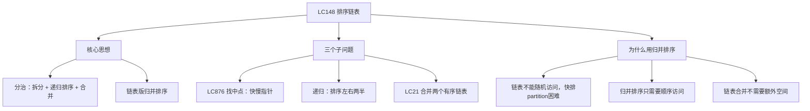
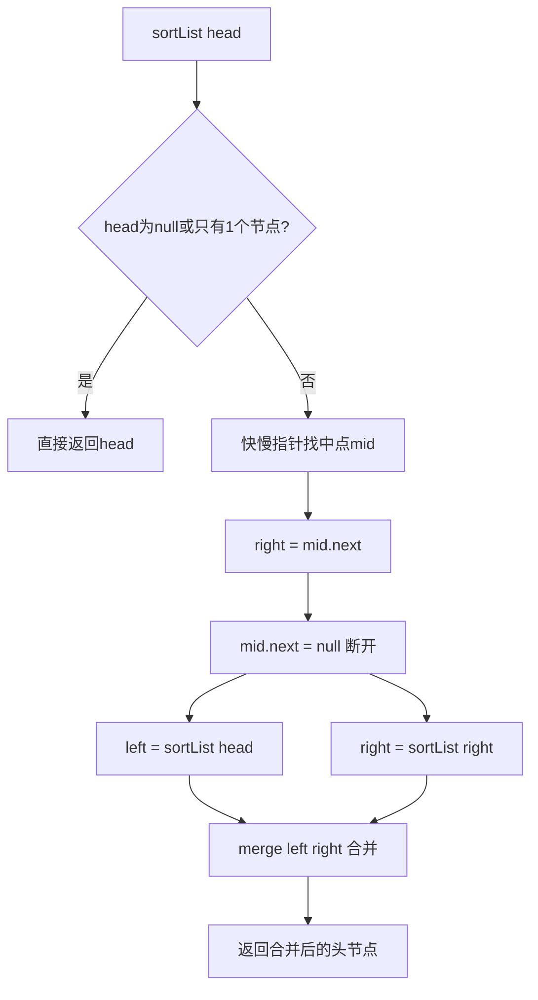

# LC148 排序链表
## 一、题目描述
给你链表的头节点 `head`，请将其按**升序**排列并返回排序后的链表。
**示例1：**
```
输入：4 → 2 → 1 → 3
输出：1 → 2 → 3 → 4
```
**示例2：**
```
输入：-1 → 5 → 3 → 4 → 0
输出：-1 → 0 → 3 → 4 → 5
```
**约束：**
- 链表节点数范围 [0, 5×10^4]
- -10^5 <= Node.val <= 10^5
- **进阶**：O(n logn) 时间，O(1) 空间
---
## 二、解法概览
### 解法对比表
| 解法 | 时间复杂度 | 空间复杂度 | 面试推荐 |
|------|-----------|-----------|---------|
| **归并排序（自顶向下/递归）** | O(n logn) | O(logn) | ✅ **首选** |
| 归并排序（自底向上/迭代） | O(n logn) | O(1) | ✅ 进阶 |
### 思维导图

---
## 三、记忆口诀
```
链表排序用归并，拆排合三步走
快慢指针找中点，断开左右各递归
合并就是LC21，dummy加双指针
```
---
## 四、解法一：归并排序 — 自顶向下/递归（首选 ✅）
### 思路
经典的**分治法**，三步走：
1. **拆**：快慢指针找中点，从中间断开链表
2. **排**：递归排序左半和右半
3. **合**：合并两个有序链表（= LC21）
### 核心公式
```
sortList(head):
  if head == null || head.next == null → return head
  mid = 找中点（快慢指针）
  right = mid.next
  mid.next = null（断开！）
  left = sortList(head)     // 递归排左半
  right = sortList(right)   // 递归排右半
  return merge(left, right) // 合并（LC21）
```
### 三个子问题拆解
| 步骤 | 做什么 | 对应题目/技巧 |
|------|--------|-------------|
| 找中点 | 快慢指针 | LC876 链表中间结点 |
| 断开 | `mid.next = null` | 关键：必须断开 |
| 合并 | 两个有序链表合并 | LC21 合并两个有序链表 |
### 为什么快慢指针的 fast 初始化为 head.next？
```
如果 fast = head（两人都从头出发）：
  链表 1 → 2  →  slow=2, fast=null
  中点是2，左半=[1,2]，右半=[] → 左半没变短，无限递归！❌
如果 fast = head.next（fast 先走一步）：
  链表 1 → 2  →  slow=1, fast=null
  中点是1，左半=[1]，右半=[2] → 正确拆分 ✅
原因：偶数长度时，要取"中间靠左"才能正确拆分
```
### 图解过程
```
链表：4 → 2 → 1 → 3
━━━━━━━━━━━━━━━━━━━━━━━━━━━━━━━━━━
第1层：拆分
  快慢指针：slow=2, fast=3(从head.next开始)
  mid=2，断开 → 左半:4→2  右半:1→3
                  sortList      sortList
━━━━━━━━━━━━━━━━━━━━━━━━━━━━━━━━━━
第2层左：排序 4→2
  mid=4，断开 → 左:4  右:2
  只有1个节点，直接返回
  合并 merge(4, 2) → 2→4
━━━━━━━━━━━━━━━━━━━━━━━━━━━━━━━━━━
第2层右：排序 1→3
  mid=1，断开 → 左:1  右:3
  只有1个节点，直接返回
  合并 merge(1, 3) → 1→3
━━━━━━━━━━━━━━━━━━━━━━━━━━━━━━━━━━
回到第1层：合并
  merge(2→4, 1→3)
  比较：1<2 → 取1
  比较：2<3 → 取2
  比较：3<4 → 取3
  剩余：4
  结果：1→2→3→4 ✅
```
### 递归树
```
          4→2→1→3
         /        \
      4→2          1→3
      / \          / \
     4   2        1   3
      \ /          \ /
      2→4          1→3
         \        /
         1→2→3→4
```
### 算法流程图

### 代码示例
```java
public ListNode sortList(ListNode head) {
    // 终止条件：空或只有一个节点
    if (head == null || head.next == null) {
        return head;
    }
    // 1. 找中点
    ListNode mid = getMid(head);
    ListNode rightHead = mid.next;
    mid.next = null;  // 断开！
    // 2. 递归排序左右两半
    ListNode left = sortList(head);
    ListNode right = sortList(rightHead);
    // 3. 合并两个有序链表（LC21）
    return merge(left, right);
}
// 快慢指针找中点（偶数时取靠左）
private ListNode getMid(ListNode head) {
    ListNode slow = head, fast = head.next;
    while (fast != null && fast.next != null) {
        slow = slow.next;
        fast = fast.next.next;
    }
    return slow;
}
// 合并两个有序链表（LC21原题）
private ListNode merge(ListNode l1, ListNode l2) {
    ListNode dummy = new ListNode(-1);
    ListNode cur = dummy;
    while (l1 != null && l2 != null) {
        if (l1.val <= l2.val) {
            cur.next = l1;
            l1 = l1.next;
        } else {
            cur.next = l2;
            l2 = l2.next;
        }
        cur = cur.next;
    }
    cur.next = (l1 != null) ? l1 : l2;
    return dummy.next;
}
```
### 你的代码中有一个小问题
```java
// Solution.java 第34行
while (left != null & right != null)  // ❌ 用了 & 而不是 &&
while (left != null && right != null) // ✅ 应该用 &&
```
`&` 是位运算，两边都会执行，如果 left 为 null，右边 `right != null` 仍然执行（虽然不会报错但不规范）。`&&` 短路求值，left 为 null 直接返回 false，更安全高效。
### 复杂度分析
- 时间复杂度：**O(n logn)**，拆了 logn 层，每层合并 O(n)
- 空间复杂度：**O(logn)**，递归栈深度
### 优缺点
| 优点 | 缺点 |
|-----|------|
| 思路清晰：拆排合 | 递归栈 O(logn) 不是 O(1) |
| 代码好写好理解 | 不满足进阶 O(1) 空间 |
| 面试首选 | 无 |
---
## 五、解法二：归并排序 — 自底向上/迭代（进阶）
### 思路
不用递归，改成**从小到大合并**：
1. 先每 1 个一组，两两合并
2. 再每 2 个一组，两两合并
3. 再每 4 个一组...
4. 直到整个链表有序
### 核心公式
```
step = 1, 2, 4, 8, ... 直到 step >= n
每轮：把链表按 step 长度切分，相邻两段合并
```
### 图解过程
```
原链表：4 → 2 → 1 → 3
━━━━━━━━━━━━━━━━━━━━━━━━━━━━━━━━━━
step=1：每1个一组，两两合并
  [4] [2] → merge → [2,4]
  [1] [3] → merge → [1,3]
  结果：2 → 4 → 1 → 3
━━━━━━━━━━━━━━━━━━━━━━━━━━━━━━━━━━
step=2：每2个一组，两两合并
  [2,4] [1,3] → merge → [1,2,3,4]
  结果：1 → 2 → 3 → 4 ✅
━━━━━━━━━━━━━━━━━━━━━━━━━━━━━━━━━━
step=4 >= n=4，结束
```
### 代码示例
```java
public ListNode sortList(ListNode head) {
    if (head == null || head.next == null) return head;
    // 计算链表长度
    int n = 0;
    ListNode cur = head;
    while (cur != null) { n++; cur = cur.next; }
    ListNode dummy = new ListNode(-1);
    dummy.next = head;
    // step: 1, 2, 4, 8, ...
    for (int step = 1; step < n; step *= 2) {
        ListNode prev = dummy;
        cur = dummy.next;
        while (cur != null) {
            // 切出左半段（长度step）
            ListNode left = cur;
            ListNode right = split(left, step);
            // 切出右半段（长度step），next是剩余部分
            cur = split(right, step);
            // 合并左右两段，接到prev后面
            prev = mergeAndReturnTail(prev, left, right);
        }
    }
    return dummy.next;
}
// 从head开始切出step个节点，返回剩余部分的头
private ListNode split(ListNode head, int step) {
    if (head == null) return null;
    for (int i = 1; i < step && head.next != null; i++) {
        head = head.next;
    }
    ListNode next = head.next;
    head.next = null;  // 断开
    return next;
}
// 合并两段有序链表，接到prev后面，返回合并后的尾节点
private ListNode mergeAndReturnTail(ListNode prev, ListNode l1, ListNode l2) {
    ListNode cur = prev;
    while (l1 != null && l2 != null) {
        if (l1.val <= l2.val) {
            cur.next = l1;
            l1 = l1.next;
        } else {
            cur.next = l2;
            l2 = l2.next;
        }
        cur = cur.next;
    }
    cur.next = (l1 != null) ? l1 : l2;
    while (cur.next != null) cur = cur.next;  // 走到尾
    return cur;
}
```
### 复杂度分析
- 时间复杂度：**O(n logn)**，logn 轮，每轮合并 O(n)
- 空间复杂度：**O(1)**，没有递归栈，只用了常数个指针
### 优缺点
| 优点 | 缺点 |
|-----|------|
| 空间 O(1)，满足进阶 | 代码复杂，容易出错 |
| 没有递归栈溢出风险 | 面试不常考 |
---
## 六、两种解法对比
| 对比 | 自顶向下（递归） | 自底向上（迭代） |
|------|----------------|----------------|
| 方向 | 先拆到底，再合上来 | 先小组合并，逐步扩大 |
| 空间 | O(logn) 递归栈 | O(1) |
| 难度 | 简单 | 复杂 |
| 面试 | **首选** | 进阶追问 |
| 子问题 | 找中点+合并 | 切分+合并 |
---
## 七、面试回答模板
### 1. 开场：理解题意
> 对链表排序，要求 O(n logn) 时间。链表不能随机访问，所以最适合归并排序。
### 2. 思路：归并排序三步走
> 第一步用快慢指针找中点并断开，第二步递归排序左右两半，第三步合并两个有序链表。
### 3. 为什么用归并而不用快排
> 链表不支持随机访问，快排的 partition 需要随机定位很不方便。而归并排序只需要顺序访问，天然适合链表。而且链表的合并不需要额外空间。
### 4. 关键细节
> 找中点时 fast 要从 head.next 开始，这样偶数长度时 slow 停在中间靠左，才能正确拆分。断开链表时一定要 `mid.next = null`。
### 5. 复杂度
> 时间 O(n logn)，空间 O(logn) 递归栈。如果用自底向上的迭代写法可以做到 O(1) 空间。
---
## 八、相关题目
| 题号 | 题目 | 关系 | 难度 |
|-----|------|------|-----|
| LC21 | 合并两个有序链表 | 子问题：合并步骤 | 简单 |
| LC876 | 链表的中间结点 | 子问题：找中点 | 简单 |
| LC23 | 合并K个升序链表 | 多路归并 | 困难 |
| LC912 | 排序数组 | 数组版归并排序 | 中等 |
| LC143 | 重排链表 | 找中点+反转+合并 | 中等 |
| LC206 | 反转链表 | 链表基础操作 | 简单 |