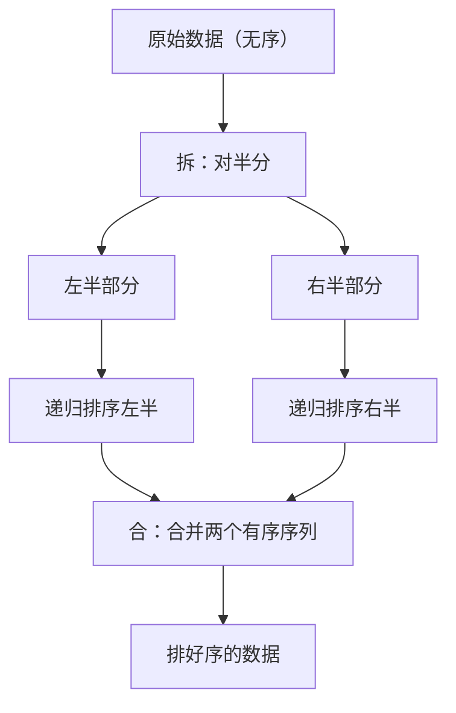
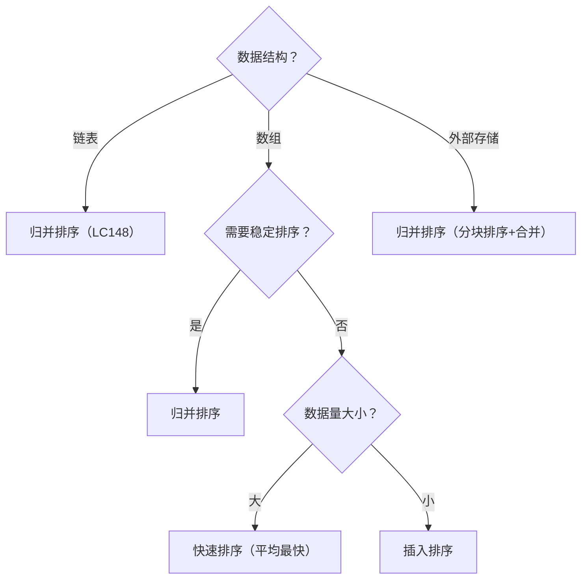

# 归并排序详解（结合 LC148 排序链表）
## 一、是什么？
归并排序（Merge Sort）是一种基于**分治思想**的排序算法，由约翰·冯·诺伊曼于 1945 年提出。
**一句话定义**：把一堆乱的东西，先拆成小份各自排好，再合并起来。
```
生活例子：整理一副乱牌
  1. 把牌分成左右两堆
  2. 每堆各自排好序（继续拆分，直到每堆只有1张）
  3. 两堆排好的牌，从顶部逐张比较，合成一堆有序的
```
---
## 二、解决什么问题？
| 场景 | 说明 |
|------|------|
| 通用排序 | 任何数据的排序，时间稳定 O(n logn) |
| **链表排序** | 链表不能随机访问，归并只需要顺序访问（**LC148**） |
| 稳定排序 | 相等元素不会交换位置（适合多字段排序） |
| 外部排序 | 数据太大内存放不下，分块排好再合并 |
| 求逆序对 | 合并时统计逆序数量（**LC剑指51**） |
---
## 三、核心思想：拆、排、合

### 三步详解
```
第1步 拆（Divide）：把数据从中间一分为二
  → 不断对半分，直到每段只有1个元素（天然有序）
第2步 排（Conquer）：递归排序每一半
  → 子问题和原问题一模一样，只是规模缩小了
第3步 合（Merge）：合并两个有序序列
  → 这是归并排序的核心操作，也是 LC21 的原题
```
### 完整过程图解
```
原始：[38, 27, 43, 3, 9, 82, 10]
━━━━━━━━━━━━━━━━━━━━━━━━━━━━━━━━━━
拆（自顶向下，不断对半分）：
              [38,27,43,3,9,82,10]
              /                  \
       [38,27,43,3]          [9,82,10]
        /       \             /     \
    [38,27]   [43,3]      [9,82]   [10]
     /  \      /  \        /  \
   [38] [27] [43] [3]   [9]  [82]
━━━━━━━━━━━━━━━━━━━━━━━━━━━━━━━━━━
合（自底向上，两两合并）：
   [38] [27] [43] [3]   [9]  [82]  [10]
     \  /      \  /        \  /      |
   [27,38]   [3,43]      [9,82]   [10]
       \       /             \      /
    [3,27,38,43]          [9,10,82]
           \                 /
        [3,9,10,27,38,43,82]  ✅
每一层的合并，就是 LC21（合并两个有序序列）
```
---
## 四、自顶向下 vs 自底向上
归并排序有两种实现方式，结果完全一样，只是**执行顺序不同**。
### 一句话区分
```
自顶向下：先拆到最小，再合回来（递归）
自底向上：直接从最小开始，逐步合上去（迭代）
```
### 用扑克牌理解
**自顶向下（递归）**：像一个强迫症患者
```
手里有8张乱牌
"8张太多了，先分成两堆4张"
  "4张还是多，再分成两堆2张"
    "2张还是多，再分成两堆1张"
      "1张！终于不用分了！"
    "现在把这2张合起来"
  "把两堆2张的合起来变4张"
"把两堆4张的合起来变8张"
特点：一直拆拆拆，拆到底才开始干活（合并）
```
**自底向上（迭代）**：像一个务实的人
```
手里有8张乱牌
"每张牌就是1人一组，已经有序"
"相邻两张合并，变成4组（每组2张有序）"
"再相邻两组合并，变成2组（每组4张有序）"
"最后两组合并，变成1组（8张全有序）"
特点：不拆分，直接从最小的开始合并
```
### 用同一个例子对比
```
原始：[4, 2, 1, 3, 6, 5, 8, 7]
```
**自顶向下（先拆到底，再合回来）：**
```
第1步 拆：[4,2,1,3] [6,5,8,7]              ← 先拆
第2步 拆：[4,2] [1,3] [6,5] [8,7]          ← 继续拆
第3步 拆：[4] [2] [1] [3] [6] [5] [8] [7]  ← 拆到底
第4步 合：[2,4] [1,3] [5,6] [7,8]          ← 开始合
第5步 合：[1,2,3,4] [5,6,7,8]              ← 继续合
第6步 合：[1,2,3,4,5,6,7,8]                ← 合完
执行顺序：先一路拆到底 → 再从底层开始合
像剥洋葱：先一层层剥开，再一层层包回来
```
**自底向上（直接从最小开始合）：**
```
起点：[4] [2] [1] [3] [6] [5] [8] [7]  ← 不用拆，每个元素天然是一组
第1轮 step=1：[2,4] [1,3] [5,6] [7,8]  ← 每1个一组，两两合并
第2轮 step=2：[1,2,3,4] [5,6,7,8]      ← 每2个一组，两两合并
第3轮 step=4：[1,2,3,4,5,6,7,8]        ← 每4个一组，两两合并
执行顺序：直接从底层开始，逐步往上合并
像砌砖：从地基开始，一层一层往上砌
```
### 执行顺序差异图解
```
自顶向下（数字=执行顺序）：        自底向上（数字=执行顺序）：
        ⑥ 合                              ③ 合
       / \                                / \
     ④    ⑤ 合                         ② 合  ② 合
     / \   / \                          / \   / \
   ② ③  ② ③ 合                       ① ① ① ① 合
   /\ /\ /\ /\                        /\ /\ /\ /\
  ①①①①①①①① 拆到底               直接就是最小单位
先从顶部一路拆到底（①）            不需要拆的过程
再从底部合回来（②③④⑤⑥）          直接从底部合上去（①②③）
```
### 对比总结
| 对比 | 自顶向下 | 自底向上 |
|------|---------|---------|
| 思路 | 先拆到底，再合回来 | 直接从最小开始合 |
| 实现 | 递归 | for 循环 |
| 空间 | O(logn) 递归栈 | O(1) 无递归 |
| 比喻 | 剥洋葱再包回来 | 从地基往上砌砖 |
| 面试 | **首选**，代码简单 | 追问 O(1) 空间时用 |
> 核心区别：**谁先执行？** 自顶向下是拆分先执行（递归到底），合并后执行；自底向上跳过拆分，合并直接开始。最终的合并操作完全一样，只是执行顺序不同。
---
## 五、通用模板
### 模板一：数组版归并排序
```java
public void mergeSort(int[] arr, int left, int right) {
    // 终止条件：只有一个元素
    if (left >= right) return;
    // 1. 拆：找中点
    int mid = left + (right - left) / 2;
    // 2. 排：递归排左右两半
    mergeSort(arr, left, mid);
    mergeSort(arr, mid + 1, right);
    // 3. 合：合并两个有序区间
    merge(arr, left, mid, right);
}
private void merge(int[] arr, int left, int mid, int right) {
    int[] temp = new int[right - left + 1];
    int i = left, j = mid + 1, k = 0;
    // 两边都有，取较小的
    while (i <= mid && j <= right) {
        if (arr[i] <= arr[j]) {
            temp[k++] = arr[i++];
        } else {
            temp[k++] = arr[j++];
        }
    }
    // 剩余的直接放进去
    while (i <= mid) temp[k++] = arr[i++];
    while (j <= right) temp[k++] = arr[j++];
    // 拷贝回原数组
    System.arraycopy(temp, 0, arr, left, temp.length);
}
```
### 模板二：链表版归并排序（LC148）
```java
public ListNode sortList(ListNode head) {
    // 终止条件：空或只有一个节点
    if (head == null || head.next == null) return head;
    // 1. 拆：快慢指针找中点，断开
    ListNode mid = getMid(head);
    ListNode rightHead = mid.next;
    mid.next = null;  // 必须断开！
    // 2. 排：递归排左右两半
    ListNode left = sortList(head);
    ListNode right = sortList(rightHead);
    // 3. 合：合并两个有序链表（LC21）
    return merge(left, right);
}
private ListNode getMid(ListNode head) {
    ListNode slow = head, fast = head.next; // fast从next开始！
    while (fast != null && fast.next != null) {
        slow = slow.next;
        fast = fast.next.next;
    }
    return slow;
}
private ListNode merge(ListNode l1, ListNode l2) {
    ListNode dummy = new ListNode(-1);
    ListNode cur = dummy;
    while (l1 != null && l2 != null) {
        if (l1.val <= l2.val) {
            cur.next = l1; l1 = l1.next;
        } else {
            cur.next = l2; l2 = l2.next;
        }
        cur = cur.next;
    }
    cur.next = (l1 != null) ? l1 : l2;
    return dummy.next;
}
```
### 数组版 vs 链表版对比
| 步骤 | 数组版 | 链表版 |
|------|--------|--------|
| 找中点 | `mid = (left+right)/2` | 快慢指针 |
| 拆分 | 天然通过下标拆分 | **`mid.next = null` 断开** |
| 合并空间 | 需要临时数组 O(n) | 不需要额外空间（改指针） |
| 递归栈 | O(logn) | O(logn) |
---
## 六、关键技巧与陷阱
### 技巧1：链表找中点时 fast 从 head.next 开始
```
❌ fast = head：偶数长度时中点偏右，左半段不会缩短 → 无限递归
✅ fast = head.next：偶数长度时中点偏左，两半都能缩短
示例 [1,2]：
  fast=head → slow=2 → 左[1,2] 右[] → 左没变，死循环
  fast=head.next → slow=1 → 左[1] 右[2] → 正确拆分
```
### 技巧2：链表必须断开
```
mid.next = null  // 这一步不能忘！
如果不断开：
  递归排左半时，左半段后面还连着右半段
  相当于在排整个链表，无限递归
```
### 技巧3：合并时用 `<=` 保证稳定性
```java
if (l1.val <= l2.val)  // ✅ 相等时取左边，保持原始顺序 = 稳定排序
if (l1.val < l2.val)   // ❌ 相等时取右边，破坏原始顺序 = 不稳定
```
### 技巧4：数组版合并需要临时数组
```
数组合并时不能原地操作（会覆盖未处理的元素）
必须用一个临时数组，合并完再拷贝回去
链表版就没这个问题（改指针就行）
```
### 常见陷阱总结
| 陷阱 | 说明 | 后果 |
|------|------|------|
| fast 初始位置错误 | `fast=head` 而不是 `fast=head.next` | 偶数长度无限递归 |
| 忘记断开链表 | 没有 `mid.next=null` | 无限递归 |
| 合并用 `&` 而不是 `&&` | 位运算，不短路 | 不规范，可能出错 |
| 数组合并没用临时数组 | 原地合并覆盖数据 | 结果错误 |
| 合并用 `<` 而不是 `<=` | 破坏稳定性 | 相等元素顺序变化 |
---
## 七、经典题目
### 直接应用
| 题号 | 题目 | 归并排序的角色 | 难度 |
|-----|------|--------------|------|
| **LC148** | 排序链表 | 链表归并排序完整应用 | 中等 |
| LC912 | 排序数组 | 数组归并排序完整应用 | 中等 |
| LC21 | 合并两个有序链表 | 归并排序的"合"步骤 | 简单 |
| LC88 | 合并两个有序数组 | 数组版的"合"步骤 | 简单 |
| LC23 | 合并K个升序链表 | 多路归并（分治或堆） | 困难 |
### 变体应用
| 题号 | 题目 | 归并排序的变体 | 难度 |
|-----|------|--------------|------|
| LC剑指51 | 数组中的逆序对 | 合并时统计逆序对 | 困难 |
| LC315 | 计算右侧小于当前元素的个数 | 合并时统计 | 困难 |
| LC493 | 翻转对 | 合并前统计 | 困难 |
| LC327 | 区间和的个数 | 前缀和+归并 | 困难 |
### 子问题应用
| 题号 | 题目 | 用到的子问题 | 难度 |
|-----|------|------------|------|
| LC876 | 链表的中间结点 | 快慢指针找中点 | 简单 |
| LC234 | 回文链表 | 找中点+反转+比较 | 简单 |
| LC143 | 重排链表 | 找中点+反转+合并 | 中等 |
---
## 八、与其他排序算法的对比
### 全面对比表
| 算法 | 时间(平均) | 时间(最坏) | 空间 | 稳定性 | 适用场景 |
|------|----------|----------|------|--------|---------|
| **归并排序** | O(n logn) | O(n logn) | O(n)/O(logn) | ✅ 稳定 | 链表、外部排序、需要稳定性 |
| 快速排序 | O(n logn) | O(n²) | O(logn) | ❌ 不稳定 | 数组内部排序（平均最快） |
| 堆排序 | O(n logn) | O(n logn) | O(1) | ❌ 不稳定 | 空间敏感、Top-K |
| 插入排序 | O(n²) | O(n²) | O(1) | ✅ 稳定 | 小数据、基本有序 |
### 归并 vs 快排：最常考的对比
```
                归并排序                    快速排序
分治方式      先拆后合（重点在合）         先分后排（重点在分）
拆分方式      从中间一刀切                用pivot分成大小两组
稳定性        稳定                        不稳定
最坏时间      O(n logn) 稳定              O(n²)（pivot选不好）
额外空间      O(n) 数组 / O(logn) 链表    O(logn)
适合数据结构  链表（只需顺序访问）         数组（需要随机访问）
```
### 为什么链表排序用归并而不用快排？
```
快排需要：
  1. 随机访问元素（链表做不到）
  2. partition 操作需要从两端向中间扫描（链表只能单向）
  3. 交换元素（链表交换值可以，但不优雅）
归并只需要：
  1. 顺序访问（链表天然支持）
  2. 找中点（快慢指针 O(n)）
  3. 合并两个有序链表（改指针，不需要额外空间）
所以 LC148 用归并排序是最佳选择
```
### 什么时候该用归并排序？

---
## 九、一句话总结
```
归并排序 = 拆 + 递归排序 + 合并
拆：找中点，分成两半
排：递归，交给自己处理
合：两个有序序列合并（= LC21）
记住这三步，所有归并问题都是变体
```