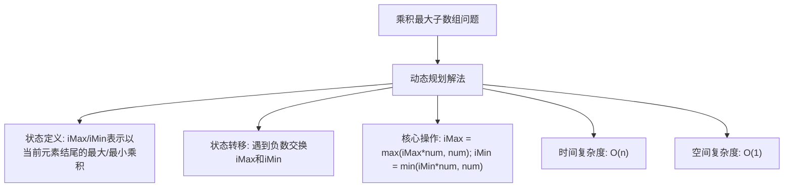

# LC152_乘积最大子数组解法分析
## 题目描述
给你一个整数数组 `nums`，请你找出数组中乘积最大的非空连续子数组（该子数组中至少包含一个数字），并返回该子数组所对应的乘积。
**说明：**
- 子数组是数组的连续子序列。
**示例：**
- 输入：`nums = [2,3,-2,4]`
- 输出：`6`
- 解释：子数组 `[2,3]` 有最大乘积 6。
## 解法概览

## 记忆口诀
**动态规划解法**：维护最大和最小，遇到负数就交换，当前乘积取最大。
## 解法一：动态规划
### 思路
1. **问题分析**：由于存在负数，乘积可能从最大值变为最小值，因此需要同时维护当前位置的最大值和最小值。
2. **状态定义**：
   - `iMax`：表示以当前元素结尾的最大乘积。
   - `iMin`：表示以当前元素结尾的最小乘积。
3. **状态转移**：
   - 当遇到负数时，交换 `iMax` 和 `iMin`，因为负数会反转大小关系。
   - 更新 `iMax` 为 `max(iMax * num, num)`（选择当前元素或与之前的最大乘积相乘）。
   - 更新 `iMin` 为 `min(iMin * num, num)`（选择当前元素或与之前的最小乘积相乘）。
4. **最终结果**：遍历过程中记录最大的 `iMax`。
### 核心公式
- 遇到负数：交换 `iMax` 和 `iMin`
- `iMax = max(iMax * num, num)`
- `iMin = min(iMin * num, num)`
- `max = max(max, iMax)`
### 图解过程
以 `nums = [2,3,-2,4]` 为例：
1. 初始化：`max = -∞`, `iMax = 1`, `iMin = 1`
2. 处理 `num=2`：
   - 非负数，不交换
   - `iMax = max(1*2, 2) = 2`
   - `iMin = min(1*2, 2) = 2`
   - `max = max(-∞, 2) = 2`
3. 处理 `num=3`：
   - 非负数，不交换
   - `iMax = max(2*3, 3) = 6`
   - `iMin = min(2*3, 3) = 3`
   - `max = max(2, 6) = 6`
4. 处理 `num=-2`：
   - 负数，交换 `iMax` 和 `iMin` → `iMax=3`, `iMin=6`
   - `iMax = max(3*(-2), -2) = -2`
   - `iMin = min(6*(-2), -2) = -12`
   - `max = max(6, -2) = 6`
5. 处理 `num=4`：
   - 非负数，不交换
   - `iMax = max(-2*4, 4) = 4`
   - `iMin = min(-12*4, 4) = -48`
   - `max = max(6, 4) = 6`
6. 最终结果：`6`
### 代码示例
```java
public int maxProduct(int[] nums) {
    int max = Integer.MIN_VALUE;
    // 由于存在负数,导致子数组乘积从最大变成最小
    // 所以每一位数组元素都需要存当前位置的最大乘积、最小乘积
    // iMax:表示0到i的最大乘积
    int iMax = 1;
    // iMin:表示0到i的最小乘积
    int iMin = 1;
    for (int num : nums) {
        // 遇到负数，交换iMax、iMin
        if (num < 0) {
            int temp = iMax;
            iMax = iMin;
            iMin = temp;
        }

        iMax = Math.max(iMax * num, num);
        iMin = Math.min(iMin * num, num);

        max = Math.max(max, iMax);
    }
    return max;
}
```
### 复杂度分析
- **时间复杂度**：O(n)，其中 n 是数组的长度。只需要遍历数组一次。
- **空间复杂度**：O(1)，只需要常数级别的额外空间。
### 优缺点
- **优点**：时间复杂度低，空间复杂度低，实现简单。
- **缺点**：需要理解为什么要同时维护最大值和最小值，以及遇到负数时的交换逻辑。
## 面试回答模板
**问题**：如何解决乘积最大子数组问题？
**回答**：
我会使用动态规划的方法来解决这个问题。
首先，分析问题的特点：由于存在负数，乘积可能从最大值变为最小值，因此需要同时维护当前位置的最大值和最小值。
然后，定义状态：`iMax` 表示以当前元素结尾的最大乘积，`iMin` 表示以当前元素结尾的最小乘积。
接下来，状态转移：
- 当遇到负数时，交换 `iMax` 和 `iMin`，因为负数会反转大小关系。
- 更新 `iMax` 为 `max(iMax * num, num)`，选择当前元素或与之前的最大乘积相乘。
- 更新 `iMin` 为 `min(iMin * num, num)`，选择当前元素或与之前的最小乘积相乘。
- 遍历过程中记录最大的 `iMax`。
这种方法的时间复杂度是 O(n)，空间复杂度是 O(1)，非常高效。
## 相关题目
1. **LC53_最大子数组和**：求数组中最大的连续子数组和，类似的动态规划思想。
2. **LC918_环形子数组的最大和**：考虑环形结构的最大子数组和。
3. **LC121_买卖股票的最佳时机**：单交易股票问题，也是动态规划的应用。
4. **LC122_买卖股票的最佳时机 II**：多交易股票问题。
5. **LC123_买卖股票的最佳时机 III**：最多两笔交易的股票问题。
## 总结
乘积最大子数组问题是一个经典的动态规划问题，其特点是需要同时维护最大值和最小值，以处理负数的情况。通过巧妙的状态定义和转移逻辑，我们可以在 O(n) 的时间复杂度和 O(1) 的空间复杂度内解决这个问题。
这种方法不仅高效，而且思路清晰，是面试中的常见考点。通过掌握这个问题，我们可以更好地理解动态规划的应用场景，以及如何处理包含负数的优化问题。