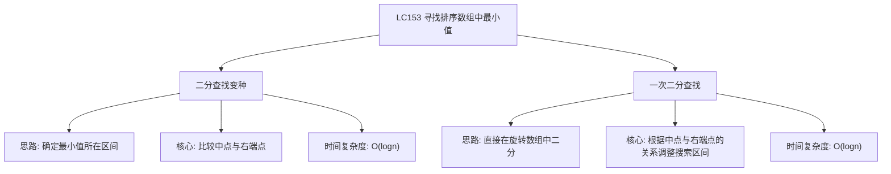

# 03-14-11-00 寻找排序数组中最小值解法分析
## 题目描述
已知一个长度为 n 的数组，预先按照升序排列，经由 1 到 n 次 旋转 后，得到输入数组。例如，原数组 nums = [0,1,2,4,5,6,7] 在变化后可能得到：
- 若旋转 4 次，则可以得到 [4,5,6,7,0,1,2]
- 若旋转 7 次，则可以得到 [0,1,2,4,5,6,7]
注意，数组 [a[0], a[1], a[2], ..., a[n-1]] 旋转一次 的结果为数组 [a[n-1], a[0], a[1], a[2], ..., a[n-2]] 。
请找出并返回数组中的最小元素。
**示例：**
输入：nums = [3,4,5,1,2]
输出：1
输入：nums = [4,5,6,7,0,1,2]
输出：0
输入：nums = [11,13,15,17]
输出：11
## 解法概览
### 思维导图

## 记忆口诀
**寻找旋转数组最小值：** 二分查找找最小值，中点与右比大小；小于右在左区间，大于右在右区间；等于右则右边界左移，循环结束左即为最小值。
## 不同解法
### 解法一：二分查找（最优解）
#### 思路
使用二分查找，通过比较中点与右端点的值，确定最小值所在的区间，逐步缩小搜索范围。
#### 核心公式
- 如果 nums[mid] < nums[right]：最小值在左侧（包括mid），right = mid
- 如果 nums[mid] > nums[right]：最小值在右侧（不包括mid），left = mid + 1
- 如果 nums[mid] == nums[right]：无法确定，缩小右边界，right--
#### 图解过程
以 nums = [4,5,6,7,0,1,2] 为例：
1. 初始：left=0, right=6, mid=3, nums[mid]=7 > nums[right]=2，最小值在右侧
2. left=4, right=6, mid=5, nums[mid]=1 < nums[right]=2，最小值在左侧
3. left=4, right=5, mid=4, nums[mid]=0 < nums[right]=1，最小值在左侧
4. left=4, right=4, mid=4, nums[mid]=0 == nums[right]=0，right--
5. 循环结束，返回 nums[left]=0
#### 代码示例
```java
public int findMin(int[] nums) {
    int left = 0;
    int right = nums.length - 1;
    while (left <= right) {
        int mid = left + (right - left) / 2;
        int target = nums[right];
        if (nums[mid] < target) {
            right = mid;
        } else if (nums[mid] > target) {
            left = mid + 1;
        } else {
            right--;
        }
    }
    return nums[left];
}
```
#### 复杂度分析
- 时间复杂度：O(log n)，每次二分查找将搜索区间缩小一半
- 空间复杂度：O(1)，只使用了常数个变量
#### 优缺点
- 优点：时间复杂度最优，代码逻辑清晰，一次二分查找即可完成
- 缺点：需要处理重复元素的情况，逻辑判断稍复杂
### 解法二：遍历查找（普通解法）
#### 思路
直接遍历整个数组，找到最小元素。
#### 核心公式
- 初始化最小值为数组第一个元素
- 遍历数组，更新最小值
- 返回最小值
#### 图解过程
以 nums = [4,5,6,7,0,1,2] 为例：
1. 初始化 min = 4
2. 比较 4 和 5，min 仍为 4
3. 比较 4 和 6，min 仍为 4
4. 比较 4 和 7，min 仍为 4
5. 比较 4 和 0，min 更新为 0
6. 比较 0 和 1，min 仍为 0
7. 比较 0 和 2，min 仍为 0
8. 返回 min = 0
#### 代码示例
```java
public int findMin(int[] nums) {
    if (nums == null || nums.length == 0) {
        return -1;
    }
    int min = nums[0];
    for (int i = 1; i < nums.length; i++) {
        if (nums[i] < min) {
            min = nums[i];
        }
    }
    return min;
}
```
#### 复杂度分析
- 时间复杂度：O(n)，需要遍历整个数组
- 空间复杂度：O(1)，只使用了常数个变量
#### 优缺点
- 优点：代码简单，逻辑清晰，不需要处理复杂的边界情况
- 缺点：时间复杂度较高，不满足题目要求的 O(log n) 时间复杂度
## 面试回答模板
**问题：** 请在旋转排序数组中寻找最小值。
**回答：**
这是一道经典的二分查找变种题。我主要使用二分查找的解法，时间复杂度为 O(log n)。
具体思路是：
1. 使用二分查找，通过比较中点与右端点的值，确定最小值所在的区间
2. 如果中点值小于右端点值，说明最小值在左侧（包括中点），将右边界移到中点
3. 如果中点值大于右端点值，说明最小值在右侧（不包括中点），将左边界移到中点+1
4. 如果中点值等于右端点值，无法确定最小值位置，将右边界左移一位
5. 重复上述过程，直到搜索区间缩小到一个元素，该元素即为最小值
**示例：** 对于 nums = [4,5,6,7,0,1,2]，经过二分查找，最终返回最小值 0。
这种方法的优势在于时间复杂度为 O(log n)，比线性遍历更高效，且代码逻辑清晰。
## 相关题目
1. **LC154：寻找旋转排序数组中的最小值 II** - 允许重复元素的情况
2. **LC33：搜索旋转排序数组** - 在旋转数组中搜索目标值
3. **LC81：搜索旋转排序数组 II** - 允许重复元素的搜索
4. **剑指Offer 11：旋转数组的最小数字** - 与本题相同
这些题目都涉及到旋转排序数组的处理，与LC153_寻找排序数组中最小值有一定的关联性。