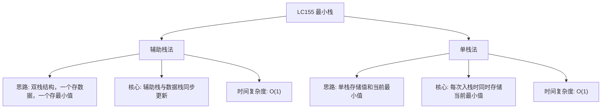

# 03-15-10-00 最小栈解法分析
## 题目描述
设计一个支持 push ，pop ，top 操作，并能在常数时间内检索到最小元素的栈。
实现 MinStack 类：
- MinStack() 初始化堆栈对象。
- void push(int val) 将元素 val 推入堆栈。
- void pop() 删除堆栈顶部的元素。
- int top() 获取堆栈顶部的元素。
- int getMin() 获取堆栈中的最小元素。
**示例：**
输入：
["MinStack","push","push","push","getMin","pop","top","getMin"]
[[],[-2],[0],[-3],[],[],[],[]]
输出：
[null,null,null,null,-3,null,0,-2]
解释：
MinStack minStack = new MinStack();
minStack.push(-2);
minStack.push(0);
minStack.push(-3);
minStack.getMin();   --> 返回 -3.
minStack.pop();
minStack.top();      --> 返回 0.
minStack.getMin();   --> 返回 -2.
## 解法概览
### 思维导图

## 记忆口诀
**最小栈实现：** 辅助栈与数据栈同步，每次入栈比较最小值；出栈时两栈同时出，getMin直接取栈顶。
## 不同解法
### 解法一：辅助栈法（最优解）
#### 思路
使用两个栈：一个数据栈存储所有元素，一个辅助栈存储对应时期的最小值。当压入新元素时，辅助栈也压入当前最小值；当弹出元素时，辅助栈也弹出栈顶元素。这样辅助栈的栈顶始终是当前栈中的最小值。
#### 核心公式
- push操作：
  - 数据栈：push(val)
  - 辅助栈：push(min(当前辅助栈顶, val))
- pop操作：
  - 数据栈：pop()
  - 辅助栈：pop()
- getMin操作：
  - 返回辅助栈顶元素
#### 图解过程
以示例操作为例：
1. push(-2)：
   - 数据栈：[-2]
   - 辅助栈：[-2]
   - 最小值：-2
2. push(0)：
   - 数据栈：[-2, 0]
   - 辅助栈：[-2, -2]（0 > -2，所以压入-2）
   - 最小值：-2
3. push(-3)：
   - 数据栈：[-2, 0, -3]
   - 辅助栈：[-2, -2, -3]（-3 < -2，所以压入-3）
   - 最小值：-3
4. getMin()：返回辅助栈顶 -3
5. pop()：
   - 数据栈：[-2, 0]
   - 辅助栈：[-2, -2]
   - 最小值：-2
6. top()：返回数据栈顶 0
7. getMin()：返回辅助栈顶 -2
#### 代码示例
```java
import java.util.Stack;

class MinStack {
    // 数据栈，存储所有元素
    private Stack<Integer> dataStack;
    // 辅助栈，存储对应时期的最小值
    private Stack<Integer> minStack;

    public MinStack() {
        dataStack = new Stack<>();
        minStack = new Stack<>();
    }

    public void push(int val) {
        dataStack.push(val);
        // 辅助栈为空或当前值小于等于辅助栈顶，压入当前值
        if (minStack.isEmpty() || val <= minStack.peek()) {
            minStack.push(val);
        } else {
            // 否则压入当前辅助栈顶（保持与数据栈大小一致）
            minStack.push(minStack.peek());
        }
    }

    public void pop() {
        // 两栈同时弹出
        dataStack.pop();
        minStack.pop();
    }

    public int top() {
        return dataStack.peek();
    }

    public int getMin() {
        return minStack.peek();
    }
}
```
#### 复杂度分析
- 时间复杂度：O(1)，所有操作都是常数时间
- 空间复杂度：O(n)，需要额外的辅助栈空间
#### 优缺点
- 优点：逻辑清晰，易于理解和实现
- 缺点：需要额外的栈空间
### 解法二：单栈法（普通解法）
#### 思路
使用单个栈，每次入栈时存储一个元组（当前值，当前最小值）。这样每个栈元素都包含了截至该元素时的最小值信息。
#### 核心公式
- push操作：
  - 计算当前最小值 = min(栈顶最小值, val)
  - 栈中存储 (val, 当前最小值)
- pop操作：
  - 直接弹出栈顶元素
- getMin操作：
  - 返回栈顶元素的最小值部分
#### 图解过程
以示例操作为例：
1. push(-2)：
   - 栈：[(-2, -2)]
   - 最小值：-2
2. push(0)：
   - 栈：[(-2, -2), (0, -2)]
   - 最小值：-2
3. push(-3)：
   - 栈：[(-2, -2), (0, -2), (-3, -3)]
   - 最小值：-3
4. getMin()：返回栈顶最小值 -3
5. pop()：
   - 栈：[(-2, -2), (0, -2)]
   - 最小值：-2
6. top()：返回栈顶值 0
7. getMin()：返回栈顶最小值 -2
#### 代码示例
```java
import java.util.Stack;

class MinStack {
    // 单栈，每个元素存储为数组 [值, 当前最小值]
    private Stack<int[]> stack;

    public MinStack() {
        stack = new Stack<>();
    }

    public void push(int val) {
        if (stack.isEmpty()) {
            // 栈为空，当前最小值就是val
            stack.push(new int[]{val, val});
        } else {
            // 计算当前最小值
            int currentMin = Math.min(stack.peek()[1], val);
            stack.push(new int[]{val, currentMin});
        }
    }

    public void pop() {
        stack.pop();
    }

    public int top() {
        return stack.peek()[0];
    }

    public int getMin() {
        return stack.peek()[1];
    }
}
```
#### 复杂度分析
- 时间复杂度：O(1)，所有操作都是常数时间
- 空间复杂度：O(n)，栈中每个元素存储两个值
#### 优缺点
- 优点：只使用一个栈，逻辑紧凑
- 缺点：每个栈元素存储两个值，空间使用 slightly 增加
## 面试回答模板
**问题：** 请设计一个支持 push、pop、top 操作，并能在常数时间内检索到最小元素的栈。
**回答：**
这是一道经典的数据结构设计题。我主要使用辅助栈的解法，时间复杂度为 O(1)。
具体思路是：
1. 使用两个栈，一个数据栈存储所有元素，一个辅助栈存储对应时期的最小值
2. 当压入新元素时，辅助栈也压入当前最小值（如果新元素小于等于辅助栈顶，则压入新元素，否则压入原辅助栈顶）
3. 当弹出元素时，两个栈同时弹出
4. getMin操作直接返回辅助栈的栈顶元素
**示例：** 对于操作序列 push(-2), push(0), push(-3), getMin(), pop(), top(), getMin()，辅助栈会依次存储 [-2, -2, -3]，每次 getMin() 都能直接返回辅助栈顶元素。
这种方法的优势在于逻辑清晰，所有操作都是常数时间，是实现最小栈的标准解法。
## 相关题目
1. **LC239：滑动窗口最大值** - 单调队列的应用
2. **LC32：最长有效括号** - 栈的应用
3. **LC84：柱状图中最大的矩形** - 单调栈的应用
4. **LC42：接雨水** - 单调栈的应用
这些题目都涉及到栈的高级应用，与LC155_最小栈有一定的关联性。