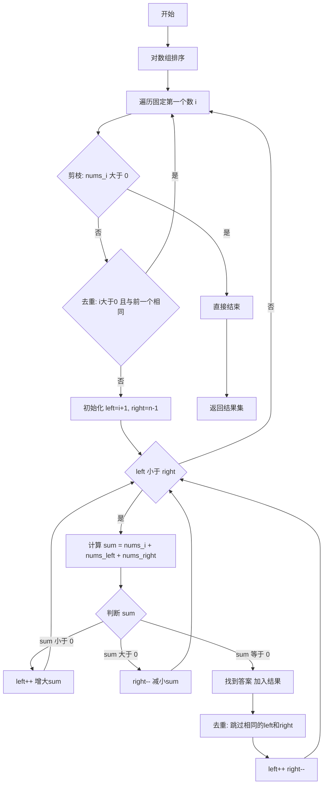

# LC15 三数之和 解法分析
## 题目描述
给你一个整数数组 `nums`，判断是否存在三元组 `[nums[i], nums[j], nums[k]]` 满足 `i != j`、`i != k` 且 `j != k`，同时还满足 `nums[i] + nums[j] + nums[k] == 0`。请你返回所有和为 0 且不重复的三元组。
**示例：**
- 输入：`nums = [-1, 0, 1, 2, -1, -4]`
- 输出：`[[-1, -1, 2], [-1, 0, 1]]`
---
## 解法总览
| 解法 | 时间复杂度 | 空间复杂度 | 是否推荐面试使用 |
|------|-----------|-----------|----------------|
| 暴力三重循环 | O(n³) | O(1) | ❌ 不推荐 |
| 哈希表法 | O(n²) | O(n) | ⚠️ 一般 |
| **排序+双指针** | O(n²) | O(1) | ✅ **最优解** |
---
## 解法一：暴力枚举（不推荐）
### 思路
三重循环枚举所有可能的三元组，判断和是否为0。
### 代码示例
```java
public List<List<Integer>> threeSum(int[] nums) {
    Set<List<Integer>> res = new HashSet<>();
    int n = nums.length;
    for (int i = 0; i < n - 2; i++) {
        for (int j = i + 1; j < n - 1; j++) {
            for (int k = j + 1; k < n; k++) {
                if (nums[i] + nums[j] + nums[k] == 0) {
                    List<Integer> list = Arrays.asList(nums[i], nums[j], nums[k]);
                    Collections.sort(list);
                    res.add(list);
                }
            }
        }
    }
    return new ArrayList<>(res);
}
```
### 复杂度分析
- 时间复杂度：O(n³)，三重循环
- 空间复杂度：O(n)，用于去重的 Set
### 缺点
- 效率太低，大数据量会超时
- 去重逻辑复杂，需要借助 Set
---
## 解法二：哈希表法（一般）
### 思路
固定第一个数，将问题转化为两数之和。使用哈希表存储已遍历的数，快速查找第三个数。
### 代码示例
```java
public List<List<Integer>> threeSum(int[] nums) {
    Set<List<Integer>> res = new HashSet<>();
    Arrays.sort(nums);
    int n = nums.length;
    for (int i = 0; i < n - 2; i++) {
        Set<Integer> seen = new HashSet<>();
        for (int j = i + 1; j < n; j++) {
            int target = -nums[i] - nums[j];
            if (seen.contains(target)) {
                res.add(Arrays.asList(nums[i], target, nums[j]));
            }
            seen.add(nums[j]);
        }
    }
    return new ArrayList<>(res);
}
```
### 复杂度分析
- 时间复杂度：O(n²)
- 空间复杂度：O(n)，哈希表空间
### 缺点
- 去重仍需借助 Set，逻辑不够优雅
- 空间复杂度较高
---
## 解法三：排序 + 双指针（最优解 ✅）
### 核心思想：问题转化
三数之和的本质是：**固定一个数，问题就变成了"两数之和"**
```
a + b + c = 0
↓ 固定 a
b + c = -a
```
所以算法思路是：遍历每个 `a`，在剩余数组中找两个数 `b + c = -a`
### 为什么要排序？
排序是这道题的**关键前置操作**，有三个作用：
| 作用 | 说明 |
|-----|------|
| **1. 让双指针可行** | 排序后数组有序，才能用"左右夹逼"的方式找两数之和 |
| **2. 便于去重** | 相同的数排在一起，只需比较相邻元素就能跳过重复 |
| **3. 便于剪枝** | 排序后最小的数大于0，说明不可能有解，直接结束 |
### 双指针为什么有效？
假设排序后数组为：`[-4, -1, -1, 0, 1, 2]`
固定 `i = 1`（即 `nums[i] = -1`），要找 `b + c = 1`
```
数组：[-4, -1, -1, 0, 1, 2]
              i  L        R
           固定  左指针   右指针
```
**双指针的移动逻辑**：
```
sum = nums[L] + nums[R]
如果 sum 小于 目标值：说明太小了，需要更大的数 → L 右移
如果 sum 大于 目标值：说明太大了，需要更小的数 → R 左移
如果 sum 等于 目标值：找到答案！
```
**为什么这样移动是正确的？**
因为数组是**有序的**：
- `L` 右移 → `nums[L]` 变大 → `sum` 变大
- `R` 左移 → `nums[R]` 变小 → `sum` 变小
这就像一个"天平"，可以精确调节 sum 的大小。
### 图解完整过程
以 `nums = [-1, 0, 1, 2, -1, -4]` 为例：
**Step 1：排序**
```
原数组：[-1, 0, 1, 2, -1, -4]
排序后：[-4, -1, -1, 0, 1, 2]
         0   1   2  3  4  5
```
**Step 2：固定 i=0，nums[i]=-4，找两数之和=4**
```
[-4, -1, -1, 0, 1, 2]
  i   L            R
sum = -1 + 2 = 1 小于 4  → L++
sum = -1 + 2 = 1 小于 4  → L++
sum = 0 + 2 = 2 小于 4   → L++
sum = 1 + 2 = 3 小于 4   → L++
L 大于等于 R，结束，无解
```
**Step 3：固定 i=1，nums[i]=-1，找两数之和=1**
```
[-4, -1, -1, 0, 1, 2]
      i   L        R
sum = -1 + 2 = 1 等于 1  → 找到！记录 [-1, -1, 2]
去重后 L++, R--
sum = 0 + 1 = 1 等于 1   → 找到！记录 [-1, 0, 1]
L++, R--
L 大于等于 R，结束
```
**Step 4：固定 i=2，nums[i]=-1，但与 i=1 相同，跳过（去重）**
**Step 5：固定 i=3，nums[i]=0，继续双指针查找，无解**
**Step 6：固定 i=4，nums[i]=1 大于 0，剪枝，直接结束**
**最终结果**：`[[-1, -1, 2], [-1, 0, 1]]`
### 去重的两个位置
**1. 外层去重（固定的 i）**
```java
if (i > 0 && nums[i] == nums[i - 1]) {
    continue;  // 跳过相同的第一个数
}
```
为什么？比如 `[-1, -1, 0, 1]`：
- `i=0` 时，固定 `-1`，找到了 `[-1, 0, 1]`
- `i=1` 时，又固定 `-1`，会重复找到 `[-1, 0, 1]`
- 所以要跳过
**2. 内层去重（找到答案后）**
```java
// 找到答案后
while (left < right && nums[left] == nums[left + 1]) left++;
while (left < right && nums[right] == nums[right - 1]) right--;
left++;
right--;
```
为什么？比如 `[-2, 0, 0, 2, 2]`：
- 找到 `[-2, 0, 2]` 后
- 如果不去重，下次还会找到 `[-2, 0, 2]`（用的是另一个0或另一个2）
- 所以要跳过相同的值
### 记忆口诀
```
三数之和怎么做？
一排二定三指针
一排：先把数组排个序
二定：外层循环固定第一个数
三指针：剩余区间用双指针找两数之和
去重要记牢：
外层跳过相同 i
内层跳过相同 left 和 right
剪枝要记牢：
nums[i] 大于 0 直接 break
```
### 算法流程图

### 代码示例
```java
public List<List<Integer>> threeSum(int[] nums) {
    if (nums == null || nums.length < 3) {
        return new ArrayList<>();
    }
    List<List<Integer>> res = new ArrayList<>();
    // 1.排序
    Arrays.sort(nums);
    int n = nums.length;
    for (int i = 0; i < n - 2; i++) {
        // 2.剪枝：最小值大于0，不可能有解
        if (nums[i] > 0) {
            break;
        }
        // 3.去重：跳过重复的第一个数
        if (i > 0 && nums[i] == nums[i - 1]) {
            continue;
        }
        // 4.双指针
        int left = i + 1;
        int right = n - 1;
        while (left < right) {
            int sum = nums[i] + nums[left] + nums[right];
            if (sum < 0) {
                left++;
            } else if (sum > 0) {
                right--;
            } else {
                // 5.找到答案
                res.add(Arrays.asList(nums[i], nums[left], nums[right]));
                // 6.跳过重复值
                while (left < right && nums[left] == nums[left + 1]) {
                    left++;
                }
                while (left < right && nums[right] == nums[right - 1]) {
                    right--;
                }
                left++;
                right--;
            }
        }
    }
    return res;
}
```
### 复杂度分析
- 时间复杂度：O(n²)，排序 O(nlogn) + 双指针遍历 O(n²)
- 空间复杂度：O(1)，不考虑结果集的额外空间
### 关键点解析
| 关键点 | 说明 |
|-------|------|
| 排序的作用 | 1. 使双指针策略可行 2. 便于去重 3. 便于剪枝 |
| nums[i] > 0 剪枝 | 排序后若最小值>0，三数之和必>0，无解 |
| 外层去重 | `i > 0 && nums[i] == nums[i-1]` 跳过重复的第一个数 |
| 内层去重 | 找到解后，跳过相同的 left 和 right 值 |
| 双指针移动 | sum<0 说明太小，left右移；sum>0 说明太大，right左移 |
---
## 面试要点总结
### 1. 推荐解法
**排序 + 双指针**是面试首选，原因：
- 时间复杂度最优 O(n²)
- 空间复杂度 O(1)
- 代码简洁，逻辑清晰
- 体现排序、双指针、去重等多种技巧
### 2. 常见追问
| 问题 | 回答要点 |
|-----|---------|
| 为什么要排序？ | 1.双指针需要有序性 2.方便去重 3.方便剪枝 |
| 如何去重？ | 外层：跳过相同的 i；内层：找到解后跳过相同的 left/right |
| 时间复杂度怎么算？ | 排序 O(nlogn) + 外层O(n) × 内层O(n) = O(n²) |
| 能否优化到 O(nlogn)？ | 不能，因为结果数量最坏可达 O(n²) 级别 |
### 3. 相关题目
- LC1 两数之和
- LC16 最接近的三数之和
- LC18 四数之和
- LC167 两数之和 II（有序数组）
---
## 总结
三数之和是经典的双指针应用题，核心思想是**排序 + 固定一个数 + 双指针找另外两个数**。面试时重点掌握：
1. 排序的必要性
2. 双指针的移动逻辑
3. 去重的处理方式
4. 剪枝优化
