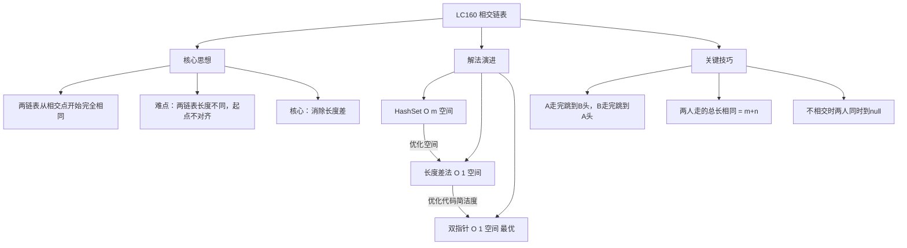
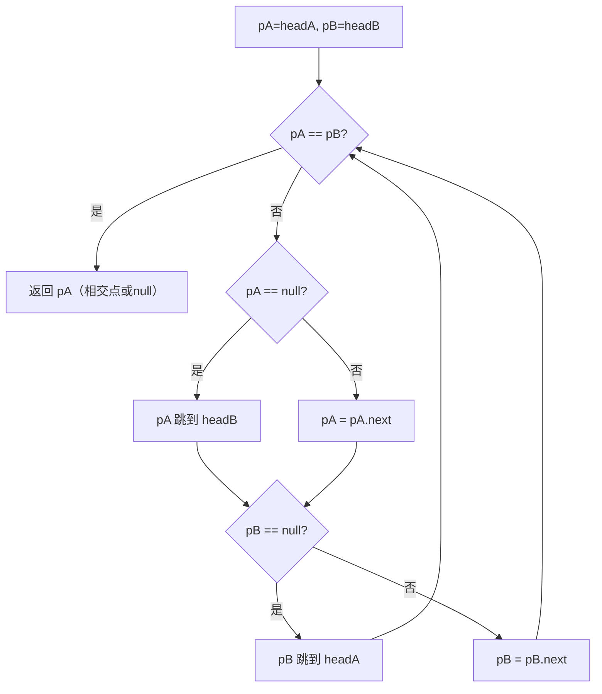

# LC160 相交链表
## 一、题目描述
给你两个单链表的头节点 `headA` 和 `headB`，请你找出并返回两个单链表相交的起始节点。如果两个链表不存在相交节点，返回 `null`。
**示例：**
```
链表A:     1 → 2 → 3
                     ↘
                      8 → 4 → 5
                     ↗
链表B: 6 → 7 → 9
相交节点 = 8
A长度=5（1,2,3,8,4,5）  B长度=5（6,7,9,8,4,5）
```
**注意：**
- 相交是指**节点引用相同**（不是值相同）
- 从相交点开始，后面的节点完全相同（因为是单链表，只有一个 next）
- 不能修改链表结构
**约束：**
- 链表长度范围 [1, 3×10^4]
- 如果不相交，返回 null
---
## 二、解法概览
### 解法对比表
| 解法 | 时间复杂度 | 空间复杂度 | 面试推荐 |
|------|-----------|-----------|---------|
| HashSet | O(m+n) | O(m) | ✅ 普通解法 |
| 长度差法 | O(m+n) | O(1) | ✅ 推荐 |
| **双指针浪漫解法** | O(m+n) | O(1) | ✅ **最优解** |
### 思维导图

---
## 三、记忆口诀
```
相交链表双指针，你走我路我走你路
A走完去B头，B走完去A头
路程都是m加n，终会在交点相遇
不相交就同到null，浪漫又高效
```
---
## 四、解法一：HashSet
### 思路
先遍历链表 A，把所有节点存入 HashSet。再遍历链表 B，第一个在 set 中出现的节点就是相交点。
### 核心公式
```
遍历A → 存入set
遍历B → 第一个 set.contains(node) 的就是答案
```
### 图解过程
```
A: 1 → 2 → 3 → 8 → 4 → 5
B: 6 → 7 → 9 → 8 → 4 → 5
第1步：遍历A，set = {1, 2, 3, 8, 4, 5}
第2步：遍历B
  6 在set中？❌
  7 在set中？❌
  9 在set中？❌
  8 在set中？✅ → 找到相交点 8
```
### 代码示例
```java
public ListNode getIntersectionNode(ListNode headA, ListNode headB) {
    Set<ListNode> set = new HashSet<>();
    ListNode cur = headA;
    while (cur != null) {
        set.add(cur);
        cur = cur.next;
    }
    cur = headB;
    while (cur != null) {
        if (set.contains(cur)) {
            return cur;
        }
        cur = cur.next;
    }
    return null;
}
```
### 复杂度分析
- 时间复杂度：**O(m+n)**，各遍历一次
- 空间复杂度：**O(m)**，存储链表 A 的所有节点
### 优缺点
| 优点 | 缺点 |
|-----|------|
| 思路直观 | 需要 O(m) 额外空间 |
| 代码简单 | 不够优雅 |
---
## 五、解法二：长度差法
### 思路
1. 分别计算两个链表的长度
2. 让长的链表先走 |长度差| 步
3. 然后两个指针同时走，第一个相同的节点就是相交点
### 核心公式
```
lenA - lenB = diff
长链表先走 |diff| 步 → 两链表剩余长度相同
然后同步前进，第一个 cur1 == cur2 的就是答案
```
### 图解过程
```
A: 1 → 2 → 3 → 8 → 4 → 5     长度=6
B: 6 → 7 → 8 → 4 → 5         长度=5
长度差 = 6-5 = 1
━━━━━━━━━━━━━━━━━━━━━━━━━━━━
第1步：A 比 B 长1，A先走1步
  cur1 → 2(→3→8→4→5)   剩余5个
  cur2 → 6(→7→8→4→5)   剩余5个
  现在对齐了！
━━━━━━━━━━━━━━━━━━━━━━━━━━━━
第2步：同步前进
  cur1=2, cur2=6 → 不同，继续
  cur1=3, cur2=7 → 不同，继续
  cur1=8, cur2=8 → 相同！找到了 ✅
```
### 代码示例
```java
public ListNode getIntersectionNode(ListNode headA, ListNode headB) {
    int lenA = 0, lenB = 0;
    ListNode curA = headA, curB = headB;
    // 计算长度
    while (curA != null) { lenA++; curA = curA.next; }
    while (curB != null) { lenB++; curB = curB.next; }
    // 让长的先走
    curA = headA;
    curB = headB;
    if (lenA > lenB) {
        for (int i = 0; i < lenA - lenB; i++) curA = curA.next;
    } else {
        for (int i = 0; i < lenB - lenA; i++) curB = curB.next;
    }
    // 同步前进
    while (curA != curB) {
        curA = curA.next;
        curB = curB.next;
    }
    return curA; // 相交返回节点，不相交返回null
}
```
### 复杂度分析
- 时间复杂度：**O(m+n)**，各遍历两次
- 空间复杂度：**O(1)**
### 优缺点
| 优点 | 缺点 |
|-----|------|
| 空间 O(1) | 代码较长 |
| 思路清晰 | 需要先遍历算长度 |
---
## 六、解法三：双指针浪漫解法（最优解 ✅）
### 思路
两个指针分别从 A 和 B 出发：
- **pA 走完 A 后，跳到 B 的头部继续走**
- **pB 走完 B 后，跳到 A 的头部继续走**
这样两个指针走的总距离都是 **m + n**，一定会在相交点相遇！
### 核心公式
```
pA 走的路：A链表 + B链表前半段 = m + (n - c) 的时候到达交点
pB 走的路：B链表 + A链表前半段 = n + (m - c) 的时候到达交点
两者都走了 m + n - c 步 → 同时到达交点！
（c 是公共部分长度）
```
### 为什么一定同时到达？
```
A链表：a1 → a2 → [c1 → c2 → c3]     独有部分长a，公共部分长c
B链表：b1 → [c1 → c2 → c3]          独有部分长b，公共部分长c
pA 走的路：(a + c) + b = a + b + c
pB 走的路：(b + c) + a = a + b + c
总距离相同！所以在交点处一定相遇
```
### 不相交的情况呢？
```
A: 1 → 2 → 3          长度m=3
B: 4 → 5 → 6 → 7      长度n=4
pA: 1→2→3→null → 4→5→6→7→null   走了 m+n+1 步到null
pB: 4→5→6→7→null → 1→2→3→null   走了 n+m+1 步到null
两人同时到达 null → pA == pB == null → 返回 null ✅
```
### 图解过程
```
A: a1 → a2 → 8 → 4 → 5     (a独有2个，公共3个，总长m=5)
B: b1 → b2 → b3 → 8 → 4 → 5  (b独有3个，公共3个，总长n=6)
━━━━━━━━━━━━━━━━━━━━━━━━━━━━━━━━━━
pA 的路径：A(5步) + B前半段(3步) = 8步到交点
  a1 → a2 → 8 → 4 → 5 → null → b1 → b2 → b3 → [8]
  -------- A链表 --------         -- B独有 --     交点
━━━━━━━━━━━━━━━━━━━━━━━━━━━━━━━━━━
pB 的路径：B(6步) + A前半段(2步) = 8步到交点
  b1 → b2 → b3 → 8 → 4 → 5 → null → a1 → a2 → [8]
  ----------- B链表 -----------         A独有     交点
━━━━━━━━━━━━━━━━━━━━━━━━━━━━━━━━━━
第8步两人同时到达节点8，相遇！ ✅
```
### 算法流程图

### 代码示例
```java
public ListNode getIntersectionNode(ListNode headA, ListNode headB) {
    ListNode pA = headA, pB = headB;
    // 两指针同时走，走完自己的就跳到对方的头
    while (pA != pB) {
        pA = (pA == null) ? headB : pA.next;
        pB = (pB == null) ? headA : pB.next;
    }
    // 相交：pA == pB == 交点
    // 不相交：pA == pB == null
    return pA;
}
```
### 代码只有4行，怎么理解？
```java
while (pA != pB) {                    // 没相遇就继续走
    pA = (pA == null) ? headB : pA.next;  // A走完跳到B头
    pB = (pB == null) ? headA : pB.next;  // B走完跳到A头
}
return pA;  // 相遇点（相交）或 null（不相交）
```
```
核心逻辑就一句话：走完自己的路，再走对方的路
pA 到了null（A走完了）→ 跳到 headB 继续
pA 没到null → 正常走 pA.next
pB 同理
```
### 复杂度分析
- 时间复杂度：**O(m+n)**，每个指针最多走 m+n 步
- 空间复杂度：**O(1)**，只用两个指针
### 优缺点
| 优点 | 缺点 |
|-----|------|
| 代码极简（4行） | 需要理解"交换链表"的原理 |
| 空间 O(1) | 第一次看不太直观 |
| 面试加分，优雅 | 无 |
### 关键点总结
| 关键点 | 说明 |
|-------|------|
| 为什么交换链表？ | 消除长度差，两人总路程都是 m+n |
| 不相交怎么办？ | 两人同时到达 null，自然退出循环 |
| 为什么判断 `pA==null` 而不是 `pA.next==null`？ | 要先走到 null 再跳转，否则会跳过最后一个节点的比较 |
| 会不会死循环？ | 不会，最多走 m+n+1 步一定结束 |
---
## 七、面试回答模板
### 1. 开场：理解题意
> 这道题要找两个链表的第一个公共节点，难点在于两个链表长度不同，起点不对齐。
### 2. 思路：双指针
> 两个指针分别从 A 和 B 出发，走完自己的链表后跳到对方的头继续走。这样两人总路程都是 m+n，一定会在交点同时相遇。
### 3. 不相交的情况
> 如果不相交，两人最终同时到达 null，返回 null。
### 4. 代码
> 核心就4行：while 循环中，到 null 就跳到对方头，否则走 next。退出循环时就是答案。
### 5. 复杂度
> 时间 O(m+n)，空间 O(1)。
---
## 八、相关题目
| 题号 | 题目 | 关系 | 难度 |
|-----|------|------|-----|
| LC141 | 环形链表 | 快慢指针判断有环 | 简单 |
| LC142 | 环形链表II | 快慢指针找入环点 | 中等 |
| LC21 | 合并两个有序链表 | 链表双指针 | 简单 |
| LC206 | 反转链表 | 链表基础操作 | 简单 |
| LC剑指52 | 两个链表的第一个公共节点 | 同题 | 简单 |