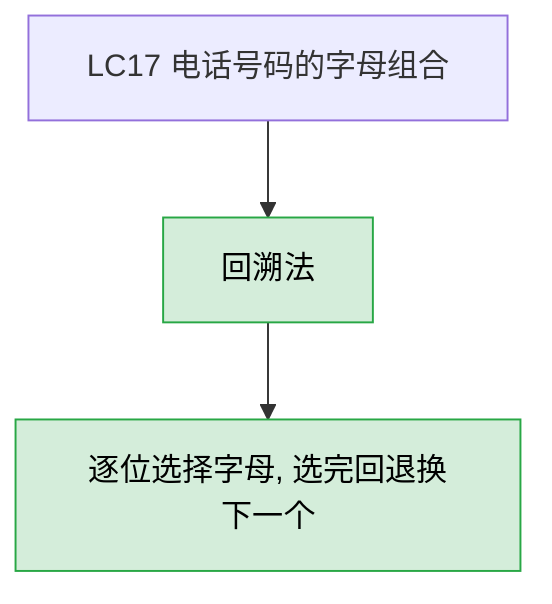
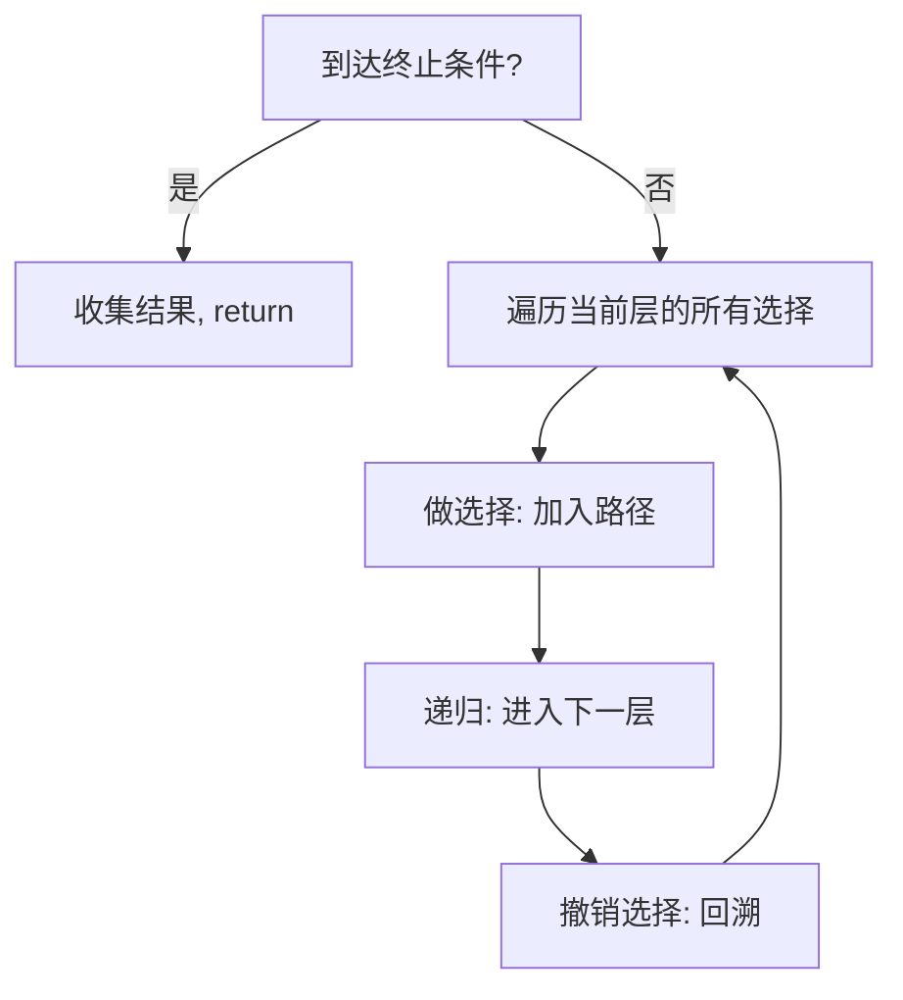
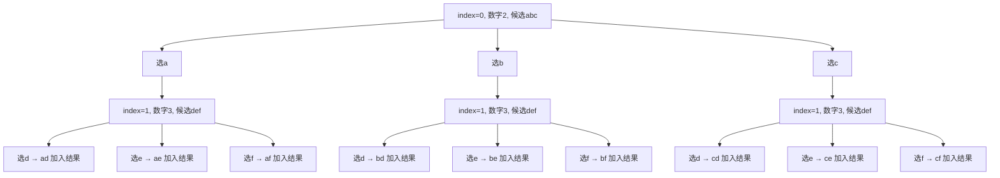
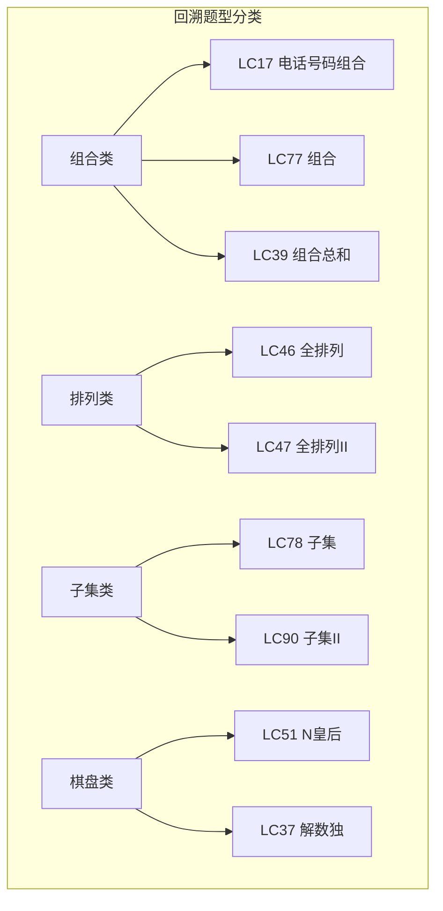

# LC17 电话号码的字母组合
## 一、题目描述
给定一个仅包含数字 2-9 的字符串，返回所有它能表示的**字母组合**。数字到字母的映射与电话按键相同（2=abc, 3=def, ..., 9=wxyz）。答案可以按任意顺序返回。
**示例：** 输入 `digits = "23"`，输出 `["ad","ae","af","bd","be","bf","cd","ce","cf"]`
**约束：** 0 <= digits.length <= 4，digits[i] 是 ['2', '9'] 范围内的一个数字
## 二、解法概览

| 解法 | 时间复杂度 | 空间复杂度 | 难度 | 面试推荐 |
|------|-----------|-----------|------|---------|
| 回溯法 | O(3^m * 4^n) | O(m+n) | ⭐⭐ | 面试首选/唯一解法 |
m 是对应 3 个字母的数字个数，n 是对应 4 个字母的数字个数（7和9）
## 三、记忆口诀
> **数字查字母，逐位选一个，选完加结果，回退换下个。**
这是最经典的回溯入门题，核心就是：**每一位数字对应几个字母候选，逐位选择，选完一轮就加入结果，回退后换下一个候选。**
## 四、前置知识：回溯法模板

```java
void backtrack(路径, 选择列表) {
    if (满足结束条件) {
        收集结果;
        return;
    }
    for (选择 : 当前选择列表) {
        做选择;
        backtrack(路径, 下一层选择列表);
        撤销选择;
    }
}
```
## 五、解法：回溯法
### 5.1 思路
1. 建立数字→字母的映射表
2. 从第一个数字开始，取出它对应的字母列表
3. 对每个字母，加入路径（StringBuilder），递归处理下一个数字
4. 递归返回后，删除刚才加的字母（回溯），换下一个字母尝试
5. 当处理完所有数字（index == digits.length），把路径加入结果
### 5.2 核心公式
```
backtrack(index):
  index == digits.length → 收集结果
  否则 → 取 digits[index] 对应的字母列表
       → for 每个字母: 加入sb → 递归(index+1) → 删除sb末尾（回溯）
```
### 5.3 图解过程
以 `digits = "23"` 为例（2=abc, 3=def）：

**逐步执行：**
| 步骤 | index | sb | 操作 |
|------|-------|-----|------|
| 1 | 0 | "" | 数字2→abc，选a |
| 2 | 1 | "a" | 数字3→def，选d |
| 3 | 2 | "ad" | index==length，加入结果 |
| 4 | - | "a" | 回溯删d，选e |
| 5 | 2 | "ae" | 加入结果 |
| 6 | - | "a" | 回溯删e，选f |
| 7 | 2 | "af" | 加入结果 |
| 8 | - | "" | 回溯删a，选b |
| 9 | 1 | "b" | 数字3→def，选d... |
### 5.4 代码示例
```java
public List<String> letterCombinations(String digits) {
    if (digits == null || digits.isEmpty()) return new ArrayList<>();
    Map<Character, String> map = new HashMap<>();
    map.put('2', "abc");
    map.put('3', "def");
    map.put('4', "ghi");
    map.put('5', "jkl");
    map.put('6', "mno");
    map.put('7', "pqrs");
    map.put('8', "tuv");
    map.put('9', "wxyz");
    List<String> res = new ArrayList<>();
    dfs(map, digits, 0, new StringBuilder(), res);
    return res;
}
private void dfs(Map<Character, String> map, String digits,
                 int index, StringBuilder sb, List<String> res) {
    if (index == digits.length()) {
        res.add(sb.toString());
        return;
    }
    String letters = map.get(digits.charAt(index));
    for (int i = 0; i < letters.length(); i++) {
        sb.append(letters.charAt(i));           // 做选择
        dfs(map, digits, index + 1, sb, res);   // 递归下一层
        sb.deleteCharAt(sb.length() - 1);       // 撤销选择（回溯）
    }
}
```
### 5.5 回溯删除：`sb.deleteCharAt(index)` 还是 `sb.deleteCharAt(sb.length()-1)`？
你的两版代码用了不同写法：
| 写法 | 含义 | 是否正确 |
|------|------|---------|
| `sb.deleteCharAt(index)` | 删除第 index 位 | 正确（因为 sb 长度恰好是 index+1） |
| `sb.deleteCharAt(sb.length()-1)` | 删除最后一位 | 正确（更通用，不依赖 index 和 sb 长度的关系） |
两种都正确。推荐用 `sb.length()-1`，更直观——**回溯就是删掉最后加的那个字符**，不需要思考 index 和 sb 长度的关系。
### 5.6 映射表也可以用数组代替
```java
String[] map = {"", "", "abc", "def", "ghi", "jkl", "mno", "pqrs", "tuv", "wxyz"};
String letters = map[digits.charAt(index) - '0'];
```
数组比 HashMap 更快（无哈希计算），面试中两种都可以。
### 5.7 复杂度分析
- **时间复杂度：O(3^m * 4^n)**，m 是对应3个字母的数字个数，n 是对应4个字母的数字个数（7和9），这是所有组合的总数
- **空间复杂度：O(m+n)**，递归栈深度等于 digits 的长度，最多4层
### 5.8 优缺点
| 优点 | 缺点 |
|------|------|
| 回溯模板题，代码结构清晰 | 无法优化时间（必须枚举所有组合） |
| 面试必会 | 无 |
| 回溯入门最佳练习题 | 无 |
## 六、本题在回溯体系中的定位

LC17 是最简单的回溯题：**没有剪枝、没有去重、没有约束条件**，纯粹就是逐位选择+回溯。适合作为学习回溯的第一道题。
## 七、面试回答模板
> **面试官：** 给定数字字符串，返回所有可能的字母组合。
**回答要点：**
1. **说思路：** 经典的回溯问题。建立数字到字母的映射，从第一个数字开始，遍历它对应的每个字母候选，选一个加入路径，递归处理下一个数字，递归返回后撤销选择（回溯），换下一个候选。
2. **终止条件：** index == digits.length 时，路径中的字母组合就是一个完整结果。
3. **回溯操作：** `sb.append` 做选择，递归后 `sb.deleteCharAt(sb.length()-1)` 撤销。
4. **复杂度：** 时间 O(3^m * 4^n)，空间 O(digits.length) 递归栈。
5. **小优化：** 映射表可以用数组代替 HashMap，常数更小。
## 八、相关题目
| 题目 | 关联点 |
|------|--------|
| LC77 组合 | 从n个数中选k个，回溯+剪枝 |
| LC39 组合总和 | 回溯+可重复选择 |
| LC40 组合总和II | 回溯+去重 |
| LC46 全排列 | 排列类回溯 |
| LC78 子集 | 子集类回溯 |
| LC22 括号生成 | 回溯+合法性剪枝 |
| LC51 N皇后 | 棋盘类回溯 |
