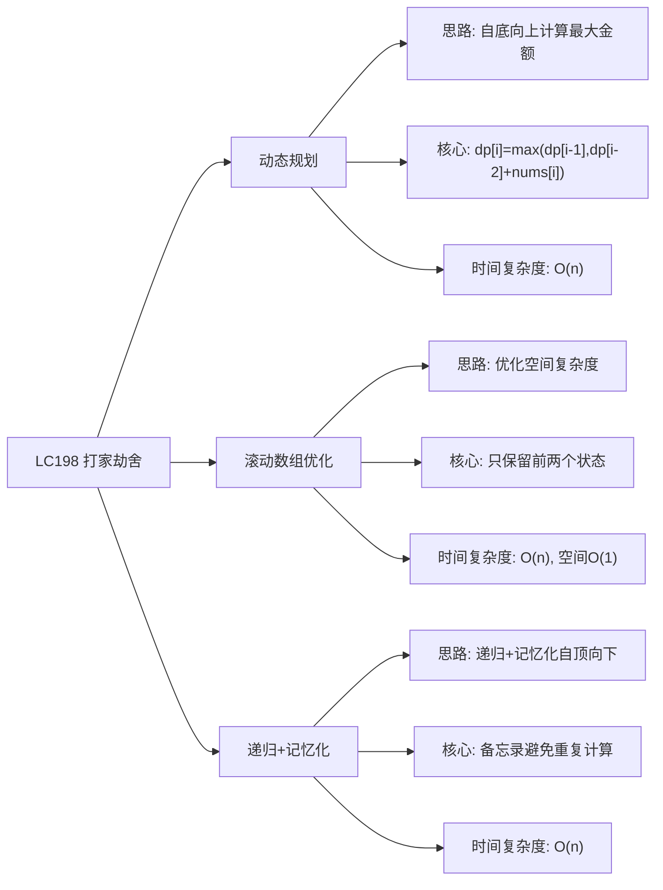

# 03-19-00-00 LC198_打家劫舍解法分析
## 题目描述
你是一个专业的小偷，计划偷窃沿街的房屋。每间房内都藏有一定的现金，影响你偷窃的唯一制约因素就是相邻的房屋装有相互连通的防盗系统，如果两间相邻的房屋在同一晚上被小偷闯入，系统会自动报警。给定一个代表每个房屋存放金额的非负整数数组，计算你不触动警报装置的情况下，一夜之内能够偷窃到的最高金额。
**示例：**
输入：[1,2,3,1]
输出：4
解释：偷窃 1 号房屋 (金额 = 1) ，然后偷窃 3 号房屋 (金额 = 3)。偷窃到的最高金额 = 1 + 3 = 4 。
输入：[2,7,9,3,1]
输出：12
解释：偷窃 1 号房屋 (金额 = 2)，继续偷窃 3 号房屋 (金额 = 9) 和 5 号房屋 (金额 = 1)。偷窃到的最高金额 = 2 + 9 + 1 = 12 。
## 解法概览
### 思维导图

## 记忆口诀
**动态规划：** 自底向上计算，状态转移方程。
**滚动数组：** 优化空间使用，只存前两个状态。
**递归记忆化：** 递归+备忘录，避免重复计算。
## 不同解法
### 解法一：动态规划（最优解）
#### 思路
使用动态规划的方法，自底向上地计算。对于第i间房屋，有两种选择：偷或者不偷。如果偷第i间房屋，那么第i-1间房屋就不能偷，金额为dp[i-2] + nums[i]；如果不偷第i间房屋，那么金额为dp[i-1]。取两者的最大值作为dp[i]。
#### 核心公式
- 状态定义：dp[i] 表示偷到第i间房屋时的最高金额
- 状态转移方程：dp[i] = max(dp[i-1], dp[i-2] + nums[i])
- 初始条件：dp[0] = nums[0], dp[1] = max(nums[0], nums[1])
#### 图解过程
以输入 [2,7,9,3,1] 为例：
- dp[0] = 2
- dp[1] = max(2, 7) = 7
- dp[2] = max(7, 2+9=11) = 11
- dp[3] = max(11, 7+3=10) = 11
- dp[4] = max(11, 11+1=12) = 12
- 最终结果：12
#### 代码示例（带详细注释）
```java
public int rob(int[] nums) {
    if (nums == null || nums.length == 0) {
        return 0;
    }
    if (nums.length == 1) {
        return nums[0];
    }
    
    int n = nums.length;
    int[] dp = new int[n];
    // 初始条件
    dp[0] = nums[0];
    dp[1] = Math.max(nums[0], nums[1]);
    
    // 自底向上计算
    for (int i = 2; i < n; i++) {
        // 状态转移方程：偷第i间房屋 vs 不偷第i间房屋
        dp[i] = Math.max(dp[i - 1], dp[i - 2] + nums[i]);
    }
    
    return dp[n - 1];
}
```
#### 复杂度分析
- 时间复杂度：O(n)，只需一次遍历
- 空间复杂度：O(n)，需要数组存储状态
#### 优缺点
- **优点：**
  - 时间复杂度线性，效率高
  - 逻辑清晰，易于理解
- **缺点：** 空间复杂度为O(n)，可以进一步优化
### 解法二：滚动数组优化
#### 思路
注意到动态规划中，计算dp[i]只需要用到dp[i-1]和dp[i-2]，因此可以使用滚动数组的方法，只保留前两个状态，从而将空间复杂度优化到O(1)。
#### 核心公式
- 使用变量 pre1 表示 dp[i-1]，pre2 表示 dp[i-2]
- 状态转移：current = max(pre1, pre2 + nums[i])
- 滚动更新：pre2 = pre1, pre1 = current
#### 图解过程
以输入 [2,7,9,3,1] 为例：
- 初始：pre2=2, pre1=7
- i=2: current=max(7, 2+9=11)=11 → pre2=7, pre1=11
- i=3: current=max(11, 7+3=10)=11 → pre2=11, pre1=11
- i=4: current=max(11, 11+1=12)=12 → pre2=11, pre1=12
- 返回pre1=12
#### 代码示例
```java
public int rob(int[] nums) {
    if (nums == null || nums.length == 0) {
        return 0;
    }
    if (nums.length == 1) {
        return nums[0];
    }
    
    // pre2 表示 dp[i-2]，pre1 表示 dp[i-1]
    int pre2 = nums[0];
    int pre1 = Math.max(nums[0], nums[1]);
    
    for (int i = 2; i < nums.length; i++) {
        // 计算当前状态
        int current = Math.max(pre1, pre2 + nums[i]);
        // 滚动更新
        pre2 = pre1;
        pre1 = current;
    }
    
    return pre1;
}
```
#### 复杂度分析
- 时间复杂度：O(n)，只需一次遍历
- 空间复杂度：O(1)，只需要常数级别的额外空间
#### 优缺点
- **优点：**
  - 时间复杂度线性，效率高
  - 空间复杂度最优，适合处理大规模数据
- **缺点：** 代码可读性略低于动态规划解法
### 解法三：递归+记忆化
#### 思路
使用递归的方法，自顶向下地解决问题。通过备忘录（记忆化）记录每个房屋的状态，避免重复计算。
#### 核心公式
- 递归函数：rob(nums, i) 表示偷到第i间房屋时的最高金额
- 状态转移：rob(nums, i) = max(rob(nums, i-1), rob(nums, i-2) + nums[i])
- 备忘录：记录每个房屋的计算结果，避免重复计算
#### 图解过程
以输入 [2,7,9,3,1] 为例：
- rob(4) = max(rob(3), rob(2)+1) = max(11, 12) = 12
- rob(3) = max(rob(2), rob(1)+3) = max(11, 10) = 11
- rob(2) = max(rob(1), rob(0)+9) = max(7, 11) = 11
- rob(1) = max(rob(0), 7) = max(2, 7) = 7
- rob(0) = 2
- 最终结果：12
#### 代码示例
```java
public int rob(int[] nums) {
    if (nums == null || nums.length == 0) {
        return 0;
    }
    
    int[] memo = new int[nums.length];
    Arrays.fill(memo, -1);
    
    return robHelper(nums, nums.length - 1, memo);
}

private int robHelper(int[] nums, int i, int[] memo) {
    if (i < 0) {
        return 0;
    }
    if (memo[i] != -1) {
        return memo[i];
    }
    
    // 状态转移方程
    int result = Math.max(
        robHelper(nums, i - 1, memo),           // 不偷第i间房屋
        robHelper(nums, i - 2, memo) + nums[i] // 偷第i间房屋
    );
    
    memo[i] = result;
    return result;
}
```
#### 复杂度分析
- 时间复杂度：O(n)，每个房屋只计算一次
- 空间复杂度：O(n)，需要备忘录数组和递归栈
#### 优缺点
- 优点：逻辑直观，易于理解
- 缺点：递归调用会增加栈空间的使用，效率略低于动态规划解法
## 面试回答模板
**问题：** 请计算小偷能够偷窃到的最高金额。
**回答：**
这是一道经典的动态规划问题，主要有三种解法：
1. **动态规划**：自底向上地计算，使用dp数组存储每个房屋的最大金额。状态转移方程：dp[i] = max(dp[i-1], dp[i-2] + nums[i])。时间复杂度O(n)，空间复杂度O(n)，逻辑清晰易于理解。
2. **滚动数组优化**：注意到计算只需要前两个状态，使用滚动数组将空间复杂度优化到O(1)。时间复杂度O(n)，空间复杂度O(1)，是面试中的推荐解法。
3. **递归+记忆化**：通过递归和备忘录记录每个房屋的计算结果，避免重复计算。时间复杂度O(n)，空间复杂度O(n)，逻辑直观但效率略低。
**最优选择：** 滚动数组优化的动态规划解法是面试中的最优选择，因为它在保证时间复杂度O(n)的同时，空间复杂度为O(1)，代码简洁且易于理解。
## 相关题目
1. **LC213：打家劫舍 II** - 打家劫舍的环形变种，首尾房屋相连
2. **LC337：打家劫舍 III** - 打家劫舍的树形变种，房屋呈二叉树分布
3. **LC70：爬楼梯** - 动态规划的基础应用
4. **LC198：打家劫舍** - 动态规划的经典应用
这些题目都涉及到动态规划的思想，与LC198_打家劫舍有一定的关联性。