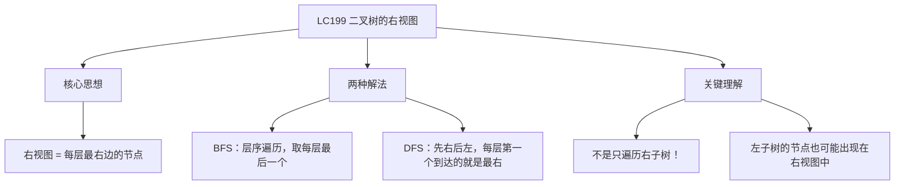
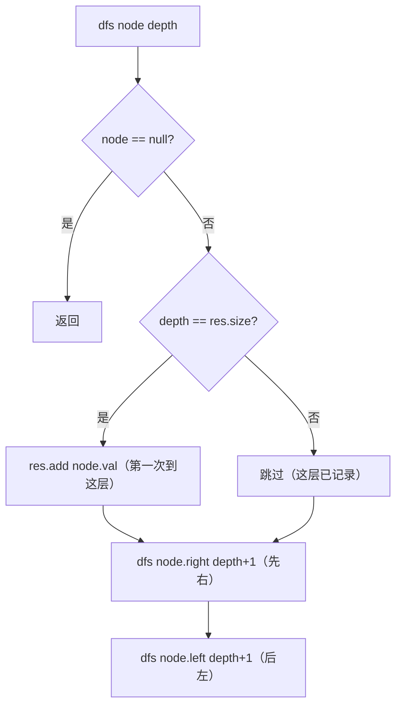

# LC199 二叉树的右视图
## 一、题目描述
给定一个二叉树的根节点 `root`，想象自己站在它的**右侧**，按照从顶部到底部的顺序，返回从右侧所能看到的节点值。
**示例1：**
```
       1
      / \
     2   3
      \   \
       5   4
右视图：[1, 3, 4]
站在右边看：
  第0层：看到1
  第1层：3挡住了2，看到3
  第2层：4在最右边，看到4
```
**示例2：**
```
       1
      /
     2
      \
       5
右视图：[1, 2, 5]
虽然2在左边，但第1层只有2，所以看得到
```
**约束：**
- 节点数范围 [0, 100]
---
## 二、解法概览
### 解法对比表
| 解法 | 时间复杂度 | 空间复杂度 | 面试推荐 |
|------|-----------|-----------|---------|
| **BFS层序遍历** | O(n) | O(w) | ✅ **首选** |
| **DFS先右后左** | O(n) | O(h) | ✅ **推荐** |
### 思维导图

---
## 三、记忆口诀
```
右视图每层取最右，BFS层序取末尾
DFS先右后左走，每层第一个就是答案
depth等于size就加入，巧妙判断是否第一次到这层
```
---
## 四、解法一：BFS层序遍历（首选 ✅）
### 思路
层序遍历，每层从左到右遍历，**取每层最后一个节点**就是右视图看到的。
### 核心公式
```
BFS逐层遍历
每层遍历完后，最后一个节点就是该层的右视图节点
```
### 图解过程
```
       1
      / \
     2   3
      \   \
       5   4
━━━━━━━━━━━━━━━━━━━━━━━━━━━━━━━━━━
第0层：queue=[1]
  遍历：1
  最后一个=1 → res=[1]
  入队：2, 3
━━━━━━━━━━━━━━━━━━━━━━━━━━━━━━━━━━
第1层：queue=[2, 3]
  遍历：2, 3
  最后一个=3 → res=[1, 3]
  入队：5, 4
━━━━━━━━━━━━━━━━━━━━━━━━━━━━━━━━━━
第2层：queue=[5, 4]
  遍历：5, 4
  最后一个=4 → res=[1, 3, 4]
━━━━━━━━━━━━━━━━━━━━━━━━━━━━━━━━━━
结果：[1, 3, 4] ✅
```
### 代码示例
```java
public List<Integer> rightSideView(TreeNode root) {
    List<Integer> res = new ArrayList<>();
    if (root == null) return res;
    Queue<TreeNode> queue = new LinkedList<>();
    queue.offer(root);
    while (!queue.isEmpty()) {
        int size = queue.size();
        for (int i = 0; i < size; i++) {
            TreeNode node = queue.poll();
            // 每层最后一个节点
            if (i == size - 1) {
                res.add(node.val);
            }
            if (node.left != null) queue.offer(node.left);
            if (node.right != null) queue.offer(node.right);
        }
    }
    return res;
}
```
### 复杂度分析
- 时间复杂度：**O(n)**，每个节点入队出队各一次
- 空间复杂度：**O(w)**，队列最大宽度
### 优缺点
| 优点 | 缺点 |
|-----|------|
| 直觉清晰：每层取最后一个 | 需要队列额外空间 |
| BFS模板题 | 代码比DFS稍长 |
---
## 五、解法二：DFS先右后左（推荐 ✅）
### 思路
**先递归右子树，再递归左子树**。这样每层第一个被访问到的节点就是最右边的节点。
用 `depth == res.size()` 判断是否是第一次到达这一层。
### 核心公式
```
dfs(node, depth):
  if node == null → return
  if depth == res.size() → res.add(node.val)  // 第一次到达这层
  dfs(node.right, depth+1)   // 先右
  dfs(node.left, depth+1)    // 后左
```
### `depth == res.size()` 怎么理解？
```
res.size() 表示已经记录了几层的结果
depth 表示当前节点在第几层（从0开始）
如果 depth == res.size()：
  说明这一层还没有记录过结果
  当前节点就是这一层第一个被访问到的
  因为先右后左，第一个到达的一定是最右边的
示例：
  depth=0, res.size()=0 → 0==0 ✅ 第0层第一次到达 → 加入
  depth=1, res.size()=1 → 1==1 ✅ 第1层第一次到达 → 加入
  depth=1, res.size()=2 → 1!=2 ❌ 第1层已记录过 → 跳过
```
### 图解过程
```
       1
      / \
     2   3
      \   \
       5   4
━━━━━━━━━━━━━━━━━━━━━━━━━━━━━━━━━━
dfs(1, depth=0)：0==0(res.size) → res=[1]
  先右：dfs(3, depth=1)
    1==1 → res=[1, 3]
    先右：dfs(4, depth=2)
      2==2 → res=[1, 3, 4]
      右null，左null
    后左：dfs(null) → 返回
  后左：dfs(2, depth=1)
    1!=3(res.size) → 跳过（第1层已经有3了）
    先右：dfs(5, depth=2)
      2!=3(res.size) → 跳过（第2层已经有4了）
    后左：dfs(null) → 返回
━━━━━━━━━━━━━━━━━━━━━━━━━━━━━━━━━━
结果：[1, 3, 4] ✅
遍历顺序：1 → 3 → 4 → 2 → 5
因为先右后左，每层最右的节点总是最先到达
```
### 左子树出现在右视图的例子
```
       1
      /
     2
      \
       5
━━━━━━━━━━━━━━━━━━━━━━━━━━━━━━━━━━
dfs(1, 0)：0==0 → res=[1]
  先右：dfs(null) → 返回
  后左：dfs(2, 1)
    1==1 → res=[1, 2]    ← 左子树的节点！但它是第1层唯一的，必须加入
    先右：dfs(5, 2)
      2==2 → res=[1, 2, 5]
    后左：dfs(null)
━━━━━━━━━━━━━━━━━━━━━━━━━━━━━━━━━━
结果：[1, 2, 5] ✅
所以右视图不是"只看右子树"，左子树节点也可能出现！
```
### 算法流程图

### 代码示例
```java
public List<Integer> rightSideView(TreeNode root) {
    List<Integer> res = new ArrayList<>();
    dfs(root, 0, res);
    return res;
}
private void dfs(TreeNode node, int depth, List<Integer> res) {
    if (node == null) return;
    // 第一次到达这一层 → 加入结果
    if (depth == res.size()) {
        res.add(node.val);
    }
    dfs(node.right, depth + 1, res);  // 先右
    dfs(node.left, depth + 1, res);   // 后左
}
```
### 复杂度分析
- 时间复杂度：**O(n)**，每个节点访问一次
- 空间复杂度：**O(h)**，递归栈深度
### 优缺点
| 优点 | 缺点 |
|-----|------|
| 代码极简 | 需要理解"先右后左"的技巧 |
| 空间只有O(h) | `depth==res.size()`不够直观 |
### 如果要求左视图呢？
```
只需要把 dfs 的递归顺序反过来：先左后右
dfs(node.left, depth + 1, res);   // 先左
dfs(node.right, depth + 1, res);  // 后右
这样每层第一个到达的就是最左边的节点
```
---
## 六、两种解法对比
| 对比 | BFS | DFS |
|------|-----|-----|
| 思路 | 每层取最后一个 | 先右后左，每层取第一个到达的 |
| 代码 | 稍长 | 更简洁 |
| 空间 | O(w) 队列 | O(h) 递归栈 |
| 直觉 | **更直观** | 需要理解先右后左 |
| 面试 | **首选** | 进阶/加分 |
---
## 七、面试回答模板
### 1. 开场：理解题意
> 右视图就是每层最右边的节点。注意不是只看右子树，左子树的节点如果这一层没有更右的，它也会出现在右视图中。
### 2. 思路一：BFS
> 层序遍历，每层遍历时取最后一个节点加入结果。
### 3. 思路二：DFS
> 先递归右子树再递归左子树，用 `depth == res.size()` 判断是否第一次到达这一层。第一次到达的一定是最右边的。
### 4. 复杂度
> 两种都是时间 O(n)。BFS 空间 O(w)，DFS 空间 O(h)。
---
## 八、相关题目
| 题号 | 题目 | 关系 | 难度 |
|-----|------|------|-----|
| LC102 | 二叉树的层序遍历 | BFS模板 | 中等 |
| LC104 | 二叉树的最大深度 | DFS基础 | 简单 |
| LC107 | 二叉树的层序遍历II | 层序变体 | 中等 |
| LC515 | 在每个树行中找最大值 | 层序+每层取最大 | 中等 |
| LC637 | 二叉树的层平均值 | 层序+每层求平均 | 简单 |
| LC116 | 填充每个节点的下一个右侧节点指针 | 层序连接 | 中等 |