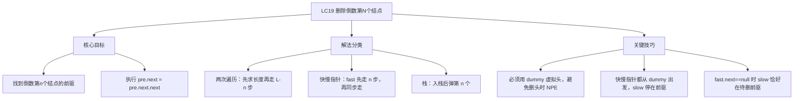
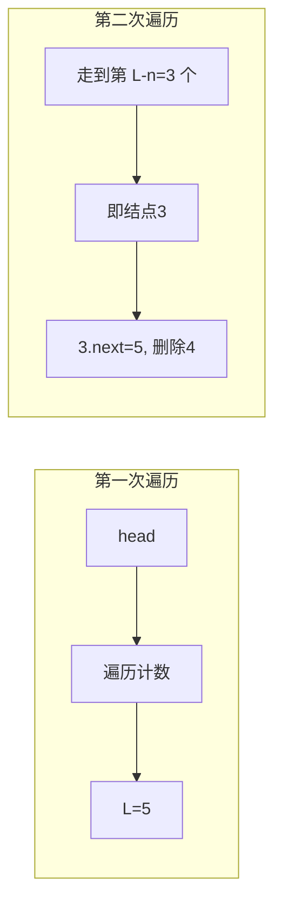
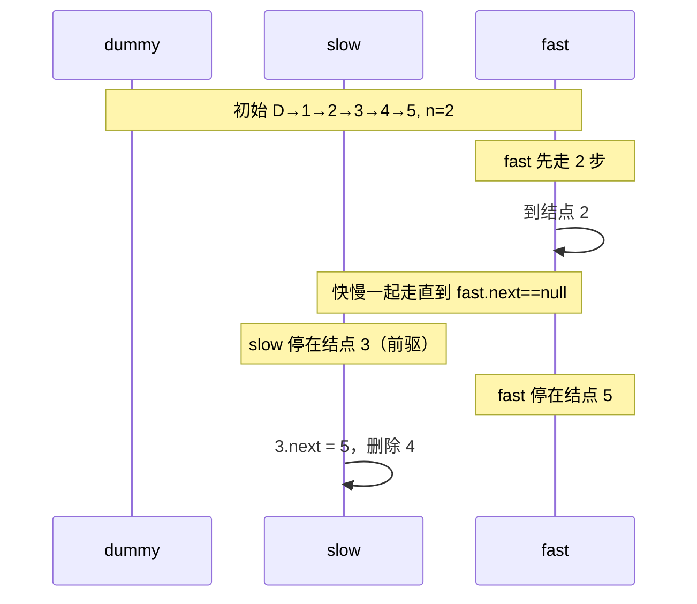

# LC19 删除链表的倒数第N个结点

## 题目描述

给你一个链表，删除链表的倒数第 n 个结点，并且返回链表的头结点。
**示例：**

```
输入：head = [1,2,3,4,5], n = 2
输出：[1,2,3,5]
```

```
输入：head = [1], n = 1
输出：[]
```

```
输入：head = [1,2], n = 1
输出：[1]
```

**约束：** 链表中结点数目为 sz，1 <= sz <= 30，0 <= Node.val <= 100，1 <= n <= sz
---

## 解法概览

| 解法         | 时间复杂度 | 空间复杂度 | 面试推荐   |
|------------|-------|-------|--------|
| 两次遍历       | O(L)  | O(1)  | ✅ 普通解法 |
| 快慢指针（一次遍历） | O(L)  | O(1)  | ✅ 最优解  |
| 栈          | O(L)  | O(L)  | 了解即可   |

### 思维导图



---

## 记忆口诀

```
删倒N用快慢针，dummy 当头不会晕
fast 先走 n 步整，再同慢针一起奔
fast 到尾 slow 前驱，next 改指即完成
```

---

## 解法一：两次遍历（普通解法）

### 思路

第一次遍历得到链表长度 L，则倒数第 n 个结点为正数第 (L−n+1) 个，其前驱为正数第 (L−n) 个。第二次遍历到第 (L−n)
个结点（即前驱），执行删除。

### 核心公式

```
L = 链表长度（第一次遍历）
待删结点前驱位置 = 第 (L - n) 个结点（从 1 开始计）
删除：pre.next = pre.next.next
```

### 图解过程



链表 1→2→3→4→5，n=2：L=5，前驱为第 3 个结点（值为 3），删除其 next（值为 4），结果 1→2→3→5。

### 代码示例

```java
public ListNode removeNthFromEnd(ListNode head, int n) {
  if (head == null || n < 1) return null;
  int len = 0;
  for (ListNode p = head; p != null; p = p.next) len++;
  if (n > len) return head;
  ListNode dummy = new ListNode(-1);
  dummy.next = head;
  ListNode cur = dummy;
  for (int i = 0; i < len - n; i++) cur = cur.next;
  cur.next = cur.next.next;
  return dummy.next;
}
```

### 复杂度分析

- 时间：O(L)，两次遍历，L 为链表长度。
- 空间：O(1)，仅 dummy 与若干指针。

### 优缺点

优点：思路直观，易实现，边界清晰。缺点：需要两次遍历，常数倍略差。
---

## 解法二：快慢指针 / 一次遍历（最优解）

### 思路

使用 dummy 虚拟头，fast、slow 均从 dummy 出发。fast 先走 n 步，然后 fast 与 slow 一起每次各走一步，当 fast.next == null
时，slow 恰好停在倒数第 n 个结点的前驱，执行删除。

### 核心公式

```
初始：fast = slow = dummy
阶段一：fast 先走 n 步（fast 与待删结点间隔 n 个结点）
阶段二：while (fast.next != null) { fast=fast.next; slow=slow.next; }
结束时：slow 为待删前驱，删除：slow.next = slow.next.next
返回：dummy.next
```

### 图解过程



```
dummy→1→2→3→4→5→null, n=2
fast 先走 2 步：dummy→1→[2]→3→4→5  (fast 在 2)
一起走：slow 到 1 fast 到 3 → slow 到 2 fast 到 4 → slow 到 3 fast 到 5
fast.next==null，slow 在 3，删除 3.next（4）→ 结果 dummy→1→2→3→5
```

### 代码示例

```java
public ListNode removeNthFromEnd(ListNode head, int n) {
  if (head == null || n < 1) return null;
  ListNode dummy = new ListNode(-1);
  dummy.next = head;
  ListNode fast = dummy;
  ListNode slow = dummy;
  while (n > 0) {
    if (fast == null) return null;
    fast = fast.next;
    n--;
  }
  while (fast.next != null) {
    fast = fast.next;
    slow = slow.next;
  }
  slow.next = slow.next.next;
  return dummy.next;
}
```

### 复杂度分析

- 时间：O(L)，单次遍历，L 为链表长度。
- 空间：O(1)，仅 dummy 与双指针。

### 优缺点

优点：一次遍历、O(1) 空间，面试首选。缺点：需理解“快先走 n 步再同步”的等价关系。
---

## 面试回答模板

1. **题意复述**：删除链表倒数第 n 个结点并返回头结点，保证 n 有效。
2. **思路选择**：可以说“有两种常见做法：先求长度再走到的两次遍历，以及一次遍历的快慢指针。我更推荐快慢指针：先建 dummy，fast 和
   slow 都从 dummy 开始，fast 先走 n 步，然后一起走，当 fast.next 为空时 slow 正好在待删结点的前驱，改 next 即可。”
3. **边界**：强调用 dummy 可以统一处理“删头”的情况（如只有一个结点删倒数第 1 个），避免 NPE。
4. **复杂度**：时间 O(L)，空间 O(1)。

---

## 相关题目

| 题号        | 题目        | 关联点              | 难度    |
|-----------|-----------|------------------|-------|
| LC206     | 反转单链表     | 链表指针操作、dummy 思想  | 简单    |
| LC21      | 合并两个有序链表  | 链表遍历与指针          | 简单    |
| LC876     | 链表的中间结点   | 快慢指针（快 2 步慢 1 步） | 简单    |
| LC141/142 | 环形链表 I/II | 快慢指针判断环与入口       | 简单/中等 |
