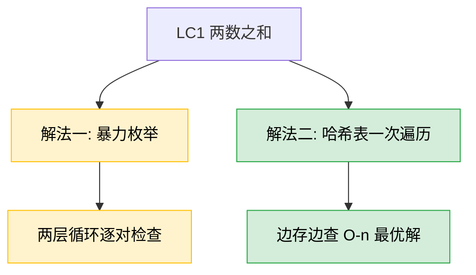
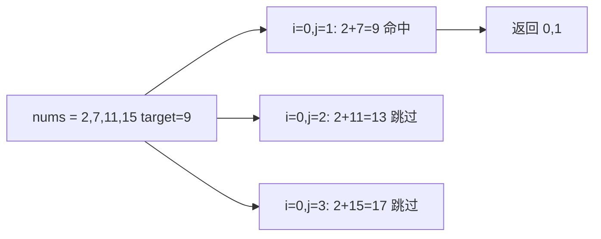
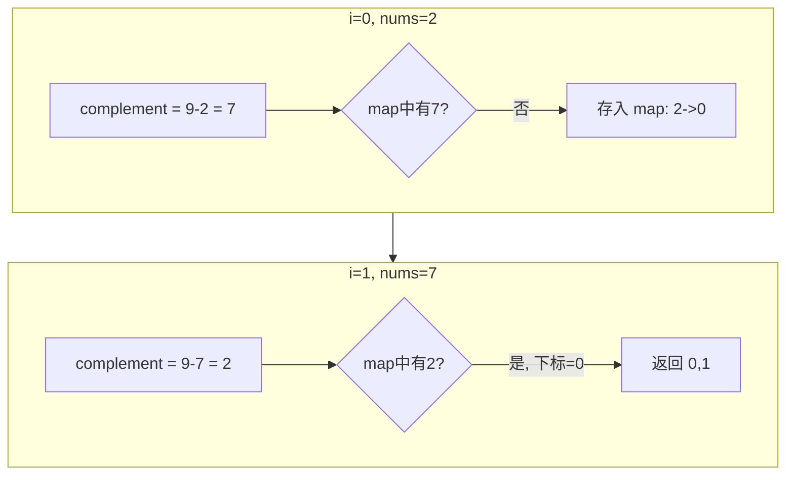

# LC1 两数之和
## 一、题目描述
给定一个整数数组 nums 和一个整数目标值 target，请你在该数组中找出**和为目标值 target 的那两个整数**，并返回它们的数组下标。
你可以假设每种输入只会对应一个答案，并且不能使用同一元素两次。可以按任意顺序返回答案。
**示例：** 输入 `nums = [2,7,11,15], target = 9`，输出 `[0,1]`，因为 `nums[0] + nums[1] == 9`
**约束：** 2 <= nums.length <= 10^4，-10^9 <= nums[i] <= 10^9，-10^9 <= target <= 10^9，只存在一个有效答案
## 二、解法概览

| 解法 | 时间复杂度 | 空间复杂度 | 难度 | 面试推荐 |
|------|-----------|-----------|------|---------|
| 暴力枚举 | O(n²) | O(1) | ⭐ | 仅用于对比说明 |
| 哈希表一次遍历 | O(n) | O(n) | ⭐⭐ | 最优解/面试首选 |
## 三、记忆口诀
> **目标减当前，哈希查补数。找到返下标，没有存进去。**
核心思想：遍历数组，对每个元素算出 `complement = target - nums[i]`，去哈希表里查有没有，有就返回，没有就把当前元素存进哈希表。
## 四、解法一：暴力枚举
### 4.1 思路
两层 for 循环，枚举所有 `(i, j)` 对，检查 `nums[i] + nums[j] == target`。
### 4.2 核心公式
`nums[i] + nums[j] == target`，其中 `0 <= i < j < n`
### 4.3 图解过程

### 4.4 代码示例
```java
public int[] twoSum(int[] nums, int target) {
    for (int i = 0; i < nums.length; i++) {
        for (int j = i + 1; j < nums.length; j++) {
            if (nums[i] + nums[j] == target) {
                return new int[]{i, j};
            }
        }
    }
    return new int[]{-1, -1};
}
```
### 4.5 复杂度分析
- **时间复杂度：O(n²)**，两层循环，最坏检查 n(n-1)/2 对
- **空间复杂度：O(1)**，不需要额外空间
### 4.6 优缺点
| 优点 | 缺点 |
|------|------|
| 思路最直观，不易出错 | 时间复杂度高，大数据量会超时 |
| 不需要额外空间 | 面试中仅作为引子，不是期望答案 |
## 五、解法二：哈希表一次遍历（面试首选/最优解）
### 5.1 思路
用哈希表存储已经遍历过的元素（值→下标）。对于当前元素 `nums[i]`，计算补数 `complement = target - nums[i]`，如果补数已在哈希表中，直接返回两个下标；否则把当前元素存入哈希表，继续遍历。**一次遍历搞定，边存边查。**
### 5.2 核心公式
`complement = target - nums[i]`，在哈希表中查找 complement 是否已存在。
### 5.3 图解过程

**完整遍历过程：**
| 步骤 | nums-i | complement | map中有? | 操作 | map状态 |
|------|--------|-----------|---------|------|--------|
| i=0 | 2 | 7 | 否 | 存入 2->0 | {2:0} |
| i=1 | 7 | 2 | 是,下标=0 | 返回[0,1] | - |
### 5.4 代码示例
```java
public int[] twoSum(int[] nums, int target) {
    if (nums == null || nums.length <= 1) {
        return new int[]{-1, -1};
    }
    Map<Integer, Integer> map = new HashMap<>();
    for (int i = 0; i < nums.length; i++) {
        int complement = target - nums[i];
        if (map.containsKey(complement)) {
            return new int[]{map.get(complement), i};
        }
        map.put(nums[i], i);
    }
    return new int[]{-1, -1};
}
```
### 5.5 复杂度分析
- **时间复杂度：O(n)**，只遍历一次数组，哈希表查找和插入均为 O(1)
- **空间复杂度：O(n)**，最坏情况下哈希表存储 n 个元素
### 5.6 优缺点
| 优点 | 缺点 |
|------|------|
| 时间最优 O(n) | 需要 O(n) 额外空间 |
| 一次遍历，边存边查 | 哈希冲突时常数因子略大 |
| 面试标准答案，代码简洁 | 无 |
## 六、面试回答模板
> **面试官：** 给定一个数组和一个目标值，找出数组中和为目标值的两个数，返回下标。
**回答要点：**
1. **先说暴力：** 最简单的方法是两层循环枚举所有对，时间 O(n²)、空间 O(1)，但效率不够。
2. **引出最优解：** 用哈希表优化。遍历数组时，对每个元素计算 complement = target - nums[i]，在哈希表中查找。如果找到了直接返回两个下标；没找到就把当前值和下标存入哈希表。一次遍历即可完成，时间 O(n)、空间 O(n)。
3. **关键细节：** 先查后存，保证不会用同一个元素两次；哈希表的 key 是元素值，value 是下标。
4. **写代码：** 核心代码只有一个 for 循环加一个 if-else，代码量很少。
## 七、相关题目
| 题目 | 关联点 |
|------|--------|
| LC15 三数之和 | 两数之和的扩展，排序后用双指针 |
| LC167 两数之和II-输入有序数组 | 有序场景下用双指针代替哈希表 |
| LC170 两数之和III-数据结构设计 | 设计类，结合哈希表 |
| LC560 和为K的子数组 | 前缀和+哈希表，思想类似 |
| LC18 四数之和 | 两数之和的进一步扩展 |
