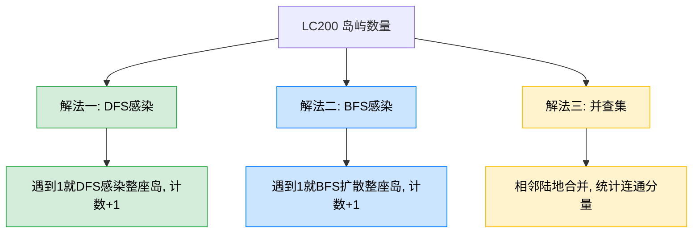
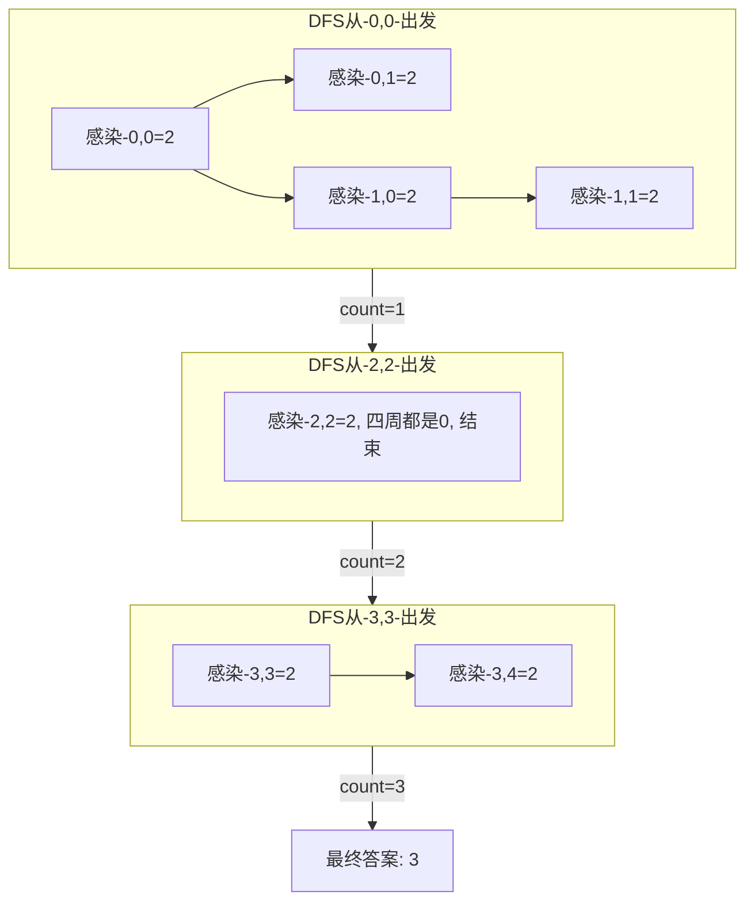

# LC200 岛屿数量
## 一、题目描述
给你一个由 `'1'`（陆地）和 `'0'`（水）组成的二维网格，请你计算网格中**岛屿的数量**。岛屿总是被水包围，并且每座岛屿只能由**水平方向和垂直方向**上相邻的陆地连接形成。
**示例：** 输入
```
grid = [
  ["1","1","0","0","0"],
  ["1","1","0","0","0"],
  ["0","0","1","0","0"],
  ["0","0","0","1","1"]
]
```
输出 `3`
**约束：** m == grid.length，n == grid[i].length，1 <= m, n <= 300，grid[i][j] 为 '0' 或 '1'
## 二、解法概览

| 解法 | 时间复杂度 | 空间复杂度 | 难度 | 面试推荐 |
|------|-----------|-----------|------|---------|
| DFS感染 | O(m*n) | O(m*n) | ⭐⭐ | 面试首选 |
| BFS感染 | O(m*n) | O(min(m,n)) | ⭐⭐ | 备选方案 |
| 并查集 | O(m*n*α) | O(m*n) | ⭐⭐⭐ | 进阶加分 |
## 三、记忆口诀
> **遍历网格找到1，DFS四方全感染，感染完了数加1，最终计数即答案。**
核心逻辑只有两步：
1. 遇到 `'1'` → 启动 DFS/BFS 把整座岛感染掉（标记为已访问）
2. 每启动一次 → 岛屿数量 +1
## 四、感染法的核心思想

**为什么叫"感染"？** 就像病毒传播，从一个格子开始，向上下左右扩散，把所有相连的 `'1'` 都感染成 `'2'`（或 `'0'`），这样同一座岛不会被重复计数。
## 五、解法一：DFS感染（面试首选）
### 5.1 思路
遍历网格，遇到 `'1'` 就从这个点启动 DFS，向上下左右四个方向递归，把所有相连的 `'1'` 改成 `'2'`（感染/标记已访问）。每启动一次 DFS，岛屿计数 +1。
### 5.2 核心公式
```
主函数: 遍历网格, grid[i][j]=='1' → dfs(i,j), count++
dfs(i,j): 越界或不是'1' → return; 否则感染为'2', 递归上下左右
```
### 5.3 图解过程
```
初始网格:          DFS第1次(从0,0):    DFS第2次(从2,2):    DFS第3次(从3,3):
1 1 0 0 0          2 2 0 0 0          2 2 0 0 0          2 2 0 0 0
1 1 0 0 0          2 2 0 0 0          2 2 0 0 0          2 2 0 0 0
0 0 1 0 0          0 0 1 0 0          0 0 2 0 0          0 0 2 0 0
0 0 0 1 1          0 0 0 1 1          0 0 0 1 1          0 0 0 2 2
count=0             count=1             count=2             count=3
```

### 5.4 代码示例
```java
public int numIslands(char[][] grid) {
    if (grid == null || grid.length == 0) return 0;
    int count = 0;
    for (int i = 0; i < grid.length; i++) {
        for (int j = 0; j < grid[0].length; j++) {
            if (grid[i][j] == '1') {
                dfs(grid, i, j);
                count++;
            }
        }
    }
    return count;
}
private void dfs(char[][] grid, int i, int j) {
    if (i < 0 || i >= grid.length || j < 0 || j >= grid[0].length) return;
    if (grid[i][j] != '1') return;
    grid[i][j] = '2';
    dfs(grid, i - 1, j);
    dfs(grid, i + 1, j);
    dfs(grid, i, j - 1);
    dfs(grid, i, j + 1);
}
```
### 5.5 DFS函数的两个 return 条件
| 条件 | 含义 | 为什么需要 |
|------|------|-----------|
| `i < 0 或 i >= m 或 j < 0 或 j >= n` | 越界 | 防止数组越界 |
| `grid[i][j] != '1'` | 是水('0')或已感染('2') | 避免重复访问和扩散到水 |
两个条件**缺一不可**，合在一起保证了 DFS 只在未访问的陆地上扩散。
### 5.6 复杂度分析
- **时间复杂度：O(m*n)**，每个格子最多被访问一次（遍历一次 + DFS中访问一次）
- **空间复杂度：O(m*n)**，最坏情况全是 '1'，递归栈深度 m*n
### 5.7 优缺点
| 优点 | 缺点 |
|------|------|
| 代码最简洁，面试首选 | 修改了原数组 |
| 思路直观：找到岛就感染 | 全是陆地时递归栈很深 |
| 不需要额外数据结构 | 递归深度可能栈溢出（300*300 一般没问题） |
## 六、解法二：BFS感染
### 6.1 思路
和 DFS 相同的感染思想，但用 BFS（队列）代替递归。遇到 `'1'` 就入队，然后不断弹出、感染、把四周的 `'1'` 入队，直到队列为空。
### 6.2 代码示例
```java
public int numIslands(char[][] grid) {
    if (grid == null || grid.length == 0) return 0;
    int m = grid.length, n = grid[0].length;
    int count = 0;
    for (int i = 0; i < m; i++) {
        for (int j = 0; j < n; j++) {
            if (grid[i][j] == '1') {
                bfs(grid, i, j, m, n);
                count++;
            }
        }
    }
    return count;
}
private void bfs(char[][] grid, int i, int j, int m, int n) {
    Deque<int[]> queue = new ArrayDeque<>();
    queue.offer(new int[]{i, j});
    grid[i][j] = '2';
    int[][] dirs = {{-1,0},{1,0},{0,-1},{0,1}};
    while (!queue.isEmpty()) {
        int[] cell = queue.poll();
        for (int[] d : dirs) {
            int ni = cell[0] + d[0], nj = cell[1] + d[1];
            if (ni >= 0 && ni < m && nj >= 0 && nj < n && grid[ni][nj] == '1') {
                grid[ni][nj] = '2';
                queue.offer(new int[]{ni, nj});
            }
        }
    }
}
```
### 6.3 复杂度分析
- **时间复杂度：O(m*n)**
- **空间复杂度：O(min(m,n))**，队列最大长度为网格较短边的长度
### 6.4 优缺点
| 优点 | 缺点 |
|------|------|
| 无递归，无栈溢出风险 | 代码比 DFS 长 |
| 空间更优 O(min(m,n)) | 需要维护方向数组和队列 |
## 七、解法三：并查集
### 7.1 思路
把每个 `'1'` 格子看作一个节点，相邻的 `'1'` 格子做 union 操作。最后统计有多少个不同的连通分量，就是岛屿数量。
### 7.2 代码示例
```java
public int numIslands(char[][] grid) {
    int m = grid.length, n = grid[0].length;
    int[] parent = new int[m * n];
    int[] rank = new int[m * n];
    int count = 0;
    for (int i = 0; i < m; i++) {
        for (int j = 0; j < n; j++) {
            if (grid[i][j] == '1') {
                parent[i * n + j] = i * n + j;
                count++;
            }
        }
    }
    int[][] dirs = {{1,0},{0,1}};
    for (int i = 0; i < m; i++) {
        for (int j = 0; j < n; j++) {
            if (grid[i][j] == '1') {
                for (int[] d : dirs) {
                    int ni = i + d[0], nj = j + d[1];
                    if (ni < m && nj < n && grid[ni][nj] == '1') {
                        if (union(parent, rank, i * n + j, ni * n + nj)) {
                            count--;
                        }
                    }
                }
            }
        }
    }
    return count;
}
private int find(int[] parent, int x) {
    while (parent[x] != x) {
        parent[x] = parent[parent[x]];
        x = parent[x];
    }
    return x;
}
private boolean union(int[] parent, int[] rank, int a, int b) {
    int ra = find(parent, a), rb = find(parent, b);
    if (ra == rb) return false;
    if (rank[ra] < rank[rb]) { int t = ra; ra = rb; rb = t; }
    parent[rb] = ra;
    if (rank[ra] == rank[rb]) rank[ra]++;
    return true;
}
```
### 7.3 复杂度分析
- **时间复杂度：O(m*n*α(m*n))**，α 是反阿克曼函数，近似 O(1)
- **空间复杂度：O(m*n)**，parent 和 rank 数组
### 7.4 优缺点
| 优点 | 缺点 |
|------|------|
| 不修改原数组 | 代码最长 |
| 并查集模板可复用 | 面试中一般不要求 |
| 适合动态增删的场景 | 本题 DFS 就够了 |
## 八、三种解法对比
| 对比项 | DFS | BFS | 并查集 |
|--------|-----|-----|--------|
| 核心操作 | 递归感染 | 队列感染 | union合并 |
| 代码量 | 最短 | 中等 | 最长 |
| 空间 | O(m*n) 递归栈 | O(min(m,n)) 队列 | O(m*n) 数组 |
| 修改原数组 | 是 | 是 | 否 |
| 面试推荐 | 首选 | 备选 | 进阶 |
## 九、面试回答模板
> **面试官：** 计算二维网格中岛屿的数量。
**回答要点：**
1. **说思路：** 遍历网格，遇到 '1' 就启动 DFS，把整座岛的所有 '1' 感染成 '2'（标记已访问），然后岛屿计数 +1。遍历完所有格子，启动了几次 DFS 就有几座岛。
2. **DFS 函数：** 两个终止条件——越界返回，不是 '1' 返回。否则感染当前格子，向上下左右四个方向递归。
3. **复杂度：** 时间 O(m*n)，每个格子最多访问一次。空间 O(m*n) 递归栈。
4. **延伸：** 如果担心递归栈溢出可以用 BFS；如果不能修改原数组可以用并查集或额外 visited 数组。
## 十、岛屿系列题目
| 题目 | 变形点 |
|------|--------|
| LC200 岛屿数量 | 基础版，数岛屿 |
| LC695 岛屿的最大面积 | DFS 中计数，返回最大值 |
| LC463 岛屿的周长 | DFS 中遇到边界或水就 +1 |
| LC694 不同岛屿的数量 | 序列化 DFS 路径作为岛屿形状签名 |
| LC827 最大人工岛 | 翻转一个 0，求最大岛（并查集） |
| LC1905 统计子岛屿 | 两个网格对比 |
