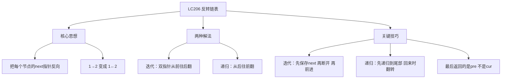
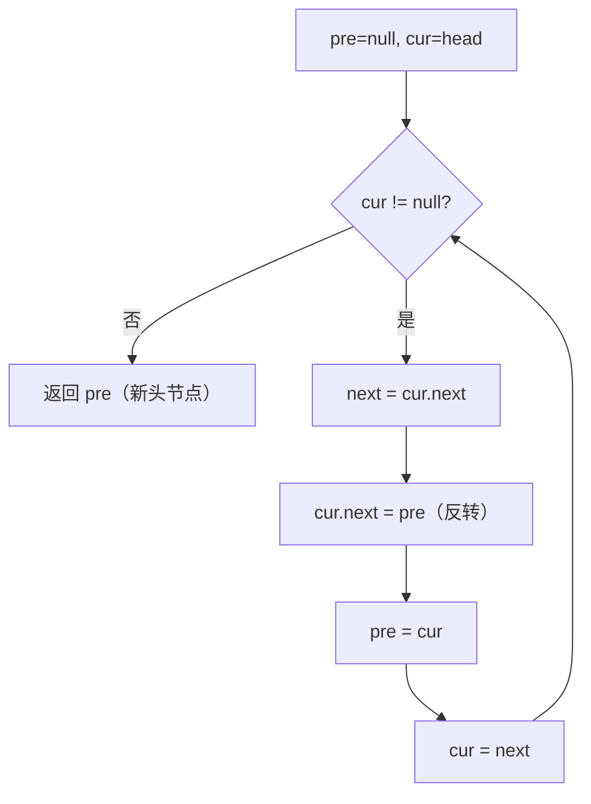

# LC206 反转链表
## 一、题目描述
给你单链表的头节点 `head`，请你反转链表，并返回反转后的链表。
**示例：**
```
输入：1 → 2 → 3 → 4 → 5 → null
输出：5 → 4 → 3 → 2 → 1 → null
```
**约束：**
- 链表节点数范围 [0, 5000]
- -5000 <= Node.val <= 5000
---
## 二、解法概览
### 解法对比表
| 解法 | 时间复杂度 | 空间复杂度 | 面试推荐 |
|------|-----------|-----------|---------|
| **迭代（双指针）** | O(n) | O(1) | ✅ **首选** |
| 递归 | O(n) | O(n) | ✅ 进阶 |
### 思维导图

---
## 三、记忆口诀
```
反转链表用迭代，pre和cur两指针
先存next防断链，cur指向pre翻转
pre前进cur前进，cur为空pre就是头
```
---
## 四、解法一：迭代 / 双指针（首选 ✅）
### 思路
用两个指针 `pre` 和 `cur` 从前往后遍历，逐个把 next 指针反向：
1. 先保存 `cur.next`（不然断链后就找不到了）
2. 把 `cur.next` 指向 `pre`（反转）
3. `pre` 和 `cur` 各前进一步
### 核心公式
```
每一步做4件事（顺序不能变）：
  next = cur.next    // 1. 先存后继
  cur.next = pre     // 2. 反转指向
  pre = cur          // 3. pre前进
  cur = next         // 4. cur前进
```
### 图解过程
```
原链表：1 → 2 → 3 → 4 → 5 → null
━━━━━━━━━━━━━━━━━━━━━━━━━━━━━━━━━━
初始状态：
  pre = null
  cur = 1
  null   1 → 2 → 3 → 4 → 5 → null
   ↑     ↑
  pre   cur
━━━━━━━━━━━━━━━━━━━━━━━━━━━━━━━━━━
第1步：反转节点1
  next = cur.next = 2       // 先存2
  cur.next = pre = null     // 1指向null
  pre = cur = 1             // pre前进
  cur = next = 2            // cur前进
  null ← 1   2 → 3 → 4 → 5 → null
         ↑   ↑
        pre  cur
━━━━━━━━━━━━━━━━━━━━━━━━━━━━━━━━━━
第2步：反转节点2
  next = 3
  cur.next = pre = 1        // 2指向1
  pre = 2, cur = 3
  null ← 1 ← 2   3 → 4 → 5 → null
              ↑   ↑
             pre  cur
━━━━━━━━━━━━━━━━━━━━━━━━━━━━━━━━━━
第3步：反转节点3
  next = 4
  cur.next = 2              // 3指向2
  pre = 3, cur = 4
  null ← 1 ← 2 ← 3   4 → 5 → null
                   ↑   ↑
                  pre  cur
━━━━━━━━━━━━━━━━━━━━━━━━━━━━━━━━━━
第4步：反转节点4
  next = 5
  cur.next = 3              // 4指向3
  pre = 4, cur = 5
  null ← 1 ← 2 ← 3 ← 4   5 → null
                       ↑   ↑
                      pre  cur
━━━━━━━━━━━━━━━━━━━━━━━━━━━━━━━━━━
第5步：反转节点5
  next = null
  cur.next = 4              // 5指向4
  pre = 5, cur = null
  null ← 1 ← 2 ← 3 ← 4 ← 5   null
                            ↑    ↑
                           pre  cur
━━━━━━━━━━━━━━━━━━━━━━━━━━━━━━━━━━
cur == null，循环结束
返回 pre = 5，就是新的头节点
结果：5 → 4 → 3 → 2 → 1 → null ✅
```
### 算法流程图

### 代码示例
```java
public ListNode reverseList(ListNode head) {
    ListNode pre = null;
    ListNode cur = head;
    while (cur != null) {
        ListNode next = cur.next;  // 1. 先存后继
        cur.next = pre;            // 2. 反转指向
        pre = cur;                 // 3. pre前进
        cur = next;                // 4. cur前进
    }
    return pre;  // pre就是新的头节点
}
```
### 为什么返回 pre 而不是 cur？
```
循环结束时：
  pre = 最后一个节点（新头）
  cur = null（已经走出链表了）
所以返回 pre
```
### 为什么要先存 next？
```
如果不先存 next：
  cur.next = pre   // 1→null，此时2已经找不到了！
  cur = cur.next   // cur = null，而不是2 ❌
先存 next = cur.next = 2，后面才能通过 cur = next 走到2
```
### 复杂度分析
- 时间复杂度：**O(n)**，遍历一次链表
- 空间复杂度：**O(1)**，只用了两个指针
### 优缺点
| 优点 | 缺点 |
|-----|------|
| 空间 O(1) | 需要理解指针操作顺序 |
| 代码简洁 | 4步顺序不能错 |
| 面试首选 | 无 |
---
## 五、解法二：递归
### 思路
先递归到链表尾部，回溯时逐个反转指针：
1. 递归到最后一个节点，作为新头 `res`
2. 回溯时，让当前节点的**下一个节点**指向自己
3. 断开自己指向下一个节点的指针
### 核心公式
```
head.next.next = head   // 让下一个节点指向自己（反转）
head.next = null        // 断开自己指向下一个的指针
```
### 递归怎么理解？
```
正常链表：1 → 2 → 3 → 4 → 5
递归到底：先不管前面，把 2→3→4→5 反转好
假设 reverseList(2→3→4→5) 已经搞定：5→4→3→2→null
现在只需要处理节点1：
  head = 1，head.next = 2
  head.next.next = head → 2.next = 1（让2指向1）
  head.next = null      → 1.next = null（断开1指向2）
  结果：5→4→3→2→1→null ✅
```
### 图解过程
```
原链表：1 → 2 → 3 → null
━━━━━━━━━━━━━━━━━━━━━━━━━━━━━━━━━━
递归展开：
  reverseList(1)
    → reverseList(2)
      → reverseList(3)
        → 3.next == null，触底！返回 3（新头）
━━━━━━━━━━━━━━━━━━━━━━━━━━━━━━━━━━
回溯第1层：head = 2，res = 3
  当前：1 → 2 → 3 → null
  head.next.next = head  → 3.next = 2
  head.next = null       → 2.next = null
  变成：1 → 2 ← 3
        ↓
       null
  即：3 → 2 → null，1还指着2（但2已经不指向3了）
━━━━━━━━━━━━━━━━━━━━━━━━━━━━━━━━━━
回溯第2层：head = 1，res = 3
  head.next.next = head  → 2.next = 1
  head.next = null       → 1.next = null
  变成：3 → 2 → 1 → null ✅
━━━━━━━━━━━━━━━━━━━━━━━━━━━━━━━━━━
返回 res = 3，就是新头节点
```
### 代码示例
```java
public ListNode reverseList(ListNode head) {
    // 终止条件：空链表或只有一个节点
    if (head == null || head.next == null) {
        return head;
    }
    // 递归反转后面的链表，res是新的头节点
    ListNode res = reverseList(head.next);
    // 回溯时反转：让下一个节点指向自己
    head.next.next = head;
    // 断开自己指向下一个节点的指针
    head.next = null;
    // 返回新头（始终是原来的尾节点）
    return res;
}
```
### `head.next.next = head` 怎么理解？
```
head = 2，head.next = 3
head.next.next = head
↓
3.next = 2    // 让节点3指向节点2，完成反转
画图：
  反转前：2 → 3 → null
  反转后：2 ← 3（即 3 → 2）
head.next = null
↓
2.next = null  // 断开2→3（防止成环）
最终：3 → 2 → null
```
### 复杂度分析
- 时间复杂度：**O(n)**，每个节点递归一次
- 空间复杂度：**O(n)**，递归栈深度为 n
### 优缺点
| 优点 | 缺点 |
|-----|------|
| 代码优雅 | 空间 O(n)，递归栈 |
| 体现递归思想 | 链表太长会栈溢出 |
| 面试加分 | 不如迭代直观 |
---
## 六、两种解法对比
| 对比 | 迭代 | 递归 |
|------|------|------|
| 方向 | 从前往后，逐个翻转 | 先递归到尾，回来时翻转 |
| 空间 | O(1) | O(n) 递归栈 |
| 难度 | 理解指针操作 | 理解递归回溯 |
| 推荐 | **首选** | 进阶/面试追问 |
| 代码量 | 6行 | 5行 |
```
面试建议：
1. 先写迭代解法（基本功）
2. 如果面试官追问"还有其他解法吗"，再写递归
3. 两种都能写出来是加分项
```
---
## 七、面试回答模板
### 1. 开场：理解题意
> 这道题把链表的所有指针反向，1→2→3 变成 3→2→1。
### 2. 思路：迭代
> 用两个指针 pre 和 cur，从前往后遍历。每一步先保存 next 防断链，然后把 cur.next 指向 pre 完成反转，最后 pre 和 cur 各前进一步。
### 3. 关键细节
> 四步的顺序不能错：先存 next，再反转，再移动 pre，最后移动 cur。返回的是 pre 不是 cur，因为循环结束时 cur 已经是 null 了。
### 4. 递归解法（如果追问）
> 先递归到链表尾部拿到新头节点，回溯时通过 `head.next.next = head` 让后继指向自己，再断开自己的 next。
### 5. 复杂度
> 迭代：时间 O(n)，空间 O(1)。递归：时间 O(n)，空间 O(n)。
---
## 八、相关题目
| 题号 | 题目 | 关系 | 难度 |
|-----|------|------|-----|
| LC92 | 反转链表II | 反转指定区间 | 中等 |
| LC25 | K个一组翻转链表 | 分组反转 | 困难 |
| LC234 | 回文链表 | 反转后半段比较 | 简单 |
| LC24 | 两两交换链表中的节点 | 局部反转 | 中等 |
| LC143 | 重排链表 | 反转+合并 | 中等 |
| LC剑指24 | 反转链表 | 同题 | 简单 |