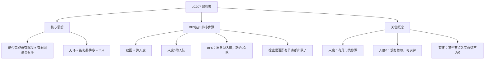
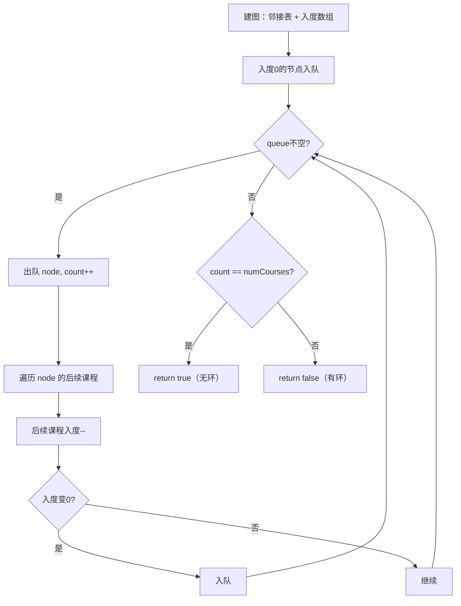

# LC207 课程表
## 一、题目描述
你这个学期必须选修 `numCourses` 门课程，记为 0 到 numCourses-1。在选修某些课程之前需要先修课程。给你先修课程数组 `prerequisites`，其中 `prerequisites[i] = [ai, bi]` 表示学习课程 `ai` 之前必须先学习课程 `bi`。判断是否可能完成所有课程的学习。
**示例1：**
```
输入：numCourses = 4, prerequisites = [[1,0],[2,0],[3,1],[3,2]]
输出：true
解释：0→1→3 和 0→2→3，一个可行顺序：0,1,2,3
  0 → 1 → 3
  0 → 2 ↗
```
**示例2：**
```
输入：numCourses = 2, prerequisites = [[1,0],[0,1]]
输出：false
解释：0和1互为先修，死锁了（有环）
  0 → 1 → 0 → ...（循环依赖）
```
**本质**：判断有向图是否有环。有环→不能完成（循环依赖），无环→能完成。
**约束：**
- 1 <= numCourses <= 2000
- 0 <= prerequisites.length <= 5000
---
## 二、解法概览
### 解法对比表
| 解法 | 时间复杂度 | 空间复杂度 | 面试推荐 |
|------|-----------|-----------|---------|
| **BFS拓扑排序（Kahn算法）** | O(V+E) | O(V+E) | ✅ **首选** |
| DFS判环 | O(V+E) | O(V+E) | ✅ 推荐 |
### 什么是拓扑排序？
```
拓扑排序 = 给有向无环图（DAG）的节点排一个合法顺序
  规则：如果有边 A→B，那么 A 必须排在 B 前面
  类比：穿衣服的顺序，先穿内衣再穿外衣，先穿袜子再穿鞋
如果图有环 → 排不出来（A要在B前面，B又要在A前面，矛盾）
所以：能拓扑排序 = 无环 = 能完成所有课程
```
### 什么是入度？
```
入度 = 一个节点有几条边指向它 = 有几门先修课
  0 → 1 → 3
  0 → 2 ↗
  节点0：入度0（没有先修课，可以直接学）
  节点1：入度1（先修0）
  节点2：入度1（先修0）
  节点3：入度2（先修1和2）
入度为0 = 没有依赖 = 可以立即开始学
```
### 思维导图

---
## 三、记忆口诀
```
课程表就是拓扑排序，判断有向图有没有环
先建图再算入度，零入度的先入队
出队把邻居入度减，减到零就入队
最后看出队个数，等于总数就能修完
```
---
## 四、解法一：BFS拓扑排序 / Kahn算法（首选 ✅）
### 思路
**模拟选课过程**：
1. 找到所有没有先修课的（入度为0），先学这些
2. 学完一门课，它后续课程的"先修要求"减1
3. 如果某门课的先修要求全部满足（入度变0），就可以学了
4. 如果最终所有课都学完了，说明没有循环依赖
### 核心公式
```
第1步：建图 + 算入度
  graph[pre] → [cur1, cur2, ...]（pre的后续课程）
  inDegree[cur]++（cur的先修课多了一门）
第2步：入度0的入队
  for i in 0..n-1: if inDegree[i]==0 → queue.offer(i)
第3步：BFS
  while queue不空:
    node = queue.poll()（学了这门课）
    count++
    for next in graph[node]:（这门课的后续课程）
      inDegree[next]--（先修要求-1）
      if inDegree[next]==0 → queue.offer(next)（可以学了）
第4步：return count == numCourses
```
### 图解过程
```
numCourses=4, pres=[[1,0],[2,0],[3,1],[3,2]]
━━━━━━━━━━━━━━━━━━━━━━━━━━━━━━━━━━
第1步：建图 + 算入度
  图：0→[1,2]  1→[3]  2→[3]  3→[]
  入度：[0, 1, 1, 2]
     课程0  课程1  课程2  课程3
  0 → 1 → 3
  0 → 2 ↗
━━━━━━━━━━━━━━━━━━━━━━━━━━━━━━━━━━
第2步：入度0的入队
  课程0入度=0 → 入队
  queue = [0], count=0
━━━━━━━━━━━━━━━━━━━━━━━━━━━━━━━━━━
第3步BFS：
  出队0，count=1
    0的后续：1和2
    inDegree[1]: 1→0 → 入队！
    inDegree[2]: 1→0 → 入队！
    queue = [1, 2]
━━━━━━━━━━━━━━━━━━━━━━━━━━━━━━━━━━
  出队1，count=2
    1的后续：3
    inDegree[3]: 2→1 → 还不能学
    queue = [2]
━━━━━━━━━━━━━━━━━━━━━━━━━━━━━━━━━━
  出队2，count=3
    2的后续：3
    inDegree[3]: 1→0 → 入队！
    queue = [3]
━━━━━━━━━━━━━━━━━━━━━━━━━━━━━━━━━━
  出队3，count=4
    3的后续：无
    queue = []
━━━━━━━━━━━━━━━━━━━━━━━━━━━━━━━━━━
第4步：count=4 == numCourses=4 → true ✅
选课顺序：0→1→2→3
```
### 有环的情况
```
numCourses=2, pres=[[1,0],[0,1]]
  图：0→[1]  1→[0]
  入度：[1, 1]（都不为0！）
  0 → 1 → 0（循环依赖）
第2步：没有入度为0的节点 → 队列为空
第3步：循环不执行 → count=0
第4步：0 != 2 → false ✅
有环的节点入度永远不会变成0，永远出不了队
```
### 算法流程图

### 代码示例
```java
public boolean canFinish(int numCourses, int[][] prerequisites) {
    // 第1步：建图 + 算入度
    List<List<Integer>> graph = new ArrayList<>();
    for (int i = 0; i < numCourses; i++) {
        graph.add(new ArrayList<>());
    }
    int[] inDegree = new int[numCourses];
    for (int[] pre : prerequisites) {
        int cur = pre[0], prev = pre[1];
        graph.get(prev).add(cur);  // prev → cur
        inDegree[cur]++;
    }
    // 第2步：入度0的入队
    Queue<Integer> queue = new LinkedList<>();
    for (int i = 0; i < numCourses; i++) {
        if (inDegree[i] == 0) {
            queue.offer(i);
        }
    }
    // 第3步：BFS
    int count = 0;
    while (!queue.isEmpty()) {
        int node = queue.poll();
        count++;
        for (int next : graph.get(node)) {
            inDegree[next]--;
            if (inDegree[next] == 0) {
                queue.offer(next);
            }
        }
    }
    // 第4步：检查是否所有课都学了
    return count == numCourses;
}
```
### 复杂度分析
- 时间复杂度：**O(V+E)**，V 是课程数，E 是先修关系数
- 空间复杂度：**O(V+E)**，邻接表 + 入度数组 + 队列
### 优缺点
| 优点 | 缺点 |
|-----|------|
| 直觉清晰：模拟选课 | 需要理解拓扑排序 |
| 面试首选 | 建图代码稍长 |
---
## 五、解法二：DFS判环
### 思路
用DFS遍历图，如果遍历过程中访问到**当前路径上已访问的节点**，说明有环。用三种状态标记节点：
- 0 = 未访问
- 1 = 当前路径上正在访问（灰色）
- 2 = 已完成访问（黑色）
### 代码示例
```java
public boolean canFinish(int numCourses, int[][] prerequisites) {
    List<List<Integer>> graph = new ArrayList<>();
    for (int i = 0; i < numCourses; i++) graph.add(new ArrayList<>());
    for (int[] pre : prerequisites) {
        graph.get(pre[1]).add(pre[0]);
    }
    int[] state = new int[numCourses]; // 0=未访问, 1=路径中, 2=已完成
    for (int i = 0; i < numCourses; i++) {
        if (hasCycle(graph, state, i)) return false;
    }
    return true;
}
private boolean hasCycle(List<List<Integer>> graph, int[] state, int node) {
    if (state[node] == 1) return true;   // 正在路径中再次访问 = 有环
    if (state[node] == 2) return false;  // 已完成 = 无环
    state[node] = 1; // 标记为路径中
    for (int next : graph.get(node)) {
        if (hasCycle(graph, state, next)) return true;
    }
    state[node] = 2; // 标记为已完成
    return false;
}
```
### 复杂度分析
- 时间复杂度：**O(V+E)**
- 空间复杂度：**O(V+E)**
### 优缺点
| 优点 | 缺点 |
|-----|------|
| DFS思路 | 三种状态不太直观 |
| 同样高效 | 不如BFS拓扑直觉好 |
---
## 六、两种解法对比
| 对比 | BFS拓扑排序 | DFS判环 |
|------|-----------|--------|
| 思路 | 模拟选课：一步步学 | 探索图：找环 |
| 判断方式 | count==n → 无环 | 遇到灰色节点 → 有环 |
| 额外产出 | 可以输出拓扑序列（LC210） | 不能 |
| 面试 | **首选** | 备选 |
### 关键点总结
| 关键点 | 说明 |
|-------|------|
| 本质是什么？ | 判断有向图是否有环 |
| 入度是什么？ | 有几门先修课 |
| 入度0的意思？ | 没有依赖，可以直接学 |
| 有环怎么判？ | 有些节点入度永远不为0，出不了队 |
| `[ai, bi]` 的方向？ | bi → ai（先学bi才能学ai） |
---
## 七、面试回答模板
### 1. 开场：转化问题
> 这道题本质是判断有向图是否有环。课程之间的先修关系构成一个有向图，如果有环就存在循环依赖，无法完成所有课程。
### 2. 思路：BFS拓扑排序
> 先建邻接表和入度数组，把入度为0的课程入队，BFS逐个出队处理。出队一门课就把它的后续课程入度减1，入度变0就入队。最后看是否所有课都出了队。
### 3. 关键细节
> `prerequisites[i] = [ai, bi]` 表示 bi→ai 方向，建图时注意方向。入度为0意味着没有先修依赖，可以直接学。
### 4. 复杂度
> 时间 O(V+E)，V 是课程数，E 是先修关系数。空间 O(V+E)。
---
## 八、相关题目
| 题号 | 题目 | 关系 | 难度 |
|-----|------|------|-----|
| LC210 | 课程表II | 输出拓扑排序序列 | 中等 |
| LC630 | 课程表III | 贪心+堆 | 困难 |
| LC269 | 火星词典 | 拓扑排序推导顺序 | 困难 |
| LC802 | 找到最终的安全状态 | DFS判环变体 | 中等 |
| LC310 | 最小高度树 | 拓扑排序剥洋葱 | 中等 |