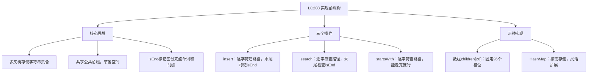
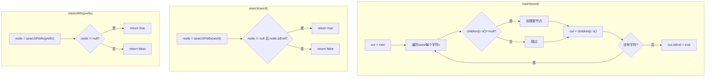

# LC208 实现前缀树（Trie）
## 一、题目描述
实现 Trie（前缀树），包含 `insert`、`search` 和 `startsWith` 三个操作。
- **Trie()** 初始化前缀树对象
- **void insert(String word)** 向前缀树中插入字符串 `word`
- **boolean search(String word)** 如果字符串 `word` 在前缀树中，返回 `true`；否则返回 `false`
- **boolean startsWith(String prefix)** 如果之前已插入的字符串中有以 `prefix` 为前缀的，返回 `true`；否则返回 `false`
**示例：**
```
输入：
["Trie", "insert", "search", "search", "startsWith", "insert", "search"]
[[], ["apple"], ["apple"], ["app"], ["app"], ["app"], ["app"]]
输出：[null, null, true, false, true, null, true]
解释：
  insert("apple")  → 树中插入 apple
  search("apple")  → true（完整单词存在）
  search("app")    → false（app不是完整单词，只是前缀）
  startsWith("app")→ true（存在以app为前缀的单词apple）
  insert("app")    → 树中插入 app
  search("app")    → true（现在app也是完整单词了）
```
**本质**：用树状结构存储字符串集合，支持高效的前缀查询。每条从根到某节点的路径表示一个前缀，节点上的标记表示是否为完整单词。
**约束：**
- 1 <= word.length, prefix.length <= 2000
- word 和 prefix 仅由小写英文字母组成
- insert、search 和 startsWith 调用次数总计不超过 3 * 10^4 次
---
## 二、解法概览
### 解法对比表
| 解法 | 时间复杂度 | 空间复杂度 | 面试推荐 |
|------|-----------|-----------|---------|
| **数组实现前缀树** | O(L) 每次操作 | O(N×26) | ✅ **首选** |
| HashMap实现前缀树 | O(L) 每次操作 | O(N×K) | ✅ 推荐（字符集大时） |
> L = 单词长度，N = 所有插入字符总数，K = 实际出现的不同字符数
### 什么是前缀树（Trie）？
```
前缀树 = 一棵多叉树，用于存储字符串集合
  特点1：根节点不存字符，每条边代表一个字符
  特点2：从根到某节点的路径 = 一个前缀
  特点3：节点上有标记（isEnd），表示到这里是一个完整单词
  类比：字典的目录结构
    apple、app、apt 共享前缀 ap
         root
        / 
       a
      /
     p → isEnd=true（app是完整单词）
    / \
   p   t → isEnd=true（apt是完整单词）
   |
   l
   |
   e → isEnd=true（apple是完整单词）
```
### search 和 startsWith 的区别
```
search("app")      → 走到p节点，检查 isEnd 是否为 true
startsWith("app")  → 走到p节点，只要能走到就返回 true
区别：search 需要 isEnd=true，startsWith 不需要
```
### 思维导图

---
## 三、记忆口诀
```
前缀树就是多叉树，每条边上挂一个字符
插入就是逐字符建路，末尾打上isEnd标记
搜索就是逐字符找路，走不通返false，走到头看isEnd
前缀查就是逐字符找路，走不通返false，走到头返true
search和startsWith只差最后一步：查不查isEnd
```
---
## 四、解法一：数组实现前缀树（首选 ✅）
### 思路
每个节点用一个长度为26的数组 `children[26]` 存储子节点，下标 `i` 对应字符 `'a'+i`。用 `isEnd` 标记是否为完整单词的结尾。三个操作都是从根节点出发，逐字符沿着树往下走。
### 核心公式
```
TrieNode结构：
  children[26]  → 26个子节点指针（对应a-z）
  isEnd         → 是否是完整单词的结尾
字符映射：
  字符c → 数组下标 = c - 'a'
insert(word)：
  cur = root
  for each char c in word:
    idx = c - 'a'
    if children[idx] == null → 新建节点
    cur = children[idx]
  cur.isEnd = true
search(word)：
  node = searchPrefix(word)
  return node != null && node.isEnd
startsWith(prefix)：
  node = searchPrefix(prefix)
  return node != null
searchPrefix(word)：（公共方法，复用逻辑）
  cur = root
  for each char c in word:
    idx = c - 'a'
    if children[idx] == null → return null
    cur = children[idx]
  return cur
```
### 图解过程
```
insert("apple") → insert("app") → search("apple") → search("ap") → startsWith("ap")
━━━━━━━━━━━━━━━━━━━━━━━━━━━━━━━━━━
第1步：insert("apple")
  root → a → p → p → l → e(isEnd=true)
  逐字符建节点：
    root.children['a'-'a'] = 新节点a
    a.children['p'-'a']    = 新节点p1
    p1.children['p'-'a']   = 新节点p2
    p2.children['l'-'a']   = 新节点l
    l.children['e'-'a']    = 新节点e
    e.isEnd = true ← 标记apple是完整单词
━━━━━━━━━━━━━━━━━━━━━━━━━━━━━━━━━━
第2步：insert("app")
  root → a → p → p(isEnd=true) → l → e(isEnd=true)
  a、p1已存在，直接复用
  p2已存在，只需标记 p2.isEnd = true
  前缀共享！不创建新节点
━━━━━━━━━━━━━━━━━━━━━━━━━━━━━━━━━━
第3步：search("apple")
  root → a(存在) → p(存在) → p(存在) → l(存在) → e(存在)
  e.isEnd = true → return true ✅
━━━━━━━━━━━━━━━━━━━━━━━━━━━━━━━━━━
第4步：search("ap")
  root → a(存在) → p(存在)
  p.isEnd = false → return false ✅
  ap只是前缀，不是完整单词
━━━━━━━━━━━━━━━━━━━━━━━━━━━━━━━━━━
第5步：startsWith("ap")
  root → a(存在) → p(存在)
  能走完 → return true ✅
  不需要检查isEnd
```
### 算法流程图

### 代码示例
```java
public class Trie {
    static class TrieNode {
        public TrieNode[] children;
        public boolean isEnd;
        public TrieNode() {
            children = new TrieNode[26];
        }
    }
    private TrieNode root;
    public Trie() {
        root = new TrieNode();
    }
    public void insert(String word) {
        TrieNode cur = root;
        for (char c : word.toCharArray()) {
            int idx = c - 'a';
            if (cur.children[idx] == null) {
                cur.children[idx] = new TrieNode();
            }
            cur = cur.children[idx];
        }
        cur.isEnd = true;
    }
    public boolean search(String word) {
        TrieNode node = searchPrefix(word);
        return node != null && node.isEnd;
    }
    public boolean startsWith(String prefix) {
        return searchPrefix(prefix) != null;
    }
    // 复用：逐字符查找前缀路径
    private TrieNode searchPrefix(String word) {
        TrieNode cur = root;
        for (char c : word.toCharArray()) {
            int idx = c - 'a';
            if (cur.children[idx] == null) {
                return null;
            }
            cur = cur.children[idx];
        }
        return cur;
    }
}
```
### 复杂度分析
- 时间复杂度：**O(L)**，L 是操作字符串的长度，每个操作都只遍历一次字符串
- 空间复杂度：**O(T×26)**，T 是所有插入字符串的字符总数（最坏情况，没有公共前缀）
### 优缺点
| 优点 | 缺点 |
|-----|------|
| 查找速度快，数组直接寻址O(1) | 每个节点固定26个槽位，空间浪费 |
| 实现简单，面试首选 | 只适用于小写字母场景 |
| 代码简洁，不易出错 | 字符集大时空间爆炸 |
---
## 五、解法二：HashMap实现前缀树
### 思路
将每个节点的 `children[26]` 数组替换为 `HashMap<Character, TrieNode>`，按需存储子节点。结构和逻辑完全一致，只是存储方式不同。适用于字符集不确定或字符集较大的场景。
### 核心公式
```
TrieNode结构：
  Map<Character, TrieNode> children  → 按需存储子节点
  boolean isEnd                      → 是否是完整单词的结尾
字符映射：
  直接用字符c作为HashMap的key
insert(word)：
  cur = root
  for each char c in word:
    if !children.containsKey(c) → children.put(c, new TrieNode())
    cur = children.get(c)
  cur.isEnd = true
```
### 图解过程
```
与数组实现逻辑完全一致，区别在于存储结构：
数组实现：children[0]=节点a, children[15]=节点p, ...（固定26个槽）
HashMap实现：{'a'=节点a, 'p'=节点p}（只存实际有的字符）
━━━━━━━━━━━━━━━━━━━━━━━━━━━━━━━━━━
insert("apple")后的HashMap结构：
  root: {'a': nodeA}
  nodeA: {'p': nodeP1}
  nodeP1: {'p': nodeP2}
  nodeP2: {'l': nodeL}   isEnd=false
  nodeL: {'e': nodeE}
  nodeE: {}               isEnd=true
━━━━━━━━━━━━━━━━━━━━━━━━━━━━━━━━━━
空间对比（插入apple）：
  数组：6个节点 × 26个槽 = 156个指针空间
  HashMap：6个节点 × 各1个entry = 5个entry空间
  节省了大量空间！
```
### 代码示例
```java
public class TrieWithMap {
    static class TrieNode {
        public Map<Character, TrieNode> children;
        public boolean isEnd;
        public TrieNode() {
            children = new HashMap<>();
        }
    }
    private TrieNode root;
    public TrieWithMap() {
        root = new TrieNode();
    }
    public void insert(String word) {
        TrieNode cur = root;
        for (char c : word.toCharArray()) {
            cur.children.putIfAbsent(c, new TrieNode());
            cur = cur.children.get(c);
        }
        cur.isEnd = true;
    }
    public boolean search(String word) {
        TrieNode node = searchPrefix(word);
        return node != null && node.isEnd;
    }
    public boolean startsWith(String prefix) {
        return searchPrefix(prefix) != null;
    }
    private TrieNode searchPrefix(String word) {
        TrieNode cur = root;
        for (char c : word.toCharArray()) {
            if (!cur.children.containsKey(c)) {
                return null;
            }
            cur = cur.children.get(c);
        }
        return cur;
    }
}
```
### 复杂度分析
- 时间复杂度：**O(L)**，L 是操作字符串的长度（HashMap的get/put均摊O(1)）
- 空间复杂度：**O(T×K)**，T 是节点总数，K 是每个节点实际的子节点数（比数组实现更节省）
### 优缺点
| 优点 | 缺点 |
|-----|------|
| 空间效率高，按需分配 | HashMap有额外开销（哈希计算、装箱拆箱） |
| 支持任意字符集（Unicode） | 查找稍慢于数组直接寻址 |
| 灵活，易扩展 | 代码略长 |
---
## 六、两种解法对比
| 对比 | 数组实现 | HashMap实现 |
|------|---------|------------|
| 子节点存储 | `TrieNode[26]` 固定数组 | `HashMap<Character, TrieNode>` |
| 查找方式 | `children[c-'a']` 直接寻址 | `children.get(c)` 哈希查找 |
| 空间效率 | 每节点固定26个槽（可能浪费） | 按需分配（更紧凑） |
| 时间效率 | 数组寻址更快 | HashMap有哈希开销 |
| 字符集 | 仅小写字母 | 任意字符 |
| 面试场景 | **首选**（LC208限定小写字母） | 面试官问扩展时提 |
### 关键点总结
| 关键点 | 说明 |
|-------|------|
| 前缀树是什么？ | 多叉树，共享公共前缀存储字符串集合 |
| insert做什么？ | 逐字符建路径，末尾标记isEnd=true |
| search和startsWith区别？ | search要检查isEnd，startsWith不用 |
| 为什么用数组[26]？ | 题目限定小写字母，数组下标寻址最快 |
| 什么时候用HashMap？ | 字符集不确定或字符集很大时 |
| 如何复用代码？ | 提取searchPrefix公共方法，search和startsWith都调用它 |
---
## 七、面试回答模板
### 1. 开场：说清数据结构
> 前缀树（Trie）是一棵多叉树，用来存储字符串集合。核心特点是公共前缀共享，比如apple和app共享前缀app，不需要重复存储。每个节点有一个children数组和一个isEnd标记。
### 2. 思路：三个操作
> **insert**：从根节点开始，逐字符往下走。如果子节点不存在就新建，走到最后一个字符时标记isEnd=true。
> **search**：逐字符往下走，走不通返回false，走到最后检查isEnd是否为true。
> **startsWith**：逐字符往下走，走不通返回false，能走完就返回true，不需要检查isEnd。
### 3. 优化细节
> search和startsWith的逻辑高度相似，可以提取一个searchPrefix公共方法复用。题目限定小写字母，所以用children[26]数组实现最高效。如果字符集更大，可以换成HashMap。
### 4. 复杂度
> 每个操作时间复杂度O(L)，L是字符串长度。空间复杂度O(T×26)，T是所有插入字符的总数。
---
## 八、相关题目
| 题号 | 题目 | 关系 | 难度 |
|-----|------|------|-----|
| LC211 | 添加与搜索单词 | Trie + DFS（支持通配符.） | 中等 |
| LC212 | 单词搜索II | Trie + 回溯（在矩阵中搜索多个单词） | 困难 |
| LC648 | 单词替换 | Trie查找最短前缀 | 中等 |
| LC677 | 键值映射 | Trie变体（节点存值） | 中等 |
| LC720 | 词典中最长的单词 | Trie + DFS/BFS | 中等 |
| LC14 | 最长公共前缀 | 可用Trie解，但有更简单方法 | 简单 |
| LC1268 | 搜索推荐系统 | Trie + 排序/优先队列 | 中等 |