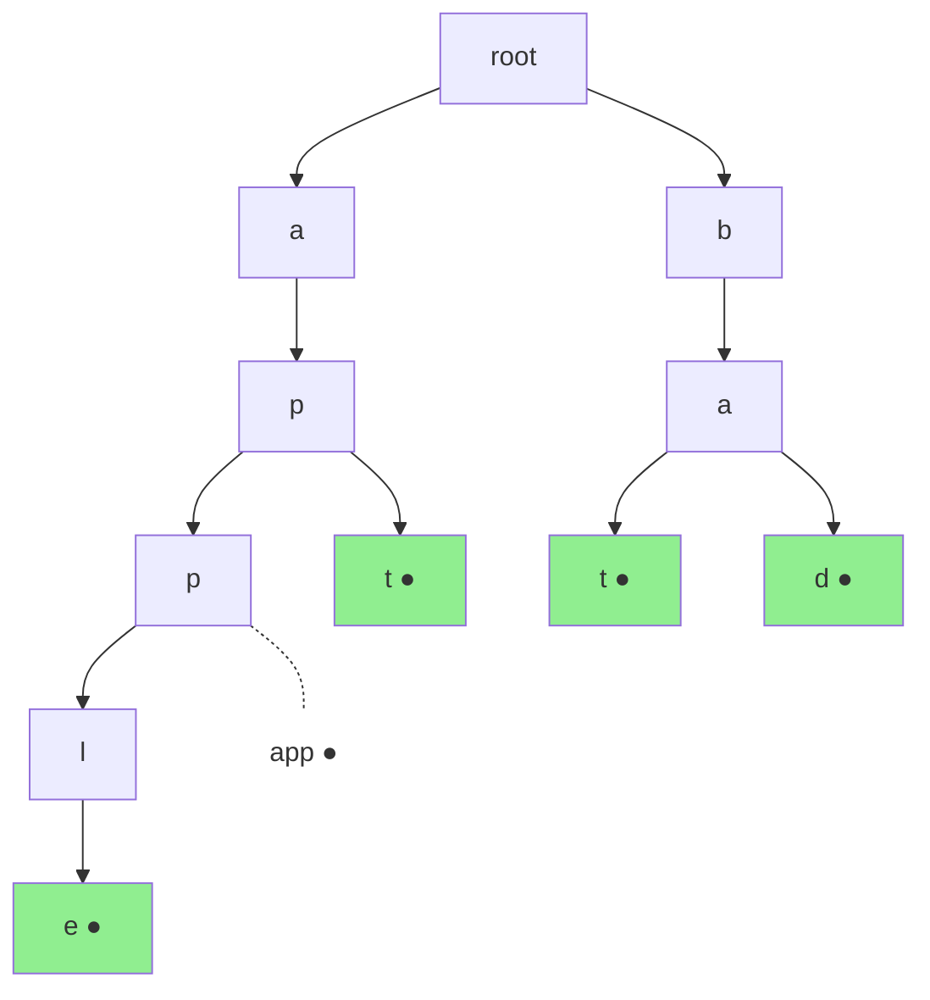
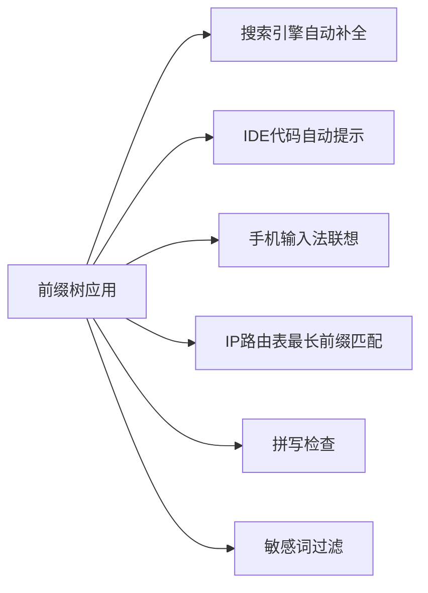

# 什么是前缀树（Trie）
## 一、一句话定义
前缀树（Trie，读音同"try"）是一种**多叉树形数据结构**，专门用来**高效存储和查找字符串集合**。它的核心思想是：**公共前缀只存一次**。
---
## 二、从生活场景理解
### 场景：手机通讯录搜索
你在手机通讯录里输入"张"，立刻显示所有姓张的联系人；继续输入"张三"，范围进一步缩小。这就是前缀匹配，背后的数据结构就是前缀树。
```
输入"张" → 张三、张三丰、张伟、张飞
输入"张三" → 张三、张三丰
输入"张三丰" → 张三丰
每多输一个字，就沿着树往下走一层，结果越来越精确
```
### 场景：搜索引擎自动补全
你在百度输入"前缀"，下拉框出现"前缀树"、"前缀和"、"前缀表达式"。搜索引擎用前缀树快速找到所有以你输入内容为前缀的候选词。
---
## 三、直观理解：和其他数据结构对比
### 如果用数组/List存储单词
```
words = ["apple", "app", "apt", "bat", "bad"]
查找"app"是否存在 → 遍历整个数组，O(N×L)
查找以"ap"开头的单词 → 遍历整个数组逐个检查，O(N×L)
N=单词个数，L=单词平均长度
```
### 如果用HashSet存储单词
```
set = {"apple", "app", "apt", "bat", "bad"}
查找"app"是否存在 → O(L)，很快
查找以"ap"开头的单词 → 还是要遍历所有单词！O(N×L)
HashSet不支持前缀查询
```
### 如果用前缀树存储单词
```
查找"app"是否存在 → 沿树走3步，O(L)
查找以"ap"开头的单词 → 沿树走2步到"ap"节点，该节点下所有路径都是结果
前缀查询天然支持，这就是前缀树的优势
```
---
## 四、前缀树长什么样
### 插入5个单词：apple、app、apt、bat、bad
```
            root（根节点，不存字符）
           /    \
          a      b
          |      |
          p      a
         / \    / \
        p    t  t   d
        |   ●  ●   ●
        l      
        |      
        e      
        ●      
● = isEnd标记，表示从根到这里是一个完整单词
```
### 逐层解读
```
第0层：root（空根节点）
第1层：a、b → 首字母只有a和b，分两个分支
第2层：p（a下面）、a（b下面）
第3层：p和t（ap下面分叉）、t和d（ba下面分叉）
第4层：l（app下面继续）
第5层：e（appl下面继续）
关键观察：
  apple和app共享前缀"app"，只存了一次！
  apple和apt共享前缀"ap"，只存了一次！
  bat和bad共享前缀"ba"，只存了一次！
```
### Mermaid图示

---
## 五、节点结构
每个前缀树节点包含两个东西：
```
┌──────────────────────────────┐
│         TrieNode             │
├──────────────────────────────┤
│ children: 指向子节点的指针    │
│   → 数组实现：TrieNode[26]   │
│   → Map实现：Map<Char, Node> │
├──────────────────────────────┤
│ isEnd: boolean               │
│   → true = 到这里是完整单词   │
│   → false = 只是某个前缀      │
└──────────────────────────────┘
```
**注意**：节点本身不存字符。字符体现在"父节点到子节点的边"上。具体来说，`children[i]` 不为空，就表示存在字符 `'a'+i` 这条边。
---
## 六、三大核心操作
### 1. 插入（insert）
```
目标：把单词"app"插入前缀树
过程：从根出发，逐字符往下走，没有路就建路，走到末尾打标记
  root --a--> 节点1 --p--> 节点2 --p--> 节点3
                                        isEnd=true
口诀：逐字符建路，末尾打标记
```
### 2. 查找（search）
```
目标：查找"app"是否是完整单词
过程：从根出发，逐字符往下走，走不通返回false，走到末尾看isEnd
  root --a--> 节点1 --p--> 节点2 --p--> 节点3
                                        isEnd=true → 返回true
  如果查找"ap"：
  root --a--> 节点1 --p--> 节点2
                           isEnd=false → 返回false（只是前缀，不是完整单词）
口诀：逐字符找路，末尾查标记
```
### 3. 前缀查询（startsWith）
```
目标：是否存在以"ap"为前缀的单词
过程：从根出发，逐字符往下走，走不通返回false，能走完就返回true
  root --a--> 节点1 --p--> 节点2
                           能走到这里 → 返回true（不管isEnd）
口诀：逐字符找路，走完就是true
```
### search与startsWith的唯一区别
```
search("ap")      → 走到节点2，检查isEnd → false → 返回false
startsWith("ap")  → 走到节点2，能走到就行 → 返回true
区别就在最后一步：查不查isEnd
```
---
## 七、为什么叫"前缀"树
```
观察这棵树存储了 apple、app、apt 三个单词：
  root → a → p → p → l → e
                 ↑
                 └→ t
从根到任意节点的路径，都是某个单词的前缀：
  root → a            → "a" 是 apple/app/apt 的前缀
  root → a → p        → "ap" 是 apple/app/apt 的前缀
  root → a → p → p    → "app" 是 apple/app 的前缀
  root → a → p → t    → "apt" 就是完整单词 apt
所以这棵树天然按前缀组织数据，前缀相同的单词共享同一条路径
这就是"前缀树"名字的由来
```
---
## 八、前缀树的优势和劣势
### 优势
| 优势 | 说明 |
|------|------|
| 前缀查询极快 | 输入几个字符就能定位到对应子树，O(L) |
| 公共前缀只存一次 | 大量相似字符串时节省空间 |
| 天然有序 | 按字典序遍历就能得到排序结果 |
| 插入和查找都是O(L) | L是字符串长度，和存了多少单词无关 |
### 劣势
| 劣势 | 说明 |
|------|------|
| 空间开销大 | 每个节点26个指针（数组实现），大部分为空 |
| 不适合精确查找 | 精确查找用HashSet更简单 |
| 字符串很长时树很深 | 递归可能栈溢出 |
---
## 九、实际应用场景

| 场景 | 怎么用 |
|------|-------|
| 搜索引擎自动补全 | 用户输入前缀，Trie快速找到所有候选词 |
| IDE代码提示 | 输入变量名前几个字符，Trie匹配所有候选 |
| 手机输入法 | 输入拼音前缀，联想完整词语 |
| IP路由最长前缀匹配 | 用二进制Trie匹配IP地址的最长前缀 |
| 拼写检查 | 逐字符在Trie中查找，找不到说明拼写错误 |
| 敏感词过滤 | 把敏感词建成Trie，扫描文本时逐字符匹配 |
---
## 十、复杂度总结
| 操作 | 时间复杂度 | 说明 |
|------|-----------|------|
| insert | O(L) | L = 单词长度 |
| search | O(L) | L = 单词长度 |
| startsWith | O(L) | L = 前缀长度 |
| 空间 | O(N×C) | N = 总字符数，C = 字符集大小（26或HashMap） |
**与HashSet对比：**
| 操作 | HashSet | Trie |
|------|---------|------|
| 插入 | O(L) | O(L) |
| 精确查找 | O(L) | O(L) |
| 前缀查找 | O(N×L) 😢 | O(L) 🎉 |
前缀查找是Trie碾压HashSet的核心场景。
---
## 十一、一张图总结前缀树
```
┌─────────────────────────────────────────────────┐
│                 前缀树（Trie）                    │
├─────────────────────────────────────────────────┤
│ 是什么：多叉树，存储字符串集合                      │
│ 核心：公共前缀只存一次                             │
│ 节点：children指针 + isEnd标记                    │
│ 三大操作：insert / search / startsWith           │
├─────────────────────────────────────────────────┤
│ insert    → 逐字符建路，末尾打标记                  │
│ search    → 逐字符找路，末尾查标记                  │
│ startsWith→ 逐字符找路，走完即true                 │
├─────────────────────────────────────────────────┤
│ 优势：前缀查询O(L)，公共前缀共享                    │
│ 劣势：空间开销大（每节点26个指针）                   │
│ 适用：自动补全、前缀匹配、敏感词过滤                 │
└─────────────────────────────────────────────────┘
```