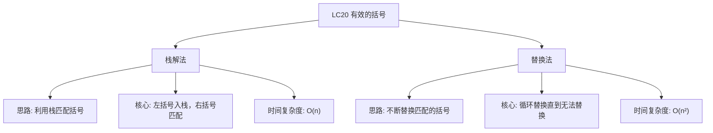

# 03-14-13-00 有效的括号解法分析
## 题目描述
给定一个只包括 '('，')'，'{'，'}'，'['，']' 的字符串 s，判断字符串是否有效。
有效字符串需满足：
1. 左括号必须用相同类型的右括号闭合。
2. 左括号必须以正确的顺序闭合。
**示例：**
输入：s = "()"
输出：true
输入：s = "()[]{}"
输出：true
输入：s = "(]"
输出：false
输入：s = "([)]"
输出：false
输入：s = "{[]}"
输出：true
## 解法概览
### 思维导图

## 记忆口诀
**有效括号判断：** 左括号入栈，右括号匹配；栈空返回假，不匹配返回假；遍历结束栈为空，判断成功。
## 不同解法
### 解法一：栈解法（最优解）
#### 思路
使用栈来处理括号匹配问题。遍历字符串，遇到左括号就入栈，遇到右括号就与栈顶元素比较，如果匹配则出栈，否则返回 false。遍历结束后，栈为空则说明所有括号都匹配成功。
#### 核心公式
- 左括号：直接入栈
- 右括号：
  - 栈为空 → 无效
  - 栈顶元素与当前右括号不匹配 → 无效
  - 栈顶元素与当前右括号匹配 → 出栈
- 遍历结束：栈为空 → 有效，否则无效
#### 图解过程
以 s = "{[]}" 为例：
1. 遇到 '{'，入栈 → 栈：['{']
2. 遇到 '['，入栈 → 栈：['{', '[']
3. 遇到 ']'，与栈顶 '[' 匹配，出栈 → 栈：['{']
4. 遇到 '}'，与栈顶 '{' 匹配，出栈 → 栈：[]
5. 遍历结束，栈为空 → 返回 true
#### 代码示例
```java
public boolean isValid(String s) {
    if (s == null || s.length() == 0) {
        return false;
    }
    // 建立括号映射表
    Map<Character, Character> map = new HashMap<>();
    map.put('(', ')');
    map.put('[', ']');
    map.put('{', '}');

    // 使用栈存储左括号
    Deque<Character> stack = new LinkedList<>();
    char[] cs = s.toCharArray();
    for (int i = 0; i < cs.length; i++) {
        char c1 = cs[i];
        if (map.containsKey(c1)) {
            // 遇到左括号，入栈
            stack.push(c1);
        } else {
            // 遇到右括号，检查栈是否为空
            if (stack.isEmpty()) {
                return false;
            }
            // 弹出栈顶元素并检查是否匹配
            char c2 = stack.pop();
            if (map.get(c2) != c1) {
                return false;
            }
        }
    }
    // 最后检查栈是否为空
    return stack.isEmpty();
}
```
#### 复杂度分析
- 时间复杂度：O(n)，只需要遍历字符串一次
- 空间复杂度：O(n)，最坏情况下栈的大小等于字符串长度
#### 优缺点
- 优点：时间复杂度最优，逻辑清晰，易于理解
- 缺点：需要额外的栈空间
### 解法二：替换法（普通解法）
#### 思路
通过不断替换字符串中匹配的括号对，直到无法替换为止。如果最终字符串为空，则说明所有括号都匹配成功。
#### 核心公式
- 循环替换 "()"、"[]"、"{}" 等匹配的括号对
- 当无法再替换时，检查字符串是否为空
#### 图解过程
以 s = "{[]}" 为例：
1. 初始字符串："{[]}"
2. 替换 "[]" → "{}"
3. 替换 "{}" → ""
4. 最终字符串为空 → 返回 true
#### 代码示例
```java
public boolean isValid(String s) {
    if (s == null || s.length() == 0) {
        return false;
    }
    int length;
    do {
        length = s.length();
        // 替换所有匹配的括号对
        s = s.replace("()", "").replace("[]", "").replace("{}", "");
    } while (length != s.length()); // 直到无法再替换
    return s.isEmpty();
}
```
#### 复杂度分析
- 时间复杂度：O(n²)，最坏情况下需要 O(n) 次替换，每次替换需要 O(n) 时间
- 空间复杂度：O(n)，字符串替换需要额外空间
#### 优缺点
- 优点：代码简洁，逻辑直观
- 缺点：时间复杂度较高，对于长字符串效率低下
## 面试回答模板
**问题：** 请判断一个字符串中的括号是否有效。
**回答：**
这是一道经典的栈应用问题。我主要使用栈的解法，时间复杂度为 O(n)。
具体思路是：
1. 使用栈来存储遇到的左括号
2. 遍历字符串，遇到左括号就入栈，遇到右括号就与栈顶元素比较
3. 如果右括号与栈顶左括号匹配，则出栈；否则返回 false
4. 遍历结束后，检查栈是否为空，为空则说明所有括号都匹配成功
**示例：** 对于字符串 "{[]}"，遍历过程中左括号入栈，右括号与栈顶元素匹配后出栈，最终栈为空，返回 true。
这种方法的优势在于时间复杂度最优，逻辑清晰，是处理括号匹配问题的标准解法。
## 相关题目
1. **LC32：最长有效括号** - 栈的应用，寻找最长有效括号子串
2. **LC22：括号生成** - 回溯法生成有效括号组合
3. **LC301：删除无效的括号** - 移除最少括号使字符串有效
4. **LC772：基本计算器 III** - 包含括号的表达式计算
这些题目都涉及到括号的处理，与LC20_有效的括号有一定的关联性。