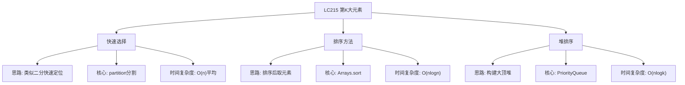

# 03-16-09-16 LC215_数组中的第K大元素解法分析
## 题目描述
给定整数数组 nums 和整数 k，请返回数组中第 k 个最大的元素。请注意，你需要找的是数组排序后的第 k 个最大的元素，而不是第 k 个不同的元素。
**示例：**
输入：nums = [3,2,3,1,2,4,5,5,6], k = 4
输出：4
输入：nums = [3,2,1,5,6,4], k = 2
输出：5
## 解法概览
### 思维导图

## 记忆口诀
**快速选择：** 快速排序变体，partition找位置；大于目标往右走，小于目标往左走。
## 不同解法
### 解法一：快速选择（最优解）
#### 思路
基于快速排序的思想，通过partition函数将数组分为两部分，使得左边的元素都小于 pivot，右边的元素都大于等于 pivot。然后根据 pivot 的位置与目标位置的关系，决定继续在左半部分还是右半部分查找。
#### 核心公式
- 目标位置：target = nums.length - k
- partition函数：返回一个位置，使得该位置左边的元素都小于该位置的元素
- 如果 pivot < target，说明第k大元素在右边，left = pivot + 1
- 如果 pivot > target，说明第k大元素在左边，right = pivot - 1
- 如果 pivot == target，找到目标，返回该位置的元素
#### 图解过程
以 nums = [3,2,1,5,6,4], k = 2 为例：
- target = 6 - 2 = 4
- partition后，假设pivot=3（元素5），位置3 < 4，继续在右边找
- 继续partition，假设pivot=5（元素6），位置5 > 4，继续在左边找
- 继续partition，假设pivot=4（元素4），位置4 == target，找到答案
#### 代码示例
```java
public int findKthLargest(int[] nums, int k) {
    int target = nums.length - k;
    int left = 0;
    int right = nums.length - 1;
    
    int pivot = partition(nums, left, right);
    while (pivot != target) {
        if (pivot < target) {
            left = pivot + 1;
        } else {
            right = pivot - 1;
        }
        pivot = partition(nums, left, right);
    }
    return nums[pivot];
}

private int partition(int[] nums, int left, int right) {
    Random random = new Random();
    int randIndex = random.nextInt(right - left + 1) + left;
    swap(nums, randIndex, right);
    
    int p1 = left - 1;
    int p2 = left;
    
    while (p2 <= right) {
        if (nums[p2] < nums[right]) {
            p1++;
            swap(nums, p1, p2);
        }
        p2++;
    }
    
    p1++;
    swap(nums, p1, right);
    return p1;
}

private void swap(int[] nums, int i, int j) {
    if (i == j) return;
    int temp = nums[i];
    nums[i] = nums[j];
    nums[j] = temp;
}
```
#### 复杂度分析
- 时间复杂度：O(n) 平均时间复杂度，最坏情况O(n^2)
- 空间复杂度：O(1)
#### 优缺点
- 优点：平均时间复杂度最优，不需要排序全部数组
- 缺点：最坏情况时间复杂度较高，可通过随机化优化
### 解法二：排序方法（普通解法）
#### 思路
直接对数组进行排序，然后返回第k大的元素。
#### 核心公式
- Arrays.sort(nums)
- return nums[nums.length - k]
#### 图解过程
以 nums = [3,2,1,5,6,4], k = 2 为例：
- 排序后：[1,2,3,4,5,6]
- 第2大元素：nums[6-2] = nums[4] = 5
#### 代码示例
```java
public int findKthLargest(int[] nums, int k) {
    Arrays.sort(nums);
    return nums[nums.length - k];
}
```
#### 复杂度分析
- 时间复杂度：O(nlogn)
- 空间复杂度：O(1)
#### 优缺点
- 优点：代码简单，容易理解
- 缺点：时间复杂度不是最优
### 解法三：堆排序（适合大数据）
#### 思路
使用最小堆，遍历数组将元素加入堆中，保持堆的大小为k，遍历结束后堆顶就是第k大的元素。
#### 核心公式
- PriorityQueue<Integer> minHeap = new PriorityQueue<>()
- 遍历数组，添加元素到堆中
- 如果堆大小超过k，移除堆顶元素
- 最终堆顶元素即为第k大的元素
#### 图解过程
以 nums = [3,2,1,5,6,4], k = 2 为例：
- 添加3：堆[3]
- 添加2：堆[2,3]
- 添加1：堆[1,3,2]
- 添加5：堆[1,3,2,5] -> 移除1 -> [2,3,5]
- 添加6：堆[2,3,5,6] -> 移除2 -> [3,5,6]
- 添加4：堆[3,5,6,4] -> 移除3 -> [4,5,6]
- 堆顶4即为第2大元素
#### 代码示例
```java
public int findKthLargest(int[] nums, int k) {
    PriorityQueue<Integer> minHeap = new PriorityQueue<>();
    for (int num : nums) {
        minHeap.offer(num);
        if (minHeap.size() > k) {
            minHeap.poll();
        }
    }
    return minHeap.peek();
}
```
#### 复杂度分析
- 时间复杂度：O(nlogk)
- 空间复杂度：O(k)
#### 优缺点
- 优点：适合数据流处理，空间可控
- 缺点：需要额外空间存储堆
## 面试回答模板
**问题：** 请找出数组中第k大的元素。
**回答：**
这是一道经典的算法题，主要有三种解法：
1. 快速选择算法：基于快速排序的思想，平均时间复杂度O(n)。通过partition函数将数组分为两部分，根据pivot位置与目标位置的关系决定搜索方向。
2. 排序方法：直接排序后取元素，时间复杂度O(nlogn)，适合对时间要求不高的场景。
3. 堆排序：使用大小为k的最小堆，时间复杂度O(nlogk)，适合大数据流处理。
面试中推荐使用快速选择算法，因为它平均时间复杂度最优。需要注意处理边界情况和随机化pivot选择以避免最坏情况。
## 相关题目
1. **LC347：前K个高频元素** - 堆排序应用
2. **LC75：颜色分类** - 荷兰国旗 partitioning
3. **LC973：最接近原点的K个点** - 堆应用
4. **LC4：有序矩阵中的第K小数** - 二分查找应用
这些题目都涉及到选择、排序和堆的思想，与LC215_数组中的第K大元素有一定的关联性。