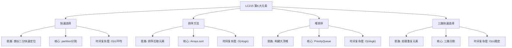

# 03-16-09-16 LC215_数组中的第K大元素解法分析
## 题目描述
给定整数数组 nums 和整数 k，请返回数组中第 k 个最大的元素。请注意，你需要找的是数组排序后的第 k 个最大的元素，而不是第 k 个不同的元素。
**示例：**
输入：nums = [3,2,3,1,2,4,5,5,6], k = 4
输出：4
输入：nums = [3,2,1,5,6,4], k = 2
输出：5
## 解法概览
### 思维导图

## 记忆口诀
**快速选择：** 快速排序变体，partition找位置；大于目标往右走，小于目标往左走。
**三路选择：** 处理重复元素，三路分割更高效；性能稳定不退化，最优解法就是它。
## 不同解法
### 解法一：快速选择（普通解法）
#### 思路
基于快速排序的思想，通过partition函数将数组分为两部分，使得左边的元素都小于 pivot，右边的元素都大于等于 pivot。然后根据 pivot 的位置与目标位置的关系，决定继续在左半部分还是右半部分查找。
#### 核心公式
- 目标位置：target = nums.length - k
- partition函数：返回一个位置，使得该位置左边的元素都小于该位置的元素
- 如果 pivot < target，说明第k大元素在右边，left = pivot + 1
- 如果 pivot > target，说明第k大元素在左边，right = pivot - 1
- 如果 pivot == target，找到目标，返回该位置的元素
#### 图解过程
以 nums = [3,2,1,5,6,4], k = 2 为例：
- target = 6 - 2 = 4
- partition后，假设pivot=3（元素5），位置3 < 4，继续在右边找
- 继续partition，假设pivot=5（元素6），位置5 > 4，继续在左边找
- 继续partition，假设pivot=4（元素4），位置4 == target，找到答案
#### 代码示例
```java
public int findKthLargest(int[] nums, int k) {
    int target = nums.length - k;
    int left = 0;
    int right = nums.length - 1;
    
    int pivot = partition(nums, left, right);
    while (pivot != target) {
        if (pivot < target) {
            left = pivot + 1;
        } else {
            right = pivot - 1;
        }
        pivot = partition(nums, left, right);
    }
    return nums[pivot];
}

private int partition(int[] nums, int left, int right) {
    Random random = new Random();
    int randIndex = random.nextInt(right - left + 1) + left;
    swap(nums, randIndex, right);
    
    int p1 = left - 1;
    int p2 = left;
    
    while (p2 <= right) {
        if (nums[p2] < nums[right]) {
            p1++;
            swap(nums, p1, p2);
        }
        p2++;
    }
    
    p1++;
    swap(nums, p1, right);
    return p1;
}

private void swap(int[] nums, int i, int j) {
    if (i == j) return;
    int temp = nums[i];
    nums[i] = nums[j];
    nums[j] = temp;
}
```
#### 复杂度分析
- 时间复杂度：O(n) 平均时间复杂度，最坏情况O(n^2)
- 空间复杂度：O(1)
#### 优缺点
- 优点：平均时间复杂度最优，不需要排序全部数组
- 缺点：最坏情况时间复杂度较高，可通过随机化优化
### 解法二：排序方法（普通解法）
#### 思路
直接对数组进行排序，然后返回第k大的元素。
#### 核心公式
- Arrays.sort(nums)
- return nums[nums.length - k]
#### 图解过程
以 nums = [3,2,1,5,6,4], k = 2 为例：
- 排序后：[1,2,3,4,5,6]
- 第2大元素：nums[6-2] = nums[4] = 5
#### 代码示例
```java
public int findKthLargest(int[] nums, int k) {
    Arrays.sort(nums);
    return nums[nums.length - k];
}
```
#### 复杂度分析
- 时间复杂度：O(nlogn)
- 空间复杂度：O(1)
#### 优缺点
- 优点：代码简单，容易理解
- 缺点：时间复杂度不是最优
### 解法三：堆排序（适合大数据）
#### 思路
使用最小堆，遍历数组将元素加入堆中，保持堆的大小为k，遍历结束后堆顶就是第k大的元素。
#### 核心公式
- PriorityQueue<Integer> minHeap = new PriorityQueue<>()
- 遍历数组，添加元素到堆中
- 如果堆大小超过k，移除堆顶元素
- 最终堆顶元素即为第k大的元素
#### 图解过程
以 nums = [3,2,1,5,6,4], k = 2 为例：
- 添加3：堆[3]
- 添加2：堆[2,3]
- 添加1：堆[1,3,2]
- 添加5：堆[1,3,2,5] -> 移除1 -> [2,3,5]
- 添加6：堆[2,3,5,6] -> 移除2 -> [3,5,6]
- 添加4：堆[3,5,6,4] -> 移除3 -> [4,5,6]
- 堆顶4即为第2大元素
#### 代码示例
```java
public int findKthLargest(int[] nums, int k) {
    PriorityQueue<Integer> minHeap = new PriorityQueue<>();
    for (int num : nums) {
        minHeap.offer(num);
        if (minHeap.size() > k) {
            minHeap.poll();
        }
    }
    return minHeap.peek();
}
```
#### 复杂度分析
- 时间复杂度：O(nlogk)
- 空间复杂度：O(k)
#### 优缺点
- 优点：适合数据流处理，空间可控
- 缺点：需要额外空间存储堆
### 解法四：三路快速选择（最优解，处理重复元素）
#### 思路
三路快速选择是解决包含大量重复元素情况的最优方案。它将数组分为三个区间：小于pivot、等于pivot、大于pivot。这种方法的核心优势在于：当遇到大量重复元素时，能一次性处理所有相等的元素，避免了传统快速选择算法在极端情况下（如所有元素相同）退化为O(n²)的问题。

**三路分割的工作原理：**
1. 随机选择一个pivot元素
2. 使用三个指针将数组分为三个部分：
   - lt：小于pivot的元素的右边界
   - i：当前遍历的位置
   - gt：大于pivot的元素的左边界
3. 遍历过程中，根据当前元素与pivot的大小关系，进行相应的交换操作
4. 遍历结束后，pivot元素会被放到正确的位置
5. 根据target位置与三个区间的关系，决定在哪个区间继续搜索

#### 核心公式
- 目标位置：target = nums.length - k
- 三路分割：将数组分为[left, lt] < pivot，[lt+1, gt-1] = pivot，[gt, right] > pivot
- 搜索方向：
  - target <= lt：在左半部分搜索
  - target >= gt：在右半部分搜索
  - 否则：target在等于pivot的部分，直接返回

#### 图解过程
以 nums = [3,2,3,1,2,4,5,5,6], k = 4 为例：
- target = 9 - 4 = 5（第4大元素，对应排序后位置5的元素）
- 随机选择pivot，假设为3
- 三路分割后：[1,2,2] < 3，[3,3] = 3，[4,5,5,6] > 3
- 检查target=5是否在等于pivot的区间（lt=2, gt=4），5 >= gt，所以在右半部分搜索
- 在右半部分[4,5,5,6]中继续三路分割
- 最终找到target位置的元素4

#### 代码示例（带详细注释）
```java
public int findKthLargest(int[] nums, int k) {
    // 计算目标位置：第k大元素在排序数组中的索引
    int target = nums.length - k;
    // 调用三路快速选择函数
    return quickSelect(nums, 0, nums.length - 1, target);
}

private int quickSelect(int[] nums, int left, int right, int target) {
    // 递归终止条件：当区间只包含一个元素时，直接返回
    if (left == right) {
        return nums[left];
    }
    
    // 随机选择pivot，避免最坏情况
    int random = new Random().nextInt(right - left + 1) + left;
    swap(nums, random, right);
    
    // 三路分割的核心逻辑
    int pivot = nums[right];  // 选择最右元素作为pivot
    int lt = left - 1;        // 小于pivot的右边界（初始为left-1）
    int gt = right;           // 大于pivot的左边界（初始为right）
    int i = left;             // 当前遍历位置（从left开始）
    
    // 遍历过程：将数组分为三部分
    while (i < gt) {
        if (nums[i] < pivot) {
            // 当前元素小于pivot，放到左侧
            lt++;
            swap(nums, lt, i);
            i++;  // 继续下一个元素
        } else if (nums[i] > pivot) {
            // 当前元素大于pivot，放到右侧
            gt--;
            swap(nums, gt, i);
            // 注意：这里i不增加，因为交换过来的元素还没检查
        } else {
            // 当前元素等于pivot，保持在中间
            i++;
        }
    }
    // 将pivot放到正确的位置（大于pivot区间的最左侧）
    swap(nums, gt, right);
    
    // 根据target的位置决定搜索方向
    if (target <= lt) {
        // target在小于pivot的区间，在左半部分继续搜索
        return quickSelect(nums, left, lt, target);
    } else if (target >= gt) {
        // target在大于pivot的区间，在右半部分继续搜索
        return quickSelect(nums, gt, right, target);
    } else {
        // target在等于pivot的区间，直接返回该位置的元素
        return nums[target];
    }
}

private void swap(int[] nums, int i, int j) {
    // 避免自我交换
    if (i == j) return;
    int temp = nums[i];
    nums[i] = nums[j];
    nums[j] = temp;
}
```

#### 复杂度分析
- **时间复杂度：** O(n) 平均时间复杂度，最坏情况也是O(n)。因为每次处理都能过滤掉大量重复元素，不会出现传统快速选择的退化情况。
- **空间复杂度：** O(logn) 递归栈深度，由于每次递归都会将问题规模显著缩小。

#### 优缺点
- **优点：**
  - 处理重复元素时性能稳定，不会退化
  - 平均时间复杂度最优，为O(n)
  - 适用于各种输入情况，包括极端情况（如所有元素相同）
  - 代码逻辑清晰，易于理解
- **缺点：**
  - 代码相对传统快速选择稍显复杂
  - 需要递归调用，栈空间开销比迭代版本稍大
## 面试回答模板
**问题：** 请找出数组中第k大的元素。
**回答：**
这是一道经典的算法题，主要有四种解法：
1. **排序方法**：直接排序后取元素，时间复杂度O(nlogn)。虽然代码简单，但时间复杂度较高，在大数据量情况下可能超时。
2. **堆排序**：使用大小为k的最小堆，时间复杂度O(nlogk)。适合大数据流处理，但对于包含大量重复元素的情况，性能不如三路快速选择。
3. **快速选择算法**：基于快速排序的思想，平均时间复杂度O(n)。但在极端情况下（如所有元素相同）会退化为O(n²)，导致超时。
4. **三路快速选择**：将数组分为小于、等于、大于pivot的三部分，时间复杂度O(n)且性能稳定，不会因重复元素而退化。

**最优选择：** 三路快速选择是本题的最优解，因为它在各种情况下都能保持O(n)的时间复杂度，特别是在处理包含大量重复元素的测试用例时，能有效避免其他算法的性能退化问题。面试中推荐使用三路快速选择算法，既展示了对算法的深入理解，又能应对各种边界情况。
## 相关题目
1. **LC347：前K个高频元素** - 堆排序应用
2. **LC75：颜色分类** - 荷兰国旗 partitioning
3. **LC973：最接近原点的K个点** - 堆应用
4. **LC4：有序矩阵中的第K小数** - 二分查找应用
这些题目都涉及到选择、排序和堆的思想，与LC215_数组中的第K大元素有一定的关联性。