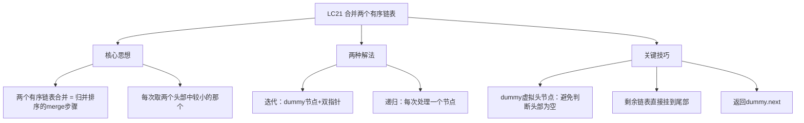
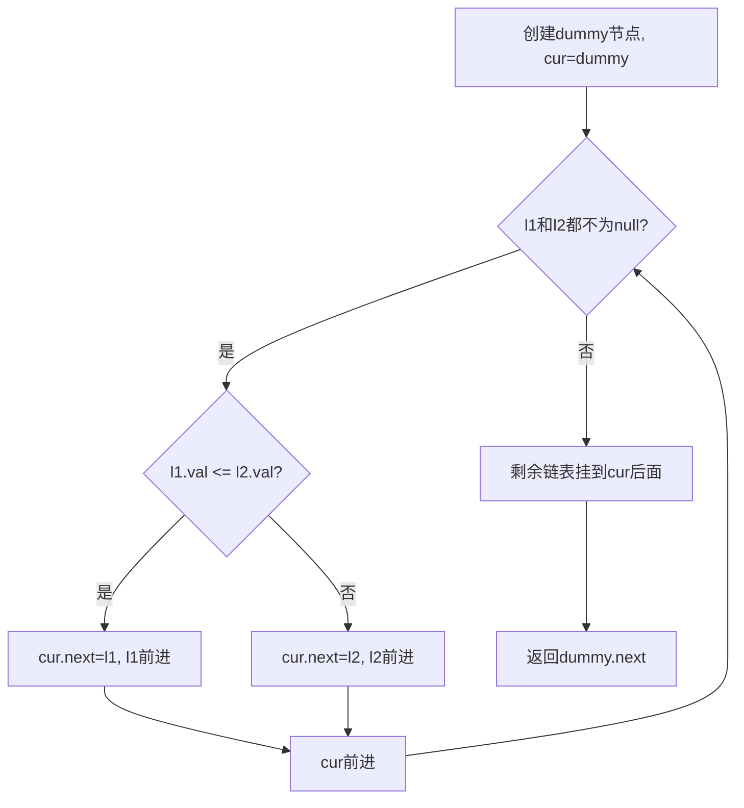
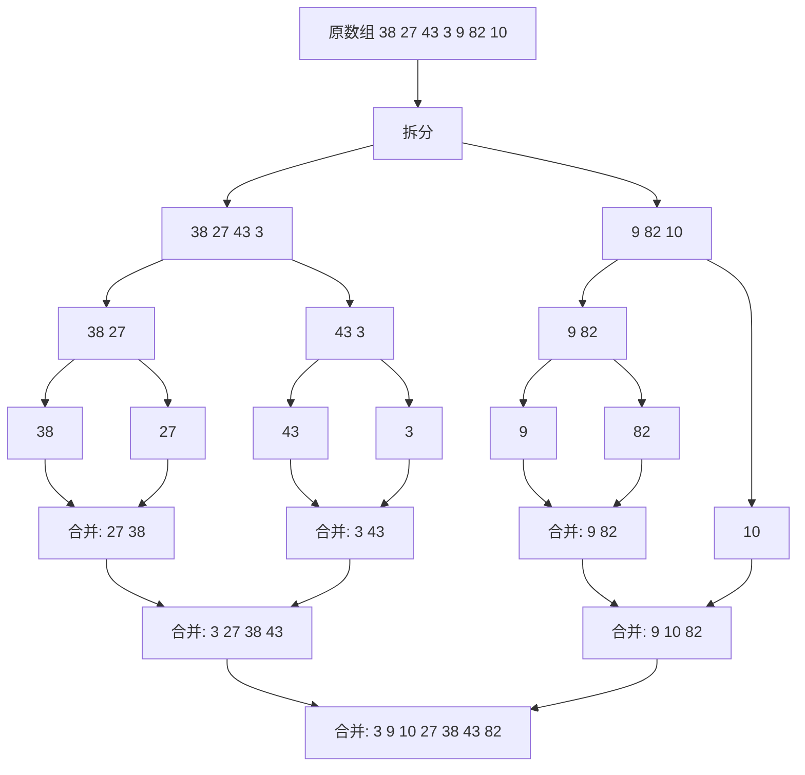

# LC21 合并两个有序链表
## 一、题目描述
将两个升序链表合并为一个新的**升序**链表并返回。新链表是通过拼接给定的两个链表的所有节点组成的。
**示例1：**
```
输入：l1 = [1,2,4], l2 = [1,3,4]
输出：[1,1,2,3,4,4]
  l1: 1 → 2 → 4
  l2: 1 → 3 → 4
  结果: 1 → 1 → 2 → 3 → 4 → 4
```
**示例2：**
```
输入：l1 = [], l2 = [0]
输出：[0]
```
**约束：**
- 两个链表的节点数目范围 [0, 50]
- 节点值 -100 <= Node.val <= 100
- 两个链表均按非递减顺序排列
---
## 二、解法概览
### 解法对比表
| 解法 | 时间复杂度 | 空间复杂度 | 面试推荐 |
|------|-----------|-----------|---------|
| **迭代（虚拟头节点）** | O(m+n) | O(1) | ✅ **首选** |
| 递归 | O(m+n) | O(m+n) | ✅ 进阶 |
### 思维导图

---
## 三、记忆口诀
```
合并链表用dummy，虚拟头节点开路先
两个都有比大小，小的接上往前走
一个走完另一个，剩余直接挂后面
最后返回dummy的next
```
---
## 四、解法一：迭代 / 虚拟头节点（首选 ✅）
### 思路
1. 创建一个**虚拟头节点 dummy**，用 cur 指针构建结果链表
2. 每次比较 l1 和 l2 的当前节点，把**较小的**接到 cur 后面
3. 一个链表遍历完后，把另一个**剩余部分直接挂到末尾**
### 核心公式
```
while l1 != null && l2 != null:
    if l1.val <= l2.val → 接 l1
    else → 接 l2
剩余的直接挂上
```
### 为什么需要 dummy 虚拟头节点？
**核心问题**：合并链表时，第一个节点还不知道是谁，head 还没初始化。
**没有 dummy 时的窘境：**
```java
// 没有 dummy 的写法
ListNode head = null;  // 头还不知道是谁
ListNode cur = null;   // cur 也是 null
while (l1 != null && l2 != null) {
    ListNode smaller = (l1.val <= l2.val) ? l1 : l2;
    // 第一次：head 和 cur 都是 null，不能 cur.next = smaller
    // 必须特判！
    if (head == null) {
        head = smaller;    // 特判：第一个节点
        cur = head;
    } else {
        cur.next = smaller; // 后续节点
        cur = cur.next;
    }
    if (l1.val <= l2.val) l1 = l1.next;
    else l2 = l2.next;
}
cur.next = (l1 != null) ? l1 : l2;
return head;
```
每次循环都要 `if (head == null)` 判断，很烦。
**有了 dummy 之后：**
```java
// 有 dummy 的写法
ListNode dummy = new ListNode(-1);  // 占位符，永远在最前面
ListNode cur = dummy;               // cur 一开始就不是 null
while (...) {
    cur.next = smaller;  // 统一处理，不需要特判
    cur = cur.next;
}
return dummy.next;  // 跳过占位符，返回真正的头
```
**用图对比：**
```
没有 dummy：
  head=null, cur=null  → 第一步必须特判
  第1步特判：head=1, cur=1
  第2步正常：cur.next=1, cur=1
  ...
有了 dummy：
  dummy(-1) → null,  cur=dummy  → cur 不是 null，可以直接操作
  第1步正常：dummy(-1) → 1,  cur=1
  第2步正常：dummy(-1) → 1 → 1,  cur=1
  ...
  返回 dummy.next = 1 → 1 → ...
```
> **一句话**：dummy 的作用就是**让第一步和后续步骤的代码完全一样**，消除了"头节点还没初始化"的特判。
### 图解过程
```
l1: 1 → 2 → 4
l2: 1 → 3 → 4
dummy → null,  cur = dummy
━━━━━━━━━━━━━━━━━━━━━━━━━━━━━━━━━━
第1步：l1.val=1 <= l2.val=1 → 接 l1(1)
  dummy → 1    l1=2, l2=1, cur=1
━━━━━━━━━━━━━━━━━━━━━━━━━━━━━━━━━━
第2步：l1.val=2 > l2.val=1 → 接 l2(1)
  dummy → 1 → 1    l1=2, l2=3, cur=1(第二个)
━━━━━━━━━━━━━━━━━━━━━━━━━━━━━━━━━━
第3步：l1.val=2 <= l2.val=3 → 接 l1(2)
  dummy → 1 → 1 → 2    l1=4, l2=3, cur=2
━━━━━━━━━━━━━━━━━━━━━━━━━━━━━━━━━━
第4步：l1.val=4 > l2.val=3 → 接 l2(3)
  dummy → 1 → 1 → 2 → 3    l1=4, l2=4, cur=3
━━━━━━━━━━━━━━━━━━━━━━━━━━━━━━━━━━
第5步：l1.val=4 <= l2.val=4 → 接 l1(4)
  dummy → 1 → 1 → 2 → 3 → 4    l1=null, l2=4, cur=4
━━━━━━━━━━━━━━━━━━━━━━━━━━━━━━━━━━
l1=null，循环结束
剩余：l2 还有 4 → 直接挂上
  dummy → 1 → 1 → 2 → 3 → 4 → 4
返回 dummy.next = 1 → 1 → 2 → 3 → 4 → 4 ✅
```
### 算法流程图

### 代码示例
```java
public ListNode mergeTwoLists(ListNode l1, ListNode l2) {
    // 虚拟头节点
    ListNode dummy = new ListNode(-1);
    ListNode cur = dummy;
    // 两个都有才比较
    while (l1 != null && l2 != null) {
        if (l1.val <= l2.val) {
            cur.next = l1;
            l1 = l1.next;
        } else {
            cur.next = l2;
            l2 = l2.next;
        }
        cur = cur.next;
    }
    // 剩余的直接挂上
    cur.next = (l1 != null) ? l1 : l2;
    return dummy.next;
}
```
### 不用 dummy 的写法
```java
public ListNode mergeTwoLists(ListNode l1, ListNode l2) {
    // 特判：一个为空直接返回另一个
    if (l1 == null) return l2;
    if (l2 == null) return l1;
    // 确定头节点（取较小的那个）
    ListNode head;
    if (l1.val <= l2.val) {
        head = l1;
        l1 = l1.next;
    } else {
        head = l2;
        l2 = l2.next;
    }
    // 后续节点正常处理
    ListNode cur = head;
    while (l1 != null && l2 != null) {
        if (l1.val <= l2.val) {
            cur.next = l1;
            l1 = l1.next;
        } else {
            cur.next = l2;
            l2 = l2.next;
        }
        cur = cur.next;
    }
    cur.next = (l1 != null) ? l1 : l2;
    return head;
}
```
### 两种写法对比
| 对比 | 有 dummy | 无 dummy |
|------|---------|---------|
| 头节点处理 | 统一，无需特判 | 需要单独确定 head |
| 代码行数 | 更少 | 更多 |
| 可读性 | 简洁 | 直观但啰嗦 |
| 推荐 | **推荐** | 理解用 |
### 复杂度分析
- 时间复杂度：**O(m+n)**，每个节点只处理一次
- 空间复杂度：**O(1)**，只用了 dummy 和 cur 两个指针
### 优缺点
| 优点 | 缺点 |
|-----|------|
| 空间 O(1) | 需要理解 dummy 节点 |
| 代码简洁清晰 | 无 |
| 面试首选 | 无 |
---
## 五、解法二：递归
### 思路
每次比较两个链表头节点，取较小的那个作为当前节点，然后**递归处理剩余部分**。
### 核心公式
```
mergeTwoLists(l1, l2):
  if l1 == null → return l2
  if l2 == null → return l1
  if l1.val <= l2.val:
      l1.next = mergeTwoLists(l1.next, l2)
      return l1
  else:
      l2.next = mergeTwoLists(l1, l2.next)
      return l2
```
### 递归怎么理解？
```
"我只管当前这一步，剩下的交给递归"
比较 l1 和 l2 的头：
  l1 更小 → l1 排前面，l1.next 接上"剩余的合并结果"
  l2 更小 → l2 排前面，l2.next 接上"剩余的合并结果"
终止条件：一个为 null，返回另一个
```
### 图解过程
```
l1: 1 → 2 → 4
l2: 1 → 3 → 4
━━━━━━━━━━━━━━━━━━━━━━━━━━━━━━━━━━
merge(1→2→4, 1→3→4)
  1<=1, 取l1(1), 1.next = merge(2→4, 1→3→4)
    merge(2→4, 1→3→4)
      2>1, 取l2(1), 1.next = merge(2→4, 3→4)
        merge(2→4, 3→4)
          2<=3, 取l1(2), 2.next = merge(4, 3→4)
            merge(4, 3→4)
              4>3, 取l2(3), 3.next = merge(4, 4)
                merge(4, 4)
                  4<=4, 取l1(4), 4.next = merge(null, 4)
                    merge(null, 4) → return 4
                  4.next = 4, return 4→4
                3.next = 4→4, return 3→4→4
              2.next = 3→4→4, return 2→3→4→4
            1.next = 2→3→4→4, return 1→2→3→4→4
          1.next = 1→2→3→4→4, return 1→1→2→3→4→4 ✅
```
### 代码示例
```java
public ListNode mergeTwoLists(ListNode l1, ListNode l2) {
    // 终止条件
    if (l1 == null) return l2;
    if (l2 == null) return l1;
    // 取较小的接上，递归处理剩余
    if (l1.val <= l2.val) {
        l1.next = mergeTwoLists(l1.next, l2);
        return l1;
    } else {
        l2.next = mergeTwoLists(l1, l2.next);
        return l2;
    }
}
```
### 复杂度分析
- 时间复杂度：**O(m+n)**，每个节点递归处理一次
- 空间复杂度：**O(m+n)**，递归栈深度
### 优缺点
| 优点 | 缺点 |
|-----|------|
| 代码优雅简洁 | O(m+n) 栈空间 |
| 递归思想 | 链表太长会栈溢出 |
| 面试加分 | 不如迭代直观 |
---
## 六、两种解法对比
| 对比 | 迭代 | 递归 |
|------|------|------|
| 方向 | 从前往后逐个接 | 每次处理一个，递归剩余 |
| 空间 | O(1) | O(m+n) 递归栈 |
| 难度 | 理解 dummy | 理解递归 |
| 推荐 | **首选** | 进阶/追问 |
---
## 七、归并排序与 LC21 的关系
### 什么是归并排序？
归并排序是一种**分治算法**，核心思想就三个字：**拆、排、合**。
```
把一个大问题拆成两个小问题，分别解决，最后合并结果。
就像整理一副乱牌：
  1. 拆：把牌分成左右两半
  2. 排：每半各自排好序（递归）
  3. 合：两堆已排好的牌，合并成一堆有序的
```
### 归并排序的流程图

### 拆、排、合 三步详解
```
原数组：[38, 27, 43, 3, 9, 82, 10]
━━━━━━━━━━━━━━━━━━━━━━━━━━━━━━━━━━
第1步：拆 — 不断对半分，直到每段只有1个元素
  [38,27,43,3] [9,82,10]
  [38,27] [43,3] [9,82] [10]
  [38] [27] [43] [3] [9] [82] [10]
  1个元素天然有序，不需要排
━━━━━━━━━━━━━━━━━━━━━━━━━━━━━━━━━━
第2步：合 — 两两合并（这一步就是 LC21！）
  [27,38] [3,43] [9,82] [10]    ← 每对合并
  [3,27,38,43] [9,10,82]        ← 再合并
  [3,9,10,27,38,43,82]          ← 最终合并
每次合并，都是"两个有序序列合并成一个" = LC21
```
### LC21 就是归并排序的"合"步骤
```
归并排序 = 拆 + 递归排序 + 合并
                              ↑
                         LC21 就是这一步
所以掌握了 LC21，就掌握了归并排序的核心！
```
### 归并排序代码（数组版）
```java
public void mergeSort(int[] arr, int left, int right) {
    if (left >= right) return;  // 只有1个元素，天然有序
    int mid = left + (right - left) / 2;
    mergeSort(arr, left, mid);      // 排左半
    mergeSort(arr, mid + 1, right); // 排右半
    merge(arr, left, mid, right);   // 合并（= LC21）
}
// 合并两个有序区间 [left,mid] 和 [mid+1,right]
private void merge(int[] arr, int left, int mid, int right) {
    int[] temp = new int[right - left + 1];
    int i = left, j = mid + 1, k = 0;
    // 两边都有，取较小的（和 LC21 完全一样！）
    while (i <= mid && j <= right) {
        if (arr[i] <= arr[j]) {
            temp[k++] = arr[i++];
        } else {
            temp[k++] = arr[j++];
        }
    }
    // 剩余的直接放进去
    while (i <= mid) temp[k++] = arr[i++];
    while (j <= right) temp[k++] = arr[j++];
    // 拷贝回原数组
    System.arraycopy(temp, 0, arr, left, temp.length);
}
```
### 归并排序代码（链表版 = LC148）
```java
public ListNode sortList(ListNode head) {
    if (head == null || head.next == null) return head;
    // 1. 拆：快慢指针找中点
    ListNode slow = head, fast = head.next;
    while (fast != null && fast.next != null) {
        slow = slow.next;
        fast = fast.next.next;
    }
    ListNode mid = slow.next;
    slow.next = null;  // 断开
    // 2. 排：递归排左右两半
    ListNode left = sortList(head);
    ListNode right = sortList(mid);
    // 3. 合：合并两个有序链表（= LC21！）
    return mergeTwoLists(left, right);
}
```
### 归并排序通用思路总结
| 步骤 | 做什么 | 对应题目 |
|------|--------|---------|
| **拆** | 对半分，直到不可分 | 二分/快慢指针找中点 |
| **排** | 递归排序每一半 | 递归调用自身 |
| **合** | 合并两个有序序列 | **LC21** 合并两个有序链表 |
### 归并排序的复杂度
| 指标 | 复杂度 | 说明 |
|------|--------|------|
| 时间 | O(n logn) | 拆了 logn 层，每层合并 O(n) |
| 空间（数组版） | O(n) | 需要临时数组 |
| 空间（链表版） | O(logn) | 只有递归栈，不需要额外数组 |
| 稳定性 | 稳定 | 相等元素不会交换位置 |
### 相关题目串联
```
LC21  合并两个有序链表  → 归并排序的"合"步骤
LC23  合并K个升序链表   → 多路归并（分治或优先队列）
LC148 排序链表          → 链表上的完整归并排序
LC88  合并两个有序数组  → 数组版的"合"步骤
LC912 排序数组          → 数组上的完整归并排序
```
---
## 八、dummy 节点的通用技巧（补充）
```
dummy（虚拟头节点）在链表题中非常常用：
  作用：避免对头节点的特殊处理
  模式：
    ListNode dummy = new ListNode(-1);
    ListNode cur = dummy;
    ... 构建链表 ...
    return dummy.next;
  适用场景：
    合并链表、删除节点、分隔链表等
    所有"需要构建新链表"或"头节点可能变化"的题
```
---
## 九、面试回答模板
### 1. 开场：理解题意
> 这道题把两个有序链表合并成一个有序链表，本质就是归并排序的 merge 步骤。
### 2. 思路：迭代+dummy
> 用一个虚拟头节点 dummy 避免头部特判，然后双指针遍历两个链表，每次取较小的接到结果后面。一个链表遍历完后，把另一个剩余部分直接挂到末尾。
### 3. 关键细节
> 用 dummy 虚拟头节点让代码更简洁，最后返回 dummy.next。剩余链表不需要逐个接，因为本身就是有序的，直接挂上即可。
### 4. 复杂度
> 时间 O(m+n)，每个节点处理一次。空间 O(1)，只用了两个指针。
---
## 十、相关题目
| 题号 | 题目 | 关系 | 难度 |
|-----|------|------|-----|
| LC23 | 合并K个升序链表 | 进阶：多链表合并 | 困难 |
| LC88 | 合并两个有序数组 | 数组版本 | 简单 |
| LC148 | 排序链表 | 归并排序（用到merge） | 中等 |
| LC2 | 两数相加 | 链表双指针遍历 | 中等 |
| LC86 | 分隔链表 | dummy节点技巧 | 中等 |
| LC206 | 反转链表 | 链表基础 | 简单 |