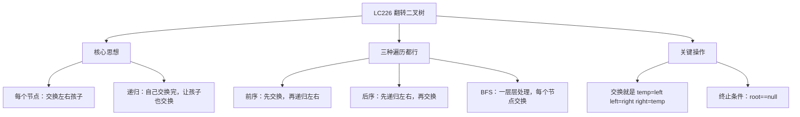

# LC226 翻转二叉树
## 一、题目描述
给你一棵二叉树的根节点 `root`，翻转这棵二叉树，并返回其根节点。翻转就是把每个节点的**左右子树交换**。
**示例：**
```
翻转前：        翻转后：
     4               4
   /   \            /   \
  2     7    →    7     2
 / \   / \       / \   / \
1   3 6   9     9   6 3   1
```
**约束：**
- 树的节点数范围 [0, 100]
---
## 二、解法概览
### 解法对比表
| 解法 | 时间复杂度 | 空间复杂度 | 面试推荐 |
|------|-----------|-----------|---------|
| **DFS递归（前序/后序）** | O(n) | O(h) | ✅ **首选** |
| BFS层序遍历 | O(n) | O(w) | ✅ 推荐 |
### 思维导图

---
## 三、记忆口诀
```
翻转二叉树很简单，每个节点换左右
递归到空就返回，先换后递或先递后换
三行交换搞定它，面试秒杀不用想
```
---
## 四、解法一：DFS递归 — 前序遍历（首选 ✅）
### 思路
**自顶向下**：先交换当前节点的左右孩子，再递归翻转左子树和右子树。
### 核心公式
```
invertTree(root):
  if root == null → return null
  交换 root.left 和 root.right    // 先交换
  invertTree(root.left)            // 再递归左
  invertTree(root.right)           // 再递归右
  return root
```
### 怎么理解？
```
你是节点4（老板），你要翻转整棵树：
  1. 先把自己的左右孩子换一下（2和7互换）
  2. 然后跟左孩子说："你把你那边也翻转一下"
  3. 再跟右孩子说："你也把你那边翻转一下"
  每个员工（节点）只管做两件事：换自己的孩子 + 让孩子继续换
```
### 图解过程
```
原始树：
     4
   /   \
  2     7
 / \   / \
1   3 6   9
━━━━━━━━━━━━━━━━━━━━━━━━━━━━━━━━━━
处理节点4：交换左右孩子（2↔7）
     4
   /   \
  7     2        ← 2和7换了位置
 / \   / \
6   9 1   3      ← 子树跟着走
━━━━━━━━━━━━━━━━━━━━━━━━━━━━━━━━━━
递归处理节点7：交换左右孩子（6↔9）
     4
   /   \
  7     2
 / \   / \
9   6 1   3      ← 6和9换了
━━━━━━━━━━━━━━━━━━━━━━━━━━━━━━━━━━
递归处理节点9：叶子，左右都是null，交换也没变化
递归处理节点6：叶子，同上
━━━━━━━━━━━━━━━━━━━━━━━━━━━━━━━━━━
递归处理节点2：交换左右孩子（1↔3）
     4
   /   \
  7     2
 / \   / \
9   6 3   1      ← 1和3换了
━━━━━━━━━━━━━━━━━━━━━━━━━━━━━━━━━━
递归处理节点3和1：叶子，无变化
最终结果：
     4
   /   \
  7     2
 / \   / \
9   6 3   1  ✅
```
### 代码示例
```java
public TreeNode invertTree(TreeNode root) {
    if (root == null) return null;
    // 交换左右孩子
    TreeNode temp = root.left;
    root.left = root.right;
    root.right = temp;
    // 递归翻转左右子树
    invertTree(root.left);
    invertTree(root.right);
    return root;
}
```
### 复杂度分析
- 时间复杂度：**O(n)**，每个节点访问一次
- 空间复杂度：**O(h)**，递归栈深度。最坏 O(n)，平衡树 O(logn)
### 优缺点
| 优点 | 缺点 |
|-----|------|
| 代码极简 | 链状树可能栈溢出 |
| 直觉清晰 | 无 |
---
## 五、解法二：DFS递归 — 后序遍历
### 思路
**自底向上**：先递归翻转左右子树，再交换当前节点的左右孩子。
### 和前序有什么区别？
```
前序（先交换再递归）：
  交换 left, right
  invertTree(left)    ← 注意：此时left已经是原来的right了
  invertTree(right)
后序（先递归再交换）：
  invertTree(left)    ← 先把左子树翻转好
  invertTree(right)   ← 再把右子树翻转好
  交换 left, right    ← 最后把翻转好的两棵子树换位置
两种都正确，结果完全一样
```
### 代码示例
```java
public TreeNode invertTree(TreeNode root) {
    if (root == null) return null;
    // 先递归翻转左右子树
    invertTree(root.left);
    invertTree(root.right);
    // 再交换左右孩子
    TreeNode temp = root.left;
    root.left = root.right;
    root.right = temp;
    return root;
}
```
### 复杂度分析
- 时间复杂度：**O(n)**
- 空间复杂度：**O(h)**
---
## 六、解法三：BFS层序遍历
### 思路
用队列一层一层处理，每个节点出队时交换它的左右孩子。
### 图解过程
```
     4          queue = [4]
   /   \
  2     7
 / \   / \
1   3 6   9
━━━━━━━━━━━━━━━━━━━━━━━━━━━━━━━━━━
弹出4，交换4的左右（2↔7），入队7和2
queue = [7, 2]
     4
   /   \
  7     2
━━━━━━━━━━━━━━━━━━━━━━━━━━━━━━━━━━
弹出7，交换7的左右（6↔9），入队9和6
弹出2，交换2的左右（1↔3），入队3和1
queue = [9, 6, 3, 1]
━━━━━━━━━━━━━━━━━━━━━━━━━━━━━━━━━━
弹出9,6,3,1 → 都是叶子，无孩子可换
queue为空，结束
```
### 代码示例
```java
public TreeNode invertTree(TreeNode root) {
    if (root == null) return null;
    Queue<TreeNode> queue = new LinkedList<>();
    queue.offer(root);
    while (!queue.isEmpty()) {
        TreeNode node = queue.poll();
        // 交换左右孩子
        TreeNode temp = node.left;
        node.left = node.right;
        node.right = temp;
        // 孩子入队
        if (node.left != null) queue.offer(node.left);
        if (node.right != null) queue.offer(node.right);
    }
    return root;
}
```
### 复杂度分析
- 时间复杂度：**O(n)**
- 空间复杂度：**O(w)**，w 是最大宽度
---
## 七、三种解法对比
| 对比 | 前序DFS | 后序DFS | BFS |
|------|---------|---------|-----|
| 顺序 | 先换再递归 | 先递归再换 | 一层层换 |
| 代码 | 最简 | 和前序一样简 | 稍长 |
| 面试 | **首选** | 也可以 | 追问时用 |
### 为什么中序遍历不行？
```
中序（左→换→右）：
  invertTree(root.left)    // 先处理左子树
  交换 left, right          // 交换
  invertTree(root.right)   // 处理右子树 ← 但此时right是原来的left！
                           // 原来的left被处理了两次，原来的right一次都没处理
所以中序不行！交换后左右身份变了，会导致一边处理两次另一边没处理
```
---
## 八、面试回答模板
### 1. 开场：理解题意
> 翻转二叉树就是把每个节点的左右子树交换。
### 2. 思路：前序递归
> 每个节点做两件事：交换自己的左右孩子，然后递归让左右子树也各自翻转。终止条件是空节点返回 null。
### 3. 代码
> 三行核心代码：判空返回，交换左右，递归左右。
### 4. 复杂度
> 时间 O(n)，每个节点访问一次。空间 O(h)，递归栈深度等于树高。
---
## 九、相关题目
| 题号 | 题目 | 关系 | 难度 |
|-----|------|------|-----|
| LC104 | 二叉树的最大深度 | 同样递归框架 | 简单 |
| LC101 | 对称二叉树 | 翻转后和原树相同就是对称 | 简单 |
| LC100 | 相同的树 | 递归比较两棵树 | 简单 |
| LC572 | 另一棵树的子树 | 递归匹配 | 简单 |
| LC114 | 二叉树展开为链表 | 树的结构变换 | 中等 |