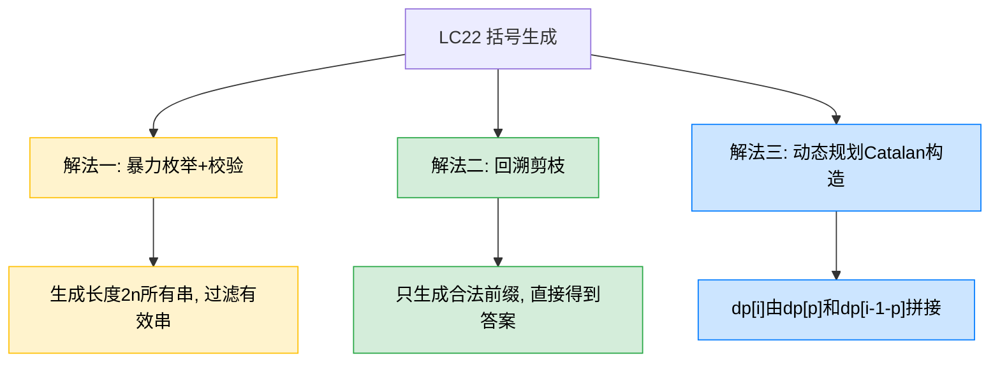
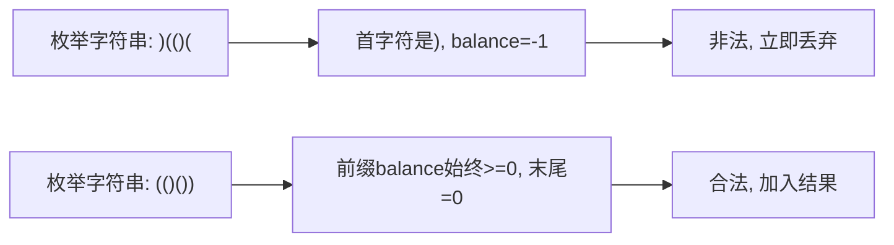
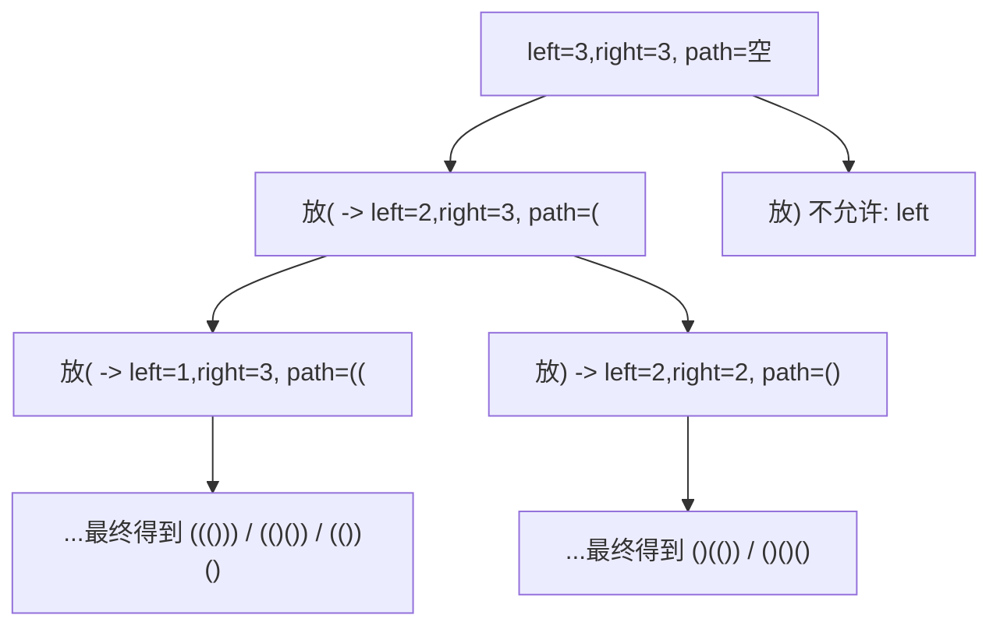
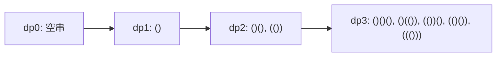

# LC22 括号生成
## 一、题目描述
给定 n 对括号，请你设计一个函数，能够生成所有可能的并且有效的括号组合。
示例：输入 `n = 3`，输出 `[( ( ( ) ) ), ( ( ) ( ) ), ( ( ) ) ( ), ( ) ( ( ) ), ( ) ( ) ( )]`（顺序可不同）。
约束：`1 <= n <= 8`。
## 二、解法概览（思维导图）

| 解法 | 时间复杂度 | 空间复杂度 | 难度 | 面试推荐 |
|------|-----------|-----------|------|---------|
| 暴力枚举+校验 | O(2^(2n) * n) | O(n) | ⭐ | 普通解法（用于对比） |
| 回溯剪枝 | O(Cn * n) | O(n) | ⭐⭐ | 面试首选/最优解 |
| DP构造 | O(Cn * n) | O(Cn * n) | ⭐⭐⭐ | 进阶补充 |
说明：`Cn` 为第 n 个卡特兰数，约等于 `4^n / (n^(3/2) * sqrt(pi))`。
## 三、记忆口诀
先放左括号，再放右括号。
左括号有剩就能放，右括号必须少于已放左括号才能放。
到长度 `2n` 就收答案。
## 四、解法一：暴力枚举+校验（普通解法）
### 4.1 思路
先生成所有长度为 `2n` 的仅由 `(`、`)` 组成的字符串，再逐个判断是否有效。
有效判断规则：从左到右扫描，计数器 balance，遇 `(` 加1，遇 `)` 减1；过程中 balance 不能小于0，最后必须等于0。
### 4.2 核心公式
合法充要条件：
1. 任意前缀满足 `leftCount >= rightCount`（即 balance >= 0）
2. 整体满足 `leftCount == rightCount == n`（即 balance == 0）
### 4.3 图解过程

### 4.4 代码示例
```java
public List<String> generateParenthesis(int n) {
    List<String> ans = new ArrayList<>();
    char[] path = new char[2 * n];
    dfs(path, 0, ans);
    return ans;
}
private void dfs(char[] path, int i, List<String> ans) {
    if (i == path.length) {
        if (valid(path)) ans.add(new String(path));
        return;
    }
    path[i] = '(';
    dfs(path, i + 1, ans);
    path[i] = ')';
    dfs(path, i + 1, ans);
}
private boolean valid(char[] s) {
    int bal = 0;
    for (char c : s) {
        bal += (c == '(' ? 1 : -1);
        if (bal < 0) return false;
    }
    return bal == 0;
}
```
### 4.5 复杂度分析
时间复杂度 `O(2^(2n) * n)`，空间复杂度 `O(n)`（递归深度）。
### 4.6 优缺点
优点：最直观，易想到。
缺点：大量无效串被生成，效率低。
## 五、解法二：回溯剪枝（面试首选/最优解）
### 5.1 思路
只生成“合法前缀”，在构造过程中剪枝掉不可能成为答案的分支。
维护两个变量：`leftNeed`（还可放多少左括号）和 `rightNeed`（还可放多少右括号）。
放左括号条件：`leftNeed > 0`。
放右括号条件：`leftNeed < rightNeed`（等价于已放左括号数 > 已放右括号数）。
### 5.2 核心公式
状态转移：
1. 放 `(`：`dfs(leftNeed-1, rightNeed, path + "(")`
2. 放 `)`：`dfs(leftNeed, rightNeed-1, path + ")")`，前提 `leftNeed < rightNeed`
终止条件：`leftNeed == 0 && rightNeed == 0`
### 5.3 图解过程
以 `n=3`：

### 5.4 代码示例
```java
public List<String> generateParenthesis(int n) {
    List<String> res = new ArrayList<>();
    dfs(n, n, new StringBuilder(), res);
    return res;
}
private void dfs(int leftNeed, int rightNeed, StringBuilder path, List<String> res) {
    if (leftNeed == 0 && rightNeed == 0) {
        res.add(path.toString());
        return;
    }
    if (leftNeed > 0) {
        path.append('(');
        dfs(leftNeed - 1, rightNeed, path, res);
        path.deleteCharAt(path.length() - 1);
    }
    if (leftNeed < rightNeed) {
        path.append(')');
        dfs(leftNeed, rightNeed - 1, path, res);
        path.deleteCharAt(path.length() - 1);
    }
}
```
### 5.5 复杂度分析
时间复杂度 `O(Cn * n)`，空间复杂度 `O(n)`。
说明：有 `Cn` 个有效答案，每个答案长度 `2n`，拷贝成本约 `O(n)`。
### 5.6 优缺点
优点：只走有效分支，效率高，面试最标准。
缺点：需要理解合法前缀剪枝条件。
## 六、解法三：动态规划Catalan构造（进阶）
### 6.1 思路
设 `dp[i]` 表示 i 对括号的所有有效组合。
将任一结果看作：`(" + 左部分 + ")" + 右部分`。
若左部分用了 p 对括号，则右部分用 `i-1-p` 对。
枚举 `p=0..i-1`，把 `dp[p]` 和 `dp[i-1-p]` 两两拼接。
### 6.2 核心公式
`dp[i] = Σ_{p=0}^{i-1} "(" + dp[p] + ")" + dp[i-1-p]`
初始：`dp[0] = [""]`
### 6.3 图解过程

### 6.4 代码示例
```java
public List<String> generateParenthesis(int n) {
    List<List<String>> dp = new ArrayList<>();
    for (int i = 0; i <= n; i++) dp.add(new ArrayList<>());
    dp.get(0).add("");
    for (int i = 1; i <= n; i++) {
        for (int p = 0; p < i; p++) {
            for (String left : dp.get(p)) {
                for (String right : dp.get(i - 1 - p)) {
                    dp.get(i).add("(" + left + ")" + right);
                }
            }
        }
    }
    return dp.get(n);
}
```
### 6.5 复杂度分析
时间复杂度 `O(Cn * n)`，空间复杂度 `O(Cn * n)`。
### 6.6 优缺点
优点：展示卡特兰数构造思维，适合进阶。
缺点：实现更绕，面试中不如回溯直观。
## 七、面试回答模板
面试官：如何生成 n 对括号的所有有效组合？
回答：这是典型回溯+剪枝题。维护两个剩余数量 leftNeed 和 rightNeed。leftNeed>0 才能放左括号；leftNeed<rightNeed 才能放右括号，保证任意前缀右括号不会超过左括号。递归到 leftNeed=0 且 rightNeed=0 时收集答案。该方法只生成合法前缀，时间复杂度约 O(Cn*n)，空间 O(n)，是面试最优实践。若追问，我还能给出 DP（卡特兰）构造法。
## 八、相关题目
| 题目 | 关联点 |
|------|--------|
| LC20 有效括号 | 判定括号合法，栈基础 |
| LC32 最长有效括号 | 有效括号的区间问题 |
| LC39 组合总和 | 回溯模板：做选择/递归/撤销 |
| LC17 电话号码组合 | 回溯入门，多叉选择 |
| LC78 子集 | 回溯枚举所有子集 |
| LC46 全排列 | 回溯+去重/状态标记 |
