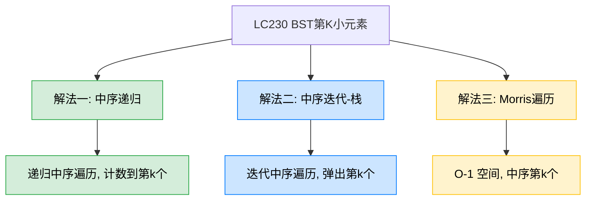
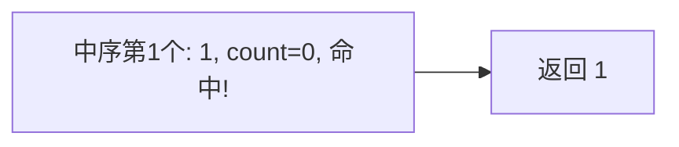
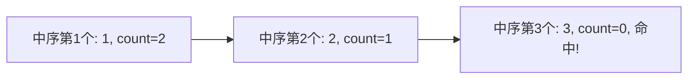

# LC230 二叉搜索树中第K小的元素
## 一、题目描述
给定一个二叉搜索树的根节点 root 和一个整数 k，请你设计一个算法查找其中第 k 小的元素（从 1 开始计数）。
**示例：** 输入 `root = [3,1,4,null,2], k = 1`，输出 `1`
**约束：** 树中节点数为 n，1 <= k <= n <= 10^4，0 <= Node.val <= 10^4
## 二、解法概览

| 解法 | 时间复杂度 | 空间复杂度 | 难度 | 面试推荐 |
|------|-----------|-----------|------|---------|
| 中序递归 | O(n) | O(n) | ⭐⭐ | 普通解法 |
| 中序迭代-栈 | O(k) | O(h) | ⭐⭐ | 面试首选 |
| Morris遍历 | O(k) | O(1) | ⭐⭐⭐ | 最优解/进阶加分 |
## 三、记忆口诀
> **BST中序天然排好序，数到第k个就是答案。**
核心思想：BST 的中序遍历是严格递增序列，第 k 小的元素就是中序遍历的**第 k 个节点**。
## 四、解法一：中序递归
### 4.1 思路
递归做中序遍历，用一个计数器 count 从 k 开始倒数，每访问一个节点就 count--，当 count 减到 0 时，当前节点就是第 k 小的元素。
### 4.2 核心公式
中序遍历中：每访问一个节点 `count--`，`count == 0` 时记录答案。
### 4.3 图解过程
以 `root = [3,1,4,null,2], k = 1` 为例：
```
      3
     / \
    1   4
     \
      2
```

以 `k = 3` 为例：

### 4.4 代码示例
```java
private int count;
private int result;
public int kthSmallest(TreeNode root, int k) {
    count = k;
    inorder(root);
    return result;
}
private void inorder(TreeNode node) {
    if (node == null || count <= 0) return;
    inorder(node.left);
    count--;
    if (count == 0) {
        result = node.val;
        return;
    }
    inorder(node.right);
}
```
### 4.5 复杂度分析
- **时间复杂度：O(n)**，最坏需遍历所有节点（k=n 时），可提前终止但最坏仍是 O(n)
- **空间复杂度：O(n)**，递归栈深度，最坏链状树 O(n)
### 4.6 优缺点
| 优点 | 缺点 |
|------|------|
| 代码简洁，容易理解 | 用了成员变量，不够纯粹 |
| 可以提前终止 | 递归深度可能很大 |
## 五、解法二：中序迭代-栈（面试首选）
### 5.1 思路
用迭代+栈做中序遍历，每弹出一个节点就 `k--`，当 `k == 0` 时直接返回当前节点的值。不需要遍历完整棵树，**找到就停**。
### 5.2 核心公式
中序迭代模板 + 弹出时 `k--`，`k == 0` 时返回。
### 5.3 图解过程
以 `root = [5,3,6,2,4,null,null,1], k = 3` 为例：
```
          5
         / \
        3   6
       / \
      2   4
     /
    1
```
| 步骤 | 操作 | 栈 | k | 说明 |
|------|------|-----|---|------|
| 1 | 压5,压3,压2,压1 | [5,3,2,1] | 3 | 一路压左到底 |
| 2 | 弹1 | [5,3,2] | 2 | 第1小=1 |
| 3 | 弹2 | [5,3] | 1 | 第2小=2 |
| 4 | 弹3 | [5] | 0 | **第3小=3，返回** |
### 5.4 代码示例
```java
public int kthSmallest(TreeNode root, int k) {
    Deque<TreeNode> stack = new ArrayDeque<>();
    while (!stack.isEmpty() || root != null) {
        if (root != null) {
            stack.push(root);
            root = root.left;
        } else {
            root = stack.pop();
            k--;
            if (k == 0) return root.val;
            root = root.right;
        }
    }
    return -1;
}
```
### 5.5 复杂度分析
- **时间复杂度：O(H + k)**，H 是树高，先走到最左需要 H 步，然后弹 k 次。平衡树 H = log n，所以是 O(log n + k)
- **空间复杂度：O(H)**，栈最多存树高个节点
### 5.6 优缺点
| 优点 | 缺点 |
|------|------|
| 找到就停，k 小时很快 | 需要理解中序迭代模板 |
| 没有成员变量，代码干净 | 空间 O(H) |
| 面试标准答案 | 无 |
### 5.7 为什么迭代比递归更适合本题？
| 对比项 | 递归 | 迭代 |
|--------|------|------|
| 提前终止 | 需要额外判断 `count <= 0` 跳过 | 直接 `return`，干净利落 |
| 时间复杂度 | 最坏 O(n)，提前终止不彻底 | O(H + k)，找到即停 |
| 成员变量 | 需要 count 和 result | 不需要 |
## 六、解法三：Morris遍历（最优解）
### 6.1 思路
用 Morris 中序遍历实现 O(1) 空间。在每次"访问节点"时 `k--`，`k == 0` 时返回。
### 6.2 代码示例
```java
public int kthSmallest(TreeNode root, int k) {
    TreeNode cur = root;
    TreeNode mostRight;
    while (cur != null) {
        mostRight = cur.left;
        if (mostRight != null) {
            while (mostRight.right != null && mostRight.right != cur) {
                mostRight = mostRight.right;
            }
            if (mostRight.right == null) {
                mostRight.right = cur;
                cur = cur.left;
                continue;
            } else {
                mostRight.right = null;
            }
        }
        k--;
        if (k == 0) return cur.val;
        cur = cur.right;
    }
    return -1;
}
```
### 6.3 复杂度分析
- **时间复杂度：O(n)**，Morris 遍历整体 O(n)
- **空间复杂度：O(1)**
### 6.4 优缺点
| 优点 | 缺点 |
|------|------|
| 空间最优 O(1) | 代码复杂 |
| 无栈无递归 | 临时修改树结构 |
## 七、三种解法与LC98/LC94的关系
本题和 LC98（验证BST）、LC94（中序遍历）用的是**同一个中序遍历模板**，只是"访问节点时做的事"不同：
| 题目 | 中序遍历时做什么 |
|------|----------------|
| LC94 中序遍历 | `res.add(node.val)` |
| LC98 验证BST | `if (node.val <= pre) return false` |
| **LC230 第K小** | `k--; if (k == 0) return node.val` |
**掌握中序遍历模板后，这三题都是换一行代码的事。**
## 八、面试回答模板
> **面试官：** 找 BST 中第 K 小的元素。
**回答要点：**
1. **说性质：** BST 的中序遍历是严格递增序列，第 k 小就是中序遍历的第 k 个节点。
2. **写代码：** 用迭代+栈做中序遍历，每弹出一个节点 k--，k 减到 0 时直接返回，不用遍历完整棵树。
3. **复杂度：** 时间 O(H + k)，空间 O(H)，其中 H 是树高。平衡树时 H = log n。
4. **延伸：** 如果频繁查询第 k 小，可以在每个节点上维护左子树的节点数，实现 O(H) 查询（类似平衡树的 rank 操作）。
## 九、相关题目
| 题目 | 关联点 |
|------|--------|
| LC94 二叉树的中序遍历 | 本题的基础，同一个模板 |
| LC98 验证二叉搜索树 | 同样利用中序递增性质 |
| LC173 二叉搜索树迭代器 | 中序迭代拆成 next() 调用 |
| LC700 二叉搜索树中的搜索 | BST 基本操作 |
| LC378 有序矩阵中第K小的元素 | 不同数据结构的第K小问题 |
| LC215 数组中的第K个最大元素 | 第K大/小问题的另一种场景 |
