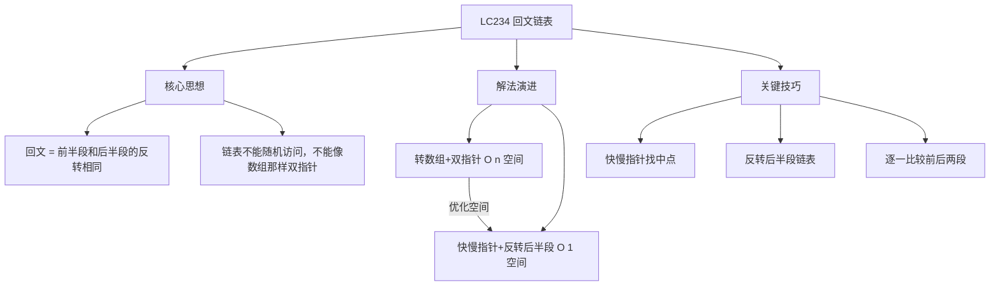
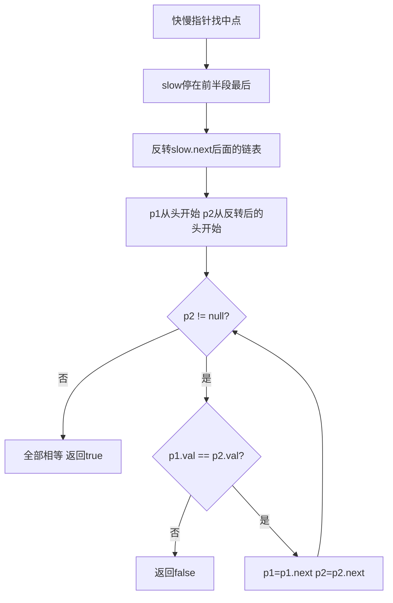

# LC234 回文链表
## 一、题目描述
给你一个单链表的头节点 `head`，请你判断该链表是否为**回文链表**。如果是，返回 `true`；否则返回 `false`。
回文：正读和反读都一样，如 1→2→2→1、1→2→1。
**示例1：**
```
输入：1 → 2 → 2 → 1
输出：true
```
**示例2：**
```
输入：1 → 2
输出：false
```
**约束：**
- 链表节点数范围 [1, 10^5]
- 0 <= Node.val <= 9
- **进阶**：用 O(n) 时间和 O(1) 空间解决
---
## 二、解法概览
### 解法对比表
| 解法 | 时间复杂度 | 空间复杂度 | 面试推荐 |
|------|-----------|-----------|---------|
| 转数组+双指针 | O(n) | O(n) | ✅ 普通解法 |
| **快慢指针+反转后半段** | O(n) | O(1) | ✅ **最优解** |
### 思维导图

---
## 三、记忆口诀
```
回文链表三步走
快慢指针找中间
后半链表来反转
前后逐一做比较
```
---
## 四、解法一：转数组+双指针
### 思路
把链表的值存到数组中，然后用数组的左右双指针判断回文。
### 核心公式
```
链表 → 数组
left = 0, right = size-1
while left < right:
    if arr[left] != arr[right] → false
    left++, right--
return true
```
### 图解过程
```
链表：1 → 2 → 2 → 1
转数组：[1, 2, 2, 1]
双指针比较：
  left=0, right=3: arr[0]=1 == arr[3]=1 ✅
  left=1, right=2: arr[1]=2 == arr[2]=2 ✅
  left=2 > right=1，退出 → true
```
### 代码示例
```java
public boolean isPalindrome(ListNode head) {
    List<Integer> list = new ArrayList<>();
    ListNode cur = head;
    while (cur != null) {
        list.add(cur.val);
        cur = cur.next;
    }
    int left = 0, right = list.size() - 1;
    while (left < right) {
        if (!list.get(left).equals(list.get(right))) {
            return false;
        }
        left++;
        right--;
    }
    return true;
}
```
### 复杂度分析
- 时间复杂度：**O(n)**，遍历+比较
- 空间复杂度：**O(n)**，存储数组
### 优缺点
| 优点 | 缺点 |
|-----|------|
| 思路简单直观 | O(n) 额外空间 |
| 不修改链表 | 不满足进阶要求 |
---
## 五、解法二：快慢指针+反转后半段（最优解 ✅）
### 思路
三步走：
1. **快慢指针找中点**：slow 走一步，fast 走两步，fast 到头时 slow 在中间
2. **反转后半段**：把 slow 后面的链表反转
3. **逐一比较**：从头和从尾同时往中间走，逐个比较
### 核心公式
```
第1步：找中点
  slow = head, fast = head
  while fast.next != null && fast.next.next != null:
      slow = slow.next, fast = fast.next.next
  slow 停在前半段的最后一个节点
第2步：反转 slow.next 后面的链表
第3步：比较前半段和反转后的后半段
```
### 快慢指针停在哪？
```
奇数个节点：1 → 2 → 3 → 2 → 1
              s       
                  s   f
                  ↑   slow停在中间节点3
  前半段：1→2→3   后半段反转后：1→2
偶数个节点：1 → 2 → 2 → 1
              s
                  s       f
                  ↑   slow停在前半段最后一个2
  前半段：1→2     后半段反转后：1→2
```
### 图解过程（偶数个节点）
```
链表：1 → 2 → 2 → 1
━━━━━━━━━━━━━━━━━━━━━━━━━━━━━━━━━━
第1步：快慢指针找中点
  初始：slow=1, fast=1
  第1轮：slow=2, fast=2(第二个)
  fast.next=1, fast.next.next=null → 停止
  slow停在节点2（前半段最后一个）
  1 → 2 → 2 → 1
       ↑
      slow
━━━━━━━━━━━━━━━━━━━━━━━━━━━━━━━━━━
第2步：反转后半段（slow.next 开始）
  反转前：2 → 1 → null
  反转后：1 → 2 → null
  链表变成：
  前半段：1 → 2    后半段（反转后）：1 → 2
━━━━━━━━━━━━━━━━━━━━━━━━━━━━━━━━━━
第3步：逐一比较
  p1=head=1,  p2=反转后的头=1:  1==1 ✅
  p1=2,       p2=2:              2==2 ✅
  p2=null，比较完毕 → true ✅
```
### 图解过程（奇数个节点）
```
链表：1 → 2 → 3 → 2 → 1
━━━━━━━━━━━━━━━━━━━━━━━━━━━━━━━━━━
第1步：快慢指针找中点
  初始：slow=1, fast=1
  第1轮：slow=2, fast=3
  第2轮：slow=3, fast=1(最后)
  fast.next=null → 停止
  slow停在节点3（中间节点）
━━━━━━━━━━━━━━━━━━━━━━━━━━━━━━━━━━
第2步：反转后半段（slow.next = 2→1）
  反转后：1 → 2 → null
  前半段：1 → 2 → 3   后半段：1 → 2
  （中间节点3不参与比较，天然忽略）
━━━━━━━━━━━━━━━━━━━━━━━━━━━━━━━━━━
第3步：逐一比较（以后半段长度为准）
  p1=1, p2=1: 1==1 ✅
  p1=2, p2=2: 2==2 ✅
  p2=null → true ✅
```
### 算法流程图

### 代码示例
```java
public boolean isPalindrome(ListNode head) {
    if (head == null || head.next == null) return true;
    // 第1步：快慢指针找中点
    ListNode slow = head, fast = head;
    while (fast.next != null && fast.next.next != null) {
        slow = slow.next;
        fast = fast.next.next;
    }
    // 第2步：反转后半段
    ListNode secondHalf = reverse(slow.next);
    // 第3步：逐一比较
    ListNode p1 = head;
    ListNode p2 = secondHalf;
    boolean result = true;
    while (p2 != null) {
        if (p1.val != p2.val) {
            result = false;
            break;
        }
        p1 = p1.next;
        p2 = p2.next;
    }
    // （可选）还原链表：再反转回来
    slow.next = reverse(secondHalf);
    return result;
}
// 反转链表（LC206）
private ListNode reverse(ListNode head) {
    ListNode pre = null, cur = head;
    while (cur != null) {
        ListNode next = cur.next;
        cur.next = pre;
        pre = cur;
        cur = next;
    }
    return pre;
}
```
### 三个子问题拆解
这道题本质是三个经典问题的组合：
| 步骤 | 子问题 | 对应题目 |
|------|--------|---------|
| 找中点 | 快慢指针找链表中点 | LC876 链表的中间结点 |
| 反转 | 反转链表 | LC206 反转链表 |
| 比较 | 逐一比较两段链表 | 基础操作 |
### 复杂度分析
- 时间复杂度：**O(n)**，找中点 O(n) + 反转 O(n/2) + 比较 O(n/2)
- 空间复杂度：**O(1)**，只用了几个指针
### 优缺点
| 优点 | 缺点 |
|-----|------|
| 空间 O(1)，满足进阶要求 | 修改了链表结构 |
| 面试首选 | 需要掌握快慢指针+反转 |
| 考察综合能力 | 可选还原链表 |
### 关键点总结
| 关键点 | 说明 |
|-------|------|
| 快慢指针停在哪？ | 前半段最后一个节点（偶数）或中间节点（奇数）|
| 为什么反转 slow.next？ | slow 是前半段最后一个，slow.next 开始是后半段 |
| 奇数个节点中间怎么处理？ | 不用特殊处理，以后半段长度为准，中间节点自动忽略 |
| 要不要还原链表？ | 面试中最好还原，体现代码规范 |
---
## 六、面试回答模板
### 1. 开场：理解题意
> 这道题判断链表是否回文，即正读反读一样。链表不能随机访问，不能直接用数组的双指针。
### 2. 思路：三步走
> 第一步用快慢指针找到中点，第二步反转后半段链表，第三步从头和尾同时走逐一比较。
### 3. 关键细节
> 快慢指针的循环条件是 `fast.next != null && fast.next.next != null`，这样 slow 停在前半段最后一个节点。奇数个节点时中间元素自动忽略，不需要特殊处理。
### 4. 复杂度
> 时间 O(n)，空间 O(1)。本质上是"找中点+反转链表+比较"三个经典子问题的组合。
---
## 七、相关题目
| 题号 | 题目 | 关系 | 难度 |
|-----|------|------|-----|
| LC206 | 反转链表 | 子问题：反转 | 简单 |
| LC876 | 链表的中间结点 | 子问题：找中点 | 简单 |
| LC9 | 回文数 | 数字回文判断 | 简单 |
| LC125 | 验证回文串 | 字符串回文判断 | 简单 |
| LC143 | 重排链表 | 同样拆分+反转+合并 | 中等 |
| LC92 | 反转链表II | 反转进阶 | 中等 |