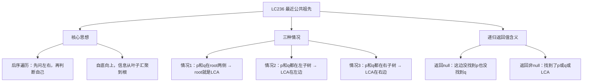
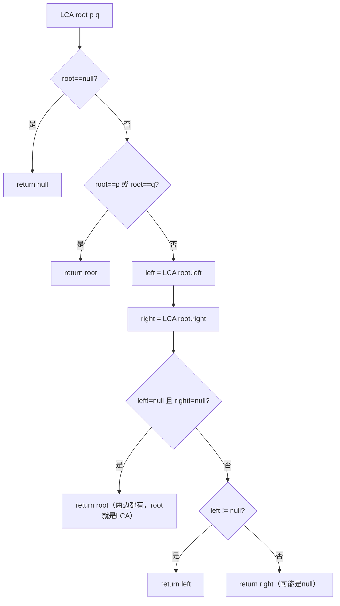

# LC236 二叉树的最近公共祖先
## 一、题目描述
给定一个二叉树，找到该树中两个指定节点的**最近公共祖先**（LCA）。
最近公共祖先的定义：对于两个节点 p 和 q，最近公共祖先是**最深的**那个同时是 p 和 q 祖先的节点（一个节点可以是自己的祖先）。
**示例1：**
```
        3
       / \
      5   1
     / \ / \
    6  2 0  8
      / \
     7   4
  p=5, q=1 → LCA=3（5和1分别在3的左右两边）
```
**示例2：**
```
  p=5, q=4 → LCA=5（5是4的祖先，自己就是公共祖先）
```
**约束：**
- 树的节点数范围 [2, 10^5]
- 所有节点值唯一
- p != q，且 p 和 q 均存在于树中
---
## 二、解法概览
### 解法对比表
| 解法 | 时间复杂度 | 空间复杂度 | 面试推荐 |
|------|-----------|-----------|---------|
| **递归（后序遍历）** | O(n) | O(h) | ✅ **首选** |
| 信息收集法（树型DP） | O(n) | O(h) | ✅ 进阶 |
### 思维导图

---
## 三、记忆口诀
```
公共祖先后序找，先问左边再问右
都不空说明在两侧，当前节点就是答案
一边空就返另一边，两边空就返空
遇到p或q就返回，自己也能当祖先
```
---
## 四、解法一：递归 / 后序遍历（首选 ✅）
### 思路
**自底向上**：后序遍历，先递归左右子树，根据左右子树的返回值判断当前节点是不是 LCA。
**返回值的含义**：在以 root 为根的子树中，是否找到了 p 或 q。
- 返回 null → 这棵子树里没有 p 也没有 q
- 返回非 null → 找到了 p 或 q（或已经找到 LCA）
### 核心公式
```
lowestCommonAncestor(root, p, q):
  if root == null → return null     // 到底了，没找到
  if root == p || root == q → return root  // 找到 p 或 q，返回自己
  left = lowestCommonAncestor(root.left, p, q)   // 问左子树
  right = lowestCommonAncestor(root.right, p, q)  // 问右子树
  if left != null && right != null → return root   // 左右都有，root就是LCA
  return left != null ? left : right  // 只有一边有，返回那一边
```
### 四种情况详解
```
情况1：root == p 或 root == q
  → 直接返回 root（找到目标了）
情况2：左右子树都找到了（left!=null && right!=null）
  → p 和 q 分别在 root 的两侧，root 就是 LCA
情况3：只有一边找到了
  → p 和 q 都在同一侧，返回那一侧的结果（它可能是 LCA）
情况4：两边都没找到
  → 返回 null
```
### 怎么理解这个递归？
```
你是节点3（老板），想找 p=5 和 q=1 在哪：
  问左子树：你那边有5或1吗？
    左子树说："有！我这边有5"  → 返回5
  问右子树：你那边有5或1吗？
    右子树说："有！我这边有1"  → 返回1
  两边都有人 → 我（节点3）就是他俩的公共祖先！
        3 ← 我就是LCA！
       / \
     "5在这" "1在这"
```
```
你是节点5，想找 p=5 和 q=4 在哪：
  我自己就是 p=5 → 直接返回自己
  （不需要继续往下找了，因为 q=4 一定在我的子树里，我就是 LCA）
```
### 图解过程
```
        3
       / \
      5   1
     / \ / \
    6  2 0  8
      / \
     7   4
  p=5, q=1
━━━━━━━━━━━━━━━━━━━━━━━━━━━━━━━━━━
递归展开（自顶向下）：
  LCA(3, 5, 1)
    LCA(5, 5, 1) → root==p → return 5 ✅ 不继续往下
    LCA(1, 5, 1) → root==q → return 1 ✅ 不继续往下
    left=5(非null), right=1(非null)
    → 两边都有！return 3 ← LCA ✅
━━━━━━━━━━━━━━━━━━━━━━━━━━━━━━━━━━
  p=5, q=4
━━━━━━━━━━━━━━━━━━━━━━━━━━━━━━━━━━
  LCA(3, 5, 4)
    LCA(5, 5, 4) → root==p → return 5 ✅
    LCA(1, 5, 4)
      LCA(0, 5, 4) → 左null右null → return null
      LCA(8, 5, 4) → 左null右null → return null
      left=null, right=null → return null
    left=5, right=null
    → 只有左边有 → return left = 5 ← LCA ✅
```
### 为什么找到 p 就直接返回，不继续往下找 q？
```
题目保证 p 和 q 都存在于树中。
如果 root==p，那 q 只有两种可能：
  1. q 在 p 的子树里 → p 就是 LCA（p 是 q 的祖先）
  2. q 在 p 的外面  → 会在更上层的节点汇合
两种情况都不需要继续往 p 的子树里找
所以直接返回 p 是正确的
```
### 算法流程图

### 代码示例
```java
public TreeNode lowestCommonAncestor(TreeNode root, TreeNode p, TreeNode q) {
    // 到底了 / 找到p或q
    if (root == null || root == p || root == q) {
        return root;
    }
    // 后序遍历：先问左右
    TreeNode left = lowestCommonAncestor(root.left, p, q);
    TreeNode right = lowestCommonAncestor(root.right, p, q);
    // 左右都有 → root就是LCA
    if (left != null && right != null) {
        return root;
    }
    // 只有一边有 → 返回那一边；都没有 → 返回null
    return left != null ? left : right;
}
```
### 复杂度分析
- 时间复杂度：**O(n)**，每个节点最多访问一次
- 空间复杂度：**O(h)**，递归栈深度
### 优缺点
| 优点 | 缺点 |
|-----|------|
| 代码极简（6行核心） | 递归不太好理解 |
| 面试首选 | 返回值含义不直观 |
---
## 五、解法二：信息收集法 / 树型DP（进阶）
### 思路
定义一个 Info 类收集每棵子树的信息：是否找到 a、是否找到 b、LCA 是谁。自底向上汇总信息。
### 核心公式
```
Info {
  boolean findA;   // 是否找到了a
  boolean findB;   // 是否找到了b
  TreeNode node;   // LCA节点（没找到就是null）
}
每个节点汇总左右子树的 Info：
  findA = 自己是a || 左找到a || 右找到a
  findB = 自己是b || 左找到b || 右找到b
  如果左/右已有LCA → 直接用
  否则如果 findA && findB → 自己就是 LCA
```
### 代码示例
```java
public TreeNode lowestCommonAncestor(TreeNode root, TreeNode p, TreeNode q) {
    return process(root, p, q).node;
}
private Info process(TreeNode x, TreeNode a, TreeNode b) {
    if (x == null) return new Info(false, false, null);
    Info leftInfo = process(x.left, a, b);
    Info rightInfo = process(x.right, a, b);
    boolean findA = (x == a) || leftInfo.findA || rightInfo.findA;
    boolean findB = (x == b) || leftInfo.findB || rightInfo.findB;
    TreeNode ans = null;
    if (leftInfo.node != null) {
        ans = leftInfo.node;       // 左子树已找到LCA
    } else if (rightInfo.node != null) {
        ans = rightInfo.node;      // 右子树已找到LCA
    } else if (findA && findB) {
        ans = x;                   // 第一次同时找到a和b，x就是LCA
    }
    return new Info(findA, findB, ans);
}
class Info {
    boolean findA, findB;
    TreeNode node;
    Info(boolean findA, boolean findB, TreeNode node) {
        this.findA = findA;
        this.findB = findB;
        this.node = node;
    }
}
```
### 复杂度分析
- 时间复杂度：**O(n)**
- 空间复杂度：**O(h)**
### 优缺点
| 优点 | 缺点 |
|-----|------|
| 逻辑清晰，不容易出错 | 代码较长 |
| 通用模板，适用于树型DP问题 | 面试写起来慢 |
---
## 六、两种解法对比
| 对比 | 递归法 | 信息收集法 |
|------|--------|-----------|
| 代码量 | 6行 | 20+行 |
| 理解难度 | 返回值含义较抽象 | 逻辑清晰但代码多 |
| 通用性 | 这道题专用 | 树型DP通用模板 |
| 面试 | **首选** | 追问或变体题 |
---
## 七、面试回答模板
### 1. 开场：理解题意
> 找两个节点的最近公共祖先，就是最深的那个同时是 p 和 q 祖先的节点。
### 2. 思路：后序递归
> 后序遍历，先递归左右子树。如果 root 就是 p 或 q，直接返回。如果左右子树都找到了目标，说明 p 和 q 在两侧，root 就是 LCA。如果只有一边找到了，返回那一边。
### 3. 关键细节
> 找到 p 就直接返回不用继续往下，因为如果 q 在 p 的子树里，p 就是 LCA；如果 q 在外面，会在更上层汇合。题目保证 p 和 q 都存在。
### 4. 复杂度
> 时间 O(n)，空间 O(h)。
---
## 八、相关题目
| 题号 | 题目 | 关系 | 难度 |
|-----|------|------|-----|
| LC235 | 二叉搜索树的最近公共祖先 | BST版本，利用大小关系 | 中等 |
| LC1644 | 二叉树的最近公共祖先II | p或q可能不存在 | 中等 |
| LC1676 | 二叉树的最近公共祖先IV | 多个节点的LCA | 中等 |
| LC865 | 具有所有最深节点的最小子树 | LCA变体 | 中等 |
| LC572 | 另一棵树的子树 | 树的递归匹配 | 简单 |